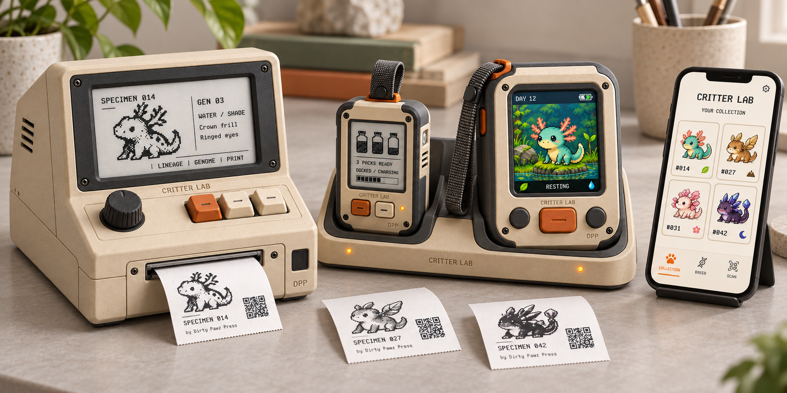
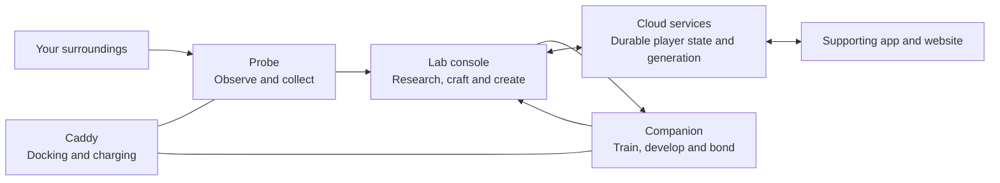
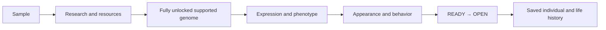
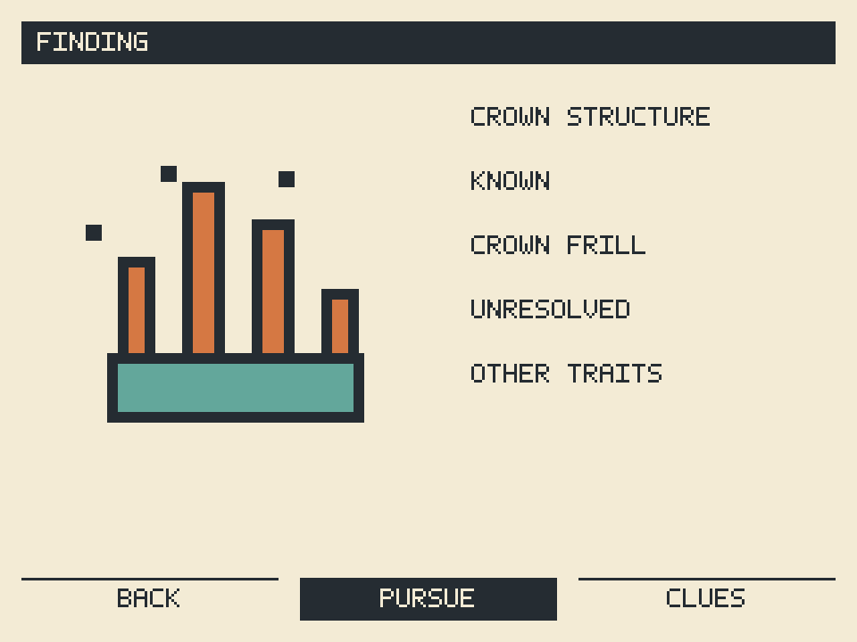
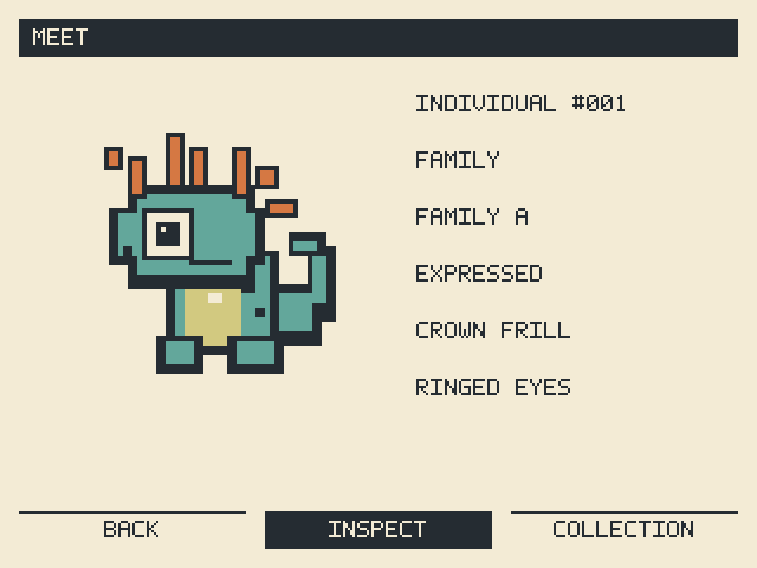

# Critter Lab

### Explore outside. Discover at the Lab. Meet something of your own.



*Concept artwork—not manufactured hardware. Displays, dimensions, sensors and controls are still being explored.*

Critter Lab is a sandbox creature-research game spanning physical instruments, inherited traits, pixel creatures and a connected world. Collect unusual samples, investigate their possibilities, craft materials and create a fully researched critter. Pursue beautiful combinations, rare discoveries, adaptable companions—or simply an individual you enjoy spending time with.

**This is the authoritative public product repository.** Specifications, game rules, software, art and buildable hardware/firmware/case designs belong here as they are developed. Today it contains product specifications and runnable host experiments; it is not yet a complete buildable kit. See [what exists and what is next](STATUS.md).

[Explore the specification](specs/README.md) · [Run the prototype](prototype/README.md) · [Visual tour](design/README.md) · [Build coverage](BUILD.md)

## One ecosystem, different kinds of play



| Lab console | Probe | Companion | Caddy |
| --- | --- | --- | --- |
| An exploratory workbench: inventory, ongoing research, crafting and deliberate reveals. | Real-world sampling, collection and reasons to go exploring. | Time with your critters: behavior, training and development. | A physical home for the portables; charging and feedback remain under design. |

One household can share a kit. Individual player profiles retain their own critters, resources, discoveries and progress. The cloud is authoritative for durable state; bounded offline activity and synchronization are still being specified.

## From a sample to an individual



| Research study | Meeting the saved individual |
| --- | --- |
|  |  |

*Renderer output from a small authored fixture. These screens demonstrate a technical experiment, not final UI, generated biodiversity or physical display performance.*

Genetics links inherited information to expressed appearance and capabilities. Behavioral models can use those properties alongside current conditions and experience. Adaptive neural behavior is an exploration proposal, not implemented functionality. An individual's identity is distinct from its genome, family and appearance.

## Try the current software

With Node.js 22 or later:

```sh
npm ci
npm start
# Open http://127.0.0.1:4173
npm test
```

The local server provides a breeding/share experiment, `/lab/` for the pixel founder fixture, and `/transfer/` for transfer-status studies. These are local experiments with authored inputs, not production cloud services. Do not expose this unauthenticated host prototype as a public game service.

## Follow the design

Start with the [specification map](specs/README.md). The [visual tour](design/README.md) separates concept art from rendered prototype frames. [Build coverage](BUILD.md) identifies implemented components and missing production deliverables. [Versioning](releases/README.md) distinguishes specification status, source versions and saved-content compatibility.

This repository is in active design. Proposals are labeled; open choices are not presented as finalized mechanics. Publication does not establish hardware validation. See [licensing status](LICENSING.md) before reusing material.
