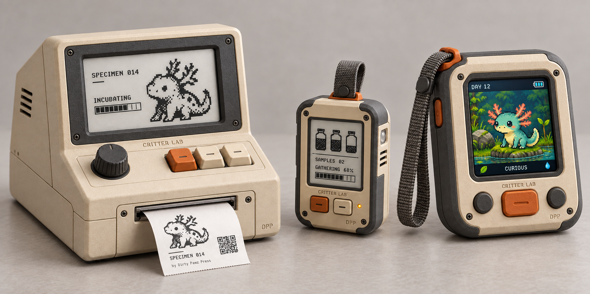

# Design reference and review guide

This page is for reviewing how Critter Lab looks, feels and operates. For a plain introduction to playing, start with [Your first discovery](sample-to-critter-walkthrough.md). For rules and system boundaries, use the [specification map](../specs/README.md); for runnable work, use [builder getting started](../docs/builders/getting-started.md).

## The device family

*Approved concept direction, not an engineering specification. These are the original device references; final dimensions, electronics, controls and display modules remain open.*

The family uses cream enclosures, charcoal frames, restrained orange controls and tactile details. Pixel critters bring character to the screens and printed cards. The Lab is a deliberate workbench, the Probe a quick outdoor instrument, and the Companion a portable place for an individual. Their different proportions and controls should remain recognizable across illustrations.

The [ecosystem reference](references/ecosystem.png) shows the portables with their Caddy and an optional app view. The [Companion close-up](references/companion.png) provides a clearer view of its silhouette, controls and creature display. Use these references to understand the physical relationships; they do not establish charging measurements, data transfer or completed app behavior.

## What to review

| Question | Material and boundary |
| --- | --- |
| Where does the player make meaningful research choices? | [Research and creation proposal](research-and-creation.md) recommends a short adaptive investigation; its test structure and worked example remain proposed. |
| Can a newcomer understand the journey? | [Your first discovery](sample-to-critter-walkthrough.md) follows exploration, research, a supply shortage, creation and companionship. It is a concept story, not an implemented sequence. |
| Does the interaction explain what changes? | [Experience specification](../specs/experience.md) covers navigation and feedback. Review the player action, its consequence and the return path together, rather than approving an isolated attractive screen. |
| What can the hardware actually support? | [Device specification](../specs/devices.md) and [build coverage](../BUILD.md) distinguish exploration from available engineering work. A render cannot demonstrate physical readability, refresh, fit or power. |
| What have the screen experiments demonstrated? | [Lab prototype](../prototype/lab/README.md) and [transfer study](../prototype/transfer/browser/README.md) contain scoped implementation evidence. Their authored placeholders and earlier layouts are not the target visual design. |

Keep shared direction separate from unresolved choices. The original instrument character guides presentation; final screen compositions, individual creature designs, motion and engineering details still need their own review. A new illustration must not silently add controls, change a critter's identity or turn a proposed mechanic into a promise.

## Sources and attribution

The [asset manifest](asset-manifest.json) records original-image hashes and design status. Concept references are AI-generated product explorations, preserved as supplied; they are not CAD or assembly instructions. Existing pixel experiments include source masks, palettes, font data and rendering code under `prototype/pixel/`.

Use the project name and restrained Dirty Pawz Press attribution consistently with the [branding policy](../BRANDING.md). That policy addresses attribution and official status; it does not supply a company-wide visual identity standard.

[All documentation](../docs/README.md) · [Player introduction](../docs/players/README.md) · [Current product status](../STATUS.md)
