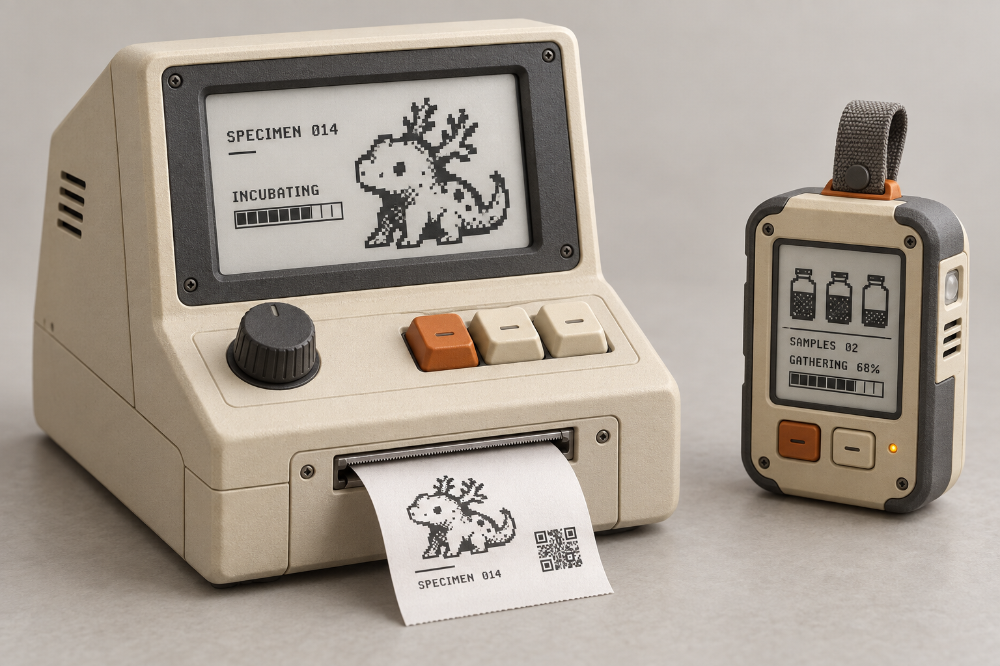
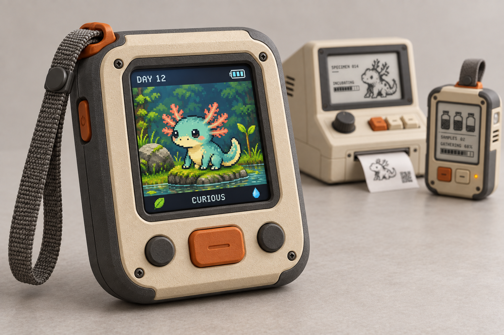
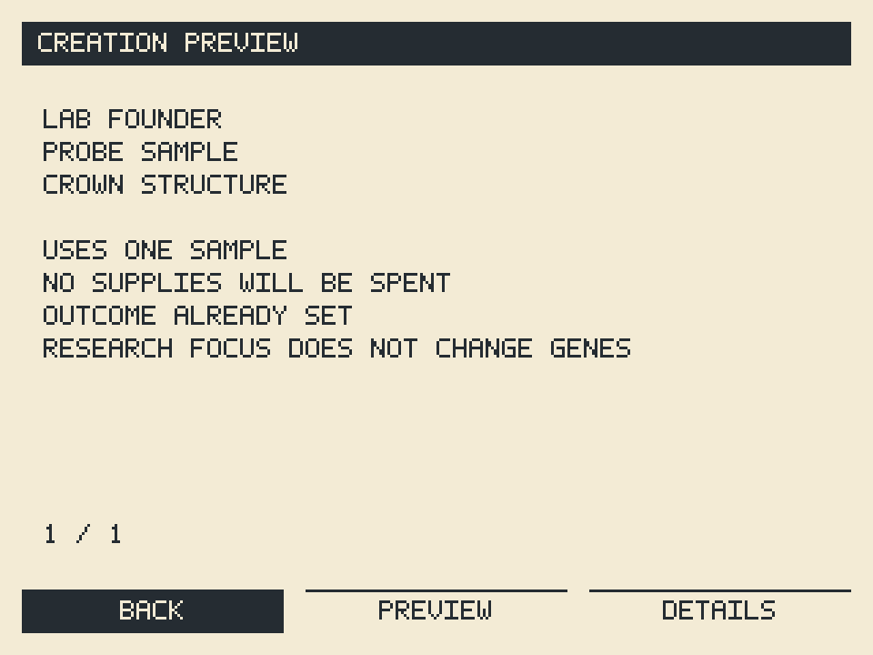
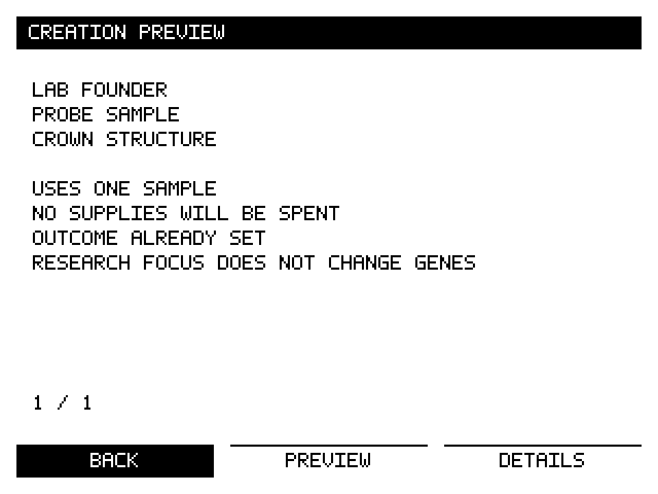
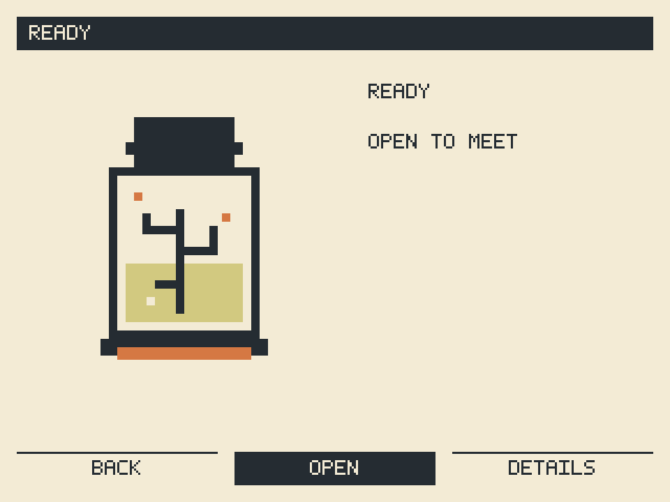

# Visual tour

## Follow one discovery

The [sample-to-critter walkthrough](sample-to-critter-walkthrough.md) connects field collection, genome research, creation and Companion life. Its bitmap is a conceptual explanation, not a final screen layout. The paired [system contract](../specs/sample-to-critter-contract.md) shows identity, cloud acceptance and generation boundaries.

## The intended physical experience

*Concept rendering. Neither the enclosure nor the depicted electronics are manufacturing-ready.*

*Concept rendering of a portable creature companion. Final naming, controls, display and creature artwork remain open.*

## Current pixel experiments

| Color preview | Monochrome preview |
| --- | --- |
|  |  |

| Ready to open | Saved individual |
| --- | --- |
|  |  |

These are host renderer outputs, generated by `node prototype/lab/export.mjs`. They use authored placeholder assets and fixed examples. They do not show the final interaction design, physical refresh behavior or actual genome-to-art generation.

## Art and provenance

Original concept images retain their bytes and embedded provenance. [Asset manifest](asset-manifest.json) records hashes and design status. Concept images are AI-generated product explorations; they are references, not schematics or CAD. Pixel experiments include their source masks, palettes, font and renderer in `prototype/pixel/`.

Future production art belongs here with source assets, palettes, animation definitions, generator inputs and versioned outputs sufficient to reproduce it. Finished specimen assets remain preserved across rule updates. No finished production art pipeline is claimed today.
