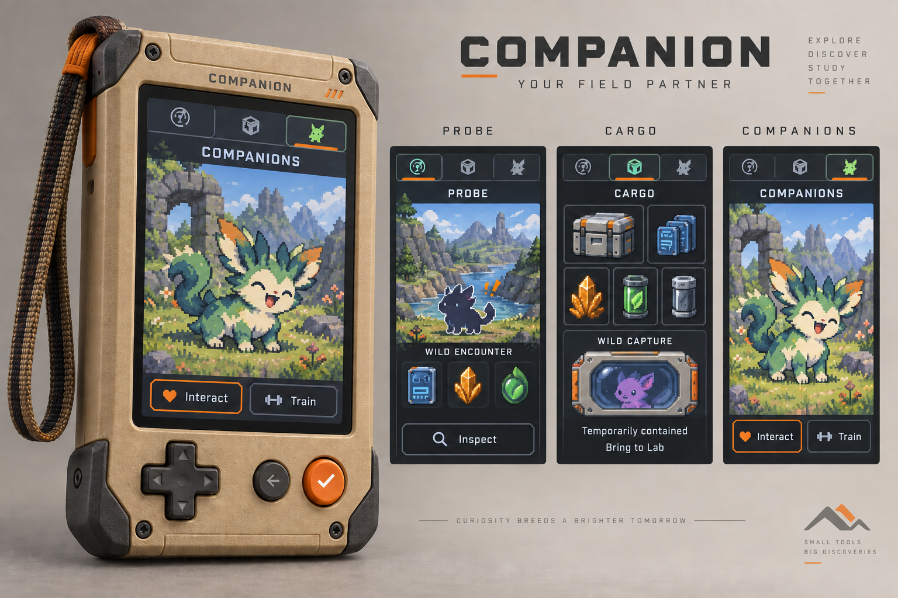

# Companion promise versus delivered screen craft

Bounded supplemental game-art assessment, 30 September 2026. Outcome: identify the visible gap between the field-partner concept and the actual connected Companion, then give the existing audit one concrete native-art proof target. Assessment only; no new artwork, code, mechanics, services, controls or design discovery. Stops at this report.

Inspected the four supplied images below, retained Gemini03/04/07 display
previews and actual released-native Gathering, Cargo and delayed-acceptance frames.
The screen studies visually match retained03/04/07. Native evidence isfd08ff1;
no new runtime pass or artwork was produced by this comparison. Original reference
bytes, dimensions and hashes are retained in [manifest](manifest.json).

| Craft references | Current native evidence |
| --- | --- |
| [Probe study](probe-study.png) | [Native Gathering](../three-device-playability-audit/connected-gathering-empty.png) |
| [Cargo study](cargo-study.png) | [Native Cargo](../three-device-playability-audit/connected-companion-cargo.png) |
| [Lab arrival study](lab-arrival-study.png) | [Native Lab acceptance](../three-device-playability-audit/connected-lab-accepted.png) |
| Marketing individual/activity above | [Delayed accepted Cargo](../three-device-playability-audit/delayed-offline-cargo-after-accept.png); Companions remains unavailable |

## What the concept promises

The whole journey has an emotional subject: explore an illustrated place, carry tangible discoveries home, then spend time with a recognizable individual from that same world. The marketing Companion gives most of its screen to a lively critter in a rich daylight landscape. Pose, expression, foreground flowers, distant mountains and ruins create scale, atmosphere and biological curiosity. Probe has a place to investigate, rather than merely a timer to monitor. Cargo makes objects feel carried and distinguishable. Restrained dark structure and orange focus support those subjects.

This promise is real direction; pictured Wild encounter, Wild capture and Train are not evidence of implemented rules. Wild capture/training are accepted broader product ambitions with unresolved detail. No raster button authorizes touch, and the depicted critter is not automatically a canonical saved resident or a preview of hidden sample genes.

## What the actual screens deliver

The native gathering frame contains a compass, expedition labels, two progress bars, supplies and actions. Cargo is three small icons in a text ledger. Their useful live information does not produce a living illustrated place or individual. Repeated brand/title/rail layers and footer instructions consume the portrait canvas. Thin blue borders and matching resource colors establish only fragments of the promised craft.

The delayed accepted Cargo frame makes the larger problem concrete: all quantities are zero and `Accepted in Lab - receipt pending` appears, but the focused action is `View expedition`. Art must clearly project an ended outing and stored result; it cannot fix the misleading action or receipt policy. Existing audit evidence also leaves the original escape trap unresolved.

## What the later studies improve—and sacrifice

| Study | Useful improvement | Remaining sacrifice |
| --- | --- | --- |
| Probe03 | Saturated material resources; distinct outing time, next try and earned contents; intentional stepped frame craft. | An emblem replaces the place/activity. `Expedition emblem`, duplicated countdown, `History record`, repeated resource labels and four boxed sections make the screen an instrument ledger. Bright blue structure and an oversized orange View Cargo frame compete with the subject. |
| Cargo04 | Physical item identity, comparable count columns, visible room and explicit send/keep choices. | The small activity thumbnail loses the place. Technical pre-send/manifest/progress prose occupies space. The action should communicate the actual Send consequence; decoration cannot supply it. Safe Keep focus and review-versus-browsing phase still require live semantics. |
| Lab07 | Incoming supplies versus Lab stock is unmistakable; concise wording and blue frame lineage are useful for this deliberate transfer task. | Large frame outlines and central Accept dominate a mostly empty field. It is a good transfer composition reference, not proof that Companion exploration or company now exists. Resource/font treatments still vary across siblings. |

The current native release has not matched these useful craft references. Retain C18/03/04/07 as the established production direction; this assessment does not reopen their approval or require another concept round. Their emphasis on operational states also explains why faithfully implementing them alone would still leave part of the marketing promise unfulfilled: living place and recognizable individual. Recover that additional subject through the existing Companion overhaul, without copying the marketing creature or inventing its mechanics. Simply placing new blue frames around the current ledger repeats the same failure.

## Two gaps, with different remedies

**Missing art projection:** an illustrated living place/activity for Probe; resources at coherent native scale; quiet structure, readable native type and perceptible award/acceptance feedback. These can visualize existing gathering truth without adding encounters, GPS, weather, sensor readings or promised finds. The landscape is fictional setting; live labels/counts establish actual state. An attempt can show no award without looking broken.

**Missing function:** Companions currently has no resident actions. Lab already saves a resident and offers a basic visit, but that does not establish portable resident access, expressive response, traveller assignment, capture or training. A beautiful critter screen alone would falsely imply completion. The same saved individual, permitted known traits, actual visit result and offline authority must be connected under the existing design/architecture gate. Capacity recovery and the post-Accept lifecycle likewise need behavior repairs, not illustrations.

## Native composition and reusable-asset target

Continue the existing 450×600/D-pad/Back/Confirm contract. Use a slim persistent three-mode rail, one principal task subject and one warm focus. Probe's principal field should be an illustrated place with an intelligible fictional gathering activity; current outing, next try and whole earned supplies remain compact and clearly distinct. Cargo gives objects/counts/capacity precedence. A proposed resident screen gives the actual individual precedence. Do not force all modes into a single boxed-card template.

Prefer Gemini-derived artwork from the retained references, with editable background/activity layers and design-led resident art. Compose from one shared Data-card/gold-crystal/rounded-Essence master family, one type hierarchy, reusable restrained frame/focus assets and explicit still feedback variants. Generated concepts and resized previews are visual references, not pixel masters. Counters, captions, focus and outcomes must be live native elements. No baked screenshot backgrounds, arbitrary sprite enlargement, inconsistent per-screen crops or a rendered device inside the display.

Before the next design iteration, inspect the actual composed 450×600 exports at 1:1, beside the marketing concept and retained03/04; inspect 1024×600 Lab reception beside07. Check native craft and actual state together. The existing cross-domain design review covers unchanged meaning; only changed meaning/interaction needs another focused review of the actual revision.

## Exact proof states before showing the next iteration

1. Ready/expedition choice, then Gathering with zero contents: illustrated activity, no fake specimen, actual route and distinct outing/next-try timing.
2. The same Gathering composition immediately before a try, after an empty try, and after the actual0/1/1 award: no guaranteed-loot implication; only earned counts change.
3. Near-capacity paused state plus Cargo with representative zero/max whole counts: truthful used/total, pause reason and real recovery.
4. Unsealed Send review with exact snapshot/consequence and safe Keep; its cancelled return restores the prior outing/focus. Cargo browsing itself does not show a false pause.
5. Sealed return before arrival, arrived/Accept at Lab, accepted with delayed confirmation and zero Companion cargo, then receipt complete: same haul identity, stored-at-Lab versus acknowledgement clearly separate, no active-expedition suggestion or duplicate credit.
6. One real supported failure/unavailable state with retained contents and an honest recovery; Back reaches modes without cancelling sealed work.
7. Companions feature unavailable versus genuinely no residents, plus a clearly labeled proposed saved-resident/visit frame: same established individual, supported known facts and real result boundary. No fake trainer, captures, care meters or hidden-genome portrait.

These are variants of the current connected journey, not a new feature catalogue. Static export inspection establishes composition only. The existing-control walkthrough must establish focus, fresh confirmation, feedback and return; it does not establish physical comfort, panel performance or human enjoyment. No native-art approval is given by this assessment.

The [full Companion contract](../companion-experience.md) and
[prioritized defect backlog #44](https://github.com/PacoCotera/critter-lab/issues/44)
carry this proof target forward. Cosmetic agreement or simulator labels cannot
claim that the marketing promise is delivered. No new palette discovery is needed.

The [full-family assessment](../three-device-playability-audit/promise-gap.md) is the parent for Lab, Companion and Dock. This retained comparison supplies the original four references; it is not the entire audit.
