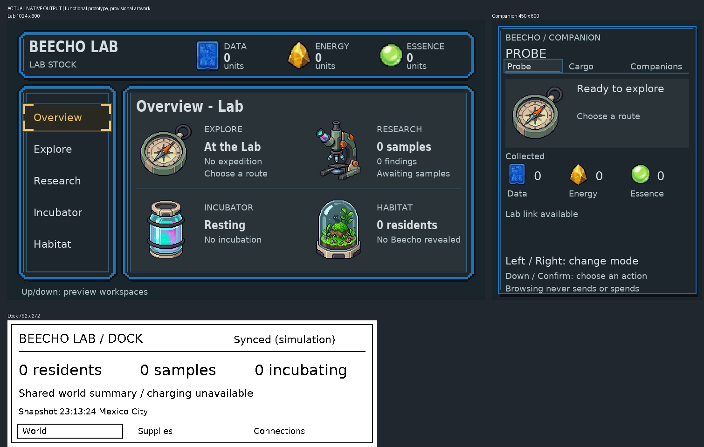

# Actual native three-device screens

These are frames produced by the native C kernels during the connected-game
acceptance journey. They show implemented functionality, not final art approval.
The Lab is 1024 × 600, Companion 450 × 600 and Dock 792 × 272. The family sheet
places unchanged native captures together; no screen content is painted over.

The [manifest](manifest.json) records source revisions, native dimensions and
image hashes. Captures use isolated test worlds and do not represent a player's
live save. This gallery supersedes the parent packet as evidence of current
implemented screens; the rejected parent artwork stays historical.

## Companion and Lab return journey

| Moment | Actual screen | Player consequence |
| --- | --- | --- |
| Probe gathers | [Gathering](gathering-companion.png) | Whole cargo and preparation toward the next unit are separate. |
| Browse Cargo | [Cargo mode](mode-cargo-companion.png) | Browsing changes preview; Confirm enters the mode. |
| Browse Companions | [Companions mode](mode-companions-companion.png) | Mode identity is visible; training is not implemented. |
| Inspect earned units | [Cargo](cargo-companion.png) | Resource counts are whole units. |
| Review return | [Send review](send-review-companion.png) | Sending requires an explicit action. |
| Receive at Lab | [Incoming haul](incoming-lab.png) | The Lab opens reception automatically. |
| Accept once | [Lab accepted](accepted-offline-lab.png), [Companion awaiting receipt](accepted-offline-companion.png) | Fresh acceptance credits cargo and ends the outing even when its acknowledgement is delayed. |
| Shared state | [Dock](complete-dock.png) | Dock summary reflects accepted stock. |
| Explore again | [New outing](new-expedition-companion.png) | A new expedition identity starts; old receipt retry cannot restart the previous one. |

## Research, incubation and habitat

| Function | Actual native screen |
| --- | --- |
| Lab overview with resident | [Overview](revealed-resident-home-0-overview.png) |
| Sample collection research overview | [Research](researched-home-2-research.png) |
| Incubation in progress | [Incubator](incubation-active-home-3-incubator.png) |
| Reveal result | [Reveal](05-reveal.png) |
| Resident habitat | [Habitat](06-habitat.png) |

The native artwork remains provisional. The reviewed [Gemini Companion and
reception concepts](../../companion-connected-art/README.md) are retained sources
for the next art implementation; their typography, icons and effects are not
claimed as present in these captures. The [hardware family render](../../lab-controls/combined-family-materials.png)
is an enclosure concept, not a photograph of built hardware. Native host evidence
does not establish radio, battery, e-paper, charging or printer performance.
