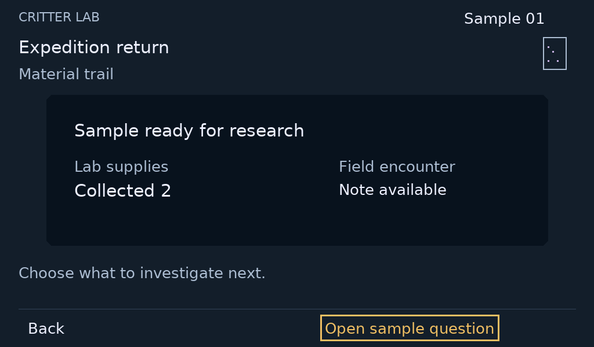
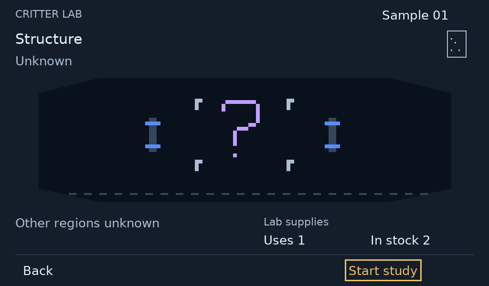
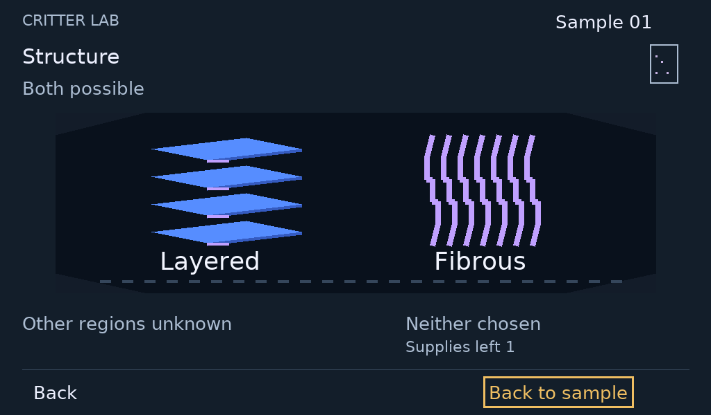

# Walk through Critter Lab

This is a review of the player experience. Start with the whole journey, then inspect the three current Lab screens below. These images are paper proposals, not working device screens. Review the experience and interaction; the repository files are supporting material.

## Where this work fits

| Moment | Player experience | Device | Design coverage now |
| --- | --- | --- | --- |
| Prepare | Compare an expedition's purpose, difficulty and expected rewards; load the chosen expedition | Lab → Probe | Intent documented; older preparation proposal retained; current layout still needs reconciliation |
| Collect | Carry the expedition, see progress and points, choose whether to inspect an optional encounter or pause | Probe | Collection frame and input sequence proposed; numeric records and encounter/pause frames still incomplete |
| Return | Receive the sample and supplies together; move directly into investigation | Probe → Lab | Proposed screen shown below |
| Investigate | Read the question and cost; start deliberately; keep findings when leaving or returning | Lab | Proposed study and finding shown below; missing-supply and pending frames described but not drawn |
| Choose | Finish required research and review a complete supported configuration | Lab | Rules/flow documented; connected screen sequence not yet designed in this packet |
| Create and meet | Commit displayed terms once; deliberately open and meet the saved individual | Lab | Intent and record experiments exist; connected screen sequence not yet designed in this packet |
| Live together | Carry and care for the same individual; return to its ongoing story | Companion ↔ Lab | Product direction; not a completed screen journey |

The caddy is the charging home. Supporting software preserves accepted records and handles generation; routine device play must not require a phone. This review does not establish those connections as implemented. See the [whole product and plan](../../docs/README.md) for the system and implementation sequence.

## 1. Bring the mystery home

The player sees one sample, the supplies received with it and a field-encounter note. The next useful action leads into research.

Turn the existing Lab knob to move the amber focus between Back and Open sample question. Confirm on Open sample question enters the study review. Turning alone changes no game state. Back returns to the previous context. The resource receipt is intended behavior; this paper screen does not demonstrate a transfer.

## 2. Decide to investigate

The sample stays recognizable. The central workbench shows what is still unknown; the cost and available supplies are visible before starting.

Turn the knob to move focus; Confirm on Start study submits it. A pending response must appear before a saved finding. Back returns without cancelling submitted work. If supplies are missing, Start is unavailable and the screen must explain why. Those response frames remain to be drawn; this image shows only the ready state.

## 3. Understand what was found

The same sample now has two supported possibilities. The equal reference drawings explain a finding; neither is a selected configuration or a finished critter.

Confirm on Back to sample or the existing Back button returns to that sample. Knowledge and spent supplies remain when revisiting it. Further required research comes before complete configuration selection; the intervening sample overview and next-study screens are still missing from this packet.

## What to review now

Does this workbench make the progression from unknown to known understandable? Does the sample stay recognizable without dominating the research? Is the cost/action/finding sequence clear when operated with the existing controls? These questions concern the three visible compositions, not approval of the unfinished whole journey.

The immediate design work after feedback is to connect these screens with their sample overview, focus changes, pending and shortage responses, then complete the research-to-selection-to-meet example. Functional implementation follows reviewed interactions. Final-release studies need broader meaningful variety: materials are only the V1 placeholder.

## Supporting material and limits

[Input storyboard](input-storyboard.png) and [Probe collection frame](probe-collection.png) preserve the current study. Probe uses Next to cycle supported targets and Confirm to activate; it never reveals sample contents. Its recorded-state placeholders are unresolved fields, not invented game counters. Encounter, pause and resumed frames are not yet supplied.

Lab rotation navigates with existing Confirm/Back. No knob press, third Probe key, Details key, screen clicking, touch or separate web action is introduced. On-screen labels are focus targets activated through physical controls. Native screen/input ownership is governed by [experience](../../specs/experience.md).

Authored example only: Sample 01, two collected supplies, one used by this study and one left afterward. These values and the layered/fibrous references do not approve balance or final content. Lab exports are 1024 × 600; Probe is 122 × 250. Neither size/profile claims final hardware or physical readability. No human playtest or functional input validation is claimed.

The disposable [generator](render.py) and retained stage art support reproducible exports. Designer regeneration, coordinator export inspection and one focused independent consistency review are the evidence for this paper packet. They do not approve the design. [Visual foundation](../visual-language/refinement-02/README.md), [screen standard](../screen-design-standard.md), [Probe rules](../../specs/probe.md) and [gameplay](../../specs/gameplay.md) hold the detailed boundaries.
