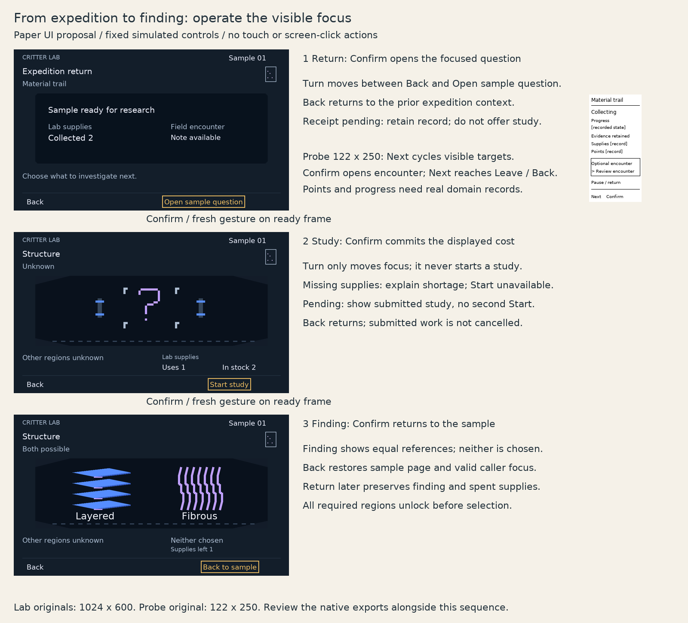

# Device interaction review

One paper proposal carries the selected Playful Pixel Lab foundation through expedition return, study and finding. It restores the existing full-width instrument stage and small persistent sample token rather than a left record / right report arrangement. Unknown becomes equally prominent layered and fibrous reference drawings; neither is selected or a final critter. It stops at inspectable compositions and input sequences, without implementation or approval claims. The existing stage art is reused in the two adjacent asset files.

Authored fixture only: Sample 01, collected supplies 2, study uses 1, stock 2 and supplies left 1. These make the proposed commitment legible; they are not approved balance, inventory implementation or canonical findings. Material study is the V1 placeholder; release study variety remains open. Reporting labels and placeholder fields are absent from the Lab player frames.

Native exports: [return](lab-return.png), [study](lab-study.png), [finding](lab-finding.png), [Probe collection](probe-collection.png). Lab exports are 1024 × 600 with the proposed 22/26/30 px scale and 8 px layout grid; the monochrome Probe is 122 × 250. The combined storyboard reduces Lab frames for comparison; inspect native exports for typography. Physical readability remains unvalidated.

## Operate the sequence

| Context | Simulated device input | Focus, action and response |
| --- | --- | --- |
| Lab return | Turn existing knob; press Confirm | Turning chooses Back or Open sample question without committing. Confirm on Open sample question enters its review. Resources remain secondary; sample and supplies are received together. |
| Lab study | Turn knob; press Confirm | Cost and stock remain visible at Start study. Confirm spends the displayed cost once and shows submitted/pending status before a saved finding. Material study is a V1 placeholder; final study variety remains open. |
| Missing supplies | Turn knob; press Back | Start study is unavailable with an explanation. Focus skips disabled Start and remains on Back. Back preserves sample, findings and caller context; it spends nothing. |
| Pending study | Press Back | Return preserves the submitted operation. No new Start target is offered for the same operation. Returning does not cancel, spend again or reroll. Pending and saved are distinct feedback. |
| Lab finding | Press Confirm or Back | Confirm on Back to sample restores that sample page and its caller focus. A later revisit retains the same knowledge and spent supplies. The equal references explain possibilities, not a chosen configuration. |
| Probe resting | Press existing Next; press Confirm | Next cycles Review encounter and Pause / return. Confirm acts on the visibly focused target. Ordinary collection remains visible without opening a status page. |
| Probe encounter | Next; Confirm | Cycle Inspect, Leave and visible Back. Inspect records the neutral encounter; Leave and Back resume the same collecting context. No genetic inference or sample contents appear. |

No knob press, third Probe button, Details key, screen click, touch or web action shortcut is introduced. These are simulated existing controls, not validated switches or drivers. A gesture started before the frame is ready is consumed; activation requires a fresh gesture on the ready frame. Back never implicitly cancels a submitted operation. Returning restores the caller's valid focus rather than choosing a consequential new command automatically.

The Probe fields are explicit placeholders for legitimate domain records, without fake counters or decorative interpolated progress. Points are visible because the owner requires them; their meaning and economy remain open. Progress must develop through actual expedition state. Encounter feedback is distinct from collecting. Exact compact text and refresh cadence require real display review; no sensor or display technology is selected here.

Every required genomic region must be resolved before complete configuration selection. Creation uses the qualifying sample once and keeps knowledge; future creation and Companion behavior are outside this packet. Identity retention, receipt reconciliation and saved results are intended behavior, not demonstrated storage or cloud implementation.

Generator: [render.py](render.py), Pillow and the public repository's Vera font; optional `CRITTER_REVIEW_FONT` overrides the font. Static export inspection and one regeneration check are the complete validation for this disposable paper artifact. No human playtest, firmware, physical readability or real device input validation is claimed. This packet needs owner visual/flow steering before dependent functional UI work.

References: [screen standard](../screen-design-standard.md), [experience](../../specs/experience.md), [Probe](../../specs/probe.md), [gameplay](../../specs/gameplay.md), [refinement 02](../visual-language/refinement-02/README.md).
