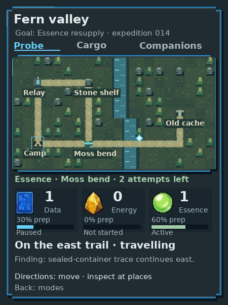
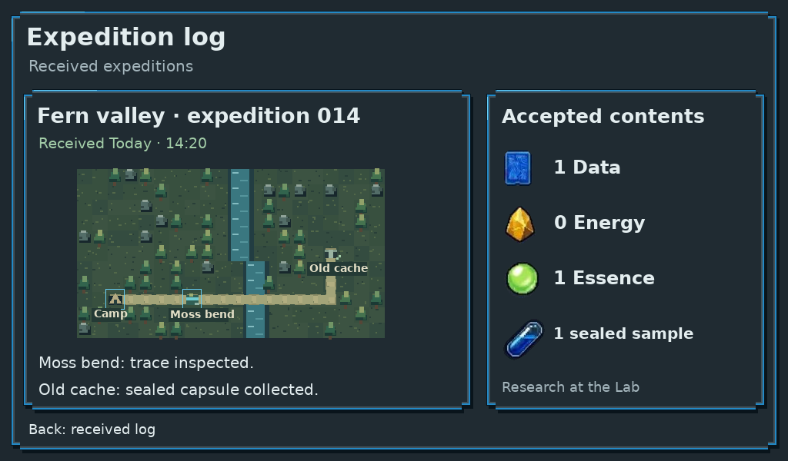
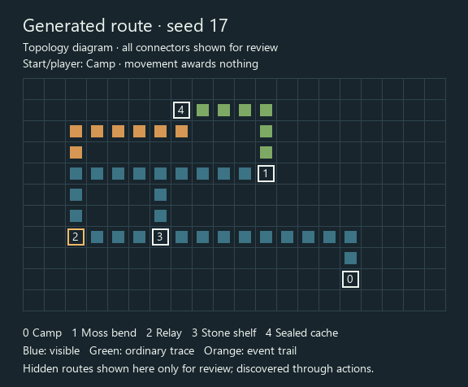
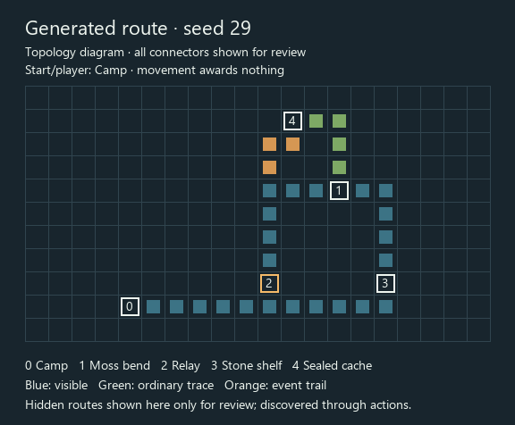

# Expedition map study

## Gathering review: exploration and source decisions

Issue [60](https://github.com/PacoCotera/critter-lab/issues/60), following actual
owner play of the [native Probe release](../../docs/evidence/native-companion-probe/README.md).
**Design proposal, not deployed behavior or approved balance.** The larger map
was delivered; gathering rules were not overhauled. The owner rejects passive
chance watching, road-only movement and repeated instructions. The earlier
supplies-versus-shortcut packet below remains preserved trial material, but is
not the recommended answer to this feedback.

**Owner pacing correction, 1 October:** preparation waiting during exploration
is artificial friction. The joined game/UX/art recommendation now removes that
clock, rather than demoting its bar. Meaningful field effort is finding,
observing, choosing and collecting; an animation communicates a committed result,
never gates it. Background work is a separate Lab process, not passive field
extraction carried under a new label.

### Lessons from other games

| Primary source | Relevant lesson | Application and limit here |
| --- | --- | --- |
| [Outer Wilds: The Intentionality of Wandering](https://www.mobiusdigitalgames.com/news/the-intentionality-of-wandering), developer discussion | Give players enough visual information to choose a destination through curiosity instead of blindly choosing a branch. | Existing landmarks invite inspection; an observed lead changes the next useful destination. Do not import its narrative, time loop or survival conditions. |
| [A Short Hike: crafting a tiny open world](https://blog.playstation.com/2021/08/05/crafting-a-tiny-open-world-a-look-behind-the-scenes-at-the-creation-of-a-short-hike/), developer Adam Robinson-Yu | Design around leaving the obvious route, with worthwhile discoveries off the path. | Test accessible ground with real detour value, not decorative grass beside mandatory roads. Do not import climbing, flying or a minigame catalogue. |
| [DREDGE: spatial inventory deep dive](https://www.gamedeveloper.com/design/deep-dive-the-surprising-depth-of-spatial-inventories-in-dredge), co-designer Joel Mason | Its early sail/interact/item/return prototype was boring; meaningful decisions needed to extend beyond collecting an item. | Instant bundles or a Confirm for each completed roll are insufficient. Learn contextual decisions and consequences; do not import inventory packing, cargo loss or a new equipment economy. |
| [No Man's Sky: Beyond](https://www.nomanssky.com/beyond-update/), developer notes | Deliberate target scanning, prospecting and clearer discovery feedback coexist with changes to reduce grind. | Source selection and observations should matter; earned items need brief visible feedback. Hold-to-scan, heat/reflex mechanics and guaranteed improvements to odds are not selected. |

These are examples to learn from, not universal best practices or evidence that
our proposal is fun. Game design, UX and art exchanged objections directly:
the packet leaves passive work intact; freer walking alone leaves the same
five-stop outing intact; repeated ready/claim prompts add chores. The considered
recommendation is **exploration-led finite collection**, with a compact source
selection only when actual alternatives matter. No compulsory reflex/alignment
game or repeated instant lottery replaces the timer. A separate active tool
interaction remains an alternative if finding and choosing still lack engagement.

### Two credible directions

| Direction | Player experience | Strongest tradeoff |
| --- | --- | --- |
| **A — open-terrain prospecting, recommended proof** | Walk accessible ground, use trails for orientation, inspect landmarks, choose finite findings and collect immediately, then follow observed leads. No preparation clock or passive extraction. | Requires truthful blocked terrain and a discovery rule that open ground cannot bypass. Simple pickups alone may still lack depth if the world offers no useful decisions. |
| **B — discrete survey sectors** | Choose a nearby sector, examine its finite findings/lead and choose the next sector; no tile commute or preparation gate. Retain the same cargo/return ownership. | Removes movement friction cheaply, but may lose the sense of inhabiting a place and become another menu sequence. |

Neither direction adds combat, survival pressure, new currency, hardware, cloud
services or a field-event platform. A later active tool interaction should be
tested separately if source decisions still leave gathering dull; it must add
agency rather than mandatory reaction timing or button repetition. Chance may
vary saved encounter contents before inspection. Once disclosed, actual contents
and the collection preview are truthful; Back/reload cannot reroll them. Do not
deplete a source on a rejected capacity check or grant an arrival/read reward.

### Worked short outing

The same player wants Data for retained Lab research. The Companion knows that
local intention, not the Lab's live inventory. Contents and capacity examples
are provisional fixtures; there is no minimum outing time or selected economy.

| Moment | Player choice and visible response | Consequence |
| --- | --- | --- |
| Orient | The local map shows accessible ground, a known source and a visually distinct inspectable landmark. Choose supplies or investigate first. | No item for arrival; moving/observing are active effort, not a reward timer. |
| Inspect/collect | A reached source reveals its saved actual contents. Fresh Confirm collects the previewed whole units immediately; one compact chooser handles meaningful alternatives. | One atomic source decrement/cargo credit. No preparation, passive extraction, repeated claim rolls or held-button gate. Brief feedback does not delay another action. |
| Observe | At a reached field-record opportunity, Read reveals an alternative source and a separate lead toward a sealed-container location. | Immediate information, no item award, no forged ordinary Moss trace and no sample contents. Retain the proposed event once. |
| Decide | Seed A puts a useful Data source nearby and the sample lead farther away. Seed B puts the sample lead nearby and Data farther away. Choose supplies now or investigate first. | Different useful ordering, not just corridors. Both opportunities can remain available; no arbitrary exclusivity or hidden boost from scenery. |
| Collect and return | Follow the deliberate lead, explicitly collect a neutral capsule if capacity permits, review exact cargo, Send, then Lab Accept. | Credit once; current Companion cargo becomes zero, received history remains. Lab/Dock receive accepted records and do not infer live away activity. |

**Conditional source example:** legitimately carried cargo38/40 leaves two slots.
A recovered supply tray has saved Data2 / Energy2 / Essence1. For a Data need,
select Data2; the preview says two whole items and40/40 after collection. Fresh
Confirm saves that result immediately; Energy/Essence remain at the source during
the outing. Back changes nothing. No loss, fraction, transmutation, new effort
budget or forced exclusivity is invented. A selected whole count must fit; never
auto-discard or silently credit part of an offered amount. This is an illustrative
near-full situation, not a universal cargo puzzle. Fresh cargo with a single useful
offer should permit simple pickup; extra chooser ceremony needs a real purpose.

This example is a hypothesis, not a native event or measured two-seed playtest.
If players choose the same sequence without considering the revealed information,
the variation has failed. Adding faster payouts does not repair that result.

### Movement and native hierarchy proof

Source inspection found separate friction: `kit.c` moves one cell on release,
ignores repeated held downs and currently pauses preparation while any Companion
key is held. The presenter also rejects new presses during pending activations. These
findings do not measure network latency. Repair reversible movement separately
from fresh Confirm/Send guards: test taps and bounded hold-repeat with no queued
steps after release and no held acquisition. Removing field preparation also
removes its travel/pause/catch-up semantics; do not retain an invisible extractor.

Proposed 450×600 composition, preserving existing art and shared framing:

| Area | Bounds and hierarchy |
| --- | --- |
| Mode | Quiet word/selected underline at the top; full selector only after Back. Compact approved mode glyphs are missing, so do not shrink or repurpose unrelated art. |
| Place | Distinct 26px place caption at x33/y54, with brief real context. |
| World | Existing native32px family in a proposed384×320 map at x33/y98; one extra row uses space reclaimed from work meters. Strong position feedback and truthful terrain; no invented saved facing. |
| Action/result | One72px region at y432–504: named action/preview or brief inline result. A genuine chooser can extend upward into the map; no permanent instructions or per-item progress bars. |
| Cargo | Persistent unframed64px band at y518–582: exact whole counts and separate capsule state. No preparation strip or instructional footer below. |

Direct Confirm is conditional on a complete visible preview. Genuine source
alternatives cannot be collapsed into a guessed default. Keep the safe return review
and explicit Lab acceptance. Target three to five purposeful field gestures
instead of the current ten inspection/selection/dismissal gestures, excluding
travel and safe transfer; this is a design target, not a measured result.

### Smallest acceptance gate

Build a reversible timer-free physical-control proof, labelled provisional:
two resolved seed situations, simple pickup and one meaningful near-full choice,
one observation that changes the next destination and explicit neutral collection.
Record attempted/applied arrows and input-to-paint using the existing hook; inspect
release, blocked ground, changed context, capacity rejection and cancelled return.
Actual exports must be reviewed at 1× against Gemini/C18 before a quality claim.
An owner playtest must show understandable route choices and useful consequences,
without a preparation wait. This can still fail if the entire field becomes
commute/press/item with no discovery. No code, build or deployment changed
for this discussion; agent agreement does not establish enjoyment.

### Background Lab pacing

Actual native studies commit resources and reveal findings immediately. There
is no research job queue. Existing incubation has a provisional20-second timer,
advances in eligible powered-on simulation separately from Companion field work
and requires deliberate opening
of the same saved individual. Save/load resets clock anchors; no powered-off or
cloud catch-up is established. Lab suspension/held input also pauses its ticking.
Retain that natural background process; do not
add a research delay simply to relocate the rejected field timer. A particular
procedure may later justify running/ready/reveal states, but its duration,
parallelism and retention require a separate selected contract. Research discovery
still needs meaningful findings and choices regardless of whether it takes time.

Away Companion screens may show last-received Lab readiness, not pretend to know
live progress. Ready is not auto-spend, auto-create or an unsolicited reveal.

## Earlier map and event studies

Issue [49](https://github.com/PacoCotera/critter-lab/issues/49): an authored static
design proposal for exploring on the Companion and receiving the result at the
Lab. The existing delivered Core V1 is unchanged. This packet is a paper/state
proof, not playable software, selected balance, real sensing or hardware evidence.

The player chooses an Essence resupply goal locally, follows a fictional map,
starts a finite gathering opportunity, investigates a trace, reaches a newly
revealed cache and explicitly collects a sealed sample. The Lab later shows the
received journey and accepted whole items. It knows nothing about the away
Companion until a record is actually received.

## Player walkthrough

All Companion exports are **450×600**. The six main states share the same outing.
The input and transition notes below are separate from the device artwork.

| State | Physical input and visible response | Recorded consequence |
| --- | --- | --- |
| [01 · At Camp](exports/01-map-seed-a.png) | Directions step along four-way paths. Confirm at Camp opens its opportunities; Back returns to modes. Camp already offers all three essential resource classes. | This staged example has one failed Data attempt, then one earned Data. The next Data preparation is 30%; two attempts remain. The selected goal is Essence resupply, not a live Lab request. |
| [02 · Moss bend](exports/02-brook-opportunity.png) | Walk to Moss bend, then Confirm to inspect the place. Up/Down chooses **Inspect trace** or **Start Essence gathering**. A fresh Confirm performs the selected action; Back restores the same map position. The close view shows the local markings. | Inspect trace records the fictional observation **“Sealed-container trace continues east”** and reveals the cache connector/location. It grants no resource or sample. Separately choosing Start Essence pauses Camp Data at 30% and activates the finite Moss bend source. |
| [03 · New east route](exports/03-active-map-lead.png) | Directions move along the newly visible branch. The cyan diamond is the current tile; the caption says travelling. Confirm opens a place only after reaching one, with no action or award on ordinary path tiles. | This staged later moment contains Data 1 / Energy 0 / Essence 1. Data preparation is paused at 30%, Energy has not started, Essence is active at 60% with two attempts left. Gathering continues while moving; movement did not change its source. |
| [04 · Cache](exports/04-sealed-sample.png) | Reach the revealed cache, Confirm to inspect it, then freshly Confirm **Collect sealed sample**, or choose Leave it here. | Collection checks the separate capsule capacity and retains capsule `cache-A-01`. The neutral art shows a sealed sample; no genome, traits or supported forms are disclosed. |
| [05 · Return review](exports/05-return-review.png) | Back to modes, choose Cargo, then open return review. **Keep exploring** is initially focused. Keep/Back restores the same location and preparation; Up then fresh Confirm selects Send. | Review freezes work. Sending seals the record and stops gathering; it transfers only whole supplies and the collected capsule. Preparation is retained local activity state, never an item to spend or unload. Illustrative stores: supplies 2/4, capsules 1/1. |
| [06 · Sent](exports/06-sent-awaiting-receipt.png) | Back returns to modes while the receipt remains pending. | The sealed result remains visible. This source expedition cannot resume. This frame is deliberately before Lab acceptance; the later Lab frames are after acceptance. |
| [08 · Lab received log](exports/08-lab-received-log.png) | Up/Down chooses a received record; Confirm opens its details; Back returns Home. | The selected record is received and accepted at the staged timestamp. Only its walked Camp → Moss bend → cache route and whole accepted contents appear; no avatar, active source or preparation exists in this view. |
| [09 · Lab detail](exports/09-lab-received-detail.png) | Back returns to the same received record. | The two recorded accomplishments are trace inspection and sealed capsule collection. The capsule leads to existing Lab research; reception does not decode it. |





The sequence condenses intermediate inputs: Camp's opportunity chooser, the
post-trace result moment, selecting Start Essence after the trace, walking to the
cache, the modes/Cargo landing, and fresh Lab acceptance are described transitions,
not additional captured states. **02 → 03 combines three independent events:** a
fresh Inspect trace records the observation and opens the route; a separate Start
Essence changes the active source; elapsed time/chance work then earns one whole
Essence. The Essence award does not reveal the path. The packet does not claim interruption/retry,
offline receipt, capacity-full or exhausted-source screen coverage. These remain
implementation acceptance work after owner direction.

## Useful divergence, not a visit-all checklist

Compare [seed A](exports/01-map-seed-a.png) with
[seed B](exports/07-map-seed-b.png). Seed A puts Moss bend on a direct nearby branch
and Relay → Stone shelf on a longer resupply circuit. Seed B divides the route at
Camp into Relay or Stone shelf arms which meet at Moss bend. The same essential
resource classes remain accessible at Camp; the optional stations offer additional
finite opportunities. Waiting cannot renew an exhausted source. The new sample
route is discovered through inspection, independently of gathering awards.

These are **two authored topology fixtures with seeded terrain**, not a general
procedural-world generator. The paper generator draws orthogonal corridors; it
does not validate the extra movement edges created by adjacent path tiles. The
cache connector is omitted before trace inspection and added afterward. Seeds
1429 and 7183 also change terrain clusters and stream placement reproducibly.

Native translation keeps the reviewed topology but moves seed B's cache branch
one row upward, leaving a blank row beside the ordinary upper arm. This prevents
unmarked shortcuts under actual four-way tile movement. The original illustrated
reference remains preserved; runtime path legality and restart behavior require
the separate native acceptance evidence.

## Visual grammar and editable source

The shared resource family is the exact retained Gemini/C18 PNG family from
`../core-v1-art/exports/`, drawn at 1×. No resource masks, Pip art or originals were
changed. `manifest.json` records the actual bytes, dimensions and hashes used.
Graphite fields, blue stepped shoulders, existing Vera/Vera Bold typography and a
dark inset with restrained amber focus carry the approved C18/03/04/07 direction.

The new fictional map vocabulary is editable code: layered grass clusters, trees,
stone, water, legal path tiles and five place markers. It is a proposed map visual
language, not a new approved creature, real geography or sensor reading. Markers
identify places; nearby terrain does not certify resources or sample contents.
The cyan/white diamond marks current position; a warm outline marks the current
inspectable place; quiet cyan marks an inspected site; the amber base marks the
active gathering source. Collected-cache marking applies only to that resolved
action, not every opportunity or clue at a site.

`study.json` owns the two graphs and representative state values. `build.cjs`
owns the reusable map/frame/resource geometry and composition. Each generated
`source/*.svg` preserves editable geometry plus exact raster resource/text layers;
live copy is edited in the generator, not repainted into an original source asset.
The map raster footprint is **400×220**, placed within its stepped panel; local
Brook/Cache views are exact **2×** crops of that same authored map, with no hidden
route in the pre-inspection Brook view. Received maps stay 400×220 at 1× and contain
only the recorded walked route. No screen screenshot is used as a background.

The Companion preserves native resource footprints (37×48, 43×51, 47×49), explicit
earned counts and separate preparation tracks. Current-location labels have quiet
backing on busy terrain. Location resource-status ink ends around y463; focus
begins at y475 outside its inset. Footer ink ends by y573, clear of the inner frame.
Actual glyph bounds for all exports are in `manifest.json`. Reference/font/source
hashes and local crop/scale coordinates are recorded there too. Full-scale proof
sheets are [six Companion states](exports/companion-sequence.png),
[two seeds](exports/two-seeds.png) and [Lab records](exports/lab-received.png);
these sheets arrange the native screens without resampling them.

## Regenerate with the established toolchain

From the public checkout, using an existing Node/Sharp installation:

```sh
node design/expedition-map-study/build.cjs
```

Set `NODE_PATH` to an existing module directory if Sharp is supplied by a separate
runtime. This uses repository Vera font files and installs nothing. Fontconfig
may report unavailable writable cache directories;
the measured font exports still complete. `manifest.json` records every native
canvas and exported PNG/SVG hash. The normal validation is whole-frame inspection
at native size and one unchanged regeneration comparison, not native gameplay tests.

## Review boundary

Game and UX agreed the proposed state/control/knowledge contract before production.
The first actual inspection identified weak location illustrations and excessive
Lab protocol prose. The revised batch uses same-map local observations and the
received route as the visual subjects. Game design, experience/visual review and
the coordinator inspected the corrected actual native-size exports and passed
this bounded proposal on 30 September 2026. The resolved objections were trace
versus gathering causality, truthful received-map scope, the travelling-position
caption, visible preparation and safe action/footer spacing.

One unchanged regeneration comparison is recorded in `validation.json`. This
does not claim owner acceptance, playable fun, selected yields or complete
procedural-map/runtime behavior. Owner steering is required before dependent
mechanics are implemented.


## Generated discovery trial

**Executable geometry spike and reviewed paper interaction, not native gameplay.**
The live version still has two authored maps and no interactive field event.
The owner requested real variation and active discovery; these examples answer
whether a small seeded generator can produce connected choices, then connect one
finite event to the existing neutral-capsule/retained-research loop. They do not
select final balance, terrain art, a new species or a research minigame.

### Two actually generated routes

Run [generate_routes.py](generate_routes.py) using Python and the installed Pillow
runtime. It constructs tile geometry from seeded role positions and a shuffled
connected tree with an optional edge; it does not select stored map templates.
Overlapping corridors can create additional connections, so construction edges
are not advertised as the actual site-adjacency graph. Tile BFS checks reachability.
The two resolved JSONs are inspectable save candidates; the game does not yet load
or save this generator. A future native content version must preserve old geometry
and persist each new resolved route without rerolling after restart.

| Example | Resolved geometry | Event route value from its location |
| --- | --- | --- |
| [Seed17 diagram](generated-trial/route-17.png) / [JSON](generated-trial/route-17.json) | Different Camp/role coordinates and corridors | Ordinary visit to Moss then cache:19steps; event connector:11steps. |
| [Seed29 diagram](generated-trial/route-29.png) / [JSON](generated-trial/route-29.json) | Different geometry, connections and source position | Ordinary visit to Moss then cache:12steps; event connector:8steps. |




Blue tiles are initially traversable. Green is revealed by the ordinary Moss
trace; orange by the optional event. **Hidden paths and cache are displayed here
only for reviewer comparison.** The actual initial player view must conceal them.
Camp0 is the current/start position, not a final player sprite. Movement awards
nothing. Diagram colors, numbered squares and grid spacing are explanatory, not
new game-art direction or native-screen proof.

The first seed29 event location offered equal-length travel alternatives. That
was weak route value. The corrected experiment places a trail event only where
it bypasses at least4legal steps through the ordinary Moss investigation stop;
otherwise it omits that optional event. This eligibility threshold is proposed,
not final balance. The ordinary lead and sample never depend on an event.

### One finite event: the abandoned field packet

| Player choice | Preview and immediate consequence | Retention / safe exit |
| --- | --- | --- |
| Recover supplies | **Recover3Energy**; the preview names3whole items, not chances or fractional preparation. Accepted choice puts those items in current Companion cargo. | Require3free cargo slots. If full, disable this choice without consuming the event or discarding cargo. |
| Read the trail | **Read the trail**; preview says it reveals a path to a sealed cache. Acceptance immediately reveals the actual connector and cache location. It gives no item or sample contents. | Walking the connector and freshly inspecting/collecting the neutral capsule remain separate deliberate actions. |
| Leave for now | Back returns to the same tile. No chosen result. | Event remains available. Choosing supplies leaves the ordinary Moss lead intact. If the route is already known, omit the redundant trail choice; Recover/Back remain useful. |

One accepted choice consumes the packet opportunity once. Revisit/reload cannot
repeat it or reroll the outcome. Resolve resource capacity and chosen consequence
atomically; rejected input changes nothing. Proposed saved event state names its
position, unresolved/chosen result and content version alongside the resolved map.
This contract is **not implemented by the generator**.3Energy and4steps are
illustrative values, not a new economy or promise that one packet funds research.
No mandatory risk, timers, radio/sensing claims or event service is introduced.

### Connected player walkthrough

| Moment | Player intention / physical controls | Visible response / durable consequence |
| --- | --- | --- |
| Generated outing | Choose an outing on Companion; directions move legal visible tiles, fresh Confirm inspects a reached site. | Camp and essential sources reachable; no start/movement award. Source preparation can continue as secondary activity. |
| Event decision | Inspect packet, Up/Down chooses Recover supplies or Read the trail; fresh Confirm commits, Back leaves. | Exact useful bundle or immediate new path; one saved choice. No hidden mandatory event. |
| Neutral sample | Follow either ordinary or event lead, inspect reached cache, freshly Confirm Collect. | One stable sealed capsule and provenance. No A/B trait or founder portrait disclosed in the field. |
| Accepted return | Cargo review defaults to keep; explicitly Send, then Lab Accept. | Credit once; current Companion supplies/capsule become zero, delivery record retained. Lab and Dock project accepted records, not live away state. |
| Sample question | On Lab, inspect a retained clue and preview the useful study/cost. | [Concrete A/B workpiece](../research-and-creation.md#next-comparison-trial): A pale-expression question differs from B walking-effort pairing. Lab handles procedure; no interpretation quiz. |
| Discovery retained | Fresh Start commits existing study; then freely inspect its relationship and choose the next useful question or resupply. | Same sample and paid finding survive Back/reload/trips. Complete facts permit supported-form comparison and separate deliberate creation. |

### Inspection and boundary

One generation pass plus one regeneration check produced identical JSON/SVG/PNG
outputs for both pinned seeds. A bounded64seed sweep asserted64distinct geometry
results, connected essential sites, reachable ordinary sample route, bounded cells
and a valid event connector where offered. This establishes topology viability,
not pacing, fun, content diversity or native compatibility. The review identified
and corrected the equal-length event case; game/genomics and UX/art directly
resolved the sample-reference disclosure boundary in the linked contract.

The next proof must be native-size composition/physical controls and a playable
slice using versioned saved geometry and truthful event state. Existing Gemini/C18
masters remain visual authority. The diagrams are not a replacement for the
pixel artist. No running V1 or deployment was changed by this trial.
