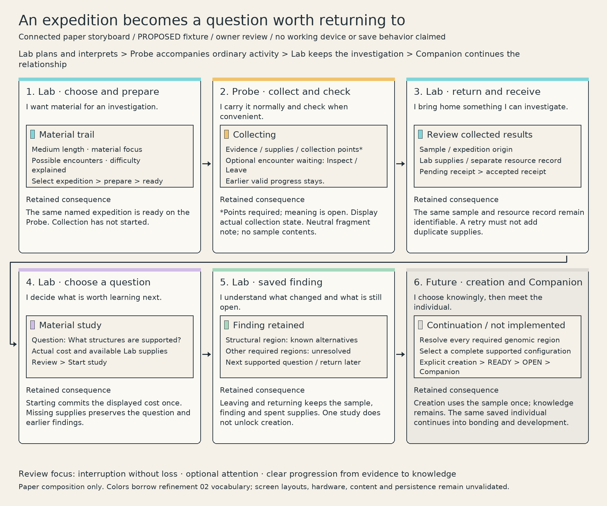

# Connected expedition review

**Purpose:** let Paco inspect whether an ordinary expedition produces a useful, understandable investigation across the kit. This is one proposed paper scenario, stopping at a saved finding; the ghosted creation/Companion continuation explains its purpose without expanding the slice. It is not approved screen design, functional software, a hardware study or human playtest evidence.

The Lab selects and prepares **Material trail**, the Probe collects with brief optional checks, and the Lab receives a stable sample plus separate Lab supplies. A study exposes its question and actual cost before **Start study**. Its result explains the newly known alternatives and remaining required regions. Return later resumes that same investigation. These working names and fictional content are proposed existing examples; no numerical economy or anatomy is selected.

The optional encounter records only that a fragment was encountered. It does not predict the sample's structure, genetics or critter. Interpretation happens at the Lab, following the boundary in [Probe](../../specs/probe.md). Collected points are required by the accepted experience direction; this paper field is a placeholder with no chosen quantity, meaning or economy; progress represents actual domain collection state, not a cosmetic animation. Loading, pending receipt, accepted receipt and retained research are intended states; this artifact does not establish working transfer, identity persistence, offline storage or cloud behavior. The intended expedition does not require a phone or live server. Cloud authority and actual offline joins remain a separate implementation question.

## Owner decision — 27 September 2026

The owner approved the connected flow and all three recommendations below. The governing rules are now in [gameplay](../../specs/gameplay.md#expedition-continuity-and-return--accepted). The alternatives remain comparison history, not active choices. This approval does not finalize screen layout, artwork, numerical content or technical implementation.

**Release follow-up:** material studies are a V1 placeholder. A broader, meaningful study set is required for final release; see the [study-variety requirement](../../specs/gameplay.md#study-variety--release-requirement).

## Approved choices in the same scenario

| Choice | Approved direction | Alternative considered |
| --- | --- | --- |
| Return before completion | Retain evidence, supplies and progress; label unfinished sample incomplete. Resume the same expedition. | End the expedition early rather than pause it; retain resources and an incomplete sample record, but do not resume collection for that sample. Simpler expedition lifecycle, but an interrupted session cannot finish the same sample. No earned resources are discarded. |
| Miss the optional encounter | Keep it available; after completion offer its note at the Lab, without extra material. | Keep a historical note with no later Inspect action. Less interaction at return, but the player loses the chance to engage with the encounter. Neither route gates research or creation. |
| Show the return as a bridge into research | Review sample and supplies together, then open the sample's next question. Keep deeper resource detail secondary. | Receive collected results into inventory first and require a separate sample selection. Supports inventory browsing but adds a step and weakens the visible expedition-to-question connection. |

Accepted research boundaries remain: all required regions unlock before final selection; selection records a complete supported configuration; explicit creation uses that sample once and retains knowledge. No undisclosed hereditary draw occurs. READY and deliberate OPEN lead to the same saved individual; Companion bonding/development is future context, with no invented care meters. Console-only acquisition remains part of the wider product, outside this expedition fixture. The Caddy supports the physical routine; no transfer or reward is inferred from docking.

## Evidence and stopping condition

Generated with the small adjacent Pillow script and inspected as a static export. One regeneration check verifies the disposable source produces the same artifact. The paper uses the refinement 02 cyan/lavender/amber/mint meanings with text labels; it does not approve that proposed vocabulary or establish monochrome readability. No sensors, actuators, dimensions or device controls are selected. The packet is complete when its connected sequence and these choices are inspectable; the approved flow may now inform a bounded implementation plan. Open study content, visual and technical choices still need their own design.
