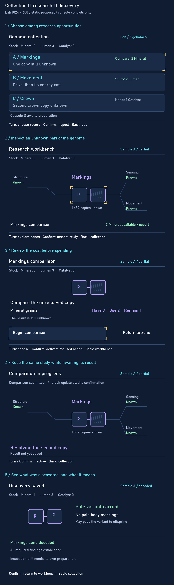

# Genome workbench: one discovery in a collection

**Approved Lab workbench study, 27 September 2026.** Approval covers the presented composition and paired-copy discovery direction; this remains a static design, not implemented UI or final balance. This continues the selected [refinement-02 vocabulary](../visual-language/refinement-02/README.md) at the Lab's 1024 × 600 profile. It is not implemented UI or a complete screen catalogue. The [connected product plan](../../docs/README.md) and [research game model](../research-and-creation.md) supply the journey; the [Pip proof](../../prototype/genetics/report.md) supplies the hereditary facts.

## Whole journey and this slice

Expedition profile → Probe gathers typed resources and may find capsules → accepted return credits Lab inventory → choose among partial genomes → inspect a research zone → review and commit a study → retain a discovery → research another record or prepare a fully decoded genome for incubation.

This study covers the middle, from collection choice to a saved discovery. It begins after the worked Bright Trace return: Mineral 3, Lumen 3, Catalyst 0, with capsule D awaiting preparation. A and B both offer useful affordable work. C remains inspectable but needs Catalyst. No Probe transfer, incubation or living critter is simulated here.

## What the visual objects mean

- The paired tiles depict the two inherited copies at the selected locus. A labelled tile is established knowledge; hatching is unresolved information, not an empty/absent allele or a locked action. Their spatial order preserves the discovered copy across frames; p/P is the same unordered genotype as Pp.
- The full-width research field organizes nearby research topics. Its connecting lines are **navigation/grouping**, not chromosome positions, dependency arrows or new biological relationships. Structure, sensing and movement are compressed known-context references in this late-stage Sample A example. They do not replace or exhaust the eleven genomic dimension families.
- Cyan carries the record identity; lavender marks research; amber corner brackets mark current focus; mint plus explicit text marks an acknowledged result. Bahnschrift and the 22/26/30 scale follow the measured component study. No final critter art is introduced.
- The workbench does not disclose a hidden allele, preview a pale critter, or promise a result before research. The saved Pp discovery means a pale variant is carried without pale markings. That fact can matter in later inheritance.

## Device input, visible response and consequence

| State | Existing input and screen response | State/spending boundary |
| --- | --- | --- |
| Collection | Turn moves focus A → B → C → capsule D; Confirm inspects the focused item; Back returns to Lab | Preview spends nothing. A needs 2 Mineral; B needs 2 Lumen. Capsule D is a separate preparation item, not a fourth prepared genome |
| A workbench | Turn traverses the displayed research topics; Confirm on Markings opens the comparison; Back restores A's collection focus | Other known topics remain inspectable. Unknown information is not disabled |
| Cost review | Turn moves between Begin comparison and Return to zone; Confirm activates the focused command; Back returns without spending | Have 3, use 2, remain 1. Result still unknown. Screen labels are operated through physical controls, never clicked |
| Pending | Turn and Confirm are inactive; no actionable target is focused. Sample A and its selected zone remain visible. Back may return to collection while the same study remains pending | Display no completed discovery or confirmed new stock until the result is acknowledged. No invented reservation rule or simulated percent/timer |
| Saved discovery | Confirm returns to the same workbench with both copies shown; Back restores A in the collection | Mineral becomes 1; Lumen 3 and Catalyst 0 remain. The variant did not change: research established the unknown copy |

The depicted console retains its existing knob and Confirm/Back. The footer explains their context; it does not add buttons or knob-press behavior. Focus on A persists when returning. In the saved-result acknowledgement, Confirm continues directly; it is not another domain commitment. Functional input handling and animation are outside this study.

## Collection consequences and complexity

Sample A's other required findings were already established in the worked model. The saved result can therefore label A decoded; it does **not** mean two allele tiles are a complete genome. Incubation remains a separate preparation/acceptance step.

After A, B still has an affordable 2-Lumen drive study. B is more complex because discovering Mm establishes burst capability while a later Ee finding explains the cost of that supported action; knowing one does not settle the other. C still needs Catalyst. The later Mixed Survey return can supply one Catalyst shared between B's efficiency study and C's crown comparison: the player chooses where to spend it. Costs/yields and names remain illustrative, not final balance.

Probe context for that next trip: choose an expedition profile for the needed resource opportunities; show gathered quantities/progress on the Probe, without revealing capsule genetics or pretending the trip itself decodes a Lab zone. Return credits the collection's shared stock. A resupply expedition need not yield a capsule. That Probe composition is not included in this Lab-only visual review.

## Unpictured states and review boundary

Insufficient supplies: C opens normally; the study shows the Catalyst shortfall and cannot submit, while Back remains available. Returning from pending preserves the operation. An uncertain result shows a check/recovery path for that same operation, not a fresh paid study. Definitive failure shows retained knowledge and authoritative inventory; no refund is assumed. These states require later frames and interaction validation before implementation.

Design review approved the paired-copy representation, broad workbench composition and presented discovery direction. That approval is not evidence of wider player comprehension. It does not claim complete flow coverage, physical readability, final art, or complete journey coverage. Implementation may follow the approved slice; unpictured flows require their own design before expansion. Resource labels visible in the approved images are rejected placeholders; see the current gathering design for naming status.

Render with Python/Pillow using `render.py`; its study font is the existing Windows Bahnschrift installation and is not bundled. Original references remain untouched. Individual full-resolution frames are retained beside the board for inspection.
