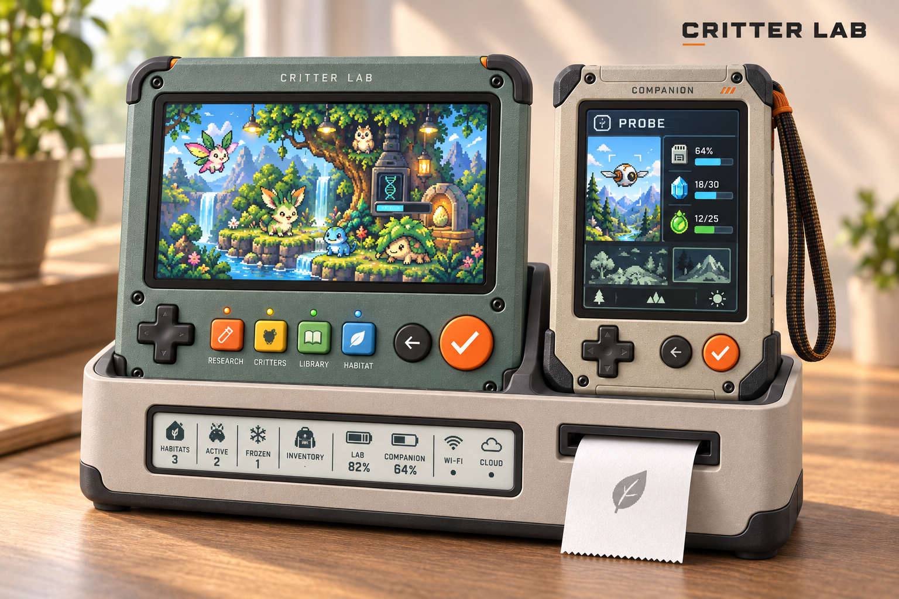
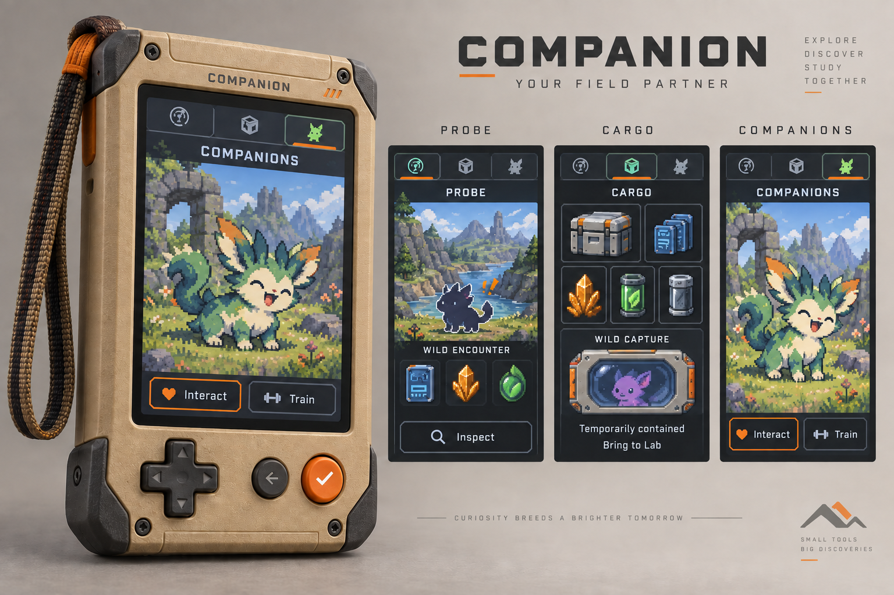
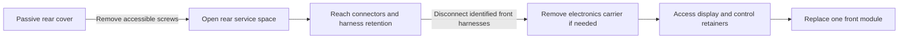
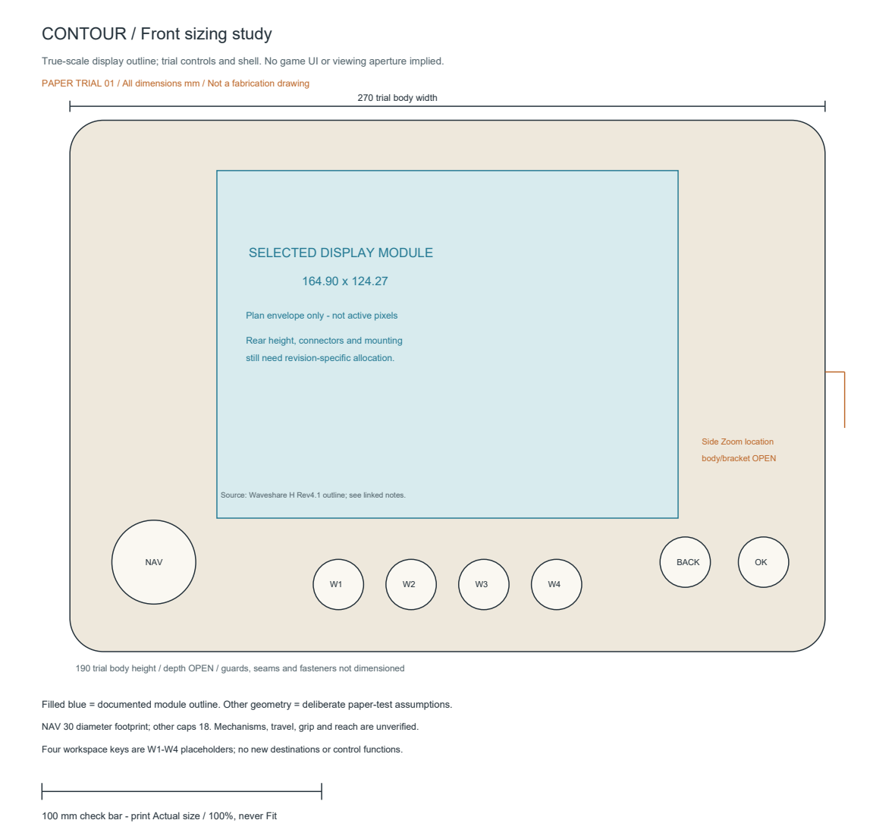
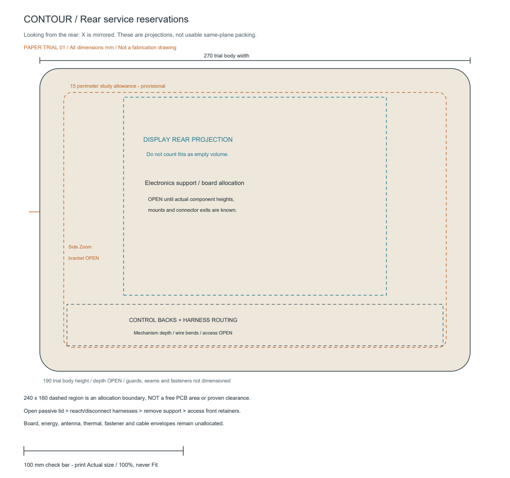
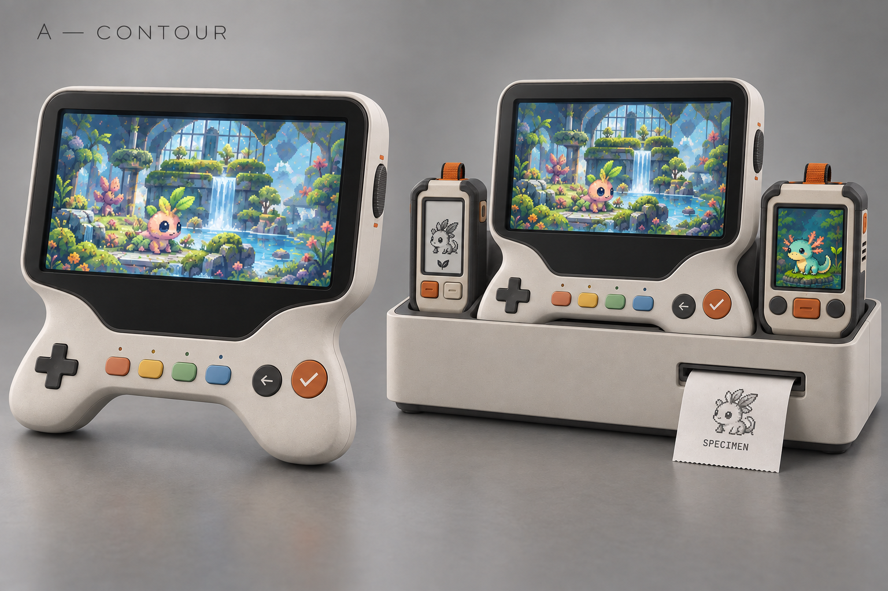
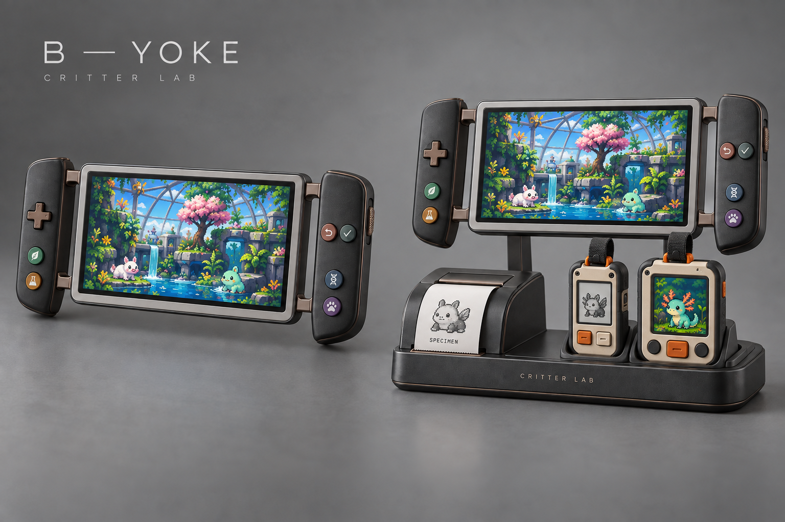
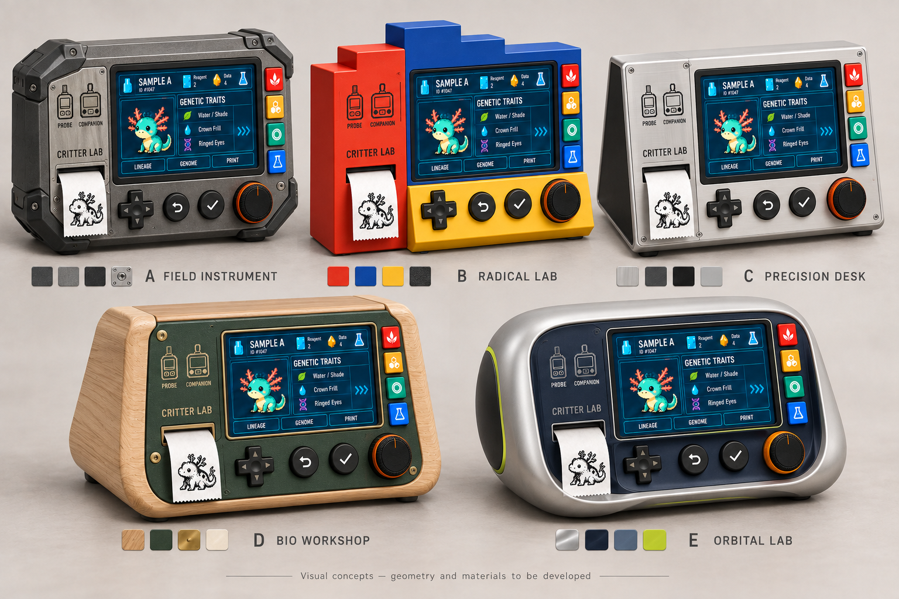

# Lab physical-design exploration

## Current concept — Companion-led three-object family

### Related shell colors and three docked displays

Owner requested less contrast between the dark blue Lab and cream Companion. This appearance proposal brings their tonal values closer: sage-grey Lab, warm stone Companion and station, shared charcoal guards and orange controls. It preserves distinguishable home/portable identities. The Lab shows a living habitat, Companion shows Probe gathering, and station has a quiet monochrome summary rather than another animated scene. [Exact built-in image-generation brief](combined-family-sage-prompt.txt).

Screen content, species, resource colors and mixed progress units are illustrative, not approved UI or assets. Display dimensions, e-ink availability, clearance, charging and manufacture are not established by the rendering. Review scope is family color and device-purpose hierarchy.

Experience Design inspected this exact export: related shell colors, two-device composition, retained controls and distinct three-display roles are suitable for owner appearance review. Inventory detail, status freshness/unknown states, capture flows and physical ergonomics are outside this pass; no implementation approval follows.

The owner approved consolidating Probe into the everyday **Companion**. Current exploration therefore contains exactly two removable devices and their shared station: Companion goes out; Lab is the home handheld workbench; caddy charges them, prints and presents the living collection. Older separate-Probe boards below are retained references, not the current kit. [Device authority](../../specs/devices.md#current-consolidated-product-architecture) and [capture/gameplay boundary](../../specs/gameplay.md#combined-portable-and-wild-capture) govern this proposal.

**Companion first.** Propose a substantial pocket-oriented portrait body, expressive color screen, wrist loop, protected direction cross, distinct Back and Confirm, and no protruding dial. A large creature view supports companionship; Probe and Cargo need fast readable glances. Actual screen, compute, sensors, power, dimensions, weight and one-thumb reach are unselected/unverified. The previous small Companion display is a development reference, not a limit on this combined role.

| Mode | Player purpose | Boundary |
| --- | --- | --- |
| Probe | Follow expedition gathering, investigate field signals and inspect wild encounters | Capture is a separate deliberate choice; no automatic catch or invented odds |
| Cargo | Inspect supplies/samples/findings, manage capacity and see temporary wild containment | Bonded critters are distinct; a captured specimen is not a decoded genome |
| Companions | Spend time with travelling critters, interact and train | Exact activities, development rules and carrying capacity remain open |

Proposed input: cross moves visible focus, Confirm opens detail or the explicitly reviewed action, Back restores the prior subject. A visible mode target provides access to the three modes without hidden cycling. Switching views does not cancel gathering. Wake must not also activate a consequential choice. Inspection stays free; capture/release and other consequential choices require explicit review rather than a stray mode/wake press. These are concept requirements, not implemented behavior.

**Lab:** larger screen for genome discovery, interpreting findings and entering habitat management; familiar branded home-instrument treatment and tactile workspace shortcuts. **Home habitat station:** one clear rest per device, reachable controls, printer separate from ambient habitat window, residents/environments visible as a home presence. Durable world state is cloud-authoritative; local capture, caching, offline behavior and synchronization need a separate bounded architecture decision before implementation.

Whole journey: prepare and take a Companion → explore while gathering → inspect findings or interact with travelling critters → decide whether to attempt a wild capture/continue exposure → return and reconcile cargo/containment at the Lab → research → place/develop residents and observe habitats through the shared world. Leaving the portable behind must not be confused with moving ownership or completing a transfer. No automatic docking reward or silent transfer is added.

The visual proposal tests physical hierarchy and the three mode identities. It does not select production parts, finalized UI, creature art, printer/display packing or ergonomic geometry. Manufacturing remains small-batch and serviceable as described below.

[Generation briefs](combined-system-prompts.txt). Experience Design inspected both final exports: two-device hierarchy and three mode identities are clear. The Companion correction adds a Confirm glyph, labels the wild encounter, removes ambiguous progress bars and renders temporary containment as status. Complete capture flow and physical ergonomics are not validated. The family plate's blank Companion Confirm and illustrative Lab content are not finalized controls or UI.

**Subsequent owner direction supersedes the docked screen content in this family render:** Lab shows environments, creatures, incubations and research; caddy provides an e-ink candidate summary of habitats, stored inventory, charging and network/cloud status; Companion keeps scanning/gathering in Probe mode while docked. See [coordinated defaults](../../specs/devices.md#coordinated-docked-defaults). Preserve the physical role proposal; do not copy the render's caddy living scene into implementation.

**Current direction:** the [owner physical-experience interview](../../specs/devices.md#owner-physical-experience-interview--current-direction) supersedes the printer-in-handheld case and fixed lower-row layout below. Develop a two-thumb home handheld, playable in its tidy shared caddy, with the printer in that home station. Field Lab is the original concept's name; Field Instrument and Orbital Lab remain inspiration. Retained boards below document earlier exploration, not the new configuration. Next visuals must show both handheld use and the supported living-display/play arrangement.

## Handheld and home station — architecture divergence

**Current refinement:** owner likes the rugged family and asks for a clearly branded home Lab with a distinct case color, meaningful workspace keys, a more substantial Companion and less crowded station. Trial V1 omits the exposed knob; current firmware/simulator inputs remain unchanged. The caddy's proposed small display is the **home habitat**, showing eggs, critters and environments rather than arbitrary status content. The Lab remains the place for deliberate research and management.

Proposed keys pair icon, label and color: **Research** (sample capsule, samples/studies), **Critters** (individual silhouette, owned individuals/history), **Library** (book, learned reference), **Habitat** (living environment, resident/environment detail). These names and destinations are proposals, not approved implemented navigation. Critters and Habitat must serve distinct purposes, not duplicate portrait lists. Cross/Confirm/Back can open authored detail pages without a hidden zoom mode; removing the knob must not make free inspection or research depend on an extra ritual. The habitat window represents the same world, not an additional care game. Off-dock operation, state authority/freshness, technology and storage remain unresolved.

This [generated appearance study](contour-home-habitat-prompts.txt) proposes a petrol-blue branded Lab, sand Probe and pale sage Companion; it omits the exposed knob, labels the four workspace keys, and gives the station a living-scene window separate from the printer. The larger-looking Companion and device gaps are visual proposals, not scaled module changes or pickup-clearance proof. The station image does not establish volume for roll, electronics or added display. Matrix pitch, exact labels/status colors and depicted species are placeholders; the repeated small LAB label is a generated-art defect, not intended copy. The window's proposed role is ambient habitat presence; Lab Habitat opens detail/management without adding duplicate care rules.

Experience Design inspected this exact image and accepted it for appearance/workspace-purpose review: destinations are clearer than unlabeled colors and the station window reads as a living scene. Dock lip/lower-corner nesting, portable proximity, finger wrap, pickup and handheld balance remain unresolved. This is not an approval of ergonomic layout, hardware or implemented navigation.

**Owner selection:** carry Contour forward, not its sculpted handles. Replace the narrow-waisted gamepad body with a substantial rugged Lab that belongs with the Probe and Companion and their protective bumpers. Small-batch 3D printing, straightforward owner assembly and obtainable controls govern convergence. Yoke and Keel remain exploration references and are not proceeding. No manufacturing feasibility is established by these renders. The next proof is a simple enclosure/component arrangement and assembly approach, followed by a model-based appearance study; preserve the dominant screen and shared printer station.

**Rugged appearance trial:** after the narrower paper study, the owner authorized trying the treatment visually. The [rugged Contour study](contour-rugged-study.png) replaces the sculpted waist/handles with a continuous cream shell, separate-looking charcoal corner guards and exposed fasteners. It shows the same control functions and shared printer home. This generated exterior is an appearance hypothesis guided by the paper study, **not a CAD-derived or dimensionally faithful render**. Perspective, depth, guard construction, service access and dock clearance are unverified. It does not replace the sourced display dimensions or approve the placeholder screen/receipt artwork. [Exact generation brief](contour-rugged-prompt.txt).

Industrial-design review inspected this actual export: rugged family character, absence of the waist/handles, prominent landscape display and control count are visible. No appearance blocker was found for owner review. The assessment does not establish exact screen proportions, hand access or mechanical feasibility.

Construction hypothesis: broad softly rectangular body with usable edge thickness, separate front/rear shell parts and accessible standard fasteners; removable protective corner/side guards rather than integrated sculpted handles. Study control mounting, screen retention, print orientation, service access and supported-play clearance together. Printed flexible guards and sourced elastomer pieces are alternatives to investigate, not selected processes. Avoid introducing custom molded parts or a bespoke wheel mechanism merely to match a render. The compact station can retain the printer below the Lab and adjacent portable rests, provided the control and hand approaches remain clear. This brief is not CAD or fit evidence.

First-build priorities: accessible assembly using common tools, room for project-designed/sourced electronics, larger boards and wiring, and straightforward reopening. Do not optimize away connector access, cable routing or assembly clearance to preserve a thin silhouette. Enclosure dimensions follow the actual electronics layout. Later revisions may improve density. The next layout must show component envelopes, board mounting, wire paths, shell opening and tool access together; it must not claim manufacturing readiness from exterior art.

### Rugged Contour — opening and assembly proposal

Purpose: let the builder assemble, debug and replace the Lab's electronics while preserving pickup/two-thumb play, supported play and the shared printer home. This is a proposed service topology, not a section drawing, dimensional layout or approved fabrication design. The printer and its roll remain in the station.

| Assembly | Proposed construction / access | What must remain open |
| --- | --- | --- |
| Front shell | Broad rectangular face with protected edges; display and control modules retained independently from inside, never released by removing the electronics support | Actual display mounting, button travel, side-wheel mount and thumb positions |
| Rear cover | Passive lid with accessible screws; no boards, battery or wiring attached to the lid | Screw count/type, shell joint and print orientation |
| Electronics support | Open removable carrier or accessible mounting rails; boards fasten independently without a dense overlapping stack | Actual PCB envelopes, underside clearance and whether a separate carrier earns its extra part |
| Harness space | Reachable connector latches, identified mating pairs/directions, strain relief, retained routing and sufficient service slack; connectors carry no structural load | Connector exit directions, disconnect grip, bend space and cable lengths |
| Protective guards | Separately replaceable edge/corner protection; cover screws remain accessible | Guard material, retention, printing capability and protection evidence |
| Energy / radio / thermal reservations | Accessible fixed-body zones, not mounted on the service lid | Cell and power topology, antenna keepouts, heat paths and cooling needs |

**Assembly sequence.** Fit and retain the display and control modules in the front shell; install their leads while both sides are accessible. Populate the electronics support separately and inspect its fasteners. Place the support in the body, connect the identified harnesses, and secure routing clear of switches, wheel motion, screw paths and the closing seam. Inspect both sides before closing the passive rear cover. Protective guards must not turn routine opening into destructive removal. The power subsystem's selected design must supply its isolation and test procedure before powered assembly is attempted; this proposal does not define one.

**Service sequence.** Use the eventual documented power-isolation procedure, remove the cover screws and lift the passive cover straight away without a wire tether. Reach routine connectors and individual board fasteners from the open rear. If deeper access requires removing the support, disconnect and release the crossing harnesses first; do not suspend the assembly on its leads. Display/control retainers become accessible after support removal but remain secured until deliberately released. The side-wheel bracket must not trap unrelated front controls behind it. Avoid a second hidden carrier layer that blocks fasteners or latches. A power source inside the body is still a separate service consideration even with the lid removed.

**Dimensional inputs before a fit claim.** Collect the actual display assembly and mounting drawing; intended compute/control/power board envelopes including connectors and component heights; control bodies and mounting depths; cell/holder or alternate power envelope; cable exits and bend/handling space; antenna/thermal constraints; and available printer build volume/process limits. These determine width, height and depth together with hands, tools and station support. Do not assign a finished external size from the concept render. The earlier display envelope is a starting reference only, not a complete packing model.

The next physical proof is a roomy layout showing these envelopes, screw/tool paths and a lid-off service state, followed by an inert assembly/hand-clearance mock-up. A render cannot establish accessible fasteners, wire clearance, comfort or printability. No new parts, charging technology, enclosure size or manufacturing process is selected here.

Hardware review of this assembly proposal found no remaining blocking contradiction in the opening/disconnection sequence. This accepts the proposal for layout development only; component envelopes, physical access and fabrication remain unverified.

### Paper sizing trial 02

[Two-page actual-size PDF](contour-sizing.pdf) · [Editable front SVG](contour-sizing-front.svg) · [Editable rear SVG](contour-sizing-rear.svg) · [Rebuild source](contour-sizing.py)

The trial uses a **215 × 190 mm** continuous body with a 12 mm corner radius, all provisional. Its purpose is to compare screen/hand/control proportions and preserve generous first-build space, not select the final case. The selected display's **164.90 × 124.27 mm module outline** comes from the [manufacturer H Rev4.1 drawing](https://www.waveshare.com/img/devkit/LCD/7HP/Exterior-Size.jpg); it is not an active image aperture. No housing depth is assigned.

Body origin is top-left in the front view. Display origin: (25.05, 18). Proposed control centers: navigation (25, 158), Back (170, 158), Confirm (195, 158), four workspace keys (64, 166), (88, 166), (112, 166), (136, 166). Navigation uses a 30 mm circular *footprint reservation*, not a proposed circular replacement for the cross; other cap reservations are 18 mm. Mechanism bodies and thumb reach are unverified. Side Zoom is only a location cue at y=95; its bracket and body remain unallocated.

The rear view mirrors X. Its 15 mm perimeter study allowance leaves a 185 × 160 mm allocation boundary, **not vacant PCB area**. The display rear projection and unknown control backs overlap that plan region at unresolved depths. Do not sum this area as available capacity. Board heights, connectors, wiring, energy, antenna, thermal and tool paths must be added before a packing claim.

Print at 100% / Actual size and verify the 100 mm check bar. PDF pages are 265 × 300 mm: tile/poster-print on smaller paper rather than shrinking. This is an inert paper check, not a fabrication template. Screen/buttons/cables must ultimately be checked with physical mock parts and hand access while supported in the station.

Owner rejected the preceding 270 mm width because it diluted the settled screen-dominant proportions. Trial 02 restores 25.05 mm beside the module, using a 215 mm trial body width; it does not establish an approved final dimension. Extra electronics capacity must first be explored through depth and layout, not automatic face widening. Hardware reviewed trial 01 only; that review does not approve these revised control positions. Coordinator inspected regenerated front/rear exports. No ergonomic, internal-fit or supported-play approval is implied.

The first handheld board was rejected: its three proposals were too toy-like and too similar in physical form. The former common upper-shoulder Zoom placement is withdrawn; no top-mounted knob. Preserve two-thumb use and control functions while exploring placement. The [earlier board](handheld-home-directions-v2.png) remains a reference to rejected exploration, not a baseline.

Three new visual hypotheses compare the same journey: pick up the home Lab, explore with physical controls, return it to the shared printer station, continue playing while supported, then leave rotating collection/vivarium screens visible. These are concept renders, not dimensionally verified models. No new UI, creature, charging method or hardware is approved.

| Proposal | Handheld architecture | Station relationship | Main uncertainty to test after visual selection |
| --- | --- | --- | --- |
| Contour | Closed continuous body, narrowed waist and lower thumb shoulders | Compact drawer-console with open grip space and portable pockets | Lower control arc reach and palm support |
| Yoke | Screen between separate-looking integral side grips with visible air gaps | Freestanding support over a horizontal printer/portable tray | Total width, handle clearance and rigidity |
| Keel | Broad screen above one continuous full-width handbar | Low radial hub with printer and rear-side portable pockets | Central workspace-key reach and balanced handheld support |

Core functions remain directional navigation, Cancel-left/Confirm-right, four workspace shortcuts and inspection/zoom. Proposed placements are exploratory. Recessed side/end wheels replace a top knob. Screen artwork is a placeholder; these images do not change the approved Lab visual baseline. Printer belongs to the station, not the handheld. Printing while undocked is still open.

A physical mock-up must establish thumb reach, workspace-key identification, support stability and finger clearance while docked. Concept images cannot establish comfort, screen aperture, battery runtime, fit or material performance.

The [generation and correction prompts](architecture-prompts.txt) retain provenance for these built-in image-generation studies. Keel's final study uses visible front-rail workspace keys instead of the initial rear-paddle hypothesis. Station underside clearance remains unresolved in Contour and Keel; Yoke makes open grip access more visible. The screen and receipt illustrations are placeholders, not firmware output or approved specimen art.

Experience Design inspected all three exact final exports for character/architecture review: rectangular portables, four workspace keys, Cancel left of Confirm, side/end Zoom and station-only printing are visible. This is not an ergonomic pass. Contour's central keys require hand relocation; Yoke's lower right hand approach may conflict with the portables; Keel's rim remains close to the grip underside and wheel. Support stability, physical reach and clearances need model/mock-up evidence. Owner selected Contour subject to the rugged construction correction above.

Joint physical/interaction exploration, 28 September 2026. No winner, dimensions, selected parts, implementation or purchases. Cream/charcoal/orange identity retained; workspace accent colors are proposals. Research and Library are owner-named destinations. Expedition, Inventory, Collection and Creation keys are tentative shortcuts to existing intended activities, not approved top-level information architecture.

## Same short journey, four different feels

| Moment | Chromatic Desk | Microscope Cradle | Experiment Station | Modular Wings |
| --- | --- | --- | --- | --- |
| Choose genome record | Research key; arrows select; Confirm opens | Research side key; list rocker; Confirm | Research keypad; directions; Confirm | Research pod key; directions; Confirm |
| Inspect feature / zoom | Arrows select, Inspect opens free detail, large Zoom wheel; arrows pan enlarged view | List rocker selects discrete feature targets and records; Inspect opens the selected feature; Pan ball pans only the opened viewport, never selects a study; Zoom changes view scale | Inspect, Zoom dial; Reference dial browses known authored contexts | Inspect and Zoom on movable navigation pod |
| Review / start research | Confirm opens terms; fresh Confirm on explicit Start commits | Same reviewed Confirm boundary | Confirm selects and reviews without spending; separate Run stroke commits reviewed operation only | Same reviewed Confirm boundary |
| Discovery | Saved finding replaces unknown only when accepted; free inspection remains available in every concept | Same | Same; Run inactive outside a supported review | Same |
| Library and return | Library key opens knowledge workspace; Research restores sample/topic/focus/zoom | Side keys preserve same context | Keypad destinations preserve same context | Workspace pod preserves same context when relocated |

Workspace switching is read-only navigation, never spending or cancellation. A committed operation can continue while browsing another workspace; show truthful global operation status, do not steal focus on completion. Returning to an uncommitted review restores a draft, revalidates the actual topic and stock, and shows a current explicit Start-ready state before a fresh deliberate action. A Run stroke or held input outside that state is discarded, never queued for later commitment. Workspace identity and selected content focus need distinct visible cues. The drawn keys use words and colors. Icons are intended but not yet drawn; combined word/icon/color legibility remains to be tested and the final palette is open. Unknown sample information is not revealed by zoom or a Reference dial.

## Physical character and questions

1. Chromatic Desk: a 2x2 destination keypad, four-way pad, large nonpush Zoom wheel and Inspect/Confirm/Back. Nine actuator bodies, eleven discrete press/direction functions and one rotary axis. Enjoyment hypothesis: destination muscle memory and a generous examination wheel. Test adjacent-key separation, mirror layouts, one-hand reach and rotary sweep.
2. Microscope Cradle: a side destination column, exposed Pan ball, two-way list rocker, large Zoom and Inspect/Confirm/Back. Ten bodies when the rocker is one body; nine press/direction functions, two pan axes and one rotary axis. The ball lets a specimen move beneath a reticle; this is an input/view proposal, not a new game rule. Test palm support, list versus spatial movement, side-key reach and ball feel; precision is unmeasured.
3. Experiment Station: a tentative six-key destination pad, four-way navigation, Zoom and known-Reference dials, Inspect/Confirm/Back and recessed Run lever. Thirteen bodies; fourteen discrete press/direction/stroke functions and two rotary axes. Pleasure hypothesis: arrange an experiment, compare, then deliberately run it. Run is inactive except on an explicit supported reviewed operation. Reference changes only known authored viewing context, never specimen state, genotype or unknown result. Test role clarity, positive lever stroke, destination reach and panel footprint.
4. Modular Wings: movable four-key workspace pod, navigation/Zoom pod and fixed Inspect/Confirm/Back action bank. Same nine control bodies/functions as Chromatic Desk. The first trial uses movable mock controls, not an assumed wireless system, battery or docking protocol. Enjoyment hypothesis: personalize posture/handedness. Test stability and whether positioning helps; mechanical/electrical connections remain open.

## Smallest comparison

Use identical full-size screen content and the same five-moment journey with paper/card mock controls on an adjustable deck. Include representative secured base mass, printer outlet and roll-access keepouts. Try left/right handed, one/two hands, workspace switches during a draft and pending operation. Observe what feels inviting, memorable or satisfying; also note overshoot, mistaken actions, context loss, reach, screen occlusion, base slip/rock and paper interference. Inert controls and authored response cards can compare interactions; only real controls and hardware can establish torque, motion, durability or power. No ergonomic outcome is measured yet.

## Focused interaction review

Experience Design reviewed the actual PNG and comparison text. Corrections clarify Cradle feature selection, Station draft revalidation and fresh Run strokes, and the absence of drawn icons. The static sheet is acceptable as physical exploration only. Active workspace versus content focus, global pending feedback, restored context and actual operation guards remain interaction-prototype requirements; this is not a usability or implementation pass.

## Product concept art

[Instrument pitch board](instrument-pitch-v1.png) visualizes the four possibilities with the selected Lab screen as a reference. Generated concept art, not a control-count or mechanical specification: illustrative extra side dials, symbols and printed material do not add approved functions. Use the layout sheet and mappings above for intended input roles. Owner favors layouts/compositions 1 (Chromatic Desk) and 3 (Experiment Station), but rejects their enclosure shapes. Continue enclosure divergence before combining preferred attributes; neither illustrated case is a baseline.

## Control family — owner direction

Retain colored workspace keys, directional cross, orange-accented rotary knob and round action buttons. Owner-approved action order: Cancel/return arrow on the left; Confirm/checkmark on the right. No dedicated Inspect in the current study; Confirm opens the selected detail. Size and group the cross and frequent actions with deliberate finger clearance. These are size/priority requirements, not measured dimensions. Case form remains open. [Six enclosure directions](enclosure-divergence-v1.png) explore form only; shown small controls are superseded by this direction. Confirm/Cancel naming and context behavior need alignment with existing Back semantics before implementation.

[Control-family reference](control-family-v2.png) retains the preferred key, cross, round-action and rotary styling; its standalone Inspect and wide spacing are superseded by the compact study. It isolates controls from the unresolved enclosure, not a standalone accessory proposal. Rendered proportions are not measured ergonomics; workspace symbols are placeholders.

Hardware review of enclosure board: useful distinct form attributes; folio closure and knob clearance unproven, all printer volumes unallocated, transparent internals illustrative, supports/rails not established as tilt locks or handles. Capture preferred form attributes before convergence.

## Current arrangement exploration

Owner direction: four colored workspace keys in one horizontal row below the screen; directional cross left, Cancel/Confirm together in the middle, orange-accented Zoom right. No Inspect. The [workspace-row comparison](workspace-row-v1.png) explores A evenly distributed row, B centered strip with slightly forward action pair, and C raised workspace shelf. These are arrangement/render proposals, not calibrated mechanical geometry or a selected enclosure. The symbols remain placeholders. Cross-to-edge and knob-to-Confirm clearance require physical layout verification. No option selected.

## Interaction-led sizing

The [dimensioned whole-face reference](ergonomics.md) predates the new horizontal workspace row; its grid arrangement is superseded and its geometry is not a fit claim for the renders. It shows the display and controls together at one millimetre scale: a proposed 215 × 230 mm developed face, not an assembled case footprint. It removes Inspect, groups navigation and actions, and places a compact workspace grid and orange-accented Zoom nearby. Earlier 280/320 mm layouts were rejected and are not active sizing recommendations. Longer examination welcomes two hands; every sequence must also work with either hand alone. Physical comfort and internal packaging remain untested.

UX reviewed the actual workspace-row board: roles/order retained, no blocking composition defect for comparing concepts. A has clearest row alignment; B needs left-edge clearance checking; C separates roles but adds a reach-over shelf. Destination symbols need labels or a learned on-screen cue; the concept icons do not establish those meanings. Grip and comfort remain unmeasured.

## Current casing exploration

The Lab is one integrated assembly. Owner permits an asymmetric body with the screen/control group offset beside an internal printer and tap-electronics zone, or printing below the controls. The [single-body allocation study](single-body-allocation-v1.png) compares right service bay, lower printer bay and left service bay. Owner selected C (left printer bay) for refinement. The [README ecosystem reference](../references/ecosystem.png) anchors textured warm cream, charcoal screen surround, visible service fasteners and restrained orange accents; its old controls and wedge shape are not revived.

Reserve space for the roll, feed mechanism, cutter, output path and accessible roll-change door. Provide an approachable side tap surface for Probe and Companion with its own electronics allowance. Insets are unscaled conceptual reservations, not mechanical sections: module size, roll orientation/feed routing, cutter design, control back clearance, compute, cables, antenna/reader separation and service clearances remain unverified. Tap does not imply charging, authorization or automatic successful transfer. Cutter inclusion is a packaging exploration, not a selected automatic-cut mechanism.

The colored workspace row, cross, Cancel-left/Confirm-right and orange-accented Zoom remain the control family, with no Inspect. Screen and printed art in these generated housing concepts are illustrative, not revisions to approved UI or game semantics. Prior separate-volume/bridge arrangements and wedge renders do not satisfy the current single-body direction.

## Selected C refinement

Owner chose C with integrated left printer bay and requested a vertical workspace-key column at the far-right front edge, counterbalancing the printer and freeing room to raise the main controls. [C with vertical workspace keys](c-vertical-keys-v1.png) is the current visual review target. No horizontal workspace row remains in this revision. Cross, Cancel-left/Confirm-right and orange Zoom remain beneath the screen with more base clearance; no Inspect. The left-side tap surface is separate from front keys. This supersedes horizontal-row placement for the selected case, without changing the control roles. Rendered screen/paper art remains illustrative; case dimensions, grip clearance, printer and tap implementation are unverified.

## Screen prominence refinement

Owner approved A in the [screen-first comparison](screen-first-v2.png): narrow vertical workspace keys at the right front, prominent 7-inch screen, integrated printer bay on the left, Cancel-left/Confirm-right and no Inspect. This supersedes the earlier horizontal-row and smaller-screen review targets. Renderer proportions are not calibrated dimensions; generated UI text is illustrative.

The next outcome is printer and tap packaging within A. Owner favors the front-left panel above the paper outlet as a contrasting, clearly labeled TAP surface and permits rear roll access. Top or right-side tapping remain alternatives if this arrangement encounters a concrete packaging problem. Keep the tap panel fixed and distinct from the service door. Preserve screen prominence while resolving roll orientation, feed path, output/cutter allowance and service access; actual components and mechanical fit remain open. See [packaging study](ergonomics.md#selected-a--printer-and-tap-packaging-discovery) for sourced constraints and proposals.

Owner rejected the cross-section in [the retained packaging attempt](printer-tap-packaging.png); it is not packaging evidence or a valid mechanical arrangement. Establish an actual dimensioned layout from the printer's mechanical documentation before illustrating internals again. The front pad treatment is also rejected as too bold and generic: use a muted surface with recognizable Probe and Companion identity, rather than a large TAP label and payment-like radio symbol. Front-above-output placement and rear roll access remain the working direction. Rendered screen and paper graphics are incidental, not approved UI or specimen art.

Exterior reference: [A with muted Probe/Companion pad](prototype-a-muted-pad.png). Preserves the screen-first case and control order, removes the pad latch, and uses a quiet sage-gray inset with paired device icons and names. Rear loading remains intended. Screen and printed specimen are illustrative.

Owner approved exploring a slight backward recline of the screen and control face, provisionally about 15 degrees from vertical, to face upward on a tabletop. Keep the base flat, printer outlet more upright and the compact rounded single assembly; do not revive the rejected large wedge. Add two shallow delimiting grooves: vertically between printer/pad bay and main panel, horizontally between screen and lower controls. The angle is a prototype hypothesis, not a measured ergonomic optimum or a calibrated render dimension.

Rejected geometry reference: [reclined A with section grooves](prototype-a-reclined-grooves.png). Owner found the resulting form inconsistent. Retain the requested recline and delimiting grooves as design intent, not this generated enclosure geometry.

## Dimensioned model before enclosure renders

**Current exploration exception:** owner explicitly requested **visuals first** for five divergent enclosure concepts, drawing from different design traditions and varying shape, proportions, color and materials. These are loose visual proposals, not dimensional proofs. Preserve the agreed functional layout and screen prominence. After selecting attributes, return to the model-based workflow below for convergence and mechanical claims.

## Five enclosure directions — current visual comparison

| Direction | Form and material proposal | Experience intent |
| --- | --- | --- |
| A — Field Instrument | Faceted graphite protection, mineral-gray face and exposed fastener language | A compact scientific tool with tactile protective edges |
| B — Radical Lab | Stepped architectural massing, vermilion and ultramarine body, yellow control ledge | An expressive, playful object inspired by Italian radical design |
| C — Precision Desk | Thin metal face, fine perimeter frame, cool gray and black | A restrained instrument whose controls supply the color |
| D — Bio Workshop | Rounded ash-like wooden cheeks, forest-green face and warm metal details | A welcoming craft object for biological discovery |
| E — Orbital Lab | Continuous capsule shell, silver, midnight blue and lime accents | A friendly space-age tabletop instrument |

The fixed layout survives across all five: dominant landscape screen; left printer output with portable-presentation area above; four right workspace keys; cross, Cancel-left/Confirm-right and Zoom below. Rear loading remains a requirement but is not shown. The board compares visual character, not exact scale or component fit. Depicted metals/wood need material, reader and manufacturing evaluation before selection; screen and printed art are illustrative. No winner selected. Capture preferred attributes before making a dimensioned model; do not infer a final enclosure from this image.

Brief references include [HIOKI's compact field instrument](https://www.hioki.com/in-en/products/testers/compact/id_5844), [Triennale Milano on Memphis](https://triennale.org/en/magazine/a-graphic-story-about-the-italian-design-collective), and [HfG-Archiv Ulm](https://www.hfg-archiv.ulm.de/). These inform design principles rather than authorizing copies or defining a national style.

## Model-based convergence after selection

Owner requires subsequent enclosure renders to originate from a dimensionally and materially coherent model. Use a single editable model in millimetres for every exterior, section and service view. Generated images may inform style, but must not establish or modify mechanical geometry.

Model the display module, glass and visible aperture as distinct boundaries; use verified manufacturer dimensions where available. Mark proposed housing dimensions, control caps/back clearance, printer mounting/service volume and reader allowance as proposals. Keep one coordinate system and explicit face angle. Resolve transitions between the reclined main face and printer bay, wall thickness, corner radii, groove width/depth, rear access and base contact in geometry. Material assignments belong to model surfaces; shading must not invent recesses or seams.

Before a beauty render, inspect front, side, top and section views from that same model, check component intersections and opening/service paths, then obtain focused independent hardware review. Publish the model, parameter/source table and matching exports together in Git. A dimensional prototype is not manufacturing-ready CAD or proof of ergonomic, thermal, RF or printer performance. No further generated-image approximation of the case is a substitute for this step.

