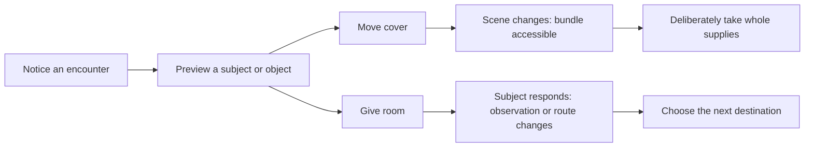

# Connected discovery: Probe, genomic research and companionship

**Owner-directed design discussion, 1 October 2026. Coding remains paused.**
Research is the visual/content backbone; worthwhile expeditions supply it, and
its outcomes become companions the player wants to know and interact with.
Companion is the ongoing bond, not merely a collection terminal. The child-facing
genome-map feeling is selected; field mechanics, resource economy, authored content
and final compositions below remain proposals.

The journey is **notice → interact/gather → return → open a genome → discover
supported expressions → deliberately create → live with the same individual**.
Lab accepts actual cargo once; current outgoing quantities clear and received
history remains. Away Companion does not know live Lab state. See [gameplay](../specs/gameplay.md),
[genetics](../specs/genetics.md), [the genetic engine](../specs/genetic-engine.md)
and [creation/identity boundaries](../specs/sample-to-critter-contract.md).

## What the research supports

These primary accounts were read, not playtested. Their lessons inform our
proposals; they do not establish our game's enjoyment or authorize copied content.

| Primary source | Observed design evidence | Our proposed application |
| --- | --- | --- |
| [Outer Wilds: creative director on intentional wandering](https://www.mobiusdigitalgames.com/news/the-intentionality-of-wandering) | Route clues were revised so curiosity could inform a destination choice. | Visible invitations and useful retained observations, rather than random corridors alone. |
| [A Short Hike: its developer on a tiny open world](https://blog.playstation.com/2021/08/05/crafting-a-tiny-open-world-a-look-behind-the-scenes-at-the-creation-of-a-short-hike/) | Off-path activity and pacing reward ignoring the obvious route. | Small, worthwhile detours on open accessible ground; no mandatory touring of five sources. |
| [DREDGE: co-designer's inventory deep dive](https://www.gamedeveloper.com/design/deep-dive-the-surprising-depth-of-spatial-inventories-in-dredge) | Travel/interact/increment/return was boring; consequential cargo choices became central. | Gathering needs a decision. Do not import packing puzzles, damage or loss merely to manufacture one. |
| [No Man's Sky: developer's Beyond update](https://www.nomanssky.com/beyond-update/) | Deliberate scanning and surveying identify useful targets/deposits. | Discovery and collection can be distinct purposeful operations; no held-scan timer or machinery required. |
| [New Pokémon Snap: official publisher description](https://www.nintendo.com/en-gb/Games/Nintendo-Switch-games/New-Pokemon-Snap-1799500.html) | Scanner, fruit and orbs create observation/encounter opportunities. | An intervention can visibly change a subject/opportunity. This is documented behavior, not a developer rationale or proof of our proposed encounter. |
| [Nintendo's nintendogs + cats developer interview](https://www.nintendo.com/en-gb/Iwata-Asks/Iwata-Asks-Nintendo-3DS/Vol-4-nintendogs-cats/2-Adding-Kittens-Doubled-the-Work/2-Adding-Kittens-Doubled-the-Work-204778.html) | Different animals required different movement/reactions to the same object. | Individual presence needs visible response, beyond skins and counters; no touch/voice controls or animal biology imported. |
| [Wobbledogs: creator interview](https://www.gamedeveloper.com/design/behind-the-ai-and-physics-of-i-wobbledogs-i-procedurally-goofy-wobbledogs) | Complex hidden AI could look random or buggy; understandable moment-to-moment responses provided life. | Make the bond observable. Do not adopt its mutation, diet or physics systems as our genetics. |

## Probe: three proposals

| Direction | Concrete player action | Repeated-use value | Main risk |
| --- | --- | --- | --- |
| **1. Open prospecting** | Walk open ground, optionally record a useful viewpoint observation, then choose a supply destination or sample lead. A simple source still takes one deliberate collection. | Observations, reachable destinations and worthwhile offers change which detour makes sense. | Better routing can remain a commute between Take buttons. |
| **2. Recovered assortment** | At a genuine assortment, preview actual whole offerings and choose the useful mix against remaining cargo space. | Real local availability and research intention change what to bring back. | Already close to current capacity behavior; forced scarcity or sorting would add chores. |
| **3. Responsive encounters** | Focus a scene subject/object, intervene, see a consequential response, then choose to collect or follow the new observation. | Authored responses change opportunities and what the player does next. | A compulsory intervention can become a disguised loot-unlock button. |

These are different hypotheses, not three systems to implement together. Existing
native play already includes trace-to-cache, finite offers and capacity; proposals
1 and 2 improve those decisions but do not establish an interactive overhaul.
The recommendation is to compare **one responsive encounter** with today's pickup
loop before authoring a larger event set. Open prospecting gives its route context;
capacity decisions occur only when actual cargo makes them relevant.

Worked encounter proposal: a loose cover obscures a supply bundle beside an
observable field subject. Both useful opportunities are visible before acting.
Directions preview **Move cover** or **Give room**.
One Confirm on Move changes the cover and subject response, exposing the actual
finite bundle. A separate fresh Take collects the disclosed whole amount.
Giving room instead changes the subject's position and must create a distinct
useful route/observation opportunity; a cute reaction alone is insufficient.
The child can choose nearby supplies or follow the observation; neither route is
compulsory or exclusive. Both resulting opportunities remain readable until the
player decides. No automatic collection or held-input replay. No reaction deadline,
bait cost, capture, reward lottery
or genotype inference is implied. Exact subject/response content needs steering.

The second encounter must change response/opportunity and the useful choice,
not only colors, cover orientation or rewards. Discard this direction if its
intervention merely delays Take or the response is cosmetic. Short decision
segments are an experiment size, not a timer or measured completion promise.
All use existing directions/Confirm/Back; preview commits nothing and results
need no dismissal. Exact event recovery/authority needs architecture after selection.

## Research: the richest part of the journey

Use the [original genome-field references](references/genome-field/README.md),
preserved unchanged: the irregular woven field and local unfolding are useful.
Old knob, labels, single-candidate diagrams and prices are not current instructions.
The main workpiece keeps the sample and surrounding knowledge visible while the
selected neighborhood opens. Sample navigation contains destinations, not findings.

The sequence is **region focus → experiment scope → visible required inputs →
one deliberate run → local knowledge and supported-expression branches**.
Unknown regions remain inspectable; resources fund investigation, not gene
installation. Known inspection is free. Optional parent detail exposes actual
copies, rules, contexts and provenance without becoming a compulsory lesson.

Richness has three jobs: different samples offer different supported contents;
relationships change which investigation is useful next; findings change both
the map and what the player can eventually create. More complex cannot mean more
identical paid tiles. The eleven dimension families/five framework layers supply
the authoring structure; they are not eleven buttons or five mandatory studies.
The current two sample profiles do not yet realize the broader variability.

Existing A example: after heritage is established, investigating Markings opens
plain/carried and pale/expressed possibilities together. Current permitted coat
references can make that contrast visual; carrying a variant does not faintly
express it. B instead opens paired steady/lower-effort and burst/baseline-effort
possibilities under the same reference conditions. Its relation opens a different
branch structure, not a recolored A map. Half of each branch cannot make a third
unsupported form. A partial finding is not complete creation eligibility or a
full-portrait permission; exact facts remain in the linked sample contract.

The first content proof must trace one sample's fact → revealed relationship →
supported expression → later individual, plus a contrasting sample. New authored
evidence must justify each reveal. Decorative genomic complexity is insufficient.

## Resource meaning — considered proposal

| Resource | Role | Requirement boundary |
| --- | --- | --- |
| **Data** | Research input needed to understand an unresolved question. Owner requires more for more complex investigation. | Exact prices remain open. Generic stock does not contain this capsule's alleles; the resulting knowledge is retained. No mandatory physical carrier fiction. |
| **Energy** | Work/power for running the selected experiment. | Browsing is free; more Energy cannot improve genes. No battery/joule or wait-time claim. |
| **Essence** | Contrast/readout material that makes a previously unresolved pattern or relationship readable. | It does not add traits. An expression already justified by known facts is free to inspect. |

Proposed economy for comparison: accept the displayed whole-unit research budget
once when a new operation runs; keep its findings permanently. Stock allocation,
threshold-only requirements and exact consumption policy are not selected by the
owner's Data clarification. A local dock shows Needs/Have and actual other inputs;
shortages preserve all stock and findings. Not every procedure needs all three.
More scope may need more Data, while useful overlap reuses established knowledge.
No larger donation chooses a preferred genotype or rare result.

## Companion: the continuing relationship

Lead with the same saved individual, its recognizable appearance and an expressive
response to a deliberate interaction. The child's result from research should
feel like someone worth knowing. One near-term **Invite play / Spend time** response
is a design proposal; its actual behavior, animation and persistence need authorship.
A visit count is bookkeeping, not proof of a bond.

Free Details has visual **Lineage / Genome / Attributes** views. Directional focus
changes content immediately; Back returns to the same creature. Lineage uses actual
parents, or origin for a founder. Genome shows inherited information; attributes
distinguish expressed capabilities, current conditions and learned history.
Unknown is not zero, and training cannot silently add a hereditary ability.
Breeding/design/training belong to the owner's broader direction; this round
neither implements them nor freezes their reward, timing or inheritance rules.
See [the Companion experience](companion-experience.md).

Home's proposed composition remains one large changing domain scene, compact
Probe/Cargo/Companions destinations and one numeric cargo band. Remove the reused
Probe capsule and ambiguous available-kind count. A sealed genetic-sample icon
may use a generic hereditary emblem without exposing a decoded sequence.
Empty Home shows unoccupied space; populated Home uses an actual saved resident.

## Discussion and next proof

Game, UX and art exchanged objections about the actual proposal. The coordinator
challenged their initial prospecting recommendation because it still resembled
delivered pickup. Responsive encounter is the revised test, not an approved
mechanic or fun verdict. Directions match spatial layout, preview is passive,
and an explicit action owns collection/research/interaction consequences.

Compare a current pickup with one encounter's before/action/response, then the
same sample's region/input/reveal and its eventual saved Companion interaction.
Include one contrasting opportunity, one shortage and the free detail return.
Original references/current resource masters/permitted portraits are reusable;
new event layers, genome-region masters, sample icon and response poses are missing.
No rendered storyboard or final artwork was produced in this research round.

This is researched paper design, not playtesting or deployment. Selection and a
small visual/control proof precede coding; the architect then checks actual device
targets/framework boundaries. No new infrastructure, provider, services, hardware,
gene laws, species approval, capture/training/ecology implementation or purchases.
Existing useful studies remain in [field design](probe-sampling.md),
[the exploration study](expedition-map-study/README.md) and
[research/creation](research-and-creation.md); their older recommendations do not
override this owner discussion.
