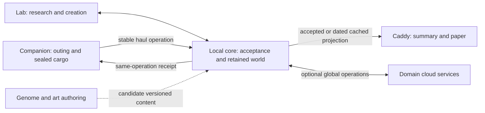
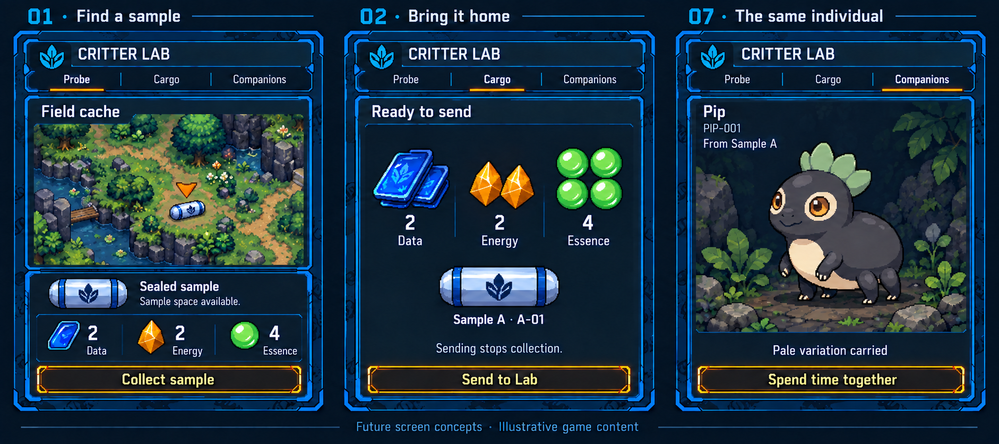
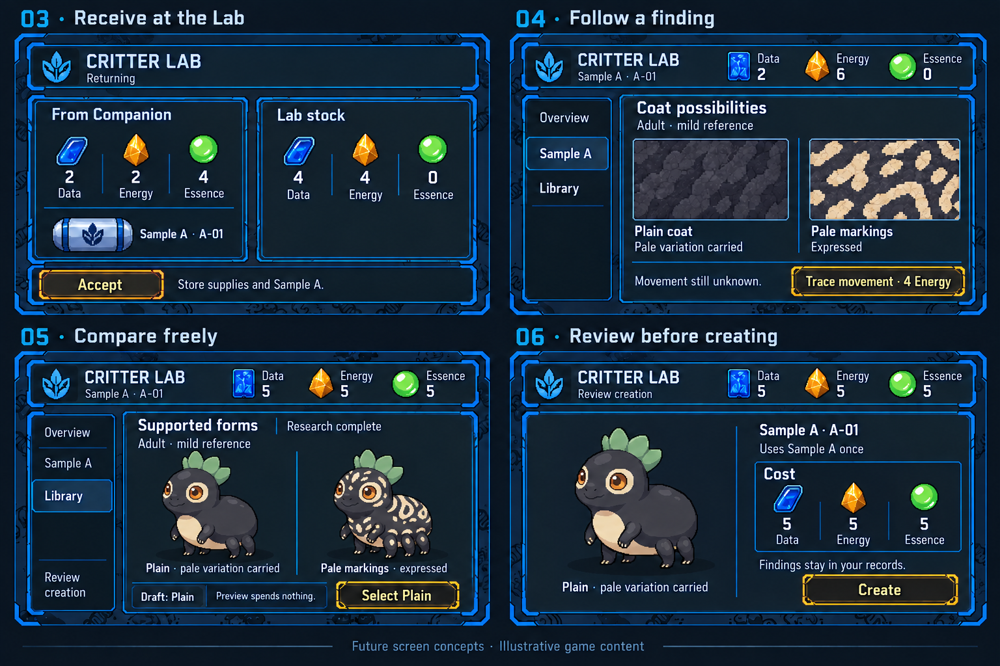
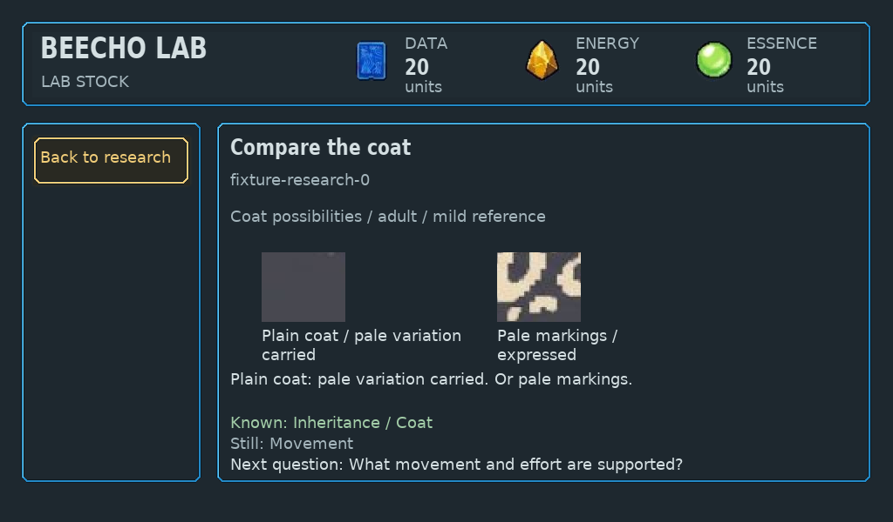

# Connected discovery: Probe, genomic research and companionship

**Connected design baseline, 3 October 2026. The loop and governing tenets are
confirmed. Broader subsystem design remains open in
[M0 / issue 105](https://github.com/PacoCotera/critter-lab/issues/105).
Dependent implementation remains paused.**
Research is the visual/content backbone; worthwhile expeditions supply it, and
its outcomes become companions the player wants to know and interact with.
Companion is the ongoing bond, not merely a collection terminal. The child-facing
genome-map feeling is selected; procedural responsive encounters and automatic creature production are selected.
Exact causal rules, economy, progression and final compositions remain proposals.

The journey is **notice → interact/gather → return → open a genome → discover
supported expressions → deliberately create → collect, nurture and observe →
breed compatible critters → discover and develop new individuals**.
Lab accepts actual cargo once; current outgoing quantities clear and received
history remains. Away Companion does not know live Lab state. See [gameplay](../specs/gameplay.md),
[genetics](../specs/genetics.md), [the genetic engine](../specs/genetic-engine.md)
and [creation/identity boundaries](../specs/sample-to-critter-contract.md).

## Read this checkpoint first

The outcome is a game about pursuing a curiosity, understanding a relationship,
and meeting an individual whose appearance and capabilities follow from it.
The [game tenets](../specs/gameplay.md#governing-game-tenets) and
[whole-game subsystem map](../specs/gameplay.md#whole-game-subsystem-map) govern
the broader design. Research and compatible breeding are central; discovery,
collectability, uniqueness and nurturing sustain engagement. C18 is concept art
that needs richer, more refined treatment; the selected genome-field feeling and
useful visual identity remain references. Visual interaction must explain the
game before supporting text does. No final screens or creature designs are
approved by this comparison.

### One sample, across the whole kit

| Moment | Input, visible result and retained consequence |
| --- | --- |
| Explore | Companion directions navigate disclosed legal ground. A fresh named action changes a responsive situation; explicit collection takes an actual offer. Proposed contrast: a movable obstruction makes Move useful in one generated state; another state has an open route and no Move. Preview grants nothing. |
| Bring home | Cargo shows actual whole supplies and the sample. One fresh Send seals the manifest and stops gathering; no normal second Send review. Separate Lab Accept credits it once. Entering a view or docking does not transfer it. |
| Investigate | Research opens the same sample. Directions focus a neighborhood; scope and Needs/Have precede deliberate Start. Findings change the visible workpiece and supported relationships. Known inspection and leaving are free. |
| Return later | A shortage preserves findings and stock. Another outing supplies the same ongoing research; it does not replace the sample or reset knowledge. |
| Create | Complete required knowledge permits supported full comparisons. Selection is a reversible draft; separate Create spends the reviewed inputs and retains one individual. Incubation, Ready and deliberate Open are distinct. |
| Live together | The same individual appears on Companion. Entry is safe; a deliberate interaction produces a response. Proposed Invite over varies with actual movement eligibility, condition and remembered familiarity. A portrait/visit count does not establish this behavior. |
| Breed and develop a collection | Choose compatible similar-baseline parents, understand their relevant differences and follow a new viable individual's inherited variation. Retain parents, offspring identities and actual lineage. Pairing rules, category model, costs and nurturing effects require design; the current founder fixture does not implement this core mechanic. |
| Glance and print | Caddy shows accepted records or a dated cache, and paper preserves the same identity and permitted facts. Neither browsing nor scanning grants ownership or breeding rights. |

Lab uses directions, Home/Research/Library/Habitat keys, Back and Confirm;
Companion uses directions/Back/Confirm; Caddy uses Previous/OK/Next. Screen pixels
are not controls. Old knob imagery and older two-step Send captures are retained
references, not instructions for new work.

**Worked A example, matching the concept sequence.** Initial stock 4 Data / 4 Energy /
0 Essence plus an accepted haul 2/2/4 gives 6/6/4. Establishing heritage and comparing
the coat spend 4 Data and 4 Essence, leaving 2/6/0. Plain coat with pale variation
carried and pale markings expressed are both supported references; movement is
still unknown. Movement research spends 4 Energy. A later haul 3/3/5 brings stock
from 2/2/0 to 5/5/5; illustrative creation spends 5 each and uses the sample once.
The 27 available items equal 27 spent. These are legacy fixture quantities, not
approved prices, guaranteed yields or a final consumption policy.

B supplies the necessary contrast: one established relationship exposes
steady/lower walking effort versus burst/baseline effort under matched conditions,
removing a redundant movement study. Attractive halves cannot be recombined into
an unsupported third result. Research must follow useful relationships, not a
fixed number of paid tiles. Pip and these two profiles do not define the eventual
body catalogue or prove broad generation.

**Interrupted return.** Before Lab acceptance, incoming supplies cannot fund
research. If Lab accepts and its receipt is lost, its stock stays credited once.
A separate Companion that has not received that receipt cannot know acceptance:
it keeps the sealed non-spendable sent record, reports delivery unknown and
recovers the same operation. Reconciliation clears the matching outgoing record
and makes a new outing available; it cannot grant stock again. The current
single-process simulator can update both views together, so its immediate
zero-outgoing capture is not evidence of independent-device knowledge. Back
changes the view, not the submitted transfer. A held input is consumed through
release before another fresh action.

### System boundary and the architecture choice

Core is a responsibility, not a selected server. The actual native prototype is
one Linux process; the separate saved-replica transfer experiment is not radio or
physical power-loss proof. Hosting the website, authoring workbench and simulator
together does not make them a shared runtime. Authoring edits/provider images
remain candidates with source identity and exact prompts; they cannot silently
become accepted residents. Core research and creation must work without a phone,
Cloud Pass or remote generation. Exact local generation coverage and unavailable
output presentation remain later decisions before dependent creation work.

| Local authority alternative | Player consequence | Tradeoff |
| --- | --- | --- |
| A. Lab accepts home-world changes | Companion retains outing/activity records; Lab accepts inventory, research, creation and resident-history effects. Caddy shows projections. | Fits existing home acceptance. Lab absence delays acceptance of shared changes; immediate away activity rights still need definition. |
| B. Authority delegated by operation | Companion can accept explicitly delegated field/resident activity while Lab owns home operations. | Enables richer independent away progress, but needs bounded handover, player switching, revocation and conflict rules. It does not mean unrestricted multi-device writes. |

Recommend A as the design assumption for the first proof, with durable field
records and an explicit unresolved boundary for away companionship. B merits
selection if independent away development is essential at this stage. Neither
choice selects hardware, transport, a cloud provider or a new service. Device-loss
recovery, nearby-kit authorization and global reconciliation are not proved here.

### Visual review: intent beside actual implementation

The boards below are retained **future concepts**, not one played save or final
UI/art. Their missing states remain missing. Native captures use separate fixture
identities, quantities and source revisions.

The concepts have graphite depth, connected blue frames, saturated subjects and
warm focus from [C18](game-art-proposals/35-vault-composition/18-c-refined.png).
The actual native result above preserves carried versus expressed meaning but
does not yet deliver the selected surrounding genome field. Carry the
[original woven-field/local-unfolding reference](references/genome-field/01-genome-field-v1.png)
into the existing visual grammar; its old controls, prices and single-candidate
genotype presentation remain superseded.

The [Caddy concept](grounded-screen-concepts/caddy-summary.png) completes the
identity trail, with used sample, zero remaining stock and explicit cache time.
The [native B contrast](../docs/evidence/research-workpiece/complete-B.png) and
[corrected return capture](three-device-playability-audit/repair-accepted-offline-companion.png)
show bounded implemented meaning, not final visual quality. Concept Library focus
must not imply creation authority; final research/Library destination treatment
needs steering.

### Open design questions

| Decision | Recommendation and meaningful alternative |
| --- | --- |
| Whole-game coverage and first proof | Explain the full subsystem map and dependencies, including breeding, collection, environments, observability, inventory, social, printer and cloud mechanics. The earlier encounter-to-research slice is one candidate proof; select its scope after the connected design shows how it serves the broader game. |
| Breeding baselines and variability | Compare defined baseline groups (32 is illustrative) with constrained generation followed by emergent classification. Use the same compatible parents and incompatible candidate; show inheritance, viable offspring, lineage and understandable player feedback. [Genetics](../specs/genetics.md#crossing-viability-and-classification) owns the comparison. |
| Local authority | Use A for the first proof, keeping away activity durable and its shared effects bounded. Choose B now only if independently accepted away development is necessary for the desired play. Both preserve standalone core play. |
| Research composition and art refinement | Compare a visible unfolding genome field with a focused study workspace retaining a miniature field. Refine the concept's hierarchy, pixel craft, richness and interactive feedback together; neither arrangement nor C18's exact borders are final. Connect the same discovery to pet creation and compatible breeding. [Screen standard](screen-design-standard.md#concept-direction-and-refinement-boundary) owns the bounded proposal brief. |

The next visual proof must show A before/review/after/return and the B relationship,
including Needs/Have, shortage, pending and receipt recovery. Incubation/Ready/Open,
reciprocal individual response and stale Caddy are explicit later gaps. No new
image has been generated or passed off as approved art in this packet; the
retained concepts have semantic/UX inspection, not independent art acceptance.

## What the research supports

These primary accounts were read, not playtested. Their lessons inform our
proposals; they do not establish our game's enjoyment or authorize copied content.

| Primary source | Observed design evidence | Our proposed application |
| --- | --- | --- |
| [Outer Wilds: creative director on intentional wandering](https://www.mobiusdigitalgames.com/news/the-intentionality-of-wandering) | Route clues were revised so curiosity could inform a destination choice. | Visible invitations and useful retained observations, rather than random corridors alone. |
| [A Short Hike: its developer on a tiny open world](https://blog.playstation.com/2021/08/05/crafting-a-tiny-open-world-a-look-behind-the-scenes-at-the-creation-of-a-short-hike/) | Off-path activity and pacing reward ignoring the obvious route. | Small, worthwhile detours on open accessible ground; no mandatory touring of five sources. |
| [DREDGE: co-designer's inventory deep dive](https://www.gamedeveloper.com/design/deep-dive-the-surprising-depth-of-spatial-inventories-in-dredge) | Travel/interact/increment/return was boring; consequential cargo choices became central. | Gathering needs a decision. Do not import packing puzzles, damage or loss merely to manufacture one. |
| [No Man's Sky: developer's Beyond update](https://www.nomanssky.com/beyond-update/) | Deliberate scanning and surveying identify useful targets/deposits. | Discovery and collection can be distinct purposeful operations; no held-scan timer or machinery required. |
| [New Pokémon Snap: official publisher description](https://www.nintendo.com/en-gb/Games/Nintendo-Switch-games/New-Pokemon-Snap-1799500.html) | Scanner, fruit and orbs create observation/encounter opportunities. | An intervention can visibly change a subject/opportunity. This is documented behavior, not a developer rationale or proof of our proposed encounter. |
| [Nintendo's nintendogs + cats developer interview](https://www.nintendo.com/en-gb/Iwata-Asks/Iwata-Asks-Nintendo-3DS/Vol-4-nintendogs-cats/2-Adding-Kittens-Doubled-the-Work/2-Adding-Kittens-Doubled-the-Work-204778.html) | Different animals required different movement/reactions to the same object. | Individual presence needs visible response, beyond skins and counters; no touch/voice controls or animal biology imported. |
| [Wobbledogs: creator interview](https://www.gamedeveloper.com/design/behind-the-ai-and-physics-of-i-wobbledogs-i-procedurally-goofy-wobbledogs) | Complex hidden AI could look random or buggy; understandable moment-to-moment responses provided life. | Make the bond observable. Do not adopt its mutation, diet or physics systems as our genetics. |

## Probe: procedural responsive encounters — selected direction

Design review selected responsive encounters and requires procedural/generative content,
not scripted scenarios. LLMs should enable a large creative space. A thousand
generated story records are still scripts; shuffling names, geometry and rewards
does not establish variation in play.

Generate retained **entities, states and relationships**, then derive available
interactions and consequences from reusable causal rules. Positions, access,
visibility, movable objects, finite supplies and compatible subject capabilities
make an operation possible. Conditions/behavior can alter the scene; a successful
collection transfers actual whole units. No mandatory Read→prepare→intervene→Take
sequence exists. An exposed source can remain immediate collection.

Hand-worked possible output, not an executed seed: a reachable movable object
obscures a real supply bundle; an observable mobile subject interrupts another
sightline; alternate approach ground is accessible. Move-object derives from
reach/mobility/clear destination and opens supply access. Change-approach can alter
the subject's position under its actual response rule and expose a useful route.
Both opportunities remain useful and nonexclusive. Another generated state with
no movable occluder must have a different action set, not the same script in a
different costume. Specific response laws remain proposed content.

Directions preview visible targets without mutation. One fresh Confirm performs
the named operation; a separate Take collects only when actual collection is
needed. No reflex deadline, held-input replay, automatic pickup or result dismissal.
Observation is not hidden-genome knowledge, ownership or a captured parent.

LLMs expand reusable definitions, relations, causal operators and presentation
within the [generation boundary](../specs/architecture.md#content-validation-and-management).
They do not decide truth through free prose. General operator/rule design needs
validation; ordinary compatible outputs must not require individually authored
scenarios. Genetic-algorithm search can improve valid diversity; it is not the
inheritance rule for a saved family.

[Generating Interactive Worlds with Text](https://arxiv.org/abs/1911.09194)
investigates compositional locations/characters/objects and new content.
[Generative Agents](https://arxiv.org/abs/2304.03442) investigates memory/planning
and emergent behavior in a town simulation. Their abstracts support research
directions, not ESP32 feasibility, our quality or a selected runtime architecture.
Compare decisions, legal action sets and useful consequences across outputs;
prose diversity and seed counts are insufficient. Earlier prospecting/cargo
alternatives remain useful support, but are not competing selected mechanics.

## Research: the richest part of the journey

Use the [original genome-field references](references/genome-field/README.md),
preserved unchanged: the irregular woven field and local unfolding are useful.
Old knob, labels, single-candidate diagrams and prices are not current instructions.
The main workpiece keeps the sample and surrounding knowledge visible while the
selected neighborhood opens. Sample navigation contains destinations, not findings.

The sequence is **region focus → experiment scope → visible required inputs →
one deliberate run → local knowledge and supported-expression branches**.
Unknown regions remain inspectable; resources fund investigation, not gene
installation. Known inspection is free. Optional parent detail exposes actual
copies, rules, contexts and provenance without becoming a compulsory lesson.

Richness has three jobs: different samples offer different supported contents;
relationships change which investigation is useful next; findings change both
the map and what the player can eventually create. More complex cannot mean more
identical paid tiles. The eleven dimension families/five framework layers supply
the authoring structure; they are not eleven buttons or five mandatory studies.
The current two sample profiles do not yet realize the broader variability.

Existing A example: after heritage is established, investigating Markings opens
plain/carried and pale/expressed possibilities together. Current permitted coat
references can make that contrast visual; carrying a variant does not faintly
express it. B instead opens paired steady/lower-effort and burst/baseline-effort
possibilities under the same reference conditions. Its relation opens a different
branch structure, not a recolored A map. Half of each branch cannot make a third
unsupported form. A partial finding is not complete creation eligibility or a
full-portrait permission; exact facts remain in the linked sample contract.

The first content proof must trace one sample's fact → revealed relationship →
supported expression → later individual, plus a contrasting sample. Generated
evidence under the defined rules must justify each reveal. Decorative genomic
complexity is insufficient.

## Resource meaning — accepted broad roles, open economy

| Resource | Role | Requirement boundary |
| --- | --- | --- |
| **Data** | Research input needed to understand an unresolved question. Design review requires more for more complex investigation. | Exact prices remain open. Generic stock does not contain this capsule's alleles; the resulting knowledge is retained. No mandatory physical carrier fiction. |
| **Energy** | Work/power for running the selected experiment. | Browsing is free; more Energy cannot improve genes. No battery/joule or wait-time claim. |
| **Essence** | Contrast/readout material that makes a previously unresolved pattern or relationship readable. | It does not add traits. An expression already justified by known facts is free to inspect. |

Proposed economy for comparison: accept the displayed whole-unit research budget
once when a new operation runs; keep its findings permanently. Stock allocation,
threshold-only requirements and exact consumption policy are not selected by the
Data requirement. A local dock shows Needs/Have and actual other inputs;
shortages preserve all stock and findings. Not every procedure needs all three.
More scope may need more Data, while useful overlap reuses established knowledge.
No larger donation chooses a preferred genotype or rare result.

## Configured incubation and progression

The fully decoded genome becomes the input to configured incubation's algorithmic
generator. Genome/expression constructs anatomy, rig, sprites, animation and
encyclopedia; no per-creature writers or artists. The [architecture pipeline](../specs/architecture.md#creature-production-pipeline)
owns generation/validation/retention. General C18/Gemini style and genomic rules
guide the generator, not a selected prefinished individual portrait.

Fully decoded founder generation is followed by actual-parent breeding and
traceable lineage. The existing two-copy example allows carried variation to
reappear in descendants; a research resource or booster cannot select a preferred
allele. Children are new individuals, not replacements for the parents.

Design review selects eventual virtual Probe/Lab tiers and boosters: start with simple
genomes, reach more complex relationships and longer research. Proposed gates
affect future discovery eligibility and analytical methods/scope; exact bonuses,
timings and recipes remain open. Existing genomes never reroll on upgrade.
Useful partial discoveries and other play make long research worth following;
moving a boring wait into the Lab is insufficient. Current studies are immediate;
background jobs, timing/power/offline completion remain future implementation.

## Companion: the continuing relationship

Lead with the same saved individual, its recognizable appearance and an expressive
response to a deliberate interaction. The child's result from research should
feel like someone worth knowing. Visible initiative, reciprocal interaction and remembered experience are the
proposal. Their behavior/learning rules and generated motion need definition.
A visit count is bookkeeping, not proof of a bond.

Free Details has visual **Lineage / Genome / Attributes** views. Directional focus
changes content immediately; Back returns to the same creature. Lineage uses actual
parents, or origin for a founder. Genome shows inherited information; attributes
distinguish expressed capabilities, current conditions and learned history.
Unknown is not zero, and training cannot silently add a hereditary ability.
Breeding/design/training belong to the broader product direction; this round
neither implements them nor freezes their reward, timing or inheritance rules.
See [the Companion experience](companion-experience.md).

Home's proposed composition remains one large changing domain scene, compact
Probe/Cargo/Companions destinations and one numeric cargo band. Remove the reused
Probe capsule and ambiguous available-kind count. A sealed genetic-sample icon
may use a generic hereditary emblem without exposing a decoded sequence.
Empty Home shows unoccupied space; populated Home uses an actual saved resident.

## Digital-pet comparison and considered interaction

Representative families were researched, not every historical title or playtested
build. Facts below come from primary sources; application to Critter Lab is our
design inference. Do not combine them into a feature checklist.

| Family/source | Supported lesson | Proposed application / boundary |
| --- | --- | --- |
| [Tamagotchi Paradise](https://tamagotchi-official.com/us/series/paradise/howto/) | Field/individual/cell views, growth and inherited eyes/colors | Reward a glance and deep inspection; do not import its dial, food-driven species or care penalties |
| [Digimon: official Next Order](https://en.bandainamcoent.eu/digimon/digimon-world-next-order) | Caring/training builds the partner relationship alongside exploration | Developing repertoire complements field play; no imported combat/evolution quota or fusion-as-inheritance |
| [Nintendogs + cats developers](https://www.nintendo.com/en-gb/Iwata-Asks/Iwata-Asks-Nintendo-3DS/Vol-4-nintendogs-cats/2-Adding-Kittens-Doubled-the-Work/2-Adding-Kittens-Doubled-the-Work-204778.html) | Different subjects require different reactions and movement | Distinct behavior, not substituted appearance; no touch/voice control assumption |
| [Creatures developers' research](https://www.cp.eng.chula.ac.th/~vishnu/gameResearch/AI/creatures.pdf) | Genetic architecture, current physiology and lifetime learning interact | Separate inherited eligibility, condition and memory; no requirement to copy a biochemical/neural engine |
| [Wobbledogs publisher](https://store.wearesecretmode.com/games/wobbledogs) | Watching personality/object interactions complements direct intervention | Visible initiative makes observation worthwhile; no imported mutation/diet/physics laws |
| [Neopets official overview](https://portal.neopets.com/about-neopets) | Persistent pets connect customization, collection and exploration | Long-lived identity and personal expression; no compulsory daily grind or cloud dependency |

Proposed interaction: the same saved resident attends to a real object/place before
input. Directions focus a near/far target or Details; no creature movement occurs
on preview. **Invite over** commits once. Inherited movement eligibility permits
actions, while current condition and actual learned familiarity shape the response.
Approach, inspection or rest changes the visible scene. A resulting reciprocal
opportunity can invite another optional action; it is not a result dismissal.
Later behavior reflects retained history, not random happy clips or invented
Train+1. No guilt, deadline or canonical care penalty is implied.

Generated motion and the encyclopedia use the same resolved body/capability and
permitted facts. Visual inspection connects a known genome region to a feature
or capability and its observed expression. Behavior alone does not prove an
unknown allele. Deeper Lineage/Genome/Attributes/History remains one free layer;
the default stays playful. Exact interaction/learning rates are still proposals.

## Next proof and stopping condition

After the system design and next emphasis are selected, refine only that feature under
[connected play](https://github.com/PacoCotera/critter-lab/issues/44): approved
controls, one ordinary/interrupted journey, actual retained state and the named
visual gaps needed to inspect it. For the recommended discovery slice, stop at
two rule-derived field states feeding one useful retained research relationship.
Reference the existing downstream creation/identity/Caddy contracts without
quietly implementing their missing breadth. Art and final interaction acceptance
remain design review reviews; numeric balance remains proposed.

Genome-derived organizations, legal motion across ground/air/water and automatic
retained art remain a separate horizon in the
[diversity proposal](genome-starter-content.md#v1-diversity-and-genome-first-construction)
and [creature-generation feature](https://github.com/PacoCotera/critter-lab/issues/60).
Classes describe expressed results, never select body templates. General rules
and configured incubation must produce individuals without per-creature manual
authorship. Existing portraits do not prove this production pipeline.

No game code, new generated assets, services, API calls, hardware or purchases in
this design round. The architect checks target/framework/workload boundaries before
implementation. Keep original references and useful unfinished studies in
[field design](probe-sampling.md), [exploration study](expedition-map-study/README.md)
and [research/creation](research-and-creation.md); earlier scripted examples and
manual per-creature assumptions do not override the current design direction.
