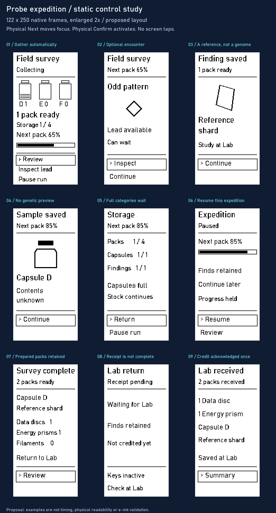

# Probe expedition: gathering to Lab receipt

**Static visual/control proposal.** Continues the [gathering and progression model](../probe-sampling.md) using the existing Probe Next/Confirm controls and candidate 122 × 250 portrait monochrome profile. The selected refinement-02 vocabulary is adapted through clear shape, text and focus, not automatic grayscale conversion. Neither this study nor enlargement establishes physical readability or e-ink behavior.

**Coverage limit:** the images retain an earlier shared next-pack bar and automatic survey-end example. Current design uses per-resource progress, player-directed return, and optional event/risk/tier rules in the [gathering framework](../probe-sampling.md#v1-expeditions-events-and-risk). These exports document composition and existing-key navigation; do not implement their obsolete timing/end semantics. Missing current states include per-resource partial storage/discard, events, damage and service.

## Whole journey

Choose the expedition at the Lab → carry the Probe normally → prepare resources and encounter optional findings → retain a sealed capsule → pause/resume or finish → return to Lab → accept the same results once → prepare the capsule and choose research at the [approved workbench](../genome-workbench/README.md).

The board depicts the Probe part. The Lab's expedition selection, transport initiation and capsule intake are not new approved screens here. The sample's baseline, variants and phenotype remain unknown on the Probe. Reference shard and resource names are the current design examples, not new canonical content.

## Controls and transitions

All outlined actions are screen focus targets operated by physical keys, never touch buttons. Next cycles available targets; Confirm activates the focused one. No Back key, long-press gesture or extra hardware is invented. Static exports show one focus state, not every keypress.

| Frame | Entry and existing-key behavior | State consequence |
| --- | --- | --- |
| 01 Gathering | Resting view. Next cycles Review → Inspect lead → Pause run; Confirm opens the selected destination or pauses | One Data disc pack is ready; preparation of the next pack is 65%. Illustrated stores labeled D/E/F stand for Data discs/Energy prisms/Essence filaments; letter icons are placeholders, with resource names in the completed-survey summary. Lead availability is a notification; it does not auto-open an encounter or move focus to Inspect |
| 02 Encounter | From 01: Next to Inspect lead, then Confirm. Next alternates Inspect/Continue; Confirm on Continue returns to gathering | No timed demand. Inspect resolves the authored encounter; leaving it alone does not award its item or cancel ordinary gathering |
| 03 Reference saved | Acknowledged encounter outcome; Confirm on Continue returns to gathering | One Reference shard retained. Ordinary stock unchanged; not a genome or automatic method unlock |
| 04 Sample saved | Acknowledgement of a separate collection opportunity at 85% preparation; Confirm continues | One capsule D stored; stock still one Data disc pack. No trait, species or genetic preview; capsule acquisition does not reset pack preparation |
| 05 Storage | Review from gathering. Next cycles Return/Pause run; Confirm on Return restores gathering | Capsules 1/1 and special findings 1/1 are full; stock remains 1/4 and can continue. Both full categories wait; earned results remain retained |
| 06 Paused | Confirm Pause run from 01 or 05; Next cycles Resume/Review | Resume continues this expedition at 85%; no preparation advances while paused. Review opens storage with Return restoring this paused caller, not resuming implicitly |
| 07 Complete | Another 15 percentage points completes the next pack: one Energy prism. This example also ends the selected survey at this point; the expedition end condition is provisional, not a consequence of its four-pack capacity. Confirm Review opens the completed expedition's summary/storage | Capsule/reference retained. Return target restores this completed caller. No forced timer, new collection or Pause command on the completed summary |
| 08 Receipt pending | Return is initiated from the Lab's existing transfer flow; this view reflects an unacknowledged receipt | Next/Confirm inactive in this depicted pending frame; contents retained. This is not proof the Lab credited anything |
| 09 Received | Authoritative Lab acknowledgement for this collection; Confirm Summary opens a read-only expedition record | Exactly 1 Data disc, 1 Energy prism, capsule D and Reference shard credited; retries cannot credit again. Historical record stays inspectable, not an active shipment |

Automatic sample/encounter completion acknowledgements must not repurpose a held Confirm press. Frames become actionable only after visible readiness and a fresh gesture, following [experience](../../specs/experience.md). Collection status updates preserve safe focus; they do not auto-activate new opportunities. Numerical timings and physical readiness are unverified.

## What changes across the journey

Design review accepted pack/unit/sample vocabulary and the direction of finer next-pack progress, separate from storage. See [shared vocabulary](../research-and-creation.md#shared-vocabulary-packs-units-and-samples). The original concept supplies the illustrated stores + ready quantity + bar composition; the container icons are provisional, not a change to the resource identities.

Illustrative arithmetic: one pack already earned; the next is 65% prepared. Qualified collection work adds 20 percentage points, reaching 85%; pausing holds it there. Resume and another 15 points completes one pack. The eligible profile rules select its resource type; no early guarantee is shown. Checking the screen does not advance work. This fixture ends with two packs, a capsule and a reference. It does not select a rate, survey duration or automatic ending rule. Preparation percentage is neither expedition completion nor storage fullness; a storage-full view must say why gathering paused instead of showing a false ongoing bar.

The initial Lab stock is 0 Data discs / 1 Energy prism / 0 Essence filaments. Accepted return adds 1/1/0, producing 1/2/0. The new capsule becomes a researchable record through the proposed routine intake, without a paid study merely to determine whether it contains genomic material. The separate reference may be investigated to develop a method. Neither is automatically researched by the expedition.

The illustrative capacity is four stock units, one capsule and one special finding. Once a category fills, its further acquisition waits while eligible categories continue. Early return preserves earned finds and partial preparation; resume neither redraws events nor duplicates previously credited stock. Capacity upgrades change game limits within supported physical storage, not the hardware itself.

## Missing states and review boundary

This is nine representative states, not a complete implementation specification. Missing visual coverage: initial profile selection, invalid-sensor waiting, all-storage-full waiting, refreshed focus positions, returning midway through an uncompleted expedition, transfer timeout/recovery and Lab intake. Completed/paused/read-only summary variants share the same information but need context-appropriate actions before implementation.

On transfer uncertainty, retain the collection and reconcile the same receipt. The depicted pending state has no player timeout/recovery action designed yet; it must not be implemented as an indefinite input lock. Reconnection or status checking cannot blindly resubmit new rewards. Transport, cloud reconciliation and actual e-ink refresh remain separate implementation/bench work. Docking alone does not imply transfer or resource credit.

Design review: refined information hierarchy on the narrow Probe, optional-encounter presentation, and whether the different kinds of find remain understandable through Next/Confirm. No final panel, font, icon art, cadence, economy or resource-name approval is implied. Preserve the approved Lab workbench; no new functional UI is part of this study.

`render.py` regenerates the native PNGs and board with Pillow and the local Windows Bahnschrift study font; the font is not bundled. The board uses nearest-neighbor enlargement so it does not imply more detail than the native frames contain.
