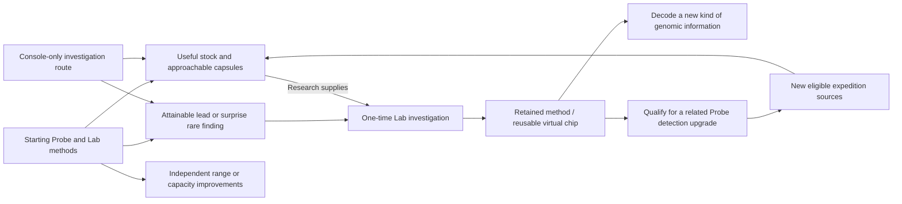

# Gathering and exploration: from field context to Lab discovery

**Current gathering design, 27 September 2026.** Accepted foundations: Lab-selected expedition profiles; simple standalone Probe operation; retained progress on early return; optional encounters without missed-check-in punishment; typed resources and capsules; no genetic disclosure on the Probe. The resource roles, events, acquisition model and worked example below are proposals for owner steering, not final balance or hardware selection.

The approved [Lab workbench](genome-workbench/README.md) gives gathering its purpose: replenish useful studies, choose among partial genomes and discover new ones. [Probe specification](../specs/probe.md) owns measured-evidence boundaries; [research and creation](research-and-creation.md) owns inventory and sample lifecycle. The [Pip proof](../prototype/genetics/report.md) supplies valid content, not the field-award algorithm.

## Review at a glance

The proposal connects **starting expeditions → useful prepared stocks and capsules → a rare reference investigation → a retained Lab method → related Probe detection → new eligible genomic sources**. Range and capacity improve expedition choice/convenience independently; all three stocks remain useful.

Review the [three stock identities](#prepared-stock-identity-proposal), [progression map](#connected-progression-proposal) and [one complete expedition](#one-complete-expedition-and-breakthrough). The owner decisions are grouped [at the end](#owner-review-boundary). Accepted foundations and proposals are explicitly separated; nothing here implements a new economy or changes the approved Lab screens.
## One connected loop

Choose a purpose at the Lab → load an expedition → carry or place the Probe normally → accumulate valid field observations and collection progress → occasionally inspect an encounter → retain typed supplies, items and possibly a capsule → return to the Lab → credit inventory and prepare new capsules → choose research using the enlarged collection.

The player chooses what to pursue, not how to operate individual sensors. Ordinary indoor and outdoor settings remain useful. No required phone, constant attention, exact destination, physical hazard or reflex test. Collection and exploration should support both purposeful resupply and curiosity.

## Three different kinds of find

| Find | Proposed role | What it does not do |
| --- | --- | --- |
| Research supplies | Stackable quantities spent by named Lab studies | Do not represent genes, research completion or an individual |
| Field items | Occasional authored objects with a clear use, such as a reference fragment enabling a comparison or a consumable affecting a later expedition's opportunities | Do not silently become equipment, permanently grant abilities or decode the current sample |
| Sample capsule | A stable discovery source containing unknown genomic information/possibilities; prepared at the Lab into a research record | Not a critter, resource stack, loot rarity label or genetic preview |

Keep the initial item set small. A reference item can supply a comparison context, but the new sample still needs its own evidence and studies. Permanent equipment/chips and nourishment belong to existing progression/care design; do not invent a second equipment economy for this slice.

## Three-resource foundation — owner scope accepted, identities open

The owner accepts three starting research resources serving an open-ended variety of critters across all genomic layers/dimension families. Mineral grains/Lumen/Catalyst are rejected names. Subsequent terrestrial/botanical naming proposals are withdrawn as too narrow. Old labels in approved visual examples remain placeholders, not vocabulary approval.

Resources support the Lab's methods; samples supply the unknown genomic information. Supplies do not install alleles, confer abilities, replace evidence or erase retained knowledge when consumed. They remain distinct from capsules, collection points, field items and nutrition. No resource corresponds to a class of creature, genomic layer or rarity tier. Extensible fictional content does not imply unlimited hardware/software capability.

### Proposed uses across unlike subjects

Game-design review recommends testing three method-oriented uses instead of the earlier preparation/response/interaction split. Preparation is a workflow step; response can overemphasize living behavior; interaction can sound like a late-game tier. The replacement below is a proposal, not a selected study taxonomy or final recipe mapping.

| Working role, not resource name | Pip | Hypothetical plantlike subject | Hypothetical fantastic subject |
| --- | --- | --- | --- |
| Establish a reference | Establish a supported reference for a markings comparison | Establish a leaf-form reference in a stated development context | Establish a reference condition for an explicitly supported phase property |
| Distinguish alternatives | Resolve whether the unknown copy is P or p; interpret carried vs expressed | Distinguish supported pigment configurations | Distinguish supported reach variants |
| Examine relationships | Determine how M drive and E efficiency jointly affect movement cost | Examine how two inherited contributors affect a supported growth result | Examine the relationship between an ability prerequisite and its control parameter |

The hypothetical columns test breadth, not approve new species, traits or universal two-copy inheritance. Every claim still needs that sample's evidence and applicable class rules. No fixed order or requirement to use all three stocks per study. Recipes can combine stocks, and different studies compete for shared inventory. A resource must not become merely a different-colored price: its role must be visible in the investigation. In particular, reference and distinction can overlap; a worked study must make their difference clear before this taxonomy is adopted.

### Selected identity: Probe-prepared research media

The Probe prepares three standard research stocks from its gathering. Different fictional field phenomena can feed the same Lab economy, without tying the resources to particular creature anatomy or terrestrial substances. The stocks need distinct tangible identities and icons; they must not become three abstract progress counters. Names and exact preparation rules remain open.

This is game fiction only: no new actuator, chemical processor, sensor claim, conversion menu or player crafting step is implied. Existing sensors provide context; they do not detect fictional substances. Preserve resource stock versus genomic capsules and support console-only acquisition. The three method roles above remain provisional; selecting this identity direction does not select their recipes or physical hardware.
### Prepared-stock identity — owner-proposed direction

Owner rejected Pucks/Prisms/Braids and suggested **Data discs / Energy prisms / Essence filaments**, or a related family. This is the current naming/concept direction to refine, not final wording or selected recipes. Earlier proposal labels in the illustrative ledger are superseded placeholders; do not regenerate approved artwork yet.

- **Data discs:** consumable prepared research inputs such as reference patterns or comparison data. They are not the unknown genome, saved discoveries, field points or the player's durable knowledge. Spending one never erases a finding. Exact data fiction/use remains proposed.
- **Energy prisms:** prepared energy stock for Lab studies, independent of whether the critter itself uses ordinary metabolism. No claim of real power storage or physical sensor harvesting.
- **Essence filaments:** a fictional research medium supporting work across unlike forms/physiologies. Its precise role needs definition; it must not be donor genes, a critter ingredient or a disguised extra genome sample.

Names and underlying roles should be developed together; do not force this trio into the preceding reference/distinction/relationship taxonomy merely to preserve an earlier proposal. Three inputs should have different comprehensible purposes and remain useful across the full framework.
## Sensors shape opportunities, not genetic answers

Use the already proposed small envelope for experiments: ambient brightness, temperature/humidity and acceleration. It is not a selected bill of materials. Hardware thresholds, calibration, cadence and power require later bench work.

| Observed context | Proposed game interpretation | Boundary |
| --- | --- | --- |
| Brightness and changes between brighter/dimmer settings | Different field opportunities or event-pool weights; a Bright Trace profile favors Lumen gathering | Bright light does not guarantee a resource or determine an allele; extreme exposure gains no special requirement |
| Thermal/moisture context | Variety in fictional deposits, residue and conditions for profile encounters | Not a real habitat, organism, chemical or hazard identification |
| Motion and stillness | Distinguish broad active-carry and settled-observation periods for collection opportunities | Not GPS, distance or proof of exploration; shaking must not become the best strategy |

Profile defines the main bias; valid sensor context adds variation; bounded fictional randomness supplies surprise. Do not demand exact environmental thresholds for essential progression. Missing data remain missing; if a profile supports a fictional fallback, it must use that declared route rather than manufacture a measurement. Any measured/generated distinction stays in evidence provenance without turning the player screen into diagnostics.

Points represent accumulated field collection progress. Supplies are awarded by explicit expedition milestones/events, not by spending points at the Lab. Profile, sensor-window credit, caps and award thresholds need a later small balance experiment. Sensor noise or repeated checking must not mint unlimited points or reroll results.

## Events: optional decisions worth noticing

Use three restrained event families rather than continual interruptions:

- **Resource opportunity:** a fictional deposit offers a choice between plentiful common supply and a smaller specialized find. Show known tradeoffs before choosing.
- **Curiosity:** an unusual pattern can be inspected or logged for later. It may yield a reference item or a lead; the Probe does not infer capsule contents.
- **Capsule discovery:** a retained lead resolves into a sample opportunity. Collect through the existing controls; its contents remain unknown.

Events are chosen from the expedition profile's authored pool and recorded once. A sensor condition may make an event eligible without being a real detection of the fictional object. Ordinary gathering continues without constant checks. Preserve the approved missed-encounter rule: the encounter remains available, and after completion its note is offered at the Lab without retroactive extra material. No expiring reflex bonus or assumed loss of earned supplies.

## Rare findings and research capability — approved direction

Owner approved rare findings enabling retained research methods, with baseline supplies funding subsequent studies and capsules supplying unknown genomes. Progression branches into capabilities; major research routes should permit deliberate pursuit alongside surprise discoveries. The ethereal crystal and ghostlike critters remain illustrative, not approved item names, canonical classes, drop rates or exact gates.

Recommend three separate values: baseline Probe-prepared supplies fund individual studies; rare discoveries enable research methods; sample capsules add unknown genomic content. A rare finding could support a one-time investigation that establishes a retained method, with later studies using the ordinary supplies. This makes the find consequential without requiring repeated rare drops for every similar genome.

Connect method access to the existing equipment/chip design before implementation. Research chips are virtual, profile-owned, removable and reusable; a method unlock must not silently decide that all capabilities are permanently active or bypass slot/capability constraints. Whether a finding grants a method directly or enables crafting a chip remains open.

Illustrative sequence: obtain a capsule, research what current methods support, retain an unresolved region requiring a new analytical method, follow a field lead, acquire a rare reference finding, investigate it at the Lab, gain access to the method, then return to the existing record and decode that region using baseline resources. Its genes never changed. Full decoding still precedes incubation; possessing a special finding never supplies missing genes or instantly decodes a class.

An essential method can gate an entire genome family when its defining information needs that method; related methods may also benefit different classes. Prefer a branching capability progression over a universal stronger-tier ladder. A later fantastic critter is not automatically better than Pip. Complexity, applicable methods and desirable traits remain distinct.

Allow rare surprises alongside attainable directed leads; do not make the only route to a major research branch indefinite random luck. Repeated finds need an authored use rather than becoming dead inventory; trading, crafting and alternate study uses are possible but not selected. Console-only play must retain an acquisition route. Probe displays never reveal capsule genotype or infer species from a rare item.

Open choices: method/chip relationship; whether and when the original find is consumed; directed acquisition and duplicate uses; which genomic domains need which methods. No new resources, numerical tiers or implementation selected here.
## Progress-proportional discovery and Probe tiers

Owner direction: findings should normally be proportional to player progress. Accidentally acquiring a much more complex genome should be unavailable or a low-probability exception, not ordinary early play. Owner proposed Probe tiers with range, capacity and detection capabilities; exact tier structure and upgrade rules remain to design.

Separate field access from analysis: Probe capability governs eligible expedition opportunities and discoverable sample sources; Lab methods govern which acquired genomic information can be decoded. Eligibility for a content family precedes weighting by research complexity and current progress. A low-probability advanced find, if enabled, must remain within the acquisition rules of the current Probe/profile; randomness cannot silently bypass a capability explicitly defined as a hard requirement.

The proposed reward mix favors useful supplies, research-ready samples and reachable next-step leads. A small exceptional discovery can foreshadow later research, but must not routinely strand the collection in unprocessable genomes. Existing samples and supported contents remain stable across upgrades; never reroll a sample to match new progress. Exact distributions and the definition of progress require design and balance work. Genomic complexity is not rarity, power or a universal higher-is-better score.

| Proposed Probe upgrade dimension | Game meaning to investigate | Boundary |
| --- | --- | --- |
| Range | Breadth/depth of fictional expedition opportunities or accessible collection bands | Not increased radio/GPS range, physical sensing distance or an instruction to travel farther |
| Capacity | Usable in-game expedition storage for typed supplies and capsules | Exact units/limits and full-capacity behavior remain open; earned finds are not silently discarded and fictional upgrades cannot add physical memory/battery |
| Detection | Recognition/collection eligibility for new classes of fictional field signatures and sample sources | Not genotype disclosure, actual ghost sensing or an uninstalled physical sensor |

Prefer author-visible capability requirements plus a small player-facing progression structure over a single unexplained level controlling all rewards. Lab/Probe upgrades should support each other without a circular gate: each next capability needs an attainable source using current capabilities or an established alternative route. Existing console-only play remains required. Decisions still open: tiers versus modular upgrades, how upgrades are acquired, range semantics, capacity handling and optional advanced-find probability.
## Acquiring an unknown genome

Use the [accepted baseline/sample/phenotype distinction](../specs/genetics.md#genome-baseline-collected-sample-and-phenotype--accepted-distinction): particular samples reveal valid foundations and sample-specific variation. They are not universally donor tissue or fragments for an unselected genome-assembly mechanic.

Recommend capsules as discovery rewards separate from routine supply milestones. A first guided expedition should provide an attainable first capsule; later exploration can mix random finds with visible progress toward a retained discovery lead, so bad luck cannot indefinitely block new research. Exact guarantees, cadence and lead costs require owner selection/balance work.

When a capsule is acquired, preserve its source identity, expedition evidence and supported genomic possibilities. It is stable on reopening or retrying delivery. The Probe may show a neutral capsule identity, never species, traits, allele letters or predicted critter art. Lab preparation exposes the research object; research establishes hereditary information and any supported configuration choices. It does not redraw hidden content for a prettier result.

Some content may resolve to one genome and other content may permit several explicitly supported configurations under the existing guided-synthesis design. Do not quietly turn every capsule into one random predetermined creature, or every capsule into an unrestricted genome generator. The existing preparation, full-decoding, selection and one-sample/one-founder boundaries still apply.

### Capsule preparation versus research — clarification proposal

A genome-bearing capsule is a kind of expedition finding, distinct from an ordinary resource award or a rare method-enabling item. The recommended player flow is: collect a sealed sample capsule → return → routine Lab intake/preparation creates a researchable genomic record → choose which unknown information to investigate. Intake may automatically identify that genomic material is present; the player does not spend a paid study merely to discover that the object is a genome sample. Preparing the record is not incubation, full decoding or an automatic species/trait reveal.

The Probe can acknowledge a collected sample capsule without naming its contents, species, traits or supported configurations. The capsule's genomic source remains stable; opening/preparing it does not roll whether a genome exists. This proposal treats a sample capsule as a reliable research opportunity, not a dud lottery. Ordinary curiosity items and rare references need not contain genomes, and their investigation is a separate purpose. Exact preparation interaction remains to design.
## Connected progression proposal

**The following is a worked design for review, not selected tiers, chip recipes or balance.** The stages demonstrate a dependency chain rather than a mandatory three-level ladder. The ledger uses neutral Stocks A/B/C so its arithmetic does not assign unapproved roles to the new naming direction.

| Illustrative stage | What the player can pursue | Boundary and payoff |
| --- | --- | --- |
| Starting exploration | Basic profiles, all three stock types over available routes, introductory capsules, ordinary Lab methods | Most samples are researchable with owned methods; supplies fund different choices across the collection |
| First breakthrough | Follow an attainable lead to a rare **phase reference**; investigate it with starting methods and stocks | Proposed result: retained **phase-comparison method** represented by a reusable virtual Lab chip; exact names and subject matter illustrative |
| Broader exploration | The completed reference investigation qualifies the player for related Probe detection calibration; optional range/capacity improvements support preferred expedition style | New eligible sources may include genomes requiring phase analysis. They still need their own research; ownership of the method is not knowledge of each genome |

The reference is an authored calibration finding readable with starting methods, not a specimen requiring the very method it enables. Recommend the one-time investigation retain its finding as a reference record and consume only its displayed ordinary stocks; repeat findings need an authored secondary use before content release. Probe detection calibration is a proposed game upgrade, not a new physical sensor. It can follow the same breakthrough without a second rare-drop requirement. Exact fitting/unlock costs are not selected.

The method remains learned; its chip must be equipped in a compatible available slot for relevant studies. Switching slots changes available work, not discovered facts or ancestry. Acquiring the method does not permanently activate every capability. Active-study chip switching requires a later explicit interruption rule; this paper example does not switch during work.

### Range, capacity and detection have different jobs

- **Range** expands the set of expedition profiles/fictional collection bands available to explore. It is not metres, GPS travel or radio range. Some profiles need both range and detection; increasing range alone cannot bypass an unknown signature category.
- **Capacity** changes how much can be brought home before returning. It is convenience and expedition planning, not a condition for owning better critters. Compartment units and exact limits remain balance choices.
- **Detection** grants eligibility to collect particular fictional source categories. It never reveals a capsule's species or genes. A profile still controls opportunities within eligible categories.

Recommend modular capabilities grouped into understandable milestones, rather than one level automatically increasing all three. Every essential next upgrade must be reachable using current capabilities or a complete console-only alternative. Names, branching structure and recipes remain proposals; this is not approval of three fixed Probe tiers.

### Choosing what can be found

First filter by installed Probe capabilities and selected profile. Then weight eligible samples using **owned research methods and demonstrated research milestones**, not simply the chip fitted at that moment. This avoids distorting rewards by temporarily removing a chip. Existing specimens/capsules remain unchanged by progression.

Ordinary results favor samples that can be researched with owned methods; a smaller share may stretch complexity or point to an attainable next method. For the first balance experiment, recommend no advanced surprise in the introductory expedition; afterward allow a small optional next-step exception, with no selected percentage. Never use random luck to bypass a hard detection requirement. Keep simpler samples and useful stocks in later pools. These weights are proposals, not a hidden adaptive implementation.

## One complete expedition and breakthrough

**Illustrative arithmetic, not selected timing or economy.** The player has a partial genome whose next comparison costs 1 Stock A, plus a saved lead to a phase reference. Lab stock is **0 Stock A / 1 Stock B / 0 Stock C**. They select a reference-survey profile that favors Stock A and can resolve the lead; capsule opportunities remain separate. Every stock type is obtainable through starting routes; Stock C are not a universal rare tier.

The Probe's resting view would show expedition progress/points, actual prepared stock and an available encounter. Existing Next/Confirm navigate optional choices. Valid observation windows accrue automatically during ordinary use; checking the screen does not advance collection. Light, temperature/humidity and acceleration contribute coarse profile context when valid. They do not detect crystals or genomes. Stillness can be useful; repeated shaking and noisy threshold crossings do not earn extra credit. Durations, channel rules and calibration remain unselected hardware/firmware work.

For this ledger only, each distinct qualifying window earns one point, capped at four for the expedition; every second point produces one stock award from the profile's eligible stock pool. Points are never spent. Fictional event selection is separate and saved once.

| Moment | Points | Probe stock | Other retained results |
| --- | ---: | --- | --- |
| Departure | 0 | 0 / 0 / 0 | Saved reference lead; no known capsule contents |
| First two valid windows | 2 | 1 Stock A / 0 / 0 | One prepared-stock award |
| Optional lead encounter | 2 | Unchanged | Player chooses to investigate with Next/Confirm; the directed lead resolves to the phase reference in this authored example |
| Two more valid windows | 4 | 1 Stock A / 1 Stock B / 0 | Second stock award; a separate eligible opportunity yields capsule D in this example |
| Accepted return | 4 retained in expedition record | Credited once to Lab | Lab stock becomes **1 Stock A / 2 Stock B / 0 Stock C**; reference and capsule have separate records |
| Choose breakthrough study | No field points spent | Lab spends **1 Stock A + 1 Stock B** | Stock becomes **0 / 1 / 0**; method/chip acquired when the investigation is accepted |

Both optional finds occurring here are a worked story, not a guaranteed bundle. Routine expeditions may yield only supplies. The player chooses the breakthrough over their waiting genome's 1-Stock A comparison; that genome retains all findings and can be resumed after resupply. Capsule D can wait unprepared. With the new method owned, the player can pursue the related detection upgrade and later collect a new source family; nothing in D is rerolled or pre-decoded.

The directed lead must have a bounded completion path under current capabilities. This example resolves it at one encounter; production pacing may span several expeditions but must not secretly require indefinite luck. A surprise route can find the same reference early within current eligibility.

### Interruption and storage within the same story

- **Ignore the encounter:** ordinary stock gathering continues. Preserve the accepted encounter availability; after expedition completion the Lab offers its note without retroactive material. The reference lead remains pursuable on a later trip.
- **Return at two points:** retain the Stock A, progress and resolved event state. Resume the same expedition for its remaining collection; already credited stock is not credited again and events do not reroll.
- **Capacity:** illustrative compartments are four stock units, one capsule and one special finding, sufficient for this ledger. Before collection could exceed a compartment, pause that collection category and show the reason. Never erase an earned find. Other categories may continue while space remains; a directed opportunity waits while its category is paused. A return/offload permits continuation under the same saved expedition. These exact capacities and waiting rules are proposals.
- **Sensor data unavailable:** show collection waiting when the selected profile lacks required valid input. A profile may explicitly support a fictional fallback; never invent a measurement. Baseline content must support ordinary indoor and settled use, not reward extreme conditions.
- **No Probe:** Lab investigation/crafting routes must provide the same essential stock, capsule access and method progression through an appropriate alternative activity. This diagram establishes the requirement, not a completed console-only economy.

## Owner review boundary

Review three connected choices: (1) the owner-proposed Data discs/Energy prisms/Essence filaments identities and distinct purposes; (2) one rare-reference investigation enabling a retained, slot-equipped Lab method plus eligibility for related Probe detection calibration; (3) modular range/capacity/detection milestones with mostly currently researchable finds and a bounded next-step exception. All names, costs, points and example capacities are illustrative.

After these choices are steered, the next slice is one Probe state/control storyboard using this ledger, including gathering, an optional encounter, interruption and return. Do not implement an event engine, choose sensors, expand the resource catalogue or redraw the approved Lab workbench at this boundary.