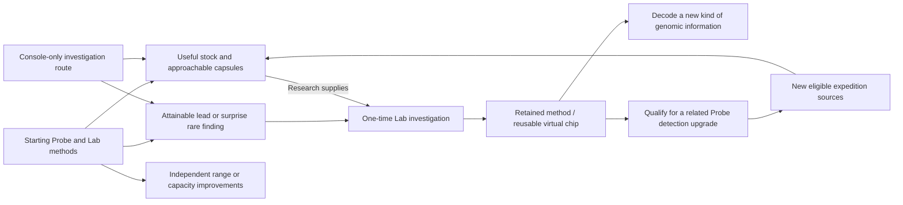

# Gathering and exploration: from field context to Lab discovery

**Current gathering design, 27 September 2026.** Accepted foundations: Lab-selected expedition profiles; simple standalone Probe operation; retained progress on early return; optional encounters without missed-check-in punishment; typed resources and capsules; no genetic disclosure on the Probe. The resource roles, events, acquisition model and worked example below are proposals for owner steering, not final balance or hardware selection.

The approved [Lab workbench](genome-workbench/README.md) gives gathering its purpose: replenish useful studies, choose among partial genomes and discover new ones. [Probe specification](../specs/probe.md) owns measured-evidence boundaries; [research and creation](research-and-creation.md) owns inventory and sample lifecycle. The [Pip proof](../prototype/genetics/report.md) supplies valid content, not the field-award algorithm.

## Review at a glance

The proposal connects **starting expeditions → useful prepared stocks and capsules → a rare reference investigation → a retained Lab method → related Probe detection → new eligible genomic sources**. Range and capacity improve expedition choice/convenience independently; all three stocks remain useful.

Review the [three stock identities](#prepared-research-resources--concrete-proposal), [progression map](#connected-progression-proposal) and [V1 expedition and event framework](#v1-expeditions-events-and-risk). The owner decisions are grouped [at the end](#owner-review-boundary). Accepted foundations and proposals are explicitly separated; nothing here implements a new economy or changes the approved Lab screens.
## One connected loop

Choose a purpose at the Lab → load an expedition → carry or place the Probe normally → accumulate valid field observations and collection progress → occasionally inspect an encounter → retain typed supplies, items and possibly a capsule → return to the Lab → credit inventory and prepare new capsules → choose research using the enlarged collection.

The player chooses what to pursue, not how to operate individual sensors. Ordinary indoor and outdoor settings remain useful. No required phone, constant attention, exact destination, physical hazard or reflex test. Collection and exploration should support both purposeful resupply and curiosity.

Use the connected model's [shared vocabulary](research-and-creation.md#shared-vocabulary-packs-units-and-samples) for packs, capacity units, samples and capsules. Resource quantities in this document count prepared packs. Show next-pack preparation separately from storage, following the original Probe concept; the pacing proposal below supplies current illustrative arithmetic.

## Three different kinds of find

| Find | Proposed role | What it does not do |
| --- | --- | --- |
| Research supplies | Stackable quantities spent by named Lab studies | Do not represent genes, research completion or an individual |
| Field items | Occasional authored objects with a clear use, such as a reference fragment enabling a comparison or a consumable affecting a later expedition's opportunities | Do not silently become equipment, permanently grant abilities or decode the current sample |
| Sample capsule | A stable discovery source containing unknown genomic information/possibilities; prepared at the Lab into a research record | Not a critter, resource stack, loot rarity label or genetic preview |

Keep the initial item set small. A reference item can supply a comparison context, but the new sample still needs its own evidence and studies. Permanent equipment/chips and nourishment belong to existing progression/care design; do not invent a second equipment economy for this slice.

## Three-resource foundation — owner scope accepted, identities open

The owner accepts three starting research resources serving an open-ended variety of critters across all genomic layers/dimension families. Mineral grains/Lumen/Catalyst are rejected names. Subsequent terrestrial/botanical naming proposals are withdrawn as too narrow. Old labels in approved visual examples remain placeholders, not vocabulary approval.

Resources support the Lab's methods; samples supply the unknown genomic information. Supplies do not install alleles, confer abilities, replace evidence or erase retained knowledge when consumed. They remain distinct from capsules, collection points, field items and nutrition. No resource corresponds to a class of creature, genomic layer or rarity tier. Extensible fictional content does not imply unlimited hardware/software capability.

### Prepared research resources — concrete proposal

**Data discs / Energy prisms / Essence filaments** follow the owner's naming direction. Their purposes below are proposals for steering, superseding the earlier reference/distinction/relationship resource taxonomy. The Probe prepares fictional research stocks; these are not new physical consumables, chemical processors or hardware requirements.

| Resource | What it is in the game | What the Lab uses it for | Why demand varies |
| --- | --- | --- | --- |
| Data disc | A prepared analysis medium carrying organized reference patterns from the expedition | Comparing and resolving ambiguous genomic information | A study distinguishing several supported alternatives needs more comparison capacity than a straightforward reading |
| Energy prism | A concentrated fictional power supply for research operations | Running demanding scans and controlled analytical trials | Some methods require longer or more intensive operation, independent of the critter's own energy system |
| Essence filament | A prepared coupling medium: a temporary interface between sample and analytical instrument | Making difficult genomic information readable without altering it | Some encoded structures need a better interface; this can occur in ordinary or fantastic samples |

For Data discs, the consumed unit is prepared analysis capacity/media, not durable knowledge. Findings are retained in the research record; repeated studies cannot charge merely for rereading an already established fact. Energy prisms are gameplay stock, never the device's actual battery charge. Filaments are neither donor genes nor an ingredient that adds a trait; their effect ends with the study while its findings remain. They are not automatically rare, ghost-specific or a replacement for a required method chip.

The Probe prepares discs from fictional collection opportunities themed around organized observations, prisms from excitation-themed opportunities, and filaments from binding/coherence-themed opportunities. Baseline typed yields are shared across profiles. Profiles control optional event pools; coarse real sensor context can influence event eligibility but does not measure these fictional properties. Different environments can supply every essential stock through available routes. No mandatory shaking, strong light, exact weather, physical harvesting or three extra field minigames.

Recommended inventory copy: **Data discs · 3**, **Energy prisms · 2**, **Essence filaments · 1**. A study names its purpose and exact cost, not a claim that the resource causes an allele. Names and recipe quantities remain unselected; this is not a global rename of the approved screen artifact's old placeholders.

### Cross-critter uses and an actual choice

These costs are arithmetic fixtures, not selected balance. The plantlike and phase examples do not establish new canonical species, copy schemes or abilities.

| Study | Finding sought | Example stock cost | Why these inputs |
| --- | --- | --- | --- |
| Pip markings comparison | Resolve the second copy, then establish Pp and carried-but-unexpressed pale variation | 2 Data discs | Comparison-heavy; existing sample preparation and basic instrument operation suffice |
| Pip movement relationship | Establish how known drive and efficiency contributions combine | 1 Data disc + 1 Energy prism | Compare the contributions and run the supported analysis |
| Plantlike genome with intertwined contributors | Distinguish supported pigment alternatives in this sample | 1 Data disc + 1 Essence filament | Compare alternatives through a temporary analytical interface; the filament does not change pigmentation |
| Hypothetical phase-capable genome | Resolve a supported phase-related locus after acquiring the appropriate method | 1 Data disc + 2 Energy prisms + 1 Essence filament | Requires the method, demanding analysis and an appropriate sample interface; none of these supplies grants the ability |

Starting with 2 discs / 1 prism / 1 filament, the player could finish Pip's markings comparison (leaving 0/1/1), or perform its movement relationship study (leaving 1/0/1) and still afford the plantlike comparison (leaving 0/0/0). This makes the same inventory relevant across different subjects. A missing method still prevents the phase study even with ample resources. No study automatically demands all three stocks; lower-demand work remains useful later.
## Sensors shape opportunities, not genetic answers

Use the already proposed small envelope for experiments: ambient brightness, temperature/humidity and acceleration. It is not a selected bill of materials. Hardware thresholds, calibration, cadence and power require later bench work.

| Observed context | Proposed game interpretation | Boundary |
| --- | --- | --- |
| Brightness and changes between brighter/dimmer settings | Different field opportunities or event-pool weights; a weather-themed event may offer a temporary Energy prism boost | Bright light does not guarantee a resource or determine an allele; extreme exposure gains no special requirement |
| Thermal/moisture context | Variety in fictional deposits, residue and conditions for profile encounters | Not a real habitat, organism, chemical or hazard identification |
| Motion and stillness | Distinguish broad active-carry and settled-observation periods for collection opportunities | Not GPS, distance or proof of exploration; shaking must not become the best strategy |

Profile defines event opportunities; valid sensor context adds event variation; bounded fictional randomness supplies surprise. Do not demand exact environmental thresholds for essential progression. Missing data remain missing; if a profile supports a fictional fallback, it must use that declared route rather than manufacture a measurement. Any measured/generated distinction stays in evidence provenance without turning the player screen into diagnostics.

Points represent accumulated field collection progress. Supplies are awarded by explicit expedition milestones/events, not by spending points at the Lab. Profile, sensor-window credit, caps and award thresholds need a later small balance experiment. Sensor noise or repeated checking must not mint unlimited points or reroll results.

## V1 expeditions, events and risk

**Accepted direction:** stable baseline gathering of all three resources; expedition-specific events can temporarily boost a resource and offer optional risk, including simulated damage requiring Lab return. No filters, automatic discard or new hardware controls. **V1 proposal below:** four expedition types, ten reusable event types, one shared interaction pattern and binary Probe condition. Names, exact event membership, boosts, odds and recovery action remain proposals for owner review.

Whole loop: choose an investigation at the Lab → gather baseline resources → notice an optional event → choose whether to participate → retain supplies/finds or return with damage → offload and research at the Lab. Expedition choice changes discovery opportunities, not the ordinary per-type yield rates. Stable does not mean all three resources have identical rates; their separate baseline rates remain to balance.

### Four expedition types

| Working name | Investigation | Featured events | Discovery emphasis |
| --- | --- | --- | --- |
| General survey | Broad exploration; calm first expedition | 1, 3, 5, 7 | Introductory capsule route, varied eligible leads |
| Weather research | Fictional atmospheric activity | 1, 2, 7 | Weather-themed encounters and eligible sources |
| Signal mapping | Patterns and interference | 3, 4, 7 | Pattern-related encounters and eligible sources |
| Resonance survey | Fictional coherence and unstable traces | 5, 6, 7 | Coherence-themed encounters and eligible sources |

Events 8–10 are shared discovery templates using each profile's eligible content. General survey offers a calm starting route without risky events; risk is optional in the specialist expeditions. These are investigation themes, not guaranteed creature classes. All profiles gather all three baseline resources, and essential capsule/method routes remain accessible with current capabilities or the established console-only alternative. Real sensor context may influence authored eligibility; it does not detect magical material, actual storms or genome types. No travel into hazardous weather or exposure to physical danger is required.

### Probe-tier progression — owner direction

Probe tiers unlock expedition types, eligible event variants and item/drop pools. They are not merely capacity upgrades. Tier eligibility is checked before event weighting or drop rolls: a rare roll cannot bypass an unmet tier requirement. Combine tier, installed capability and retained progression requirements where relevant; Lab method ownership/equipping remains a separate research constraint, not a substitute for Probe eligibility.

Proposed V1 structure: the starting tier offers General survey, safe introductory events and approachable capsule/reference content. Later tiers open the specialist expedition themes and their advanced event/drop variants. The exact number of tiers, which specialist theme opens when, upgrade requirements and capacities remain open. The four themes above are the V1 catalogue, not four starting choices or four automatically corresponding tiers.

Reuse the ten event types across tiers with authored eligible variants; do not create ten new mechanics per tier. A Sealed capsule event may draw from a broader genomic-source pool later, weighted toward player progress and research complexity. A Reference trace may lead to a new method-enabling item. Stronger resource-boost/risk variants can become eligible without making ordinary resources obsolete. Tier affects eligibility, not an automatic increase of every baseline yield rate. Earlier expedition choices remain available.

An upgrade's prerequisites must be obtainable through current-tier expeditions or an established Lab alternative. Never require an item found only at the tier it unlocks. Acquired samples, events already accepted and retained leads are not rerolled on upgrade. These requirements preserve the accepted rarity/progression rules and avoid turning tier upgrades into automatic genome decoding.

### Ten shared event types

| ID / working title | Opportunity and choice | Outcome / risk |
| --- | --- | --- |
| 1. Charged front | Collect or pass | One finite Energy prism gathering boost; no damage |
| 2. Electrical storm | Shelter or accept exposure; optionally take one stronger second exposure | Energy boost; explicit simulated-shock risk that rises on the second exposure |
| 3. Patterned echo | Record or pass | One finite Data disc gathering boost; no damage |
| 4. Signal overload | Leave or accept exposure; optionally take one stronger second exposure | Data boost; explicit simulated-overload risk |
| 5. Filament drift | Gather or pass | One finite Essence filament gathering boost; no damage |
| 6. Unstable weave | Leave or accept exposure; optionally take one stronger second exposure | Filament boost; explicit simulated-strain risk |
| 7. Mixed deposit | Gather or pass | A small finite boost across all three resources; no damage |
| 8. Capsule trace | Follow or leave pending | Advance a retained, bounded lead toward an eligible capsule; no genomic disclosure |
| 9. Sealed capsule | Collect or leave pending | One stable sample capsule if its compartment has room; no species/trait reveal |
| 10. Reference trace | Investigate or leave pending | Advance a bounded reference lead; its final step yields the method-enabling item, not the method itself |

A capsule trace reaches a capsule opportunity through finite authored steps; it is not an endless chain of clues. References are capability-eligible and have a bounded path too. Early surprise finds can satisfy the same pending lead; they do not also award a duplicate scheduled find. Variants change fiction/content, not create more V1 mechanics. No separate minigames, ten input schemes, new resource types or compulsory damage events.

### One small event contract

Each authored event specifies: stable identity; permitted profiles, minimum Probe tier and capability requirements; presentation; allowed choices; affected resource or discovery lead; finite exposure/work budget and yield effect; disclosed risk for each choice; capacity handling; and one retained resolution. Numeric settings are data to tune, not extra gameplay systems. Event selection, acceptance and resolution are retained so restarting, checking or reconnecting cannot reroll an opportunity or duplicate its award.

Use one visible lifecycle: **available → choice → bounded activity → result → resolved**. One active or pending encounter at a time in V1; baseline gathering continues where possible. An ignored notice stays safe and does not move focus. Player interaction uses existing Next/Confirm. Before accepting risk, show its benefit, duration/work bound and chance of forced return; a plain risk label may summarize a disclosed probability once balance is set. Default focus is the safe choice.

A risky event permits at most two accepted exposure intervals for V1. The second offers a stronger boost and greater disclosed risk. After each interval, shelter automatically while awaiting the next choice; no missed-response damage. Shock can occur within an accepted interval even if the screen is not being watched—that bounded risk was explicitly accepted. No repeated live rolls based on screen checks. Pausing retains the same exposure/risk state; resuming does not restart its odds. Voluntary withdrawal forfeits remaining opportunity, not already earned contents; it cannot undo damage already incurred.

If the target resource cannot fit, block activation or suspend remaining exposure without more yield or risk. On storage release, resume only the remaining saved budget. No infinite bonus reserve. Manual discarding frees only the capacity actually occupied; partial-resource accounting remains a required design decision. Returning to the Lab ends the current boost and preserves cargo, partial resource amounts and completed lead steps. Unused encounters can remain as notes/leads, never retroactive rewards. Closing the expedition cannot resurrect a used boost.

### Simple damage and recovery

Use only **Operational** and **Damaged — return to Lab**. No durability percentage, damage categories, repair currency, equipment-loss roll or repair timer in V1. A simulated shock/overload/strain changes the condition to Damaged and stops resource gathering and discovery advancement. Controls, cargo inspection and transfer remain usable. Every earned pack, sample, special find and partial amount is retained.

At the Lab, offload first, then use a simple explicit service action to restore operation. Service is free in this V1 proposal: the consequence is an interrupted expedition and required return, not a new repair economy. It never depends on a resource obtainable only with an operational Probe. Repair does not restore the resolved event or unearned boost. This is game state, not evidence that a physical device has been damaged or repaired.

### Worked storm encounter and review boundary

Choose Weather research; ordinary disc/energy/filament rates remain unchanged. A storm notice waits while gathering continues. Ignore it safely, or inspect: see an Energy boost, one bounded exposure and a disclosed shock chance. Accept once. Success retains extra Energy progress; then shelter automatically. Leave with the gain, or accept the stronger second interval. If shocked, stop the expedition's collection and show the retained cargo plus return requirement. Offload/service at the Lab; continue research with what was brought home. No supply is converted from a discarded type into Energy.

Paper checks before implementation: ignored notice; accepted exposure while unattended; first success then withdrawal; second-stage damage; storage full mid-exposure; pause/resume without new risk draw; and return/service without event replay. Inspect quantity conservation and retained state. Rates, probabilities and whether returning feels costly enough need player testing; agent review is not playtest evidence. Current storyboard lacks these event/damage states and is not an implementation specification.

## Rare findings and research capability — approved direction

Owner approved rare findings enabling retained research methods, with baseline supplies funding subsequent studies and capsules supplying unknown genomes. Progression branches into capabilities; major research routes should permit deliberate pursuit alongside surprise discoveries. The ethereal crystal and ghostlike critters remain illustrative, not approved item names, canonical classes, drop rates or exact gates.

Recommend three separate values: baseline Probe-prepared supplies fund individual studies; rare discoveries enable research methods; sample capsules add unknown genomic content. A rare finding could support a one-time investigation that establishes a retained method, with later studies using the ordinary supplies. This makes the find consequential without requiring repeated rare drops for every similar genome.

Connect method access to the existing equipment/chip design before implementation. Research chips are virtual, profile-owned, removable and reusable; a method unlock must not silently decide that all capabilities are permanently active or bypass slot/capability constraints. Whether a finding grants a method directly or enables crafting a chip remains open.

Illustrative sequence: obtain a capsule, research what current methods support, retain an unresolved region requiring a new analytical method, follow a field lead, acquire a rare reference finding, investigate it at the Lab, gain access to the method, then return to the existing record and decode that region using baseline resources. Its genes never changed. Full decoding still precedes incubation; possessing a special finding never supplies missing genes or instantly decodes a class.

An essential method can gate an entire genome family when its defining information needs that method; related methods may also benefit different classes. Prefer a branching capability progression over a universal stronger-tier ladder. A later fantastic critter is not automatically better than Pip. Complexity, applicable methods and desirable traits remain distinct.

Allow rare surprises alongside attainable directed leads; do not make the only route to a major research branch indefinite random luck. Repeated finds need an authored use rather than becoming dead inventory; trading, crafting and alternate study uses are possible but not selected. Console-only play must retain an acquisition route. Probe displays never reveal capsule genotype or infer species from a rare item.

Open choices: method/chip relationship; whether and when the original find is consumed; directed acquisition and duplicate uses; which genomic domains need which methods. No new resources, numerical tiers or implementation selected here.
## Progress-proportional discovery and Probe tiers

Owner direction: findings should normally be proportional to player progress. Accidentally acquiring a much more complex genome should be unavailable or a low-probability exception, not ordinary early play. Owner requires Probe tiers to unlock expeditions, event variants and drop pools; range, capacity and detection remain relevant capabilities. Exact tier structure and upgrade rules remain to design.

Separate field access from analysis: Probe capability governs eligible expedition opportunities and discoverable sample sources; Lab methods govern which acquired genomic information can be decoded. Eligibility for a content family precedes weighting by research complexity and current progress. A low-probability advanced find, if enabled, must remain within the acquisition rules of the current Probe/profile; randomness cannot silently bypass a capability explicitly defined as a hard requirement.

The proposed reward mix favors useful supplies, research-ready samples and reachable next-step leads. A small exceptional discovery can foreshadow later research, but must not routinely strand the collection in unprocessable genomes. Existing samples and supported contents remain stable across upgrades; never reroll a sample to match new progress. Exact distributions and the definition of progress require design and balance work. Genomic complexity is not rarity, power or a universal higher-is-better score.

| Proposed Probe upgrade dimension | Game meaning to investigate | Boundary |
| --- | --- | --- |
| Range | Breadth/depth of fictional expedition opportunities or accessible collection bands | Not increased radio/GPS range, physical sensing distance or an instruction to travel farther |
| Capacity | Usable in-game expedition storage for typed supplies and capsules | Exact units/limits and full-capacity behavior remain open; earned finds are not silently discarded and fictional upgrades cannot add physical memory/battery |
| Detection | Recognition/collection eligibility for new classes of fictional field signatures and sample sources | Not genotype disclosure, actual ghost sensing or an uninstalled physical sensor |

Prefer author-visible capability requirements plus a small player-facing progression structure over a single unexplained level controlling all rewards. Lab/Probe upgrades should support each other without a circular gate: each next capability needs an attainable source using current capabilities or an established alternative route. Existing console-only play remains required. Decisions still open: tier count and unlock order, how upgrades are acquired, range semantics, capacity handling and optional advanced-find probability.
## Acquiring an unknown genome

Use the [accepted baseline/sample/phenotype distinction](../specs/genetics.md#genome-baseline-collected-sample-and-phenotype--accepted-distinction): particular samples reveal valid foundations and sample-specific variation. They are not universally donor tissue or fragments for an unselected genome-assembly mechanic.

Recommend capsules as discovery rewards separate from routine supply milestones. A first guided expedition should provide an attainable first capsule; later exploration can mix random finds with visible progress toward a retained discovery lead, so bad luck cannot indefinitely block new research. Exact guarantees, cadence and lead costs require owner selection/balance work.

When a capsule is acquired, preserve its source identity, expedition evidence and supported genomic possibilities. It is stable on reopening or retrying delivery. The Probe may show a neutral capsule identity, never species, traits, allele letters or predicted critter art. Lab preparation exposes the research object; research establishes hereditary information and any supported configuration choices. It does not redraw hidden content for a prettier result.

Some content may resolve to one genome and other content may permit several explicitly supported configurations under the existing guided-synthesis design. Do not quietly turn every capsule into one random predetermined creature, or every capsule into an unrestricted genome generator. The existing preparation, full-decoding, selection and one-sample/one-founder boundaries still apply.

### Capsule preparation versus research — clarification proposal

A genome-bearing capsule is a kind of expedition finding, distinct from an ordinary resource award or a rare method-enabling item. The recommended player flow is: collect a sealed sample capsule → return → routine Lab intake/preparation creates a researchable genomic record → choose which unknown information to investigate. Intake may automatically identify that genomic material is present; the player does not spend a paid study merely to discover that the object is a genome sample. Preparing the record is not incubation, full decoding or an automatic species/trait reveal.

The Probe can acknowledge a collected sample capsule without naming its contents, species, traits or supported configurations. The capsule's genomic source remains stable; opening/preparing it does not roll whether a genome exists. This proposal treats a sample capsule as a reliable research opportunity, not a dud lottery. Ordinary curiosity items and rare references need not contain genomes, and their investigation is a separate purpose. Exact preparation interaction remains to design.
## Connected progression proposal

**The following is a worked design for review, not selected tiers, chip recipes or balance.** The stages demonstrate a dependency chain rather than a mandatory three-level ladder. The expedition ledger uses the proposed resource identities above; its costs and thresholds are illustrative.

| Illustrative stage | What the player can pursue | Boundary and payoff |
| --- | --- | --- |
| Starting exploration | Basic profiles, all three stock types over available routes, introductory capsules, ordinary Lab methods | Most samples are researchable with owned methods; supplies fund different choices across the collection |
| First breakthrough | Follow an attainable lead to a rare **phase reference**; investigate it with starting methods and stocks | Proposed result: retained **phase-comparison method** represented by a reusable virtual Lab chip; exact names and subject matter illustrative |
| Broader exploration | The completed reference investigation qualifies the player for related Probe detection calibration; optional range/capacity improvements support preferred expedition style | New eligible sources may include genomes requiring phase analysis. They still need their own research; ownership of the method is not knowledge of each genome |

The reference is an authored calibration finding readable with starting methods, not a specimen requiring the very method it enables. Recommend the one-time investigation retain its finding as a reference record and consume only its displayed ordinary stocks; repeat findings need an authored secondary use before content release. Probe detection calibration is a proposed game upgrade, not a new physical sensor. It can follow the same breakthrough without a second rare-drop requirement. Exact fitting/unlock costs are not selected.

The method remains learned; its chip must be equipped in a compatible available slot for relevant studies. Switching slots changes available work, not discovered facts or ancestry. Acquiring the method does not permanently activate every capability. Active-study chip switching requires a later explicit interruption rule; this paper example does not switch during work.

### First capability branch: a concrete phase-analysis example

This is one proposed fictional branch, not a committed ghost class or universal tier ladder.

| Step | Player action and result | Gate that makes it attainable |
| --- | --- | --- |
| 1. Starting capability | Use baseline expeditions and Lab methods; collect useful stock and approachable capsules | All essential starting inputs have field and console-only sources |
| 2. Follow a reference lead | A baseline-compatible survey can yield a **Reference shard**, a special finding separate from capsules | Its collection signature is detectable at the starting capability; the directed lead offers bounded pursuit alongside a surprise route |
| 3. Investigate the shard | A one-time study using starting methods and, illustratively, 1 Data disc + 1 Energy prism establishes **Phase analysis** | No phase-analysis prerequisite and no second rare item. Retain the reference record; ordinary stock is consumed only upon accepted study |
| 4. Equip the new method | Receive access to a reusable virtual Phase analysis chip; equip it in an available compatible Lab slot | Owning the method retains it across Labs; equipping makes relevant studies available. It does not instantly decode samples |
| 5. Calibrate Probe detection | Completing the same investigation makes a related fictional detection calibration available at the Lab | Recommend no second rare-drop gate; fitting/calibration price remains open. It enables a game content capability, not a new sensor |
| 6. Explore the new sources | Compatible profiles can now yield capsules with phase-related genomic requirements | Both field eligibility and owned Lab capability precede ordinary rewards from this new family; complexity is still weighted toward progress |
| 7. Prepare and research | Routine Lab intake creates an unknown genomic record; perform its required studies with stocks and fitted methods | Baseline, particular genome and phenotype remain distinct; full decoding and selected configuration precede incubation |

Advanced surprises before this breakthrough can be more complex samples within starting detection eligibility; they cannot bypass this branch's hard source-category gate. A shard is a reference object whose starting-readable signature supports method development, not a secretly inaccessible genome. A new method may later help more than one critter family. No physical accessory is required and no individual inherits the chip.

Recommend keeping range and capacity as independent upgrades: they can improve choice and expedition convenience without forcing the player down this particular analysis branch. Exact acquisition costs remain open. Duplicate shards must eventually have a defined secondary use, but that is not necessary to choose this first-discovery path; do not implement drops until duplicates and full-inventory handling are specified.
### Range, capacity and detection have different jobs

- **Range** expands the set of expedition profiles/fictional collection bands available to explore. It is not metres, GPS travel or radio range. Some profiles need both range and detection; increasing range alone cannot bypass an unknown signature category.
- **Capacity** changes how much can be brought home before returning. It is convenience and expedition planning, not a condition for owning better critters. Compartment units and exact limits remain balance choices.
- **Detection** grants eligibility to collect particular fictional source categories. It never reveals a capsule's species or genes. A profile still controls opportunities within eligible categories.

Assign explicit capabilities and expedition/event/drop eligibility to Probe tiers; do not assume every tier increases all three capabilities. Every essential next upgrade must be reachable using current capabilities or a complete console-only alternative. Names, branching structure and recipes remain proposals; this is not approval of three fixed Probe tiers.

### Choosing what can be found

First filter by installed Probe capabilities and selected profile. Then weight eligible samples using **owned research methods and demonstrated research milestones**, not simply the chip fitted at that moment. This avoids distorting rewards by temporarily removing a chip. Existing specimens/capsules remain unchanged by progression.

Ordinary results favor samples that can be researched with owned methods; a smaller share may stretch complexity or point to an attainable next method. For the first balance experiment, recommend no advanced surprise in the introductory expedition; afterward allow a small optional next-step exception, with no selected percentage. Never use random luck to bypass a hard detection requirement. Keep simpler samples and useful stocks in later pools. These weights are proposals, not a hidden adaptive implementation.

## Expedition pacing and return — team proposal

**For owner steering, not selected balance.** Gather under the selected profile until the player returns or eligible storage fills. Full storage pauses collection; it does not mean the expedition's scientific purpose is completed. Offload and resume, or explicitly close the expedition at the Lab and choose another profile. This avoids a third progress meter alongside next-pack preparation and storage.

### Typed gathering, pack thresholds and manual discard

**Owner direction:** no filters, automatic rejection or keep-only settings. Every expedition gathers all three baseline resources; events can temporarily boost one type. Each resource accumulates toward its own pack threshold; the type is not selected randomly at a single shared completion boundary. The player can keep unwanted resources as they reach pack readiness or manually discard them to make room for more gathering.

Represent the arithmetic as amount[type] += eligible yield[type]; each full threshold produces one pack of that type, retaining the remainder. Baseline yield proportions are shared across expeditions; an accepted event may modify them temporarily. Example only: with a threshold of 100 for each resource, a period might yield 60 filament progress, 25 disc progress and 15 energy progress. After two such periods that means one filament pack plus 20% toward the next, discs 50%, energy 30%. These internal quantities are not a new player currency; rates and ratios remain balance work.

Discard destroys the selected resource quantity without refund, conversion, immediate replacement or increasing the filament yield rate. It frees occupied capacity so gathering can continue under the same mixed yields. No unwanted resource is silently filtered. Retain undiscarded progress and contents; screen checks do not generate yield. Deliberate cargo management may change eventual cargo composition, but ignoring the device does not destroy earned cargo or decay pending encounters.

One complete pack occupies one resource-storage unit; resource types share capacity. **Still to design:** how unfinished amounts occupy that capacity, and the exact discard quantity/action for partial contents versus ready packs. Do not invent free, unlimited partial storage or claim that discarding partial contents frees a whole slot. Capsule and special-find stores remain separate. Full collection pauses with an explicit reason, not silent overflow or a hidden reserve. The existing single next-pack bar and fixed 30-minute-per-pack arithmetic require revision to reflect simultaneous typed gathering.

### Expedition identity

The [V1 framework](#v1-expeditions-events-and-risk) owns profile/event/risk rules. Stable per-resource baseline yields apply across expedition types; temporary event boosts provide targeted opportunities. This supersedes permanent profile-biased resource mixes. Changing expedition cannot alter collected contents or reroll resolved events. Saved discovery effort remains attached to its lead.

### Samples and rare finds have their own pace

Provide an attainable guided first capsule. After that, test a baseline discovery opportunity after roughly **120 qualified minutes of discovery work**, retained across returns; exact source and pace depend on the eligible profile. Discovery work is independent of packs produced or spent: full pack storage does not block it when capsule storage remains free. This is a provisional bounded-pursuit hypothesis, not a guarantee of a capsule every four packs or an extra player currency. Surprise opportunities may arrive sooner; resolving one fulfills the same pending opportunity rather than granting a second duplicate scheduled reward.

Rare method-enabling references should take a longer authored lead, potentially across several expeditions. Do not select another universal timer yet: its effort must match the actual branch it enables. Retain lead steps and optional encounters without decay. Essential progression has a bounded route using current capabilities or the established console-only alternative; random luck cannot be the only route. Neither kind of finding reveals a genotype on the Probe.

### Connection to Lab choices and next design step

A player pursuing filaments can keep incidental discs and energy for another genome's studies, or discard them to continue collecting with limited capacity. On return, accepted packs credit Lab stock once; spending on one research record changes affordability elsewhere without erasing discoveries. More complex genomes require repeated studies and expeditions; introductory content should demonstrate discovery promptly.

Next bounded design decision is partial-resource storage accounting, shown with a worked mixed-yield/fullness/discard example and corresponding container display. Check conservation of retained/discarded quantities, meaningful storage release and no hidden overflow. Exact timing then needs human playtesting against research costs. Current single-bar and Survey complete storyboard states are not authoritative for these corrected mechanics; do not implement them unchanged.

## Owner review boundary

Review the four expedition themes, ten shared event types and binary damage/free Lab service model above. The owner approved the stable-baseline/event-boost direction and simple V1 scope; these concrete names and rules are proposals. Partial-resource capacity accounting, event rates/odds and numerical economy remain open. No new screens, functional code or hardware changes are delivered by this framework.
