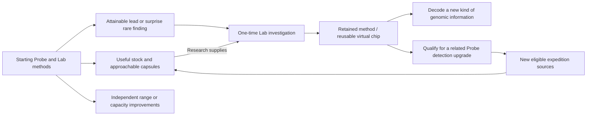

# Gathering and exploration: from field context to Lab discovery

**Current gathering design, 30 September 2026.** Accepted foundations: Companion-selected expeditions and standalone field play; Lab knows only expedition records it actually receives; expeditions end when returned resources are accepted at Lab; optional encounters without missed-check-in punishment; whole typed resources and sealed capsules; no genetic disclosure on the Probe. The [generated field-loop proposal](#generated-field-loop--owner-review-proposal) addresses the owner's request for steerable exploration, deliberate acquisition and per-resource progress. Its interaction rules, resource roles, event catalogue and worked quantities remain proposals for owner steering, not implemented mechanics, final balance or hardware selection.

The approved [Lab workbench](genome-workbench/README.md) gives gathering its purpose: replenish useful studies, choose among partial genomes and discover new ones. [Probe specification](../specs/probe.md) owns measured-evidence boundaries; [research and creation](research-and-creation.md) owns inventory and sample lifecycle. The [Pip proof](../prototype/genetics/report.md) supplies valid content, not the field-award algorithm.

## Review at a glance

The current review connects **choose an expedition on Companion → explore a generated map → investigate a location → work a useful supply opportunity or follow a capsule lead → deliberately collect → return and send → Lab accepts once → continue retained research**. The broader rare-reference/method progression below remains future design context, outside this map proof. Range and capacity improve expedition choice/convenience independently; all three stocks remain useful.

Review the [three stock identities](#prepared-research-resources--concrete-proposal), [progression map](#connected-progression-proposal) and [V1 expedition and event framework](#v1-expeditions-events-and-risk). The owner decisions are grouped [at the end](#owner-review-boundary). Accepted foundations and proposals are explicitly separated; nothing here implements a new economy or changes the approved Lab screens.
## One connected loop

Choose a purpose in Companion's Probe mode → retain the generated expedition → steer to an interesting location → deliberately investigate and activate useful work → retain whole supplies and possibly a sealed capsule → review and send the actual expedition contents → Lab accepts and credits inventory once → prepare new capsules or continue an existing research record. Lab may provide known research needs already received by Companion; it does not select the field route or observe away progress.

The player chooses what to pursue, not how to operate individual sensors. Ordinary indoor and outdoor settings remain useful. No required phone, constant attention, exact destination, physical hazard or reflex test. Collection and exploration should support both purposeful resupply and curiosity.

Use the connected model's [shared vocabulary](research-and-creation.md#shared-vocabulary-packs-units-and-samples) for packs, capacity units, samples and capsules. Resource quantities in this document count prepared packs. Show time-and-chance activity toward the next award attempt separately from whole-item storage; gameplay owns the current accounting rule.

## Three different kinds of find

| Find | Proposed role | What it does not do |
| --- | --- | --- |
| Research supplies | Stackable quantities spent by named Lab studies | Do not represent genes, research completion or an individual |
| Field items | Occasional authored objects with a clear use, such as a reference fragment enabling a comparison or a consumable affecting a later expedition's opportunities | Do not silently become equipment, permanently grant abilities or decode the current sample |
| Sample capsule | A stable discovery source containing unknown genomic information/possibilities; prepared at the Lab into a research record | Not a critter, resource stack, loot rarity label or genetic preview |

Keep the initial item set small. A reference item can supply a comparison context, but the new sample still needs its own evidence and studies. Permanent equipment/chips and nourishment belong to existing progression/care design; do not invent a second equipment economy for this slice.

## Three-resource foundation — owner scope accepted

The owner accepts three starting research resources, Data, Energy and Essence, serving an open-ended variety of critters across all genomic layers/dimension families. Mineral grains/Lumen/Catalyst are rejected names. Subsequent terrestrial/botanical naming proposals are withdrawn as too narrow. Old labels in retained examples are superseded vocabulary.

Resources support the Lab's methods; samples supply the unknown genomic information. Supplies do not install alleles, confer abilities, replace evidence or erase retained knowledge when consumed. They remain distinct from capsules, collection points, field items and nutrition. No resource corresponds to a class of creature, genomic layer or rarity tier. Extensible fictional content does not imply unlimited hardware/software capability.

### Prepared research resources — concrete proposal

**Data cards / Energy prisms / Essence** follow the owner's naming direction. Their purposes below are proposals for steering, superseding the earlier reference/distinction/relationship resource taxonomy. The Probe prepares fictional research stocks; these are not new physical consumables, chemical processors or hardware requirements.

| Resource | What it is in the game | What the Lab uses it for | Why demand varies |
| --- | --- | --- | --- |
| Data card | A prepared analysis medium carrying organized reference patterns from the expedition | Comparing and resolving ambiguous genomic information | A study distinguishing several supported alternatives needs more comparison capacity than a straightforward reading |
| Energy prism | A concentrated fictional power supply for research operations | Running demanding scans and controlled analytical trials | Some methods require longer or more intensive operation, independent of the critter's own energy system |
| Essence | A prepared coupling medium: a temporary interface between sample and analytical instrument | Making difficult genomic information readable without altering it | Some encoded structures need a better interface; this can occur in ordinary or fantastic samples |

For Data cards, the consumed unit is prepared analysis capacity/media, not durable knowledge. Findings are retained in the research record; repeated studies cannot charge merely for rereading an already established fact. Energy prisms are gameplay stock, never the device's actual battery charge. Essence is neither donor genes nor an ingredient that adds a trait; its effect ends with the study while its findings remain. It is not automatically rare, ghost-specific or a replacement for a required method chip.

The Probe prepares discs from fictional collection opportunities themed around organized observations, prisms from excitation-themed opportunities, and Essence from binding/coherence-themed opportunities. Baseline typed yields are shared across profiles. Profiles control optional event pools; coarse real sensor context can influence event eligibility but does not measure these fictional properties. Different environments can supply every essential stock through available routes. No mandatory shaking, strong light, exact weather, physical harvesting or three extra field minigames.

**Selected third-resource identity: Essence.** Its visual direction is a simple droplet alongside discs and prisms; depict the contents, not a vial that could be mistaken for a sample capsule. It retains the prepared analytical-medium role and existing pack, gathering and study mechanics. Essence is not harvested organism matter, a donor gene or an ingredient that grants a trait. Retained concept plates and prototype identifiers may still use the superseded filament name/form; those are pending presentation updates, not alternative resource definitions.

Recommended inventory copy: **Data cards · 3**, **Energy prisms · 2**, **Essence · 1**. A study names its purpose and exact cost, not a claim that the resource causes an allele. Resource names are selected; recipe quantities remain illustrative. Retained artwork and implementation identifiers have not yet been migrated.

### Cross-critter uses and an actual choice

These costs are arithmetic fixtures, not selected balance. The plantlike and phase examples do not establish new canonical species, copy schemes or abilities.

| Study | Finding sought | Example stock cost | Why these inputs |
| --- | --- | --- | --- |
| Pip markings comparison | Resolve the second copy, then establish Pp and carried-but-unexpressed pale variation | 2 Data cards | Comparison-heavy; existing sample preparation and basic instrument operation suffice |
| Pip movement relationship | Establish how known drive and efficiency contributions combine | 1 Data card + 1 Energy prism | Compare the contributions and run the supported analysis |
| Plantlike genome with intertwined contributors | Distinguish supported pigment alternatives in this sample | 1 Data card + 1 Essence pack | Compare alternatives through a temporary analytical interface; the Essence does not change pigmentation |
| Hypothetical phase-capable genome | Resolve a supported phase-related locus after acquiring the appropriate method | 1 Data card + 2 Energy prisms + 1 Essence pack | Requires the method, demanding analysis and an appropriate sample interface; none of these supplies grants the ability |

Starting with 2 discs / 1 prism / 1 Essence pack, the player could finish Pip's markings comparison (leaving 0/1/1), or perform its movement relationship study (leaving 1/0/1) and still afford the plantlike comparison (leaving 0/0/0). This makes the same inventory relevant across different subjects. A missing method still prevents the phase study even with ample resources. No study automatically demands all three stocks; lower-demand work remains useful later.
## Sensors connect ordinary surroundings to expedition mechanics

Owner requires the Probe's hardware sensors to participate in the game loop. The existing [Probe evidence contract](../specs/probe.md) owns measured-input limits and the wider candidate sensor set. The small V1 experiment envelope is brightness, temperature/humidity and acceleration; it is a proposal, not selected hardware. Pressure, spectral channels, sound features and magnetic sensing remain candidates pending demonstrated gameplay value and bench constraints. No new component or purchase is selected here.

### Proposed V1 sensor-to-mechanics connection

**Sensor observations → valid observation windows → coarse context → expedition event eligibility/weights → explicit player choice → resource or discovery consequence → Lab research.** Stable baseline yields stay shared across expedition types. Sensors make context and opportunities meaningful rather than directly converting brightness into Energy, motion into Essence or a measurement into an allele.

| Measured context | Player experience | Proposed mechanical effect |
| --- | --- | --- |
| Broad light level and sustained transitions | A desk, a pocket and a brighter setting feel different to the instrument | Change the context of eligible Patterned echo, Charged front or other authored encounters; never guarantee an event or reward brighter extremes |
| Broad temperature/humidity conditions and changes | Leaving the Probe to observe a setting can be useful | Diversify eligible atmosphere/coherence encounters within the selected expedition; no claim to identify weather, habitat or materials |
| Activity versus settled observation | Carrying and placing the Probe both contribute | Tag observation periods for event variety; neither movement nor repeated shaking is a mandatory collection multiplier |

An event's authored rule may prefer a context without making it the only possible route. Expedition and Probe tier first define eligible content; sensed context adjusts that pool; bounded generated variation selects an opportunity. A Weather expedition in changing conditions might favor a fictional Electrical storm, but the display must never claim a real storm was detected. Accepting that event applies its finite Energy boost and explicit simulated damage risk. Real environment readings do not themselves damage the game Probe.

### Collection credit and sensor feedback

One eligible observation interval can advance baseline resource preparation once, regardless of how many sensors reported. More channels, repeated reads, screen checks and rapid threshold crossings cannot multiply its elapsed-time credit. Use broad states, sustained changes and bounded context contributions; exact thresholds, smoothing windows and cadence require sensor/bench evidence. Ordinary stable indoor observations remain useful, not inferior to dangerous/extreme conditions. Player feedback can acknowledge a measured change or a settled observation without exposing raw diagnostics in the main gathering view.

Missing/stale/invalid channels remain explicitly unavailable. A documented subset may still support ordinary observation; if no required evidence is valid, show sensing paused rather than invent data. An explicitly selected simulator/fallback mode may provide authored context, always kept distinct from actual measurements. Apply the existing charging-related collection constraints; charging/hand/enclosure effects require bench review before treating readings as environment evidence.

Tier upgrades can unlock new interpretations, expeditions and event pools using installed sensors. They cannot create an absent physical capability. No GPS, phone, microphone or location service is required by this proposed V1 slice; the wider optional context design remains separate.

### Observations and expedition log — requested destination

Owner asks for a view conveying sensor accumulators or logs. Proposed V1 destination: **Observations**, separate from resource gathering. Current observations show broad light/climate/activity summaries, valid observed duration, and freshness or unavailable status. Its **Log** page lists recent measured changes and game events with distinct labels/symbols. The exact layout remains part of the complete UI revisit; this is an interaction/data proposal, not approved screen art.

Do not introduce a second resource economy: sensor accumulation means retained observation coverage and context, not three spendable sensor scores. Observed duration counts a valid time interval once across channels, not once per sensor. Observation coverage and credited resource-gathering work are distinct: the hold can be full while the instrument still observes; seeing more observed minutes must not imply that resource stock increased. Per-channel missing data remain visible even when the remaining valid channels support an observation.

Example current view: “Light — dim, steady”; “Climate — warm, humid”; “Activity — mostly still”; “Observed — 24 min”; “Last reading — recent”. All these values require supporting trace evidence; “unavailable” replaces any unsupported field. Qualitative thresholds and freshness limits remain unselected calibration parameters. In the simulator, the view must clearly identify simulated observations.

Example log sequence: **Observation: light increased** → **Observation: settled period** → **Game event: storm available** → **Choice: exposure accepted** → **Game result: Energy boost ended**. A fictional storm never appears as a sensor measurement. The display is a bounded recent summary, not a new permanent raw-data archive; presentation retention must not erase receipt/research deduplication records.

Existing combined Companion controls only: four directions, Confirm and Back. Choose Observations through visible task focus; Confirm opens; directions browse entries; Back returns to the same caller and safe focus. Reading or scrolling never generates collection credit, draws a new event, accepts exposure or changes resource state. Raw sensor units belong in a later diagnostic/learning view if selected, not an unrequested main-screen instrument panel.

### Sensor experiment acceptance examples

| Authored trace | Expected observations/log | Expected game boundary |
| --- | --- | --- |
| Stable desk, valid light/climate/activity | Stable summaries and elapsed observation coverage, without repeated change entries | Ordinary eligible gathering; stable surroundings are useful |
| Ordinary carry, sustained light transition, then stillness | One supported change and later settled context | Context can alter the selected expedition's eligible event weighting; no guaranteed storm or extra credit per sensor |
| Missing/stale channel or no valid required input | Per-channel unavailable state; sensing paused if no supported observation remains | No fabricated measurement or free progress during invalid periods |
| Replay the same intervals after restart | Same retained coverage/log, no duplicate entries | No additional gathering credit, event reroll or item award |
| Full resource hold while observations continue | Observation coverage may advance; resource-full reason remains clear | No overflow resource bank; reading the log changes nothing |

One trace comparison and bounded readable projection suffice for the next host experiment. No real sensor driver, new final UI, broader event engine or hardware procurement is implied.

### Executable integration boundary

The [simulated observation adapter](../prototype/expedition/README.md#simulated-observation-adapter) wraps the existing expedition rules and save repository. Timestamped quality-marked windows credit ordinary gathering once; a sustained light-context change alters one fictional Weather opportunity. Explicit acceptance remains required for the resource boost. Observations/log projections separate coverage, current availability, game events, player choices and results. The comparison covers desk, changing light, missing/stale input, replay/restart and full storage. This remains a bounded host experiment: its window duration, freshness threshold, event weights and 128-window history cap are test parameters, not final hardware, balance or production storage choices. Physical evidence begins only with actual hardware tests.

## V1 expeditions, events and risk

**Accepted direction:** all three resources have accessible baseline opportunities and per-type rates shared across expedition profiles; expedition-specific events can temporarily boost a resource and offer optional risk, including simulated damage requiring Lab return. This does not approve concurrency for the new map design: one active focus is proposed below, while deployed Core V1 still uses its simultaneous timed fixture. No filters, automatic discard or new hardware controls. **Broader future proposal below:** four expedition types, ten reusable event types, one shared interaction pattern and binary Probe condition. Names, exact event membership, boosts, odds and recovery action remain proposals for owner review, outside the five-place map proof.

Whole loop: choose an investigation on Companion → explore and activate useful gathering → inspect an optional event → choose whether to participate → retain supplies/finds or return with damage → offload and research at the Lab. Expedition choice changes discovery opportunities, not the ordinary per-type yield rates. Stable does not mean all three resources have identical rates; their separate baseline rates remain to balance. The risk/event catalogue remains broader future design context; the current five-location map study introduces no damage mechanic.

### Four expedition types

| Working name | Investigation | Featured events | Discovery emphasis |
| --- | --- | --- | --- |
| General survey | Broad exploration; calm first expedition | 1, 3, 5, 7 | Introductory capsule route, varied eligible leads |
| Weather research | Fictional atmospheric activity | 1, 2, 7 | Weather-themed encounters and eligible sources |
| Signal mapping | Patterns and interference | 3, 4, 7 | Pattern-related encounters and eligible sources |
| Resonance survey | Fictional coherence and unstable traces | 5, 6, 7 | Coherence-themed encounters and eligible sources |

Events 8–10 are shared discovery templates using each profile's eligible content. General survey offers a calm starting route without risky events; risk is optional in the specialist expeditions. These are investigation themes, not guaranteed creature classes. All profiles offer access to all three baseline resource classes, and essential capsule/method routes remain accessible through current-capability Companion expeditions. Real sensor context may influence authored eligibility; it does not detect magical material, actual storms or genome types. No travel into hazardous weather or exposure to physical danger is required.

### Probe-tier progression — owner direction

Probe tiers unlock expedition types, eligible event variants and item/drop pools. They are not merely capacity upgrades. Tier eligibility is checked before event weighting or drop rolls: a rare roll cannot bypass an unmet tier requirement. Combine tier, installed capability and retained progression requirements where relevant; Lab method ownership/equipping remains a separate research constraint, not a substitute for Probe eligibility.

Proposed V1 structure: the starting tier offers General survey, safe introductory events and approachable capsule/reference content. Later tiers open the specialist expedition themes and their advanced event/drop variants. The exact number of tiers, which specialist theme opens when, upgrade requirements and capacities remain open. The four themes above are the V1 catalogue, not four starting choices or four automatically corresponding tiers.

Reuse the ten event types across tiers with authored eligible variants; do not create ten new mechanics per tier. A Sealed capsule event may draw from a broader genomic-source pool later, weighted toward player progress and research complexity. A Reference trace may lead to a new method-enabling item. Stronger resource-boost/risk variants can become eligible without making ordinary resources obsolete. Tier affects eligibility, not an automatic increase of every baseline yield rate. Earlier expedition choices remain available.

An upgrade's prerequisites must be obtainable through current-tier expeditions or an established Lab alternative. Never require an item found only at the tier it unlocks. Acquired samples, events already accepted and retained leads are not rerolled on upgrade. These requirements preserve the accepted rarity/progression rules and avoid turning tier upgrades into automatic genome decoding.

### Ten shared event types

| ID / working title | Opportunity and choice | Outcome / risk |
| --- | --- | --- |
| 1. Charged front | Collect or pass | One finite Energy prism gathering boost; no damage |
| 2. Electrical storm | Shelter or accept exposure; optionally take one stronger second exposure | Energy boost; explicit simulated-shock risk that rises on the second exposure |
| 3. Patterned echo | Record or pass | One finite Data card gathering boost; no damage |
| 4. Signal overload | Leave or accept exposure; optionally take one stronger second exposure | Data boost; explicit simulated-overload risk |
| 5. Essence drift | Gather or pass | One finite Essence gathering boost; no damage |
| 6. Unstable weave | Leave or accept exposure; optionally take one stronger second exposure | Essence boost; explicit simulated-strain risk |
| 7. Mixed deposit | Gather or pass | A small finite boost across all three resources; no damage |
| 8. Capsule trace | Follow or leave pending | Advance a retained, bounded lead toward an eligible capsule; no genomic disclosure |
| 9. Sealed capsule | Collect or leave pending | One stable sample capsule if its compartment has room; no species/trait reveal |
| 10. Reference trace | Investigate or leave pending | Advance a bounded reference lead; its final step yields the method-enabling item, not the method itself |

A capsule trace reaches a capsule opportunity through finite authored steps; it is not an endless chain of clues. References are capability-eligible and have a bounded path too. Early surprise finds can satisfy the same pending lead; they do not also award a duplicate scheduled find. Variants change fiction/content, not create more V1 mechanics. No separate minigames, ten input schemes, new resource types or compulsory damage events.

### One small event contract

Each authored event specifies: stable identity; permitted profiles, minimum Probe tier and capability requirements; presentation; allowed choices; affected resource or discovery lead; finite exposure/work budget and yield effect; disclosed risk for each choice; capacity handling; and one retained resolution. Numeric settings are data to tune, not extra gameplay systems. Event selection, acceptance and resolution are retained so restarting, checking or reconnecting cannot reroll an opportunity or duplicate its award.

Use one visible lifecycle: **available → choice → bounded activity → result → resolved**. One active or pending encounter at a time in this broader proposal; gathering continues where possible. An ignored notice stays safe and does not move focus. Player interaction uses the existing Companion directions, Confirm and Back. Before accepting risk, show its benefit, duration/work bound and chance of forced return; a plain risk label may summarize a disclosed probability once balance is set. Default focus is the safe choice.

A risky event permits at most two accepted exposure intervals for V1. The second offers a stronger boost and greater disclosed risk. After each interval, shelter automatically while awaiting the next choice; no missed-response damage. Shock can occur within an accepted interval even if the screen is not being watched—that bounded risk was explicitly accepted. No repeated live rolls based on screen checks. Pausing retains the same exposure/risk state; resuming does not restart its odds. Voluntary withdrawal forfeits remaining opportunity, not already earned contents; it cannot undo damage already incurred.

If the target resource cannot fit, block activation or suspend remaining exposure without more yield or risk. On storage release, resume only the remaining saved budget. No infinite bonus reserve. Manual discarding removes whole items and frees their occupied capacity; activity preparation consumes no cargo space. Returning to the Lab ends the current boost and preserves cargo, saved activity preparation and completed lead steps. Unused encounters can remain as notes/leads, never retroactive rewards. Closing the expedition cannot resurrect a used boost.

### Simple damage and recovery

Use only **Operational** and **Damaged — return to Lab**. No durability percentage, damage categories, repair currency, equipment-loss roll or repair timer in V1. A simulated shock/overload/strain changes the condition to Damaged and stops resource gathering and discovery advancement. Controls, cargo inspection and transfer remain usable. Every earned resource, sample, special find and saved activity preparation is retained.

At the Lab, offload first, then use a simple explicit service action to restore operation. Service is free in this V1 proposal: the consequence is an interrupted expedition and required return, not a new repair economy. It never depends on a resource obtainable only with an operational Probe. Repair does not restore the resolved event or unearned boost. This is game state, not evidence that a physical device has been damaged or repaired.

### Worked storm encounter and review boundary

Choose Weather research; ordinary disc/energy/Essence rates remain unchanged. A storm notice waits while gathering continues. Ignore it safely, or inspect: see an Energy boost, one bounded exposure and a disclosed shock chance. Accept once. Success retains extra Energy progress; then shelter automatically. Leave with the gain, or accept the stronger second interval. If shocked, stop the expedition's collection and show the retained cargo plus return requirement. Offload/service at the Lab; continue research with what was brought home. No supply is converted from a discarded type into Energy.

Paper checks before implementation: ignored notice; accepted exposure while unattended; first success then withdrawal; second-stage damage; storage full mid-exposure; pause/resume without new risk draw; and return/service without event replay. Inspect quantity conservation and retained state. Rates, probabilities and whether returning feels costly enough need player testing; agent review is not playtest evidence. Current storyboard lacks these event/damage states and is not an implementation specification.

## Rare findings and research capability — approved direction

Owner approved rare findings enabling retained research methods, with baseline supplies funding subsequent studies and capsules supplying unknown genomes. Progression branches into capabilities; major research routes should permit deliberate pursuit alongside surprise discoveries. The ethereal crystal and ghostlike critters remain illustrative, not approved item names, canonical classes, drop rates or exact gates.

Recommend three separate values: baseline Probe-prepared supplies fund individual studies; rare discoveries enable research methods; sample capsules add unknown genomic content. A rare finding could support a one-time investigation that establishes a retained method, with later studies using the ordinary supplies. This makes the find consequential without requiring repeated rare drops for every similar genome.

Connect method access to the existing equipment/chip design before implementation. Research chips are virtual, profile-owned, removable and reusable; a method unlock must not silently decide that all capabilities are permanently active or bypass slot/capability constraints. Whether a finding grants a method directly or enables crafting a chip remains open.

Illustrative sequence: obtain a capsule, research what current methods support, retain an unresolved region requiring a new analytical method, follow a field lead, acquire a rare reference finding, investigate it at the Lab, gain access to the method, then return to the existing record and decode that region using baseline resources. Its genes never changed. Full decoding still precedes incubation; possessing a special finding never supplies missing genes or instantly decodes a class.

An essential method can gate an entire genome family when its defining information needs that method; related methods may also benefit different classes. Prefer a branching capability progression over a universal stronger-tier ladder. A later fantastic critter is not automatically better than Pip. Complexity, applicable methods and desirable traits remain distinct.

Allow rare surprises alongside attainable directed leads; do not make the only route to a major research branch indefinite random luck. Repeated finds need an authored use rather than becoming dead inventory; trading, crafting and alternate study uses are possible but not selected. Essential acquisition remains attainable through current-capability Companion play; console-only acquisition was removed by owner direction. Probe displays never reveal capsule genotype or infer species from a rare item.

Open choices: method/chip relationship; whether and when the original find is consumed; directed acquisition and duplicate uses; which genomic domains need which methods. No new resources, numerical tiers or implementation selected here.
## Progress-proportional discovery and Probe tiers

Owner direction: findings should normally be proportional to player progress. Accidentally acquiring a much more complex genome should be unavailable or a low-probability exception, not ordinary early play. Owner requires Probe tiers to unlock expeditions, event variants and drop pools; range, capacity and detection remain relevant capabilities. Exact tier structure and upgrade rules remain to design.

Separate field access from analysis: Probe capability governs eligible expedition opportunities and discoverable sample sources; Lab methods govern which acquired genomic information can be decoded. Eligibility for a content family precedes weighting by research complexity and current progress. A low-probability advanced find, if enabled, must remain within the acquisition rules of the current Probe/profile; randomness cannot silently bypass a capability explicitly defined as a hard requirement.

The proposed reward mix favors useful supplies, research-ready samples and reachable next-step leads. A small exceptional discovery can foreshadow later research, but must not routinely strand the collection in unprocessable genomes. Existing samples and supported contents remain stable across upgrades; never reroll a sample to match new progress. Exact distributions and the definition of progress require design and balance work. Genomic complexity is not rarity, power or a universal higher-is-better score.

| Proposed Probe upgrade dimension | Game meaning to investigate | Boundary |
| --- | --- | --- |
| Range | Breadth/depth of fictional expedition opportunities or accessible collection bands | Not increased radio/GPS range, physical sensing distance or an instruction to travel farther |
| Capacity | Usable in-game expedition storage for typed supplies and capsules | Exact units/limits and full-capacity behavior remain open; earned finds are not silently discarded and fictional upgrades cannot add physical memory/battery |
| Detection | Recognition/collection eligibility for new classes of fictional field signatures and sample sources | Not genotype disclosure, actual ghost sensing or an uninstalled physical sensor |

Prefer author-visible capability requirements plus a small player-facing progression structure over a single unexplained level controlling all rewards. Lab/Probe upgrades should support each other without a circular gate: each next capability needs an attainable Companion source using current capabilities. Decisions still open: tier count and unlock order, how upgrades are acquired, range semantics, capacity handling and optional advanced-find probability.
## Acquiring an unknown genome

Use the [accepted baseline/sample/phenotype distinction](../specs/genetics.md#genome-baseline-collected-sample-and-phenotype--accepted-distinction): particular samples reveal valid foundations and sample-specific variation. They are not universally donor tissue or fragments for an unselected genome-assembly mechanic.

Recommend capsules as discovery rewards separate from routine supply milestones. A first guided expedition should provide an attainable first capsule; later exploration can mix random finds with visible progress toward a retained discovery lead, so bad luck cannot indefinitely block new research. Exact guarantees, cadence and lead costs require owner selection/balance work.

When a capsule is acquired, preserve its source identity, expedition evidence and supported genomic possibilities. It is stable on reopening or retrying delivery. The Probe may show a neutral capsule identity, never species, traits, allele letters or predicted critter art. Lab preparation exposes the research object; research establishes hereditary information and any supported configuration choices. It does not redraw hidden content for a prettier result.

Some content may resolve to one genome and other content may permit several explicitly supported configurations under the existing guided-synthesis design. Do not quietly turn every capsule into one random predetermined creature, or every capsule into an unrestricted genome generator. The existing preparation, full-decoding, selection and one-sample/one-founder boundaries still apply.

### Capsule preparation versus research — clarification proposal

A genome-bearing capsule is a kind of expedition finding, distinct from an ordinary resource award or a rare method-enabling item. The recommended player flow is: collect a sealed sample capsule → return → routine Lab intake/preparation creates a researchable genomic record → choose which unknown information to investigate. Intake may automatically identify that genomic material is present; the player does not spend a paid study merely to discover that the object is a genome sample. Preparing the record is not incubation, full decoding or an automatic species/trait reveal.

The Probe can acknowledge a collected sample capsule without naming its contents, species, traits or supported configurations. The capsule's genomic source remains stable; opening/preparing it does not roll whether a genome exists. This proposal treats a sample capsule as a reliable research opportunity, not a dud lottery. Ordinary curiosity items and rare references need not contain genomes, and their investigation is a separate purpose. Exact preparation interaction remains to design.
## Connected progression proposal

**The following is a worked design for review, not selected tiers, chip recipes or balance.** The stages demonstrate a dependency chain rather than a mandatory three-level ladder. The expedition ledger uses the proposed resource identities above; its costs and thresholds are illustrative.

| Illustrative stage | What the player can pursue | Boundary and payoff |
| --- | --- | --- |
| Starting exploration | Basic profiles, all three stock types over available routes, introductory capsules, ordinary Lab methods | Most samples are researchable with owned methods; supplies fund different choices across the collection |
| First breakthrough | Follow an attainable lead to a rare **phase reference**; investigate it with starting methods and stocks | Proposed result: retained **phase-comparison method** represented by a reusable virtual Lab chip; exact names and subject matter illustrative |
| Broader exploration | The completed reference investigation qualifies the player for related Probe detection calibration; optional range/capacity improvements support preferred expedition style | New eligible sources may include genomes requiring phase analysis. They still need their own research; ownership of the method is not knowledge of each genome |

The reference is an authored calibration finding readable with starting methods, not a specimen requiring the very method it enables. Recommend the one-time investigation retain its finding as a reference record and consume only its displayed ordinary stocks; repeat findings need an authored secondary use before content release. Probe detection calibration is a proposed game upgrade, not a new physical sensor. It can follow the same breakthrough without a second rare-drop requirement. Exact fitting/unlock costs are not selected.

The method remains learned; its chip must be equipped in a compatible available slot for relevant studies. Switching slots changes available work, not discovered facts or ancestry. Acquiring the method does not permanently activate every capability. Active-study chip switching requires a later explicit interruption rule; this paper example does not switch during work.

### First capability branch: a concrete phase-analysis example

This is one proposed fictional branch, not a committed ghost class or universal tier ladder.

| Step | Player action and result | Gate that makes it attainable |
| --- | --- | --- |
| 1. Starting capability | Use baseline Companion expeditions and Lab methods; collect useful stock and approachable capsules | All essential starting inputs have reachable field sources |
| 2. Follow a reference lead | A baseline-compatible survey can yield a **Reference shard**, a special finding separate from capsules | Its collection signature is detectable at the starting capability; the directed lead offers bounded pursuit alongside a surprise route |
| 3. Investigate the shard | A one-time study using starting methods and, illustratively, 1 Data card + 1 Energy prism establishes **Phase analysis** | No phase-analysis prerequisite and no second rare item. Retain the reference record; ordinary stock is consumed only upon accepted study |
| 4. Equip the new method | Receive access to a reusable virtual Phase analysis chip; equip it in an available compatible Lab slot | Owning the method retains it across Labs; equipping makes relevant studies available. It does not instantly decode samples |
| 5. Calibrate Probe detection | Completing the same investigation makes a related fictional detection calibration available at the Lab | Recommend no second rare-drop gate; fitting/calibration price remains open. It enables a game content capability, not a new sensor |
| 6. Explore the new sources | Compatible profiles can now yield capsules with phase-related genomic requirements | Both field eligibility and owned Lab capability precede ordinary rewards from this new family; complexity is still weighted toward progress |
| 7. Prepare and research | Routine Lab intake creates an unknown genomic record; perform its required studies with stocks and fitted methods | Baseline, particular genome and phenotype remain distinct; full decoding and selected configuration precede incubation |

Advanced surprises before this breakthrough can be more complex samples within starting detection eligibility; they cannot bypass this branch's hard source-category gate. A shard is a reference object whose starting-readable signature supports method development, not a secretly inaccessible genome. A new method may later help more than one critter family. No physical accessory is required and no individual inherits the chip.

Recommend keeping range and capacity as independent upgrades: they can improve choice and expedition convenience without forcing the player down this particular analysis branch. Exact acquisition costs remain open. Duplicate shards must eventually have a defined secondary use, but that is not necessary to choose this first-discovery path; do not implement drops until duplicates and full-inventory handling are specified.
### Range, capacity and detection have different jobs

- **Range** expands the set of expedition profiles/fictional collection bands available to explore. It is not metres, GPS travel or radio range. Some profiles need both range and detection; increasing range alone cannot bypass an unknown signature category.
- **Capacity** changes how much can be brought home before returning. It is convenience and expedition planning, not a condition for owning better critters. Compartment units and exact limits remain balance choices.
- **Detection** grants eligibility to collect particular fictional source categories. It never reveals a capsule's species or genes. A profile still controls opportunities within eligible categories.

Assign explicit capabilities and expedition/event/drop eligibility to Probe tiers; do not assume every tier increases all three capabilities. Every essential next upgrade must be reachable through Companion using current capabilities. Names, branching structure and recipes remain proposals; this is not approval of three fixed Probe tiers.

### Choosing what can be found

First filter by installed Probe capabilities and selected profile. Then weight eligible samples using **owned research methods and demonstrated research milestones**, not simply the chip fitted at that moment. This avoids distorting rewards by temporarily removing a chip. Existing specimens/capsules remain unchanged by progression.

Ordinary results favor samples that can be researched with owned methods; a smaller share may stretch complexity or point to an attainable next method. For the first balance experiment, recommend no advanced surprise in the introductory expedition; afterward allow a small optional next-step exception, with no selected percentage. Never use random luck to bypass a hard detection requirement. Keep simpler samples and useful stocks in later pools. These weights are proposals, not a hidden adaptive implementation.

## Expedition pacing and return — team proposal

**For owner steering, not selected balance.** Gather under the selected profile until the player returns or eligible storage fills. Full storage pauses collection; it does not mean the expedition's scientific purpose is completed. Returning and accepting the unload ends the expedition; the next outing chooses a new expedition. Cargo inspection or cancelled review can return to gathering before Send. Keep expedition time, the next award attempt and whole-item storage distinct; avoid unnecessary duplicate meters.

### Typed gathering, pack thresholds and manual discard

Current owner direction: resources are fungible within their own class and indivisible. Cargo holds whole Data cards, Energy crystals and Essence drops. Gathering progress is time and chance based; it is activity toward another award attempt, never unfinished contents. [Gameplay](../specs/gameplay.md#research-collection-and-gathering--accepted) owns this rule and supersedes the earlier fractional reservoir example.

Each resource can retain its own preparation state. Completing an eligible attempt can award a whole item or award nothing. Preserve preparation and resolved outcomes across view changes and returns; checking the screen must not generate yield or reroll results. Exact rates, probabilities and event boosts remain balance work. The native connected fixture is a bounded simulation, not selected field pacing.

Manual discard remains an explicit player choice, with Keep as the initial confirmation choice. Show the resource class and whole count removed. Do not add filters, automatic rejection, fractional discard or a player currency for activity progress. Discard does not increase future yield or immediately replace the removed item.

### Whole storage and retained activity progress

All resource classes share a whole-item hold. Two Data cards and one Essence drop occupy three units; retained preparation occupies none. Capsules and special finds have separate stores. Full storage pauses resource gathering with a visible reason. No hidden overflow or invisible earned stock is allowed.

Offload awarded whole items to Lab stock. Preparation remains on the Companion, independent of the transferred manifest and the Lab's spendable stock. Returning, discarding or changing a view cannot convert preparation into an item. The screen should show cargo counts, storage capacity and the next attempt as distinct facts, using concise labels and meaningful resource art.

### Expedition identity

The [V1 framework](#v1-expeditions-events-and-risk) owns profile/event/risk rules. Stable per-resource baseline yields apply across expedition types; temporary event boosts provide targeted opportunities. This supersedes permanent profile-biased resource mixes. Changing expedition cannot alter collected contents or reroll resolved events. Saved discovery effort remains attached to its lead.

### Samples and rare finds have their own pace

Provide an attainable guided first capsule through the [bounded location/lead sequence](#generated-field-loop--owner-review-proposal), not an elapsed-time award. Discovery remains independent of supplies produced or spent: a full resource hold does not block an inspectable lead when capsule storage remains free. Surprise opportunities can resolve the same stable pending lead rather than granting a second duplicate reward. Exact guarantees and cadence remain owner choices; neither waiting nor finishing a resource meter proves a sample was acquired.

Rare method-enabling references should take a longer authored lead, potentially across several expeditions. Do not select another universal timer: its effort must match the actual branch it enables. Retain lead steps and optional encounters without decay. Essential progression has a bounded Companion route using current capabilities; random luck cannot be the only route. Neither kind of finding reveals a genotype on the Probe.

### Connection to Lab choices and next design step

A player pursuing Essence can keep incidental discs and energy for another genome's studies, or discard them to continue collecting with limited capacity. On return, accepted packs credit Lab stock once; spending on one research record changes affordability elsewhere without erasing discoveries. More complex genomes require repeated studies and expeditions; introductory content should demonstrate discovery promptly.

Whole-item storage accounting is accepted; unfinished gathering preparation is separate and occupies no cargo space. The [connected visual journey](probe-expedition/README.md) retains earlier gathering, discard, risk and Lab-return context; the generated-map proposal supersedes its passive field composition. Check conservation of retained/discarded whole quantities, meaningful storage release and no hidden overflow. Exact timing then needs human playtesting against research costs. A visual study is not functional UI or approval of balance.

## Owner review boundary

Current review concerns the [generated field loop](#generated-field-loop--owner-review-proposal), one-focus opportunity handling and actual map/interaction study. The four themes, ten shared event types and binary damage/free-service model remain broader proposals, not dependencies for this proof. Whole-item capacity and explicit discard are accepted; preparation, event rates/odds and numerical economy remain separate and open. No live mechanics or hardware changes are delivered by this design round.

## Executable slice and limits

The [host experiment](../prototype/expedition/README.md) implements the accepted storage/discard/offload boundaries plus one authored storm and a paid existing Pip Crown study. Its rates boost only Energy while keeping the other baseline yields unchanged; these executable arithmetic fixtures differ from the earlier static-story quantities and do not select final balance. It omits capsule generation, second exposure, all other events, tier upgrades and visual UI. See its reproducible transcript for actual measured software behavior; the design catalogue is not an implementation-completeness claim.

## Generated field loop — owner-review proposal

**Design round, 30 September 2026; not live mechanics.** The delivered native
Core V1 remains the implementation checkpoint. This proposal replaces its passive
seconds-counter/decorative field view with useful movement, local investigation
and retained accomplishments. It serves the player replenishing research supplies
or seeking a new sample. Completion of this round is one native-size map/interaction
packet with two generated map examples and a truthful received Lab log, ready for
owner steering. No code, balance, sensor, creature or hardware decision is approved
by the paper flow.

### Whole journey and choices

**Companion chooses route → player steers along discovered paths → inspects a
place → activates a supply opportunity or investigates a lead → sees actual
preparation and whole finds → follows the revealed cache path → deliberately
collects a sealed sample → reviews Return/Send → Lab accepts once → continues
the same research collection.** Lab shows only information it has received.

The meaningful choice is which useful opportunity to pursue with limited carrying
room and attention: replenish a known shortage, inspect a promising trace, switch
gathering focus, leave optional branches unexplored, or return now. Map arrival,
distance walked and seconds elapsed are not achievements or rewards. A location
investigated, an opportunity resolved, a trace identified and an actual item
collected are inspectable accomplishments. No question has a secret correct
answer; inspection reveals choices, not a quiz or required reflex challenge.

For this packet, use a self-selected **Goal: Essence resupply**, not a supposed
live Lab shortage. A previously received research request could instead be shown
with its date/source; it cannot update itself while the player is away. At Brook,
the player learns **Sealed-container trace continues east** as an explicitly
fictional field finding. Recording it adds a previously unavailable connector and
Cache location: it changes where the player can actually steer. It is not a
genetic clue, collection reward or checkbox that merely fills a meter.

The visible decision is to work/resume the named supply source for that goal or
pursue the newly revealed sample route, while choosing which resource work remains
active. Camp sources are finite; an exhausted source cannot award again by waiting.
Relay/Stone therefore offer additional eligible Data/Energy work if those supplies
are the current goal. Show remaining attempts/opportunities as finite **chances**,
not promised items. Directed map discovery and choosing a useful source supply
the accomplishment; preparation only reports the work that may earn stock.

### Map and five-place example

The map is a fictional game space, not GPS, a real journey, radio range or measured
terrain. Generation chooses a small valid graph, four-direction path geometry,
eligible place content and opportunity placement from a pinned seed/content
version. Keep that exact map, identities and resolved outcomes for the expedition;
changing view, reconnecting or restarting cannot regenerate a luckier map.
Two seeds demonstrate different approaches, not only a new background color.

| Place, working name | Useful choice and visible consequence | Knowledge boundary |
| --- | --- | --- |
| Camp | Choose an ordinary Data, Energy or Essence opportunity, or set out. All three essential classes are available here; other stations are optional. | Choosing a resource starts work, not an item award. No supply is a gene or real battery charge. |
| Brook station | Start/resume its finite Essence opportunity, independently Inspect trace, or continue exploring. The trace finding says Sealed-container trace continues east and reveals a new Cache connector/location. | The trace locates a fictional field opportunity; it reveals no capsule contents. Essence progress cannot secretly reveal the cache. |
| Relay | Start/resume a finite Data opportunity or take another path. | Its theme does not disclose genome structure or create a permanently superior Data route. |
| Stone shelf | Start/resume a finite Energy opportunity or take another path. | Fictional Energy is not measured light, physical hazard or device power. |
| Cache | Inspect the discovered site, then Collect sealed sample if its separate store has room, or leave it pending. | One stable neutral capsule, no species, genotype, phenotype or supported-form count. |

For map example A, draw Camp–Brook, Camp–Relay, Relay–Stone, Stone–Brook;
Brook–Cache appears only after the trace finding. Example B draws Camp–Relay,
Camp–Stone, Relay–Brook, Stone–Brook, then the same independently revealed
Brook–Cache connector. The shorter Essence/lead approach and the supply detour
are different choices; neither example requires visiting or activating every
station. Other authored maps may put leads and optional opportunities elsewhere
while keeping current-capability essential supplies and the promised starter
discovery attainable. These five names, graphs and starter-cache availability are
review fixtures, not a selected world catalogue or guaranteed reward schedule.

Unvisited, inspected, active-work and resolved-opportunity markers have distinct
meaning. An inspected location may still have unfinished work or an unexamined
trace. Resolve the relevant opportunity, not the whole node indiscriminately.
Unrevealed paths are not legal movement shortcuts. A lead cue may invite
inspection; it cannot display a secret sample count or hidden creature silhouette.

### Existing controls, response and commitment

Use the existing Companion four directions, Confirm and Back. At the mode rail,
Left/Right previews Probe/Cargo/Companions; fresh Down/Confirm enters the remembered
task. Inside the map, directional presses move the player one visible path tile
at a time. They do not select a hidden neighboring node, jump a gap, collect or
begin work. At a named place, Confirm opens its inspection/action page. Along a
plain path, Confirm cannot create an encounter or award; the view directs the
player toward a place. No screen click, touchscreen action or added control.

On a location page, Up/Down focuses supported actions; a fresh Confirm performs
the named Start/resume, Inspect trace or Collect action. Back restores the same
map position and safe focus. Preview and entry spend nothing and do not change
gathering focus. Cargo is reached through Back to the mode rail, then Cargo;
it is not permanently focused over the map. An explicitly selected Confirm
target and its immediate feedback stay visible in every illustrated step.

### Finite opportunities and truthful per-resource progress

**Proposed for owner steering:** one active gathering opportunity, not three
invisible concurrent sources or a background queue. Activating a site unlocks
its chosen work for this outing; it does not permanently unlock a resource class,
new sensor, method or allele. Camp keeps every essential class accessible. Typed
baseline rates remain shared across expedition profiles; any temporary site
boost/budget is finite, authored and still unbalanced.

Work can continue while the player navigates or investigates a capsule lead.
Only eligible local activity intervals advance the selected source. Movement,
button presses and repeated status reads cannot multiply time credit. Selecting
a different source explicitly pauses the previous remaining budget, keeps its
preparation and retained attempts, and starts/resumes the named source. The action
says that gathering focus changes and preparation is kept. Revisiting an exhausted
source cannot refill its budget or draw its result again. No queue, automatic
source rotation or unlimited event boost is implied.

Each resource shows **whole earned units** separately from **Preparation** toward
its next time-and-chance attempt, with the active source and Active/Paused/Not
started/Finished/Capacity full status. Partial preparation is not a fractional
item, cargo, spendable currency or probability of success. A full preparation
bar resolves an attempt which may award a whole item or nothing; show the retained
result. Exact durations, chances and yields remain owner/balance choices.
The deployed simultaneous timed fixture is not silently changed by this proposal.

The shared resource hold contains only whole Data/Energy/Essence items. Full
storage pauses resource work before overflow and explains why; map exploration
and a separately capacitated sample lead can continue. Capsule collection checks
its own store and otherwise leaves the same cache pending. Explicit whole-item
discard needs its existing separate review and safe Keep default; discard does
not grant a replacement item, refill work or turn preparation into stock.

### Worked journey for the visual packet

All quantities and percentages here are staged arithmetic examples, not balance,
measured timing, future yield promises or live code. Use a four-whole-item resource
hold and one separate capsule slot for this example.

| Moment and depicted action | Actual proposed state/result to show | Choice still available |
| --- | --- | --- |
| Camp: inspect, then Start Data | One attempt finds nothing; a later accepted attempt earns one Data. Next Data preparation is 30%. | Continue that work, set out, or choose another resource; no badge for waiting. |
| Steer to Brook, Confirm opens place | Same outing/map/cargo; movement itself awards nothing. Camp Data is the named active source until explicitly changed. | Start Essence, Inspect trace, or keep exploring. |
| Inspect trace with fresh Confirm | Record Sealed-container trace continues east and reveal Brook–Cache path/location, absent from the earlier map. | Follow the new path now or prioritize finite supply work. No resource award or all-site quota is required. |
| Start Brook Essence | Camp Data becomes Paused at 30%; Energy is Not started. One accepted attempt earns one Essence; next Essence preparation is 60%. | Resume Camp later or navigate while Brook work remains active. |
| Steer to Cache, inspect, then Collect | Save exactly one sealed capsule in its separate store; no genomic preview. Earned supplies are Data 1 / Energy 0 / Essence 1, occupying 2 of 4 resource units. | Keep exploring, resume useful work, or return. |
| Cargo Return/Send review, Keep initially focused | Show only Data 1 / Energy 0 / Essence 1 and one sealed capsule. Freeze the pictured Data 30% / Essence 60% preparation independently; neither enters the manifest. | Keep restores map/source/work state; Send seals these actual contents and stops future work. |
| Lab explicitly accepts received record | Store those whole items/capsule once. Received log records visited/investigated places, resolved attempts/trace and actual contents, not unexplored rewards. | Continue retained Lab research; Companion waits for/retains matching receipt before a new outing. |

The cache sequence is **Brook place inspection → deliberate Inspect trace →
revealed navigable connector → Cache inspection → deliberate Collect**. It is
a proposed bounded field discovery, not a genome permission lock, a timer or
three mandatory station purchases. A resource work result and a trace finding
remain separate events even if a static example later shows both.

### Early return, offline and repeated use

Return is valid from any accessible map position; do not require walking back,
visiting every place, filling storage, collecting the sample or finishing a meter.
An early return preserves actual whole contents and established findings while
granting no unearned capsule, item or completion. Empty outings retain an explicit
Finish path without a phantom shipment. Canceling before Send restores the same
map and work state. After Send, navigate status/receipt; do not resume the sealed
outing. Lab acceptance stores once and ends it; receipt retries cannot mint a
second sample or restart it.

No Lab connection is needed for local field movement, inspection or valid local
activity. Offline means disconnected, not fictitious idle progress. Persist seed,
position, discovered paths, chosen source/remaining budget, per-type preparation,
resolved attempt identities, lead/cache identity, actual cargo and return state.
Restart resumes these facts, never rerolls a failed attempt or awards a second
capsule. Powered-off time earns no invented activity in this proof. Screen-off
activity and later hardware clock behavior remain separate choices/evidence.
Retained unfinished preparation remains on Companion under the existing
provisional carryover boundary; it cannot be credited to Lab or used to revive
a closed source's unused expedition-local budget.

The next outing can use another valid map and a different useful focus: quick
resupply from Camp, a branch opportunity, or a remaining/new eligible lead.
Retained leads cannot be duplicated merely because a new seed places a cache;
match their stable identity and resolved history. Resolved prior sources stay
history; a new outing needs its own legitimate opportunities. Repeated-use value
is different route/focus/acquisition choices and useful Lab work, not repeated
redecorated timers. These are play hypotheses requiring owner steering and later
human observation, not proven fun or a new tier/method/capture/training system.

### Team agreement and review boundary

Game design, UX and map production exchanged the actual constraints before
visuals: tile-step steering on legal paths; no acquisition on arrival; one finite
source with retained preparation; independent trace/cache actions; optional supply
stations because Camp offers all three classes; per-type state beside whole items;
capacity and return/retry boundaries; received-only Lab knowledge. The native-size
study shows those decisions together. Brief agreement was followed by game-design
inspection of the actual nine exports and direct UX/production exchange. The
current corrected packet is accepted for **game meaning and owner-review design
readiness**, not canonical rules, runtime behavior or human enjoyment.

Actual review must additionally show the before/after connector and retained
observation, finite source bounds, and a legible supply-versus-sample route choice.
If the export offers only Start plus a preparation bar, it has not answered the
owner's depth/accomplishment request even if its accounting and disclosure are
correct. No additional minigame or screen count is required to demonstrate this
within the agreed sequence. Human enjoyment remains an untested hypothesis.

Actual review reference: [expedition map study](expedition-map-study/), the final
`01`–`09` PNG exports identified by its manifest. Game design inspected both map
examples and the full initial sequence, then the corrected `02` local Brook
observation, `03` travelling/revealed route, `04` local Cache collection and `08`/`09`
received-route views. The final observations are:

- The Brook workpiece depicts local field context without the undiscovered Cache.
  Its explicit trace action reveals a new eastern connector and place; the player
  can now steer there. Recorded trace meaning is fictional location evidence,
  not a sample trait or real sensor result.
- Named sources and finite attempts distinguish useful work from unlimited waiting.
  Data remains one whole item with paused 30% preparation; Essence becomes one whole
  item with active 60% preparation. These are staged values. Inspecting the trace,
  separately starting Essence and resolving a chance attempt are separate depicted
  inputs/events; their combined after-frame does not mean Essence creates a path.
- The reached Cache gives deliberate Collect/Leave choices and a neutral sealed
  capsule. The return review contains only earned whole items and that capsule;
  Send seals the outing, while Lab acceptance is a later separate state.
- Lab's received timestamp and recorded Camp–Brook–Cache route show the accomplishment
  alongside accepted contents. No current avatar, active preparation, optional
  unvisited-site result or inferred away progress is shown.

No game-meaning objection remains in these final exports. Two authored graph
examples with deterministic terrain variation demonstrate the design contrast;
they do not deliver a world generator or interactive expedition engine. Visual
craft, input usability and integration retain their own review evidence. The
owner still steers whether these choices supply enough depth, which interactions
to develop and their pacing before dependent live implementation.

Owner choices after the concrete packet: whether this one-focus/finite-opportunity
loop provides the desired depth; the effort/pacing of site work and directed sample
discovery; which locations and repeat-play variation to develop. No live mechanics,
GPS/cloud/backend, new sensors/controls, physical hazard, traits, capture, training
or habitat ecology belongs to this design round. Stop after the integrated visual
review and meaningful owner steering; do not build dependent live rules yet.
