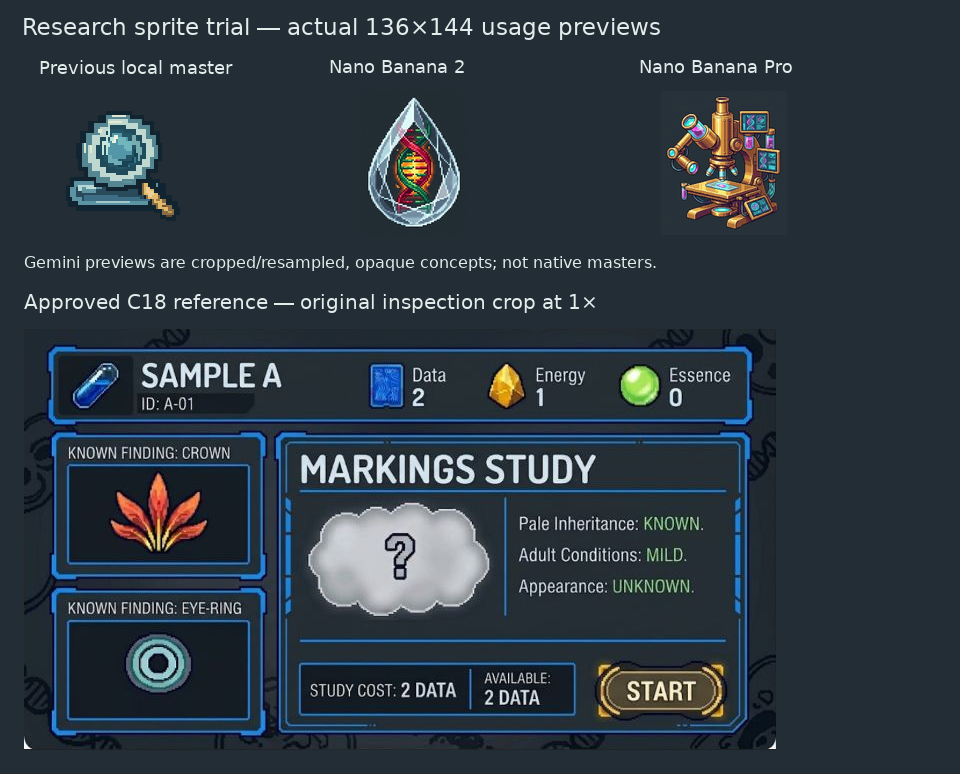

# Research sprite method trial

29 September 2026. Two Gemini browser-generated concepts tested at a 136×144
Research destination footprint. Neither is accepted for native integration.
The existing approved C18 direction remains authoritative.

## Inputs and acquisition

The same conversation received the [C18 inspection crop](../../game-art-proposals/37-lab-extracted-kit/screen-reference.png),
the [populated Overview proof](../exports/overview-populated.png), and the
[production prompt](prompt.txt). The rejected Overview was explicitly a placement
reference, not the intended rendering style.

Chat mode was already **3.1 Pro**. The first image is labelled Nano Banana 2 here
according to Google's documented initial-generation routing, not an exposed
per-response backend identifier. The second used the visible **Redo with Pro**
command. This is a two-output comparison, not a controlled model benchmark.

Both `*-copied.png` files are actual PNG bytes obtained through Gemini's Copy image
control, not screenshots. Each is 1024×559 with entirely opaque alpha. The browser
reported a full-size download, but a local full-size file was not recovered; do not
describe these copies as verified maximum-resolution originals. Original copied
bytes are preserved. Hashes, crop rectangles and preview transformations are in
[inspection.json](inspection.json).

`inspect.cjs` crops rectangular subject bounds and resamples into 136×144 for
honest usage previews. It neither redraws nor removes backgrounds. These are
resampled concepts, **not authored native pixel masters**. Run with the existing
Node/Sharp environment; it also composes the comparison with the unchanged C18
crop and prior local Research export.

## Findings and disposition

- Initial image: clear glass modeling and silhouette, but its droplet overlaps
  Essence's resource identity; the visible DNA content is ambiguous for an empty
  Research destination.
- Pro redo: richer brass and glass, but too many tiny screens, tubes and accessories
  at intended size. It reads as a miniature apparatus scene rather than one clear
  destination symbol, and suggests an examination already in progress.
- Both preserve useful material studies. Neither solves semantic clarity,
  native-size craft or isolated transparent-asset delivery. No production asset,
  game state or renderer was replaced.

Browser production and actual PNG acquisition succeeded twice, so this trial
does **not** justify an API migration. Reference attachments and conversation
history retain context; Git preserves the explicit brief, sources and results.
Cross-session consistency and full-size export remain unproven. API transport
could automate asset/provenance handling, but has not been tested and cannot be
assumed to solve composition, subject choice, pixel craft or transparency.

Use 3.1 Pro as the currently available reasoning mode; no browser reasoning-effort
selector was observed. Pro image generation is worth comparing for material craft,
not automatically preferable for small sprites. A further trial needs a reframed
subject and pixel-production method, not another detail-increasing prompt.

Primary model references: [Gemini Apps image generation](https://support.google.com/gemini/answer/14286560?hl=en-IN),
[image API models](https://ai.google.dev/gemini-api/docs/image-generation?authuser=00),
[API thinking controls](https://ai.google.dev/gemini-api/docs/thinking).
API controls are not evidence of equivalent browser settings.
