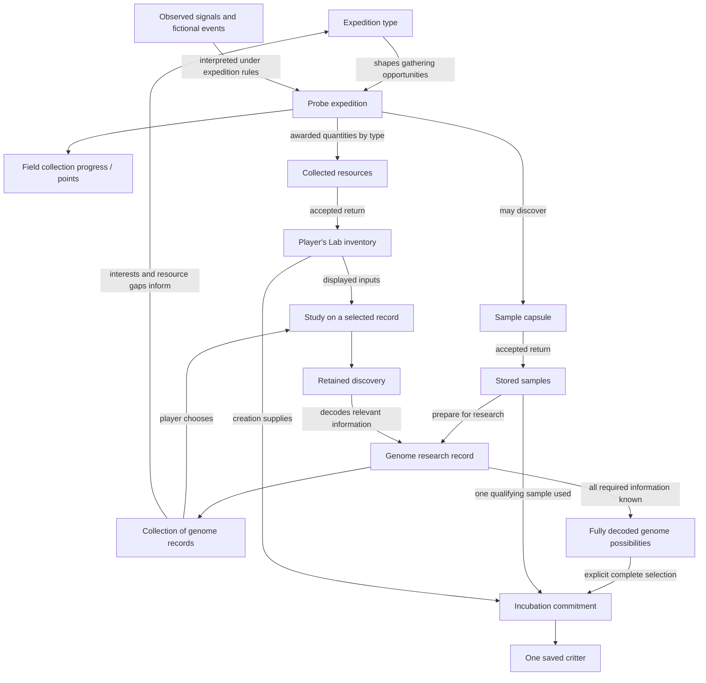

# Research and creation: the connected game model

**Design proposal for owner review.** Accepted foundations come from [gameplay](../specs/gameplay.md), [genetics](../specs/genetics.md), [Probe](../specs/probe.md) and [creation terms](creation-terms.md). The recommended capsule preparation, field-point meaning, example resources/profiles and progression model below are proposals. No numerical economy, final screen, genome encoding or hardware design is approved by this document.

## Current design discussion

Owner selected a very visual child-facing genome map: region selection,
resource-funded experiments, progressive opening and branching expressions.
The [current Probe/bench brief](probe-bench-review.md#current-visual-research-brief)
and [original artwork](references/genome-field/README.md) govern the design work.
Detailed genetics serves deeper parent inspection. Exact encoding, content,
interaction and balance remain provisional; the retained A/B workpiece is an
implementation foundation, not accepted discovery play. The trial below must
not be treated as an instruction to resume paid-question coding.

## Retained discovery trial

Joined game-design, genomics and UX proposal; methods, costs and pacing remain
for owner steering. The current native loop now retains authored A/B findings,
different useful investigation paths and supported forms. Owner playtest still
finds samples too alike and research a checklist; this implementation is not an
accepted discovery experience. The next interaction must make specimen-specific
evidence the main workpiece, with active comparison and meaningful next questions.
Navigation names choices; results, errors and explanations belong beside evidence.
Exact comparison content and rules remain proposals. Accepted requirements remain sample-specific retained
knowledge, complete supported selection, indivisible supplies and deliberate
creation. This proposal explains the next bounded content/interaction proof.

**Play loop:** return with a stable sample → pursue a clue → gain a specific
finding → choose the next useful investigation or resupply → compare supported
possibilities → deliberately create one individual. Lab keeps the same workpiece
across trips; Companion gathers actual whole items; acceptance ends each outing;
Dock reflects the same accepted records. A collection Overview and the selected
sample workbench have distinct subjects. Known findings stay free to inspect.

### A discovery that changes the next question

Sample A has a stable neutral capsule/pattern and origin. It supports exactly two
Pip-proof configurations, `Cc/Rr/Pp/Mm/Ee` and `Cc/Rr/pp/Mm/Ee`, under the pinned
baseline. These configurations are now current versioned native support, not
a hidden already-living creature. No portrait or secret candidate count is
shown before the relevant evidence exists. Full genotype notation stays secondary
to readable feature language.

| Moment | Player purpose and screen response | Retained consequence |
| --- | --- | --- |
| Prepare | Choose between `Read the pattern` and `Trace movement`; preview spends nothing | Reopen this sample's record, not a new specimen |
| Read the pattern | `Pale variation found` / `How it shows is still unknown` | Establish the explicitly validated baseline bundle, crown/ring facts and one pale-variant copy; remaining markings is unresolved |
| Trace movement | `Short bursts supported` / `Less energy for the same action` | Establish movement/efficiency relationship in matched adult, healthy/rested reference conditions; no invented speed or endurance |
| Inspect next question | `Compare the coat` becomes useful; show exact whole-item shortage if needed | Preserve every finding while switching sample or going for supplies |
| Compare the coat | `Plain coat · pale variation carried` versus `Pale markings` | Fully explain both supported alternatives; spending does not grant an arbitrary allele |
| Choose form | Inspect either fully understood supported configuration | Retain a reversible draft; selecting does not spend creation inputs |
| Incubate | Separate review names the selected form, sample and creation supplies; fresh Start commits | Save one parentless founder with exact genome/context/identity and consumed material; research record remains |
| Meet | Deliberately open the already-saved individual | Reveal cannot reroll genes or mint a second birth; retained portrait and identity persist |

The hypothesis “Could that pattern show on a Beecho?” expresses curiosity, not a
quiz or desired answer purchase. A known reference may inspire it but cannot
certify this sample. A carried pale variant must never appear as faint pale
markings in art. Unknown, partly known, established absence, carried/unexpressed,
not applicable and unsupported remain distinct.

### Progression through relationships, not more compulsory clicks

Sample B offers a different relationship using existing rules: supported B1
`Cc/Rr/Pp/mm/Ee` is steady with lower cost for the same walking action; B2
`Cc/Rr/Pp/Mm/ee` is burst-capable with baseline walking cost. Heritage establishes
their common plain/carried-marking facts. Movement reveals capabilities; a
relevant effort comparison resolves their actual pairing. B has no irrelevant
coat follow-up. Picking two appealing findings cannot create an unsupported
third `Mm/Ee` form. A sample whose initial investigations resolve everything
needs no artificial third purchase.

Keep each sample's complete support, content version and evidence arrangement
stable. Vary real configurations, useful methods and relationships before
wording or container color. More complex questions need validated content, not
automatic strength/rarity/XP claims. Introductory two investigations plus a
relevant follow-up is a useful arrangement, not a universal click quota.

An applicable broader comparison can run early if its declared evidence bundle
establishes the same baseline/markings facts. Movement still needs investigation
if unresolved. Omit redundant resolved work rather than charge again. Method
applicability, prerequisites and exact price remain proposed. Deterministic
findings from accepted sample/method come first; assay noise, research failure
and destructive tests are not introduced here.

### Next comparison trial

**Reviewed provisional paper contract; no new native mechanic or visual approval.**
The [generated route/event trial](expedition-map-study/README.md#generated-discovery-trial)
connects to the same accepted sample record. Current `pip-discovery-v1` contains
A/B findings and supported relationships, not measured assay traces or a hidden
answer to align. The accepted Lab procedure performs analysis; the player chooses
which useful question to pursue. A visible reveal explains its accepted result.
There is no interpretation quiz, mandatory wait or added completion click.

#### Primary workpiece: A, a pale possibility with unresolved expression

A useful starting clue exists only after an accepted `heritage` finding: **“Pale variation found. How it shows is still unknown.”** This is a retained finding, not a decorative vial mark interpreted as genetic evidence. The workpiece keeps the same neutral capsule/sample identity and origin, one compact retained-clue caption and one open question. Navigation contains choices; discoveries and shortages appear beside the workpiece.

| Moment | Main workpiece and player choice | Exact disclosure / authority |
| --- | --- | --- |
| Before | Known clue: “Pale variation found.” Open question: **“How could it show?”** No coat swatch or split alternatives yet. Player can choose `Compare the coat` to pursue appearance, or `Trace movement` to pursue movement; preview shows4Essence or4Energy respectively. | Heritage has established baseline/crown/eye-ring references and partial pale variation. Expression, complete supported forms and movement remain unknown unless separately investigated. Nothing is drawn as absent, faintly expressed or locked. Preview/Back spend nothing. |
| During / commit | Cost review preserves the clue and question. A fresh Confirm on displayed `Start · 4 Essence` lets the Lab perform the existing coat comparison. On accepted commit the central question becomes a labeled reference pair, revealed together. | Current domain atomically records the comparison and spends4Essence once. The visible reveal illustrates those newly accepted facts; it does not discover them by alignment, cursor location, player interpretation or animation. There is no paid unfinished puzzle or mandatory wait. Rejection shows the actual shortage/error beside the workpiece and changes no knowledge or stock. |
| After | Heading: **“Coat possibilities · adult · mild reference”**. Two equal, cropped reference-coat panels: **“Plain coat · pale variation carried”** and **“Pale markings · expressed”**. Beneath them: **“Movement still unknown.”** Next useful choice: `Trace movement · 4 Energy`, or return/resupply if short. | This reveals the existing A0/A1 coat relationship only. They are supported reference alternatives from one sample, not two discovered individuals or two predicted finished portraits. Plain/carried has no faint pale markings. No full portrait, complete-genome selection or creation while movement remains unknown. |

Art contract: use an internal coat crop from the retained plain and marked Pip reference masters, omitting eyes, crown, limbs, ventrum/body boundaries and the whole-body silhouette. Both crops share one framing and context, with no separate specimen IDs. Carried variation is stated in text; it is not painted into the unmarked coat. A separate host permission requires validated A heritage and coat findings; it does not grant complete portraits or candidates. Actual LVGL clipping compares source-size and nearest2× views of the same original descriptors. If the crop leaks anatomy or is unintelligible, stop the clip and use truthful text-only or the smaller B relationship proof. New swatch/art reconstruction needs a separate reviewed content decision. No microscope scene, spectrum, waveform, percentages, numeric trait bars or specimen movement performance is authorized by this contract.

Existing controls: Up/Down moves visible investigation/action focus, Confirm previews then fresh Confirm starts, Right may inspect an already-known finding, Back/Left returns while retaining the sample and findings. Both revealed coat panels are visible together; no extra Confirm is required to reveal the second alternative. Inspection, revisits and retry after acceptance are free. Reconciliation uses the same accepted request; reopening never charges again. This bounded workpiece adds no comparison-emphasis state or interpretation action.

If movement was already investigated, the after-frame replaces “Movement still unknown” with **“Supported forms ready to compare.”** Only the complete-knowledge view may expose full supported reference portraits and offer a reversible form draft. The final creation review remains separate and spends its actual sample/supplies only on explicit acceptance. If coat comparison ran first, baseline and movement both remain unknown. Show the established plain/carried versus pale/expressed relationship as text only: no charcoal/cream palette, torso/coat crop, body outline or complete portrait, because baseline coat/ventrum references remain unknown. Use neutral relationship connectors with no biological encoding; the arrangement does not assert a new gene map. Show those next questions. Once heritage establishes the baseline, free inspection can display the retained coat crops without another purchase. A heritage finding learned later must use its resolved copy rather than repeat “How it shows is still unknown.”

#### B contrast: capability does not tell us effort

After B's accepted `movement`, the workpiece clue is **“Steady and burst-capable patterns found. Their energy relationship is unresolved.”** Open question: **“How do these patterns compare in walking effort?”** No lower/baseline tag is attached to either pattern before comparison. A mode badge is a qualitative known capability label, not an observed motion trace.

Player chooses `Compare movement effort · 4 Essence`. Accepted commit reveals two linked text/badge pairs under **“Same walking action · healthy/rested adult · firm ground · mild conditions”**:

- **Steady ↔ lower walking energy**.
- **Burst-capable ↔ baseline walking energy**.

These are categorical fictional reference facts, with no numeric savings, equal distances, timed walking, speed advantage, burst cost or fatigue claim. Keep each pair visibly connected; the display must not suggest combining burst capability and lower walking energy into a third supported form. No full early portraits. Unlike A, B has no pale-marking expression alternative to investigate; its supported adult coat is plain with pale variation carried.

If B heritage is still unknown, after comparison the next specific question is **“What else does this sample carry?”** with `Read the pattern · 4 Data`. If heritage is known, complete forms are available. Comparison establishes everything the separate movement study would establish: a later `Trace movement` is inspectable freely, not a compulsory purchase. This makes B a genuinely different useful path, even though both records reuse the same workpiece structure.

#### Knowledge and review boundary

Use the exact existing findings and evidence masks in `native/shared/pip_genetics.c`.
A needs heritage, movement and coat comparison in any order. B heritage plus effort
comparison resolves all required facts; effort already resolves its movement study,
so buying movement again is unnecessary. Complete required knowledge and disclosed
supported forms still govern creation; changing the view grants nothing.

Game/genomics authored this concrete before/during/after contract against the
existing package. UX/art direction inspected the same corrected artifact and
agreed the shared reference heading, early-comparison text-only boundary, costs,
retention and physical controls. One bounded correction clarified adult/mild
context and prevented a baseline-palette leak. This is content/interaction review,
not a native screen, craft acceptance, human playtest or discovery minigame.
Only two content profiles remain: this framing does not solve long-term repetition.
Before production art, compose the actual known/unknown workpiece at native size
with the retained Gemini-derived masters and inspect the full input journey.

### Genomic acceptance boundary

The worked manifest contains nine baseline-module references, three fixed-locus
references and five variable-locus references. An investigation can establish
several justified entries. Completion requires validated evidence for all
required facts and fully disclosed supported configurations; study count is not
eligibility. Candidate-scoped Pp and pp are separate supported alternatives,
not contradictory facts merged into one genome.

The current native `pip-discovery-v1` package validates these four configurations,
partial pale-variation knowledge and the17-reference manifest. Its accepted
investigation ledger derives established references; only the full required set
plus the supported comparison discloses complete candidates. The older host
`researchCompleteness()` sketch is not the native creation authority. New paper
illustrations cannot establish evidence or mark a sample complete; recognizing Pip
or receiving a familiar reference grants no specimen knowledge.

### One review ledger and next proof

Whole-item arithmetic example only, not approved balance or promised yields:
start4 Data/4 Energy/0 Essence; pattern costs4 Data; movement costs4 Energy;
one actual possible accepted haul adds2/2/4; comparison costs4 Essence;
a later possible haul adds3/3/5; incubation costs5 of each plus A's material.
27 items available equal27 spent. Research completeness and creation affordability
are separate states; neither haul is guaranteed by a route label.

Next bounded proof: native-size composition and a control walkthrough of the
changed A/B workpiece, retained findings, shortage/resupply and early comparison.
Existing supported-form draft and explicit creation remain intact. Observe
whether a person can explain the discovery, choose
a useful next study, distinguish reference from sample, and describe carried
versus expressed. Joy and progression are playtest hypotheses, not established
by agent agreement. New art derives from the retained Gemini/C18 family and
permitted knowledge; do not regenerate whole screens or disclose hidden anatomy.
[Generation authority](../specs/architecture.md#generation-backend-proposal--30-september-2026)
and [audit defects](three-device-playability-audit/README.md) constrain the next
implementation. No service, code, final art or canonical balance is delivered here.

## The experience

### Current correction: return to the same research workpiece

The Home overview is retained. The owner requires two visible device roles,
integer supply counts, understandable expedition differences, a persistent
sample workbench and reliable navigation. The interaction requirements live in
[experience](../specs/experience.md#current-owner-playtest-requirements).
The following is the bounded next prototype design, not implemented behavior
or final content/balance approval.

**Whole journey:** Lab compares an expedition against research needs → Companion
Probe mode carries out that expedition → Companion retains cargo → Lab accepts
one receipt → saved Lab stock updates → the player resumes the same sample,
chooses a study and keeps the finding → supported complete research permits
separate creation/incubation. Selecting another screen or docking transfers nothing.
The caddy remains part of the product; console-only acquisition is removed by owner direction; this
proof does not claim their implementation.

| Surface | What must be visible and actionable |
| --- | --- |
| Lab Home | Saved Lab stock, actual pending received haul, retained research, incubation and residents. Any older Companion information is labeled as received/cached; away activity and carried cargo cannot be inferred from shared simulator state. |
| Lab expedition log | Received completed expedition records and their actual findings/accepted contents. No route selection, live away position, preparation or timer. Cached information is labeled; a log is not a field-control screen. |
| Companion Probe/Cargo | Active expedition, actual observations/progress and owned cargo. Mode changes preserve the current outing. Send stops collection; accepted unloading ends it. Receipt confirms transport; the next outing is a new expedition. Simulator device selection is outside the device face. |
| Lab receipt | Named haul, exact quantities and samples, pending/saved result. Credit once; retries return the same receipt. Fresh Lab acceptance transfers ownership and clears matching carried quantities once; a matching acknowledgment then closes the pending receipt metadata. Lost acknowledgment must not leave spendable copies on both devices. |
| Research overview | Overview entry above the left sample list; collection-wide discoveries, pending work and shared supply needs. It does not borrow the last selected sample's progress as the collection status. |
| Selected sample/workbench | Focusing a sample previews that sample; Confirm enters its retained findings, unresolved question and directed study. Findings change the workpiece, not just a completion counter. |

The workbench uses the accepted directional/workspace/Back/Confirm panel. Up/Down
browse the sample rail; Confirm retains the sample and enters its study/inspection
choices without spending. Up/Down then browse those choices. Back/Left restore the
same rail selection; Right remains read-only detail. Confirm on a study opens its
cost review, then a fresh Confirm commits. Known findings remain freely inspectable.
Identity and valid focus survive workspace/device switching, receipt and reload.

**Discovery interaction remains an open quality boundary.** Current native
`pip-discovery-v1` retains two validated content profiles. A resolves heritage,
movement and coat relationships; B resolves heritage and paired movement/effort,
with effort already establishing movement. The older `pip-proof-v1` five-study
records remain supported legacy content, not the current package description.
The [next comparison trial](#next-comparison-trial) uses these existing facts:
retained clue, useful question, explicit paid procedure, supported reference
comparison and the next unresolved question. Samples Overview remains aggregate;
left sample destinations and Library ordinals preview their exact record in main.
Scientific facts, costs and actions do not occupy navigation. This is inquiry and
explanatory inspection, not a proven discovery minigame. Richer pre-finding evidence
requires an authored content decision; no invented assay, allele or study-count
shortcut may supply it.

Worked decision, without unapproved numbers: Sample A has a retained finding;
Sample B still has an unanswered supported question. The player can spend stock
on A now or choose an expedition opportunity relevant to B's shortage. On receipt,
B is still selected and becomes affordable; A's findings remain intact. The new
study produces a specific supported finding and changes what remains useful to
investigate. A route-specific opportunity must execute in this proof; descriptive
copy over identical outcomes is insufficient. Exact events, probability and
balance remain provisional.

**Whole-resource accounting:** inventory, costs, shortages, transfers and discard use whole items in the same denomination. The native compatibility encoding uses 100 internal units per whole item; it is not player-facing fractional stock. Legacy saves and reserved transfers must recover safely before conversion. Residual legacy values become retained activity preparation, never an awarded item. The authoritative rule is in [gameplay](../specs/gameplay.md#research-collection-and-gathering--accepted); exact native conversion and receipt behavior belong in [architecture](../specs/architecture.md).

The actual native screens must retain C18's illustrated findings, graphite depth,
defined blue edges, dark shadow separation, friendly type and selective warm halo.
Use a compact shared sample identity sprite, consistent finding/reference art,
resource family and reusable frame/focus pieces. A large generic vial, floating
paragraphs and five progress bars do not substitute for that visual system.
Unknown art reveals no result; an identity pattern is not a genomic topology map.
The [screen standard](screen-design-standard.md) remains the visual authority.

The next integrated proof must cover two persistent records, two genuinely
different expedition opportunities, separate Lab/Companion views, interrupted and
retried receipt without loss/duplication, immediate saved-stock/header change,
return to the same research choice, exact integer affordability and reliable
physical-button navigation during timed updates. Capture actual native states
against C18. This establishes a bounded software journey, not final art, fun,
balance, physical transfer or hardware performance.

The accepted [genomic framework](../specs/genetics.md#accepted-framework-layers-and-dimensions) supplies five layers and eleven dimension families. The [worked genetics bridge](../specs/genetics.md#worked-bridge-traits-alleles-research-and-phenotype) connects actual trait examples to locus/allele copies, expression rules, phenotype and lifetime state. Genome zones organize research knowledge about that framework; they do not replace it. Every designed discovery needs this traceability before it becomes screen content.

Return to a workbench with several discoveries in progress. Choose a genome because it interests you and because the materials on your bench let you investigate it. A finding reveals something specific, makes part of its genome understood and changes the next useful experiment. Choose another record or plan an expedition for the materials you need. New capsules add surprises to that collection. Eventually a fully decoded, selected genome can be incubated into an individual.

This is a loop with choice and continuity, not one sample's compulsory linear quest. Expeditions support the collection; the current Lab research record need not travel on the Probe. Unknown regions are undiscovered information, not locks. Being unable to afford a study is an inventory condition, not a genome state.

## Shared vocabulary: packs, units and samples

Current player accounting uses whole **items**, **samples** and capacity counts. Earlier pack/storage conversion language is superseded by the indivisible-item rule. Exact storage limits and resource recipes remain provisional. Resource identities and functions remain in [gathering design](probe-sampling.md#prepared-research-resources--concrete-proposal); baseline, sample and phenotype meanings remain in [genetics](../specs/genetics.md#genome-baseline-collected-sample-and-phenotype--accepted-distinction).

| Term | Meaning across the journey | Example / boundary |
| --- | --- | --- |
| Resource | A type of research supply prepared by the Probe and spent at the Lab | Data cards, Energy prisms and Essence are the selected resource names; not genes or discovered knowledge |
| Pack | One completed, usable quantity of a single resource type | A Data card pack. Not a mixed reward bundle, sample container, physical accessory or extra wrapping to unpack |
| Unit | A measure of quantity or capacity, not another object | One awarded item occupies one resource-storage unit; no player-facing pack conversion is selected. Exact capacity is balance; sensor units such as degrees are unrelated |
| Stock | Packs currently held, counted by resource type | Probe stock becomes Lab stock after accepted transfer; quantities are not duplicated |
| Sample | A particular research source containing unknown genomic information consistent with a baseline and its supported variation | Neither a generic baseline blueprint, an already known phenotype nor a research-supply pack |
| Sample capsule | The identifiable container/presentation holding a sample | Probe acknowledges the capsule without revealing genes or traits. Physical form is undecided; capsule storage is separate from resource-pack capacity |
| Research record | Retained knowledge about that sample | Preparation establishes the record; studies discover genomic information. The record is not the sample and cannot substitute for it at incubation |
| Special find | An expedition object with an authored use outside routine supplies and samples | A rare reference may enable a research method; finding it does not itself decode a genome |

Resources are whole Data cards, Energy crystals and Essence items. Player inventory and prices count those items directly: Data ×2, Cargo 3 /40, Next try in3 sec, and a separate identified sample. Gathering preparation is not an item or an additional contents-per-pack economy.

Collected resources are whole items, fungible within their own class. Time-and-chance preparation toward another award attempt is separate from inventory; it consumes no cargo space and cannot pay research costs or transfer to Lab. [Gameplay](../specs/gameplay.md#research-collection-and-gathering--accepted) owns this accounting rule; [gathering](probe-sampling.md#typed-gathering-pack-thresholds-and-manual-discard) describes its field presentation. Completing an attempt need not award an item. Checking the screen reveals state rather than causing collection. Preserve illustrated resource identity, whole counts and concise activity feedback; expedition time, battery charge, sample discovery and resource attempts must remain distinguishable. Exact rates, probabilities, event boosts, cadence and artwork remain to refine.

Whole journey: **gather whole resources and sometimes collect sample capsules → transfer to the Lab → spend whole items researching a sample → retain discoveries in its research record → incubate a fully decoded, selected genome**. A special find can expand available research methods along that journey.

## Entity and relationship map

Points in this map report field progress; they are not an additional spend arrow into research. Sample discovery and resource awards are separate outputs, not automatic conversions from each other. Lab and Probe are shared physical devices; all these records and inventory remain attributed to the relevant player.

| Thing | What it is / contains | How it relates to the rest |
| --- | --- | --- |
| Probe | Portable executor of a selected expedition; retains activity, collection progress and results | Gathers typed resources and sometimes samples. Does not decode genomes or own the player's research |
| Lab | Workbench for collection, inventory, research and incubation; received expedition log | Shows only field records actually received; shared terminal does not merge profiles or infer away-device state |
| Expedition type | Investigation theme and eligible events; tier requirements govern availability | Selected and played on Companion. Expected mix is not guaranteed yield or a promise of a sample |
| Signals | Sensed observations and separately identified fictional event inputs | Evidence used by expedition rules. Neither spendable materials nor genome zones; no physical sensor per resource/gene |
| Collection points | **Recommended:** expedition-local measure of qualified gathering activity | Explains gathering progress toward declared collection milestones. Not research XP, money, a resource count or gene count. Conversion/rates remain to design |
| Resource type / stack | A defined game material and its available quantity | Requirements on studies/creation refer to types and quantities. Stock is shared across that player's genome records |
| Lab inventory | Accepted typed resource stock plus a separately identifiable sample store | Resources can serve multiple projects; spending on one changes affordability elsewhere, never their retained discoveries |
| Sample capsule | **Recommended:** identifiable in-game container/package holding one sample and its origin | Capsule is the presentation/container; sample is the research material. Physical cartridge, printing, opening mechanism and capsule reuse are undecided |
| Genome in a sample | Hereditary information and supported possibilities still to be discovered | It is neither a living individual nor an already-selected critter. Retain accepted guided-synthesis rules; do not infer a new randomization model from the container |
| Prepared genome research record | Persistent workbench record linked to its source sample, findings and known/unknown information | Player keeps many at once. Selecting/preparing a record does not clone the sample, spend it or create a critter |
| Genome zone | Meaningful area of required information, with links to relevant findings | Can be unknown, partly decoded or decoded. Not automatically a genetic layer, one study, or an allele-sized square |
| Study and finding | A supported investigation with input requirements, followed by sample-specific knowledge | An accepted finding can inform more than one zone or a relation between zones. Repeating it does not reroll or farm rewards |

## From capsule to prepared research

Recommended lifecycle: **collected capsule → received sample → prepared research record → partial discoveries → fully decoded possibilities → selected complete genome → incubation → retained origin and findings**.

Preparation is a deliberate Lab action that establishes the sample on the workbench and creates or reopens its record. Recommend no V1 preparation fee or extra minigame. It may reveal the organization needed to navigate research, but does not decode genetic contents for free. An initial complexity description must reflect known organization; revise it honestly if more relationships become apparent. Do not pretend every hidden detail is known at intake.

The physical capsule and research record are not interchangeable. Subsequent gathering trips bring resources and perhaps other capsules; the prepared sample and accumulated research remain at the Lab. Leaving the bench does not erase findings or consume the remaining sample. Treat selecting an active workpiece separately from committing a study. Recommend no unattended multi-project job scheduler in this first slice; collection breadth does not require parallel execution.

Creation retains the accepted rule: one qualifying sample supports one founder. Research may consume its displayed reagents; explicit accepted incubation uses the qualifying sample and displayed creation inputs. The research record remains as discovery/reference and origin history after material is used. It cannot supply another founder by itself. Preparation/storage consumable policy beyond this default remains open.

## Gathering: choose a useful direction

Expedition types share stable baseline resource yields; their eligible events offer temporary boosts and discoveries. They express a goal rather than require a real geographic trip or rare sensor condition. The player may prioritize a scarce reagent, replenish general stock or look for more samples. A selected record's resource shortage is helpful context, not a binding quest that reserves all rewards for that record.

The Probe's primary view shows the expedition, current gathering progress and actual typed awards. Sample finds appear separately as capsules with neutral identity/origin. Collection points can explain how an expedition is progressing, but only explicit award rules produce resource units or a capsule. Never add the points and item quantities or imply every completed bar creates a sample. Sensor-invalid periods, fictional event contributions and interrupted expeditions need honest retained state; exact scoring/thresholds remain an implementation dependency.

Return deliberately credits each result once to the player's Lab. The Lab can then surface which existing studies are newly affordable and which new capsules await preparation. A resupply run need not add a new genome. An expedition can supply several records, and a new capsule need not be researched immediately.

## Research: choose what to discover with what you have

At the bench, compare partially decoded records by identity, discoveries, visible complexity and available work. All remain accessible when supplies are scarce. For a chosen study, show required resource types, available amounts and the shortfall before commitment. Selecting a record or previewing a study spends nothing. Accepted spending/results must follow the operation boundary; uncertain delivery checks the same operation rather than submitting another.

A meaningful finding establishes a hereditary fact and explains its consequence: for example, a markings study identifies Pp, so the pale-marking allele is carried but does not express under the defined rule; a later movement study resolves how drive and efficiency variants jointly affect action cost. See the worked genetics bridge for exact proposed allele rules. One zone may need several findings and one finding may inform several traits. Resources enable the study; they do not install alleles. Avoid equating investigation categories with genomic layers or mechanically requiring one expedition per zone.

The accepted introductory two-study/conditional-follow-up structure remains a small example, not a universal quota. A known useful comparison may be attempted earlier with supported inputs. Existing knowledge guides work but does not automatically complete another sample. Material studies remain V1 placeholders; final release requires broader meaningful study types.

### Player-facing genetics abstraction — proposed projection

**Accepted foundations:** research discovers sample-specific information; it does not install or let the player choose alleles. Unknown is different from absent, and an inherited possibility is different from an expressed feature. Expression depends on declared rules and reference conditions. All required genomic information must still be resolved before selecting a supported complete genome for incubation.

**Proposed player view:** organize inspection around recognizable features and research topics such as markings or movement effort, not a map of loci. A topic is a way to find and interpret research; it is not a locus, a quiz question or a promise of the result. Before commitment, show the study's purpose, resource cost and available stock. Players choose a record, study topic and gathering direction; they do not choose an allele or desired outcome. After acceptance, retain the finding with the sample and explain the inherited fact, its expression as a feature under a named reference context, and any relevant unresolved information. If expression is unresolved, show it as unknown rather than absent. A generic feature illustration is a topic/reference image, not the sample's portrait or a prediction.

Keep the full [five-layer model](../specs/genetics.md#accepted-framework-layers-and-dimensions) under the interface: body-plan applicability; inherited sample facts and evidence; expression/development rules and context; resolved reference phenotype; and individual lifetime state/history. The research record overlays what is known about the sample; it is not another genome layer. Player-facing topics and features are views into that model, not one-to-one aliases for traits, loci or studies. Authored content records their many-to-many relations explicitly; the interface must not imply genome topology with invented edges or define completeness by counting visible features. Unknown information, resources needed to research it, and information that does not apply remain distinct. The engine determines required information, supported configurations, research completeness and incubation eligibility; selecting a complete supported genome and committing incubation stay explicit steps. Progression can add meaningful relationships among findings and features, not just more visible regions.

**Worked projection using existing examples:** before Sample A's markings study, a pale-marking variant is known in the sample while other inheritance information and the adult-reference appearance remain unknown. The player chooses the study by its purpose and displayed cost, not to answer a quiz. Once accepted, the existing worked result Pp is retained as an inherited finding; under the adult, mild-condition reference it predicts no pale markings, while the pale variant remains heritable. In the proposed Sample B movement example, the drive finding establishes whether burst movement is supported; a separate efficiency finding explains the energy cost of that same action. One player-facing movement-energy relationship therefore uses both findings. These costs and the movement example remain illustrative proposals, not balance or canonical content.

Whether technical genotype notation such as Pp appears in a secondary player view remains open: showing it could support players who want explicit inheritance detail, while hiding it keeps routine discovery in feature language. The core feature explanation, meaningful topic choice and retained research must work without requiring that notation.

## Worked collection: three records, two more expeditions

**Illustrative content and numbers only.** These records already contain findings from earlier play; the example is not a two-expedition minimum from acquisition to completion. Resource names describe game items, not real sensor measurements or final science.

- **Sample A / markings:** introductory record, most required information already established. One p copy is known; the other is unknown. Its remaining comparison needs **2 Data card packs**, establishes Pp and explains why pale markings are carried but not expressed.
- **Sample B / movement:** more interdependent research. A drive study needs **2 Energy prism packs** and establishes Mm; a subsequent efficiency comparison needs **1 Data card pack + 1 Essence pack** and establishes Ee, explaining reduced action energy cost for the supported burst capability. Earlier findings cover the worked candidate's other requirements.
- **Sample C / crown:** another partly decoded record. Its useful next comparison needs **1 Essence pack** to distinguish the second crown allele; more required information remains afterward.

The corresponding allele/expression rules are in the worked genetics bridge. The ledger assumes all other required information for A/B's authored example has already been established; it is not a production-complete trait set or permission to ignore unmodeled families. Resource names/costs are placeholders, with no literal implication that Energy prism packs creates a light or movement gene.

| Choice / result | Data card packs | Energy prism packs | Essence pack | Collection consequence |
| --- | ---: | ---: | ---: | --- |
| Start with retained stock | 2 | 1 | 0 | A affordable; B short1 Energy prism packs; C short1 Essence pack |
| Choose Weather research; illustrative return +1 Data card pack, +2 Energy prism packs and capsule D | 3 | 3 | 0 | B becomes affordable; D may wait unprepared |
| Study B, spend2 Energy prism packs | 3 | 1 | 0 | Mm drive pair established; efficiency contribution still unknown |
| Use existing stock to finish A, spend2 Data card packs | 1 | 1 | 0 | Pp established: pale variant carried, no pale markings expressed; assumed remaining completeness met |
| Choose General survey; illustrative return +1 Data card pack, +1 Essence pack, no capsule | 2 | 1 | 1 | Both B and C now have an affordable comparison, but share one Essence pack |
| Choose B's comparison, spend1 Data card pack +1 Essence pack | 1 | 1 | 0 | Ee efficiency contribution established; assumed remaining completeness met. C retains knowledge but needs Essence pack |

Weather research may offer an Energy boost event; General survey offers calmer mixed opportunities. These returns are one authored example, not promises. Per-resource progress accounts for collection within each expedition and are deliberately not counted as Lab stock or automatically applied to B's research.

The interesting choice is visible: finish A now, pursue the intriguing B, or spend the scarce Essence pack exploring C. Gathering and spending alter opportunities across the whole collection. Complexity does not force the player to abandon simpler records. D brings a future discovery rather than an obligation.

## Progression with purpose

Recommend progression by expanding what the player understands and can undertake: simpler relationships and fewer resource demands introduce the loop; later samples add interdependent zones, varied study requirements and more consequential choices among supported outcomes. A discovery may make a previously obscure comparison understandable. Growing inventory knowledge and later equipment/chips widen research options under the existing game direction.

Do not use unknown regions as level locks. Distinguish **knowledge** (what this record establishes), **means** (resources/capabilities to run a study), and **complexity** (the information/relationships to understand). Rarity, strength, cost and visual density are separate. Exact access gates, pacing, content ladder and equipment benefits remain open; no XP-level system is proposed here. A more complex genome must offer a meaningful discovery payoff, not merely more repetitions. Existing individuals never become incomplete when later content grows.

Companion owns field acquisition in the current three-device loop. The Lab researches accepted samples and uses accepted whole resources; it does not duplicate expedition selection or field play. Earlier console-only acquisition proposals are superseded. The proposed [map exploration study](probe-sampling.md#generated-field-loop--owner-review-proposal) connects field choices to research needs without claiming a particular resource or sample is guaranteed.

## Workbench experience and hardware consequences

| Player intent | Object and visible response | Existing input / hardware implication |
| --- | --- | --- |
| Choose what to work on | Collection previews the actual genome record, discoveries and affordable studies; chosen workpiece becomes central | Lab rotation previews; Confirm opens; Back restores collection focus |
| Inspect a zone | Show its partial structure/known relationships with unknown portions, plus relevant findings; no padlock or generic green completion grid | Rotate through meaningful targets, Confirm inspect; monochrome-safe known/unknown distinctions |
| Run research | Bring the sample, chosen study and actual reagents into a cost review; pending work stays distinct from an accepted discovery | Existing Confirm commits, Back leaves a review; feedback must remain legible without animation or touch |
| Plan gathering | Compare expedition opportunities against retained inventory gaps and collection interests | Companion selects and plays; locally available content supports play without a phone. Lab has received records only |
| Gather and return | Typed awards, field preparation and capsule finds remain distinct; receipt changes Lab availability once | Existing Companion directions, Confirm and Back; persistent expedition state. Proposed map interactions require owner review before implementation |
| Prepare incubation | Complete supported genome, source sample and required materials together | Lab explicit review/commit; physical placement/display/printing remain later engineering design |

Concise candidate language: **Unknown**, **Partly decoded**, **Decoded**, **Data card packs 2 / Needs 3**, **Pale variant carried**, **Crown present**, **New capsule**, **Prepare**, **Compare**, **Incubate**. These label objects and discoveries backed by the worked genotype/phenotype rules. The visual work must supply the relationships instead of explaining the whole process in paragraphs on the device. Keep the small specimen identity, give the research object a meaningful workbench presence, and use selected refinement-02 vocabulary. Do not copy the previous bare grid/layout.

Genome zones need a dedicated visual example with an actual before/after discovery, relation between zones, carried-versus-expressed knowledge and unknown information. Unknown areas should feel unexplored rather than disabled. No final morphology, mapping or screen layout is selected here.

## Review and next artifact

The proposed defaults to steer as one coherent model are: capsule preparation creates/reopens a persistent record without a V1 fee; field points explain gathering rather than becoming research currency; expedition profiles shape optional events while baseline resource yields stay stable. Physical capsule form, exact yield/balance and final terminology remain open. Owner need not specify all resource recipes or interface details.

Pip is the [accepted qualitative phenotype reference](../specs/genetics.md#pip-accepted-worked-phenotype-reference). The [completed bounded proof](../prototype/genetics/report.md) demonstrates its baseline, locus/allele definitions, expression and validation. These hereditary facts now support the [collection-to-discovery workbench study](genome-workbench/README.md). The locus library and LLM-assisted authoring direction are described in genetics; no complete tool suite or production service is implied.

The current workbench/collection study uses that coherent content, shared inventory and a meaningful zone discovery through existing controls. Expedition selection remains context rather than a completed Probe composition. Include a small-versus-more-complex genome comparison with a reason the complexity is interesting. Review visual composition before functional implementation. Do not produce another full screen catalogue first.

Acceptance questions for that study: can a player identify what is unknown, choose between two useful affordable studies, explain why an expedition helps, see how one spend affects another record, recognize what a finding actually revealed and distinguish research completeness from incubation eligibility? Use observed human evidence later; this paper model and arithmetic do not establish fun or balance.
