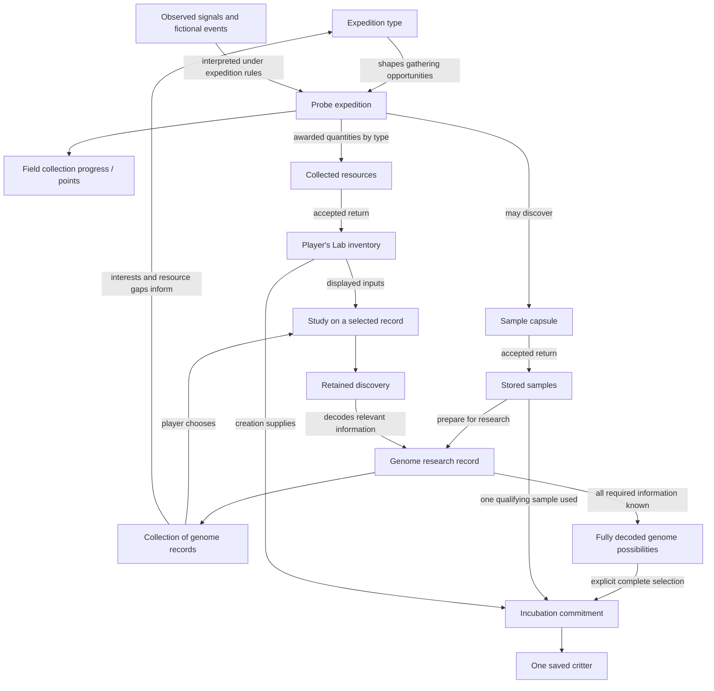

# Research and creation: the connected game model

**Design proposal for owner review.** Accepted foundations come from [gameplay](../specs/gameplay.md), [genetics](../specs/genetics.md), [Probe](../specs/probe.md) and [creation terms](creation-terms.md). The recommended capsule preparation, field-point meaning, example resources/profiles and progression model below are proposals. No numerical economy, final screen, genome encoding or hardware design is approved by this document.

## The experience

### Current correction: return to the same research workpiece

The Home overview is retained. The owner requires two visible device roles,
integer supply counts, understandable expedition differences, a persistent
sample workbench and reliable navigation. The interaction requirements live in
[experience](../specs/experience.md#current-owner-playtest-requirements).
The following is the bounded next prototype design, not implemented behavior
or final content/balance approval.

**Whole journey:** Lab compares an expedition against research needs → Companion
Probe mode carries out that expedition → Companion retains cargo → Lab accepts
one receipt → saved Lab stock updates → the player resumes the same sample,
chooses a study and keeps the finding → supported complete research permits
separate creation/incubation. Selecting another screen or docking transfers nothing.
The caddy and console-only acquisition remain part of the wider product; this
proof does not claim their implementation.

| Surface | What must be visible and actionable |
| --- | --- |
| Lab Home | Saved Lab stock, Companion activity/awaiting receipt, retained research, incubation and residents. Carried cargo is separate from spendable stock. |
| Lab Explore | Shared baseline gathering, each expedition's distinct possible opportunity, and relevant supply needs. A route cannot promise a genotype or merely rename identical behavior. |
| Companion Probe/Cargo | Active expedition, actual observations/progress and owned cargo. Mode changes preserve activity; return/receipt states are explicit. Simulator device selection is outside the device face. |
| Lab receipt | Named haul, exact quantities and samples, pending/saved result. Credit once; retries return the same receipt. Companion clears only the acknowledged matching haul. |
| Research workbench | Pending samples at left; the retained sample's established findings, unresolved question and directed study together. Findings change the workpiece, not just a completion counter. |

The workbench uses the accepted directional/workspace/Back/Confirm panel. Up/Down
browse the sample rail; Confirm retains the sample and enters its study/inspection
choices without spending. Up/Down then browse those choices. Back/Left restore the
same rail selection; Right remains read-only detail. Confirm on a study opens its
cost review, then a fresh Confirm commits. Known findings remain freely inspectable.
Identity and valid focus survive workspace/device switching, receipt and reload.

**Discovery content is the missing dependency.** Current native `pip-proof-v1`
gives every sample the same five studies and the same two candidate genomes.
Only markings distinguishes those candidates; both share movement. Per-sample
study bits persist, but this is not yet the intended progressive discovery model.
New copy must not claim a distinct movement clue that this content cannot support.
The smallest content experiment uses the existing supported markings distinction,
two authored cache/evidence scenarios, two initial study choices and a follow-up
only when it resolves a remaining uncertainty. Define and version the facts each
study establishes, supported configurations and required completeness before coding.
Do not waive required genomic information to shorten the visible checklist or
invent new alleles/species merely to make two records look different.

Worked decision, without unapproved numbers: Sample A has a retained finding;
Sample B still has an unanswered supported question. The player can spend stock
on A now or choose an expedition opportunity relevant to B's shortage. On receipt,
B is still selected and becomes affordable; A's findings remain intact. The new
study produces a specific supported finding and changes what remains useful to
investigate. A route-specific opportunity must execute in this proof; descriptive
copy over identical outcomes is insufficient. Exact events, probability and
balance remain provisional.

**Integer presentation experiment:** preserve existing saved arithmetic while
displaying one supply unit per 100 internal units. Current recipe costs 400/500
then read 4/5; 1,320 held reads 13 with a separate 20% next-unit progress indicator.
Affordability stays exact for existing costs, all multiples of 100. No remainder
is lost or rounded up. A legacy pack remains 1,000 internal units (10 displayed
supply units), and its storage unit is not silently renamed. This is a provisional
display denomination, not an approved new pack economy. Apply one denomination
to stock, cargo, cost, shortage and discard; reconcile permanent terminology and
future nonmultiple costs before promoting it beyond the prototype.

The actual native screens must retain C18's illustrated findings, graphite depth,
defined blue edges, dark shadow separation, friendly type and selective warm halo.
Use a compact shared sample identity sprite, consistent finding/reference art,
resource family and reusable frame/focus pieces. A large generic vial, floating
paragraphs and five progress bars do not substitute for that visual system.
Unknown art reveals no result; an identity pattern is not a genomic topology map.
The [screen standard](screen-design-standard.md) remains the visual authority.

The next integrated proof must cover two persistent records, two genuinely
different expedition opportunities, separate Lab/Companion views, interrupted and
retried receipt without loss/duplication, immediate saved-stock/header change,
return to the same research choice, exact integer affordability and reliable
physical-button navigation during timed updates. Capture actual native states
against C18. This establishes a bounded software journey, not final art, fun,
balance, physical transfer or hardware performance.

The accepted [genomic framework](../specs/genetics.md#accepted-framework-layers-and-dimensions) supplies five layers and eleven dimension families. The [worked genetics bridge](../specs/genetics.md#worked-bridge-traits-alleles-research-and-phenotype) connects actual trait examples to locus/allele copies, expression rules, phenotype and lifetime state. Genome zones organize research knowledge about that framework; they do not replace it. Every designed discovery needs this traceability before it becomes screen content.

Return to a workbench with several discoveries in progress. Choose a genome because it interests you and because the materials on your bench let you investigate it. A finding reveals something specific, makes part of its genome understood and changes the next useful experiment. Choose another record or plan an expedition for the materials you need. New capsules add surprises to that collection. Eventually a fully decoded, selected genome can be incubated into an individual.

This is a loop with choice and continuity, not one sample's compulsory linear quest. Expeditions support the collection; the current Lab research record need not travel on the Probe. Unknown regions are undiscovered information, not locks. Being unable to afford a study is an inventory condition, not a genome state.

## Shared vocabulary: packs, units and samples

Owner favors **pack**, **sample** and **unit**. The owner accepted these definitions and one-pack/one-resource-storage-unit accounting. Exact storage limits and resource recipes remain provisional. Resource identities and functions remain in [gathering design](probe-sampling.md#prepared-research-resources--concrete-proposal); baseline, sample and phenotype meanings remain in [genetics](../specs/genetics.md#genome-baseline-collected-sample-and-phenotype--accepted-distinction).

| Term | Meaning across the journey | Example / boundary |
| --- | --- | --- |
| Resource | A type of research supply prepared by the Probe and spent at the Lab | Data cards, Energy prisms and Essence are the selected resource names; not genes or discovered knowledge |
| Pack | One completed, usable quantity of a single resource type | A Data card pack. Not a mixed reward bundle, sample container, physical accessory or extra wrapping to unpack |
| Unit | A measure of quantity or capacity, not another object | One pack occupies one resource-storage unit. Exact capacity is balance; sensor units such as degrees are unrelated |
| Stock | Packs currently held, counted by resource type | Probe stock becomes Lab stock after accepted transfer; quantities are not duplicated |
| Sample | A particular research source containing unknown genomic information consistent with a baseline and its supported variation | Neither a generic baseline blueprint, an already known phenotype nor a research-supply pack |
| Sample capsule | The identifiable container/presentation holding a sample | Probe acknowledges the capsule without revealing genes or traits. Physical form is undecided; capsule storage is separate from resource-pack capacity |
| Research record | Retained knowledge about that sample | Preparation establishes the record; studies discover genomic information. The record is not the sample and cannot substitute for it at incubation |
| Special find | An expedition object with an authored use outside routine supplies and samples | A rare reference may enable a research method; finding it does not itself decode a genome |

Player copy should name the thing, with **unit** reserved for explaining storage/accounting. Example: **“3 packs ready”**, **“Storage 3 / 4”**, **“Next pack 65%”**, and a separate **“1 sample capsule”**. A study costs **“2 Data card packs”**; compact inventory rows can use **“Data cards ×2”** under a clearly labeled pack count. Existing illustrative resource recipes count packs, not an additional contents-per-pack economy.

Each resource accumulates toward its own pack threshold; preparation percentages must identify the resource. All expeditions share baseline resource yields; expedition-specific events may temporarily boost one resource. The [V1 expedition/event/risk framework](probe-sampling.md#v1-expeditions-events-and-risk) owns this distinction. There are no filters or automatic rejection: the player manually discards unwanted cargo. Accepted fractional-capacity accounting and discard quantities are defined in [gathering](probe-sampling.md#typed-gathering-pack-thresholds-and-manual-discard). Preparation percentage measures qualified work toward a pack; it is not occupied storage, expedition completion, a chance of a capsule, genetic decoding or battery charge. Checking the screen reveals progress rather than causing it. Preserve the original Probe concept's illustrated contents, ready count and compact bar; distinguish stored quantities from preparation progress and explicitly label charging when docked. Rates, display cadence, fullness/end conditions and container artwork remain to refine; the current single-bar Probe study needs adaptation for simultaneous typed progress.

Whole journey: **gather → prepare resource packs and sometimes collect sample capsules → transfer to the Lab → spend packs researching a sample → retain discoveries in its research record → incubate a fully decoded, selected genome**. A special find can expand available research methods along that journey.

## Entity and relationship map

Points in this map report field progress; they are not an additional spend arrow into research. Sample discovery and resource awards are separate outputs, not automatic conversions from each other. Lab and Probe are shared physical devices; all these records and inventory remain attributed to the relevant player.

| Thing | What it is / contains | How it relates to the rest |
| --- | --- | --- |
| Probe | Portable executor of a selected expedition; retains activity, collection progress and results | Gathers typed resources and sometimes samples. Does not decode genomes or own the player's research |
| Lab | Workbench for collection, inventory, research, expedition planning and incubation | Makes player choices and their consequences visible; shared terminal does not merge profiles |
| Expedition type | Investigation theme and eligible events; tier requirements govern availability | Selected at Lab, shapes opportunities on Probe. Expected mix is not guaranteed yield or a promise of a sample |
| Signals | Sensed observations and separately identified fictional event inputs | Evidence used by expedition rules. Neither spendable materials nor genome zones; no physical sensor per resource/gene |
| Collection points | **Recommended:** expedition-local measure of qualified gathering activity | Explains gathering progress toward declared collection milestones. Not research XP, money, a resource count or gene count. Conversion/rates remain to design |
| Resource type / stack | A defined game material and its available quantity | Requirements on studies/creation refer to types and quantities. Stock is shared across that player's genome records |
| Lab inventory | Accepted typed resource stock plus a separately identifiable sample store | Resources can serve multiple projects; spending on one changes affordability elsewhere, never their retained discoveries |
| Sample capsule | **Recommended:** identifiable in-game container/package holding one sample and its origin | Capsule is the presentation/container; sample is the research material. Physical cartridge, printing, opening mechanism and capsule reuse are undecided |
| Genome in a sample | Hereditary information and supported possibilities still to be discovered | It is neither a living individual nor an already-selected critter. Retain accepted guided-synthesis rules; do not infer a new randomization model from the container |
| Prepared genome research record | Persistent workbench record linked to its source sample, findings and known/unknown information | Player keeps many at once. Selecting/preparing a record does not clone the sample, spend it or create a critter |
| Genome zone | Meaningful area of required information, with links to relevant findings | Can be unknown, partly decoded or decoded. Not automatically a genetic layer, one study, or an allele-sized square |
| Study and finding | A supported investigation with input requirements, followed by sample-specific knowledge | An accepted finding can inform more than one zone or a relation between zones. Repeating it does not reroll or farm rewards |

## From capsule to prepared research

Recommended lifecycle: **collected capsule → received sample → prepared research record → partial discoveries → fully decoded possibilities → selected complete genome → incubation → retained origin and findings**.

Preparation is a deliberate Lab action that establishes the sample on the workbench and creates or reopens its record. Recommend no V1 preparation fee or extra minigame. It may reveal the organization needed to navigate research, but does not decode genetic contents for free. An initial complexity description must reflect known organization; revise it honestly if more relationships become apparent. Do not pretend every hidden detail is known at intake.

The physical capsule and research record are not interchangeable. Subsequent gathering trips bring resources and perhaps other capsules; the prepared sample and accumulated research remain at the Lab. Leaving the bench does not erase findings or consume the remaining sample. Treat selecting an active workpiece separately from committing a study. Recommend no unattended multi-project job scheduler in this first slice; collection breadth does not require parallel execution.

Creation retains the accepted rule: one qualifying sample supports one founder. Research may consume its displayed reagents; explicit accepted incubation uses the qualifying sample and displayed creation inputs. The research record remains as discovery/reference and origin history after material is used. It cannot supply another founder by itself. Preparation/storage consumable policy beyond this default remains open.

## Gathering: choose a useful direction

Expedition types share stable baseline resource yields; their eligible events offer temporary boosts and discoveries. They express a goal rather than require a real geographic trip or rare sensor condition. The player may prioritize a scarce reagent, replenish general stock or look for more samples. A selected record's resource shortage is helpful context, not a binding quest that reserves all rewards for that record.

The Probe's primary view shows the expedition, current gathering progress and actual typed awards. Sample finds appear separately as capsules with neutral identity/origin. Collection points can explain how an expedition is progressing, but only explicit award rules produce resource units or a capsule. Never add the points and item quantities or imply every completed bar creates a sample. Sensor-invalid periods, fictional event contributions and interrupted expeditions need honest retained state; exact scoring/thresholds remain an implementation dependency.

Return deliberately credits each result once to the player's Lab. The Lab can then surface which existing studies are newly affordable and which new capsules await preparation. A resupply run need not add a new genome. An expedition can supply several records, and a new capsule need not be researched immediately.

## Research: choose what to discover with what you have

At the bench, compare partially decoded records by identity, discoveries, visible complexity and available work. All remain accessible when supplies are scarce. For a chosen study, show required resource types, available amounts and the shortfall before commitment. Selecting a record or previewing a study spends nothing. Accepted spending/results must follow the operation boundary; uncertain delivery checks the same operation rather than submitting another.

A meaningful finding establishes a hereditary fact and explains its consequence: for example, a markings study identifies Pp, so the pale-marking allele is carried but does not express under the defined rule; a later movement study resolves how drive and efficiency variants jointly affect action cost. See the worked genetics bridge for exact proposed allele rules. One zone may need several findings and one finding may inform several traits. Resources enable the study; they do not install alleles. Avoid equating investigation categories with genomic layers or mechanically requiring one expedition per zone.

The accepted introductory two-study/conditional-follow-up structure remains a small example, not a universal quota. A known useful comparison may be attempted earlier with supported inputs. Existing knowledge guides work but does not automatically complete another sample. Material studies remain V1 placeholders; final release requires broader meaningful study types.

### Player-facing genetics abstraction — proposed projection

**Accepted foundations:** research discovers sample-specific information; it does not install or let the player choose alleles. Unknown is different from absent, and an inherited possibility is different from an expressed feature. Expression depends on declared rules and reference conditions. All required genomic information must still be resolved before selecting a supported complete genome for incubation.

**Proposed player view:** organize inspection around recognizable features and research topics such as markings or movement effort, not a map of loci. A topic is a way to find and interpret research; it is not a locus, a quiz question or a promise of the result. Before commitment, show the study's purpose, resource cost and available stock. Players choose a record, study topic and gathering direction; they do not choose an allele or desired outcome. After acceptance, retain the finding with the sample and explain the inherited fact, its expression as a feature under a named reference context, and any relevant unresolved information. If expression is unresolved, show it as unknown rather than absent. A generic feature illustration is a topic/reference image, not the sample's portrait or a prediction.

Keep the full [five-layer model](../specs/genetics.md#accepted-framework-layers-and-dimensions) under the interface: body-plan applicability; inherited sample facts and evidence; expression/development rules and context; resolved reference phenotype; and individual lifetime state/history. The research record overlays what is known about the sample; it is not another genome layer. Player-facing topics and features are views into that model, not one-to-one aliases for traits, loci or studies. Authored content records their many-to-many relations explicitly; the interface must not imply genome topology with invented edges or define completeness by counting visible features. Unknown information, resources needed to research it, and information that does not apply remain distinct. The engine determines required information, supported configurations, research completeness and incubation eligibility; selecting a complete supported genome and committing incubation stay explicit steps. Progression can add meaningful relationships among findings and features, not just more visible regions.

**Worked projection using existing examples:** before Sample A's markings study, a pale-marking variant is known in the sample while other inheritance information and the adult-reference appearance remain unknown. The player chooses the study by its purpose and displayed cost, not to answer a quiz. Once accepted, the existing worked result Pp is retained as an inherited finding; under the adult, mild-condition reference it predicts no pale markings, while the pale variant remains heritable. In the proposed Sample B movement example, the drive finding establishes whether burst movement is supported; a separate efficiency finding explains the energy cost of that same action. One player-facing movement-energy relationship therefore uses both findings. These costs and the movement example remain illustrative proposals, not balance or canonical content.

Whether technical genotype notation such as Pp appears in a secondary player view remains open: showing it could support players who want explicit inheritance detail, while hiding it keeps routine discovery in feature language. The core feature explanation, meaningful topic choice and retained research must work without requiring that notation.

## Worked collection: three records, two more expeditions

**Illustrative content and numbers only.** These records already contain findings from earlier play; the example is not a two-expedition minimum from acquisition to completion. Resource names describe game items, not real sensor measurements or final science.

- **Sample A / markings:** introductory record, most required information already established. One p copy is known; the other is unknown. Its remaining comparison needs **2 Data card packs**, establishes Pp and explains why pale markings are carried but not expressed.
- **Sample B / movement:** more interdependent research. A drive study needs **2 Energy prism packs** and establishes Mm; a subsequent efficiency comparison needs **1 Data card pack + 1 Essence pack** and establishes Ee, explaining reduced action energy cost for the supported burst capability. Earlier findings cover the worked candidate's other requirements.
- **Sample C / crown:** another partly decoded record. Its useful next comparison needs **1 Essence pack** to distinguish the second crown allele; more required information remains afterward.

The corresponding allele/expression rules are in the worked genetics bridge. The ledger assumes all other required information for A/B's authored example has already been established; it is not a production-complete trait set or permission to ignore unmodeled families. Resource names/costs are placeholders, with no literal implication that Energy prism packs creates a light or movement gene.

| Choice / result | Data card packs | Energy prism packs | Essence pack | Collection consequence |
| --- | ---: | ---: | ---: | --- |
| Start with retained stock | 2 | 1 | 0 | A affordable; B short1 Energy prism packs; C short1 Essence pack |
| Choose Weather research; illustrative return +1 Data card pack, +2 Energy prism packs and capsule D | 3 | 3 | 0 | B becomes affordable; D may wait unprepared |
| Study B, spend2 Energy prism packs | 3 | 1 | 0 | Mm drive pair established; efficiency contribution still unknown |
| Use existing stock to finish A, spend2 Data card packs | 1 | 1 | 0 | Pp established: pale variant carried, no pale markings expressed; assumed remaining completeness met |
| Choose General survey; illustrative return +1 Data card pack, +1 Essence pack, no capsule | 2 | 1 | 1 | Both B and C now have an affordable comparison, but share one Essence pack |
| Choose B's comparison, spend1 Data card pack +1 Essence pack | 1 | 1 | 0 | Ee efficiency contribution established; assumed remaining completeness met. C retains knowledge but needs Essence pack |

Weather research may offer an Energy boost event; General survey offers calmer mixed opportunities. These returns are one authored example, not promises. Per-resource progress accounts for collection within each expedition and are deliberately not counted as Lab stock or automatically applied to B's research.

The interesting choice is visible: finish A now, pursue the intriguing B, or spend the scarce Essence pack exploring C. Gathering and spending alter opportunities across the whole collection. Complexity does not force the player to abandon simpler records. D brings a future discovery rather than an obligation.

## Progression with purpose

Recommend progression by expanding what the player understands and can undertake: simpler relationships and fewer resource demands introduce the loop; later samples add interdependent zones, varied study requirements and more consequential choices among supported outcomes. A discovery may make a previously obscure comparison understandable. Growing inventory knowledge and later equipment/chips widen research options under the existing game direction.

Do not use unknown regions as level locks. Distinguish **knowledge** (what this record establishes), **means** (resources/capabilities to run a study), and **complexity** (the information/relationships to understand). Rarity, strength, cost and visual density are separate. Exact access gates, pacing, content ladder and equipment benefits remain open; no XP-level system is proposed here. A more complex genome must offer a meaningful discovery payoff, not merely more repetitions. Existing individuals never become incomplete when later content grows.

Console-only play retains equivalent access to samples and necessary resource types through Lab acquisition/crafting/investigation. The exact route needs its own worked example; avoid quietly making any essential type or whole family Probe-exclusive.

## Workbench experience and hardware consequences

| Player intent | Object and visible response | Existing input / hardware implication |
| --- | --- | --- |
| Choose what to work on | Collection previews the actual genome record, discoveries and affordable studies; chosen workpiece becomes central | Lab rotation previews; Confirm opens; Back restores collection focus |
| Inspect a zone | Show its partial structure/known relationships with unknown portions, plus relevant findings; no padlock or generic green completion grid | Rotate through meaningful targets, Confirm inspect; monochrome-safe known/unknown distinctions |
| Run research | Bring the sample, chosen study and actual reagents into a cost review; pending work stays distinct from an accepted discovery | Existing Confirm commits, Back leaves a review; feedback must remain legible without animation or touch |
| Plan gathering | Compare expedition events and discovery opportunities against inventory gaps and collection interests | Lab controls select profile; Probe receives enough content to operate without a phone |
| Gather and return | Typed awards, field progress and capsule finds remain distinct; receipt changes Lab availability once | Probe Next/Confirm with visible focus; persistent expedition state; no sensor per item or invented capsule mechanism |
| Prepare incubation | Complete supported genome, source sample and required materials together | Lab explicit review/commit; physical placement/display/printing remain later engineering design |

Concise candidate language: **Unknown**, **Partly decoded**, **Decoded**, **Data card packs 2 / Needs 3**, **Pale variant carried**, **Crown present**, **New capsule**, **Prepare**, **Compare**, **Incubate**. These label objects and discoveries backed by the worked genotype/phenotype rules. The visual work must supply the relationships instead of explaining the whole process in paragraphs on the device. Keep the small specimen identity, give the research object a meaningful workbench presence, and use selected refinement-02 vocabulary. Do not copy the previous bare grid/layout.

Genome zones need a dedicated visual example with an actual before/after discovery, relation between zones, carried-versus-expressed knowledge and unknown information. Unknown areas should feel unexplored rather than disabled. No final morphology, mapping or screen layout is selected here.

## Review and next artifact

The proposed defaults to steer as one coherent model are: capsule preparation creates/reopens a persistent record without a V1 fee; field points explain gathering rather than becoming research currency; expedition profiles shape optional events while baseline resource yields stay stable. Physical capsule form, exact yield/balance and final terminology remain open. Owner need not specify all resource recipes or interface details.

Pip is the [accepted qualitative phenotype reference](../specs/genetics.md#pip-accepted-worked-phenotype-reference). The [completed bounded proof](../prototype/genetics/report.md) demonstrates its baseline, locus/allele definitions, expression and validation. These hereditary facts now support the [collection-to-discovery workbench study](genome-workbench/README.md). The locus library and LLM-assisted authoring direction are described in genetics; no complete tool suite or production service is implied.

The current workbench/collection study uses that coherent content, shared inventory and a meaningful zone discovery through existing controls. Expedition selection remains context rather than a completed Probe composition. Include a small-versus-more-complex genome comparison with a reason the complexity is interesting. Review visual composition before functional implementation. Do not produce another full screen catalogue first.

Acceptance questions for that study: can a player identify what is unknown, choose between two useful affordable studies, explain why an expedition helps, see how one spend affects another record, recognize what a finding actually revealed and distinguish research completeness from incubation eligibility? Use observed human evidence later; this paper model and arithmetic do not establish fun or balance.
