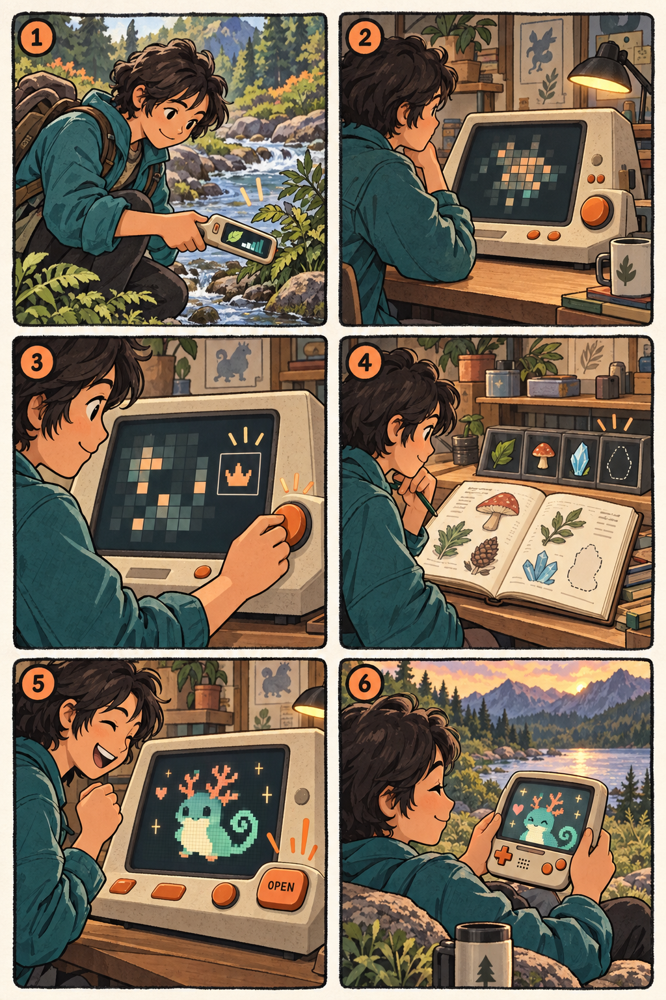

# Your first discovery

*A player walkthrough concept for newcomers.*

**1. Take the Probe outside**

Mara clips the **Probe**, a small portable explorer, to her bag. As she walks, it observes the conditions around her. In Critter Lab, those observations help form a mysterious sample. She wonders what it could become.

**2. Bring the mystery home**

Back home, she brings her sample to the **Lab**, the tabletop machine where she investigates and creates critters. Opening the sample reveals a curious pattern. There is something to discover here, but she cannot make a critter yet.

**3. Follow a clue**

Mara chooses a study about head shape. The Lab presents a clue she can compare with references. Further investigation reveals that this sample supports more than one shape. She starts imagining the critter she might choose to create.

**4. Find what the next study needs**

Another study needs a supply she does not have. Her finding stays saved while she goes gathering or prepares supplies through crafting at the Lab. Returning does not mean starting her research again.

**5. Understand, choose, then meet**

Mara finishes all the research required to understand the sample's complete genetic possibilities. The Lab explains her creation options, including what the critter will show and what it can carry unseen. Before she commits, she can review her choice and what creation will use.

When her critter is ready, the Lab waits. Mara presses **OPEN** herself. Now she meets an individual of her own, with a life beyond this first discovery.

**6. Take that critter with you**

The **Companion** is the handheld home for spending time with her critter away from the Lab. Mara takes the same individual along, gets to know it, and returns to continue their story. It is not a fresh copy each time she changes devices.

*Concept walkthrough: study activities, supplies, crafting, creation requirements and life together are still being designed. The illustration sets the scene; it does not fix screen layouts or creature designs.*

For the design details, see the [sample-to-critter system contract](../specs/sample-to-critter-contract.md).
