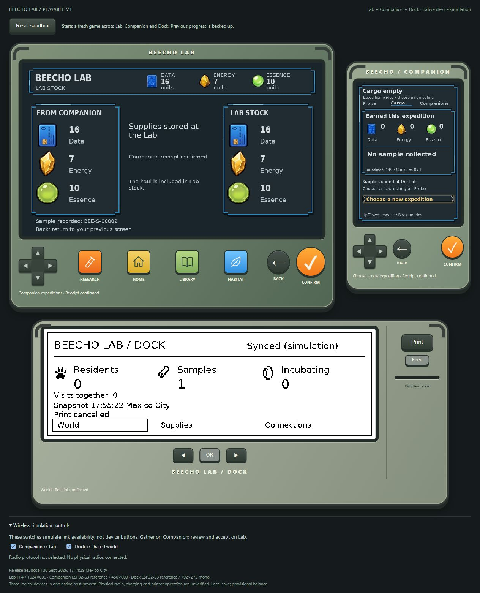
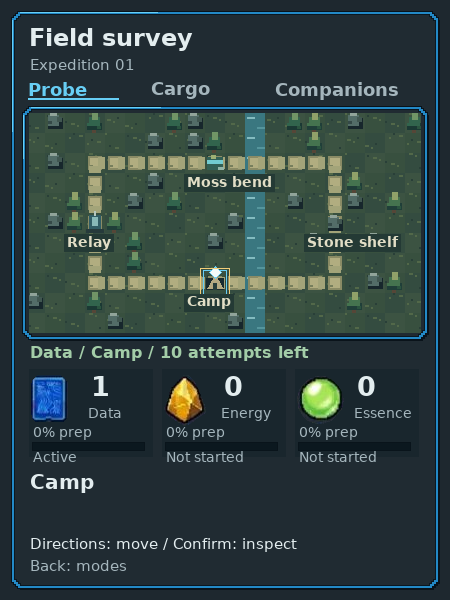
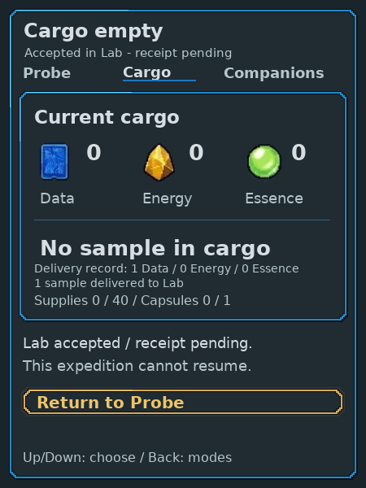
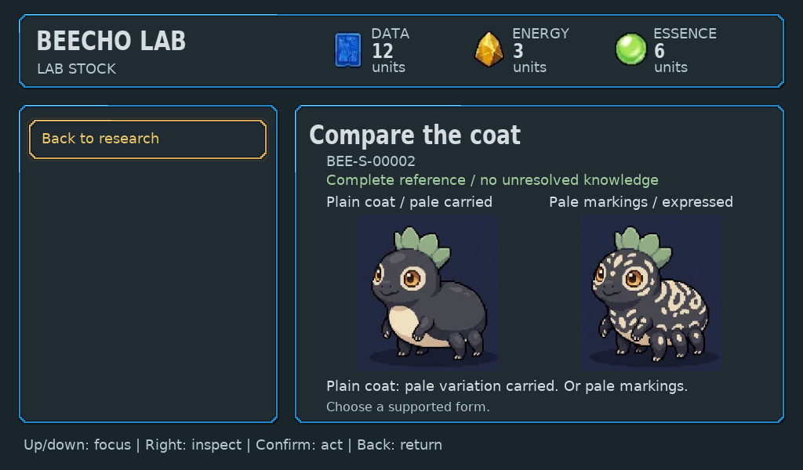

# Three-device playability: current findings

30 September 2026. Assessed installed release
`ae5dcded00e36dbcbfdbbd16211dca2809f97d1a`.
The connected loop is playable; satisfying repeat exploration and full fidelity
to the Gemini references are still open. This assessment makes no code or art
changes. Task status belongs to [backlog #44](https://github.com/PacoCotera/critter-lab/issues/44);
the [roadmap](../../ROADMAP.md) owns scope.

## Actual play

The released browser simulator was operated through its depicted device buttons
in a fresh isolated game. No supplies were granted and no route-search script
drove the task. The existing installed native build and presenter were used;
the shared public game was preserved.

The chosen journey started Camp Data, traversed Relay and Moss bend, switched
sources, inspected the trace, walked its revealed connector, collected the sealed
sample, then visited Stone shelf for Energy. Return review was cancelled once,
then sent and explicitly accepted on Lab. Actual delivery was **16 Data,
7 Energy, 10 Essence and one sealed sample**. Lab reception and Companion receipt
agreed. Research spent four Data on **Read the pattern**; Home and returning to
Research retained the finding. Dock showed **12 Data, 7 Energy, 10 Essence**
after research and one retained sample. Supplies, Connections and Print-preview
cancellation were exercised.

Separate game and interaction reviews operated the same installed native build
with fresh isolated saves. Game play observed a failed first Data attempt,
followed Relay to Moss, inspected the trace, switched to Essence and returned
eight Data and two Essence without a sample. Interaction play exercised retained
movement/work after cancelled return and Dock controls. Art/UI assessed actual
outputs against original references; it did not perform its own browser play.

These are agent-operated sessions with prior product knowledge. They do not
establish first-time human comprehension, enjoyment, physical thumb comfort,
real radio, panel refresh or printer operation. Tool inspection time allowed
gathering to continue; the haul is not a human pacing measure. Creation, reveal
and shared visits remain covered by the previous
[actual native journey](../../docs/evidence/playable-expeditions/README.md),
not repeated in this browser task.

## What holds together

- **Game:** Inspect changes reachability; collecting is explicit. Earned supplies
  fund retained discoveries. Lab receives a record, not the live away map.
- **UX:** Whole resources, preparation, budgets and sealed contents stay distinct.
  Safe return review, Home recovery and retained Research context worked.
- **Art/UI:** Resource materials stay recognizable. Map/site views refer to the
  same place. Original resident identity is preserved in the established journey.
- **Dock:** Accepted stock and freshness are truthful; Connections and print
  preview disclose their simulated limits.

## Defects and focused proof

| Priority / domain | Actual finding | Smallest correction or proof |
| --- | --- | --- |
| P1 / Companion layout | “This expedition cannot resume” is partly covered by Return to Probe. Confirmed in browser and native operation. | Restore clearance; inspect both sealed receipt types. |
| P1 / Companion receipt | Empty Cargo says “Earned this expedition / No sample collected” after a successful sample-bearing delivery. Quantities are current; wording falsely implies history. | Current-cargo captions or distinct delivered totals; inspect both receipt types. |
| P1 / simulator input | Six rapid Right presses advanced five legal tiles. A deliberate extra press reached Moss; later observed-step sequences worked. Source silently cancels a new gesture while an activation is pending. Plausible cause, not a per-gesture diagnosis. | Reproduce the short segment at rapid/ready-separated cadence. Acknowledge consumed/updating input; preserve fresh gestures and stale-screen safety. |
| P1 / shared composition | Native map raster overwrites blue vertical strokes at x25–26 and x423–424; sampled y200 pixels are terrain instead of frame RGB35,137,198. Arrival siblings differ4px width,6px heading inset and8px outer alignment from other workspaces. | Clip to real frame interior or preserve border draw order; normalize sibling geometry. Separate native damage from browser cropping. |
| P2 / simulator orientation | Map movement has a View cargo caption. Controls auto-scroll device titles/mode headers out of view. | Project actual movement context and keep screen/depicted controls visible together. |
| P2 / field feedback | A failed attempt consumed chance and restarted preparation under stale source-selected copy. Finished sources are quiet; marker/bars weak at ordinary browser size. | Compact award/no-find/finished result, stronger marker/bars at native and presenter sizes. |
| P2 / return copy | Back: keep exploring returns first to Cargo, requiring modes/Probe to reach map. | Name immediate destination; preserve tile/work/cargo. |

One Lab acceptance reported **740 ms input-to-paint** using existing DOM
instrumentation. This is one observation, not a benchmark, bottleneck diagnosis
or RPi hardware measurement. No freeze was observed; rapid-press loss stays open.

## What remains shallow or visually weak

- **Expeditions:** Sources share the same work/chance model; fixed trace-to-cache
  becomes predictable. More route labels alone do not create different adventures.
  Depletion detours currently add access friction more reliably than choices.
- **Owner play:** Expeditions and samples feel alike; chance acquisition is painfully
  boring, events absent and sample collection dull. Research feels like a checklist.
  This direct player evidence supersedes earlier enjoyment hypotheses.
- **Research:** Known/unknown and retained findings work. Instruments often provide
  context rather than explain the discovery visually; broad empty action space
  and prose still dominate results.
- **Companion:** Tactical navigation and a static portrait do not yet deliver the
  Gemini field-partner reference's expressive presence in a living place.
- **Dock:** Truthful monochrome summary is useful; small glyphs, thin outlines and
  generic typography need the same authored care as the color family.
- **Physical ergonomics:** Dimensions, hand reach, grip, force, comfort, docked
  clearance and panel readability remain unmeasured.

## Ranked incremental proposals

These are trials, not approved new mechanics or creature canon.

1. **Craft and clarity:** fix frame/content clearance, receipt wording,
   acknowledged inputs, movement orientation and attempt feedback first.
2. **Genuine generated field:** varied saved topology, source/lead placement and a
   clearly readable token; not two fixed maps or palette/label swaps.
3. **One immediate event:** a finite choice with visible consequence; waiting
   through random acquisition must become secondary, not the main activity.
4. **Active research evidence:** one specimen-specific comparison in the main
   workpiece, retaining the existing finding and next meaningful question.
   The [joined trial](../probe-sampling.md#next-discovery-trial) defines its boundary.

Game, interaction and art reviewers agreed that reveal emphasis clarifies causality
but does not add depth, and decoration cannot solve source parity. A short human
task can fund one study, investigate a promising place, choose return and resume
the same sample. Confirmed layout/copy repairs do not need to wait for that task.

## Actual browser evidence

- [Pending reception](playtest-pending-reception.jpg)
- [Accepted haul and contradictory Cargo](playtest-accepted-receipt.jpg)
- [Finding paid with earned Data](playtest-research-finding.jpg)
- [Dock after research](playtest-dock-stock.jpg)
- [Screenshot hashes](playtest-manifest.json)

Earlier audit images and [manifest](manifest.json) remain reference evidence for
their earlier revision, not current unresolved implementation claims.
[Family promise comparison](promise-gap.md) and
[Companion promise](../companion-promise/README.md) preserve visual targets.
No new infrastructure, radio, capture, training or ecology implementation is implied.

## Corrected native increment

Source864eca5d555c8d1624cde9a7fb646420ec5d8202, [PR53](https://github.com/PacoCotera/critter-lab/pull/53).
This replaces the broken-frame/current-Cargo/navigation behavior identified above.
The earlier playtest captures remain baseline defect evidence, not current claims.

- Shared panel/focus contours now have connected6px pixel chamfers instead of
  reentrant cap shelves. Art direction and pixel production directly agreed the
  repair and independently inspected actual shallow/tall/map/nestedCargo states
  at native size. Both passed this bounded frame repair.
- Terrain stays inside the complete rim; sealed-return consequence clears action
  focus. Both delivery-pending and complete Cargo show zero current supplies and
  capsules, with immutable sent contents separately labeled Delivery record.
- Lab acceptance waits for the cleared Companion frame before painting its stock
  change. Deliberately delayed-frame testing passed; consumed update-time gestures
  receive visible feedback and do not act later. This does not establish future
  disconnected-device radio behavior or eliminate every cadence concern.
- Home is first in the physical row. Empty Library/incomplete-form navigation uses
  real return actions. Findings, status and failure feedback stay in the main
  workpiece; two complete coat alternatives remain visible without label overlap.
- Coordinator checked Home→Research→sample→retained coat finding in the actual
  browser presenter. The prior16/7/10 earned haul funded these studies; after4Data,
  4Energy and4Essence total study spend, Lab/Dock agree12/3/6. Reinspection is free.

Validation: exact clean pushed source built in the established native environment;
three native suites passed; focused actual-native HTTP/link recovery passed; Node
presenter3/3 passed including delayed paint and consumed input; GitHub native CI
36798449693 passed. Independent technical source review caught and corrected
remaining finding-pane facts; actual exports caught a sprite sizing-contract error
before delivery. The original art masters/hashes remain unchanged.

[Browser and Home-first proof](repair-browser-finding.jpg),
[sealed return](repair-sending-offline-companion.png),
[completed receipt](repair-complete-companion.png),
[Dock](repair-complete-dock.png), [hashes](repair-manifest.json).

This closes these concrete repairs, not the full depth/craft/discovery gap. The
oversized one-action navigation pane, weak player presence and uneven sibling
arrival geometry still need composition work. Fixed maps, no map events, dull
chance acquisition, same-feeling samples and checklist research remain rejected.
The [comparison mapping](../research-and-creation.md#next-comparison-trial) exposes
why a cosmetic alignment puzzle would not solve discovery: authored pre-finding
specimen evidence and its interpretation rule are missing. No production
procedural/event/minigame feature is claimed in this increment.
