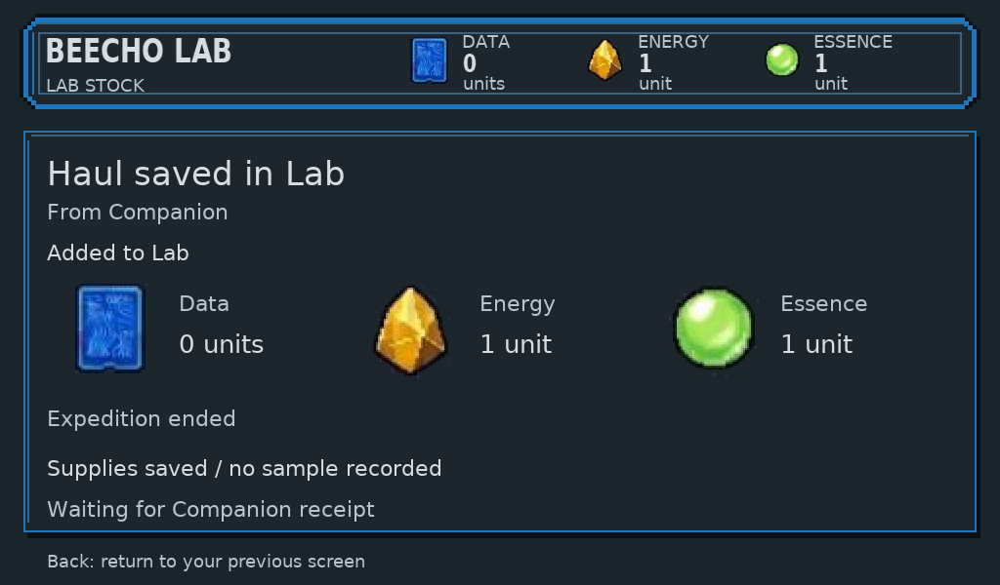
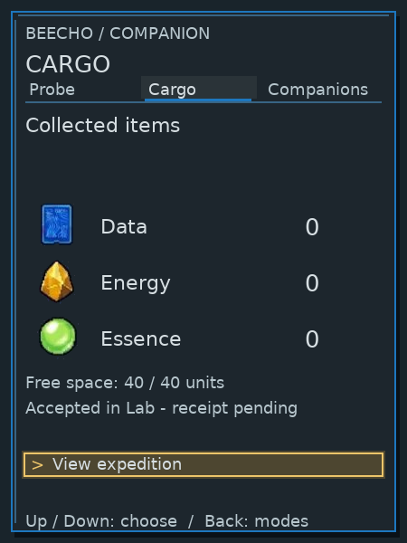

# Three-device playability defects and design gaps

30 September 2026. Audit of released native revision
`fd08ff1f3cdd88c9a03bcc388c1326546b5dba38`, its presenter, current gallery
and C18/Gemini03/04/07 references. This is a prioritized repair packet, not a
repair release or full V1 acceptance. Defect status belongs to the linked GitHub
[backlog #44](https://github.com/PacoCotera/critter-lab/issues/44); evidence and proposed acceptance remain here.

**Journey:** choose a task at Lab → gather on Companion → inspect cargo → review
Send → receive and explicitly Accept at Lab → resume research → choose a fully
supported form → incubate/reveal → visit the same individual. Dock summarizes
that same world. Browsing does not spend supplies or transfer ownership.

## What was exercised

Two fresh isolated native worlds covered early return, Home and Explore callers,
sealed offline Send, arrival, acceptance with delayed acknowledgement, post-receipt
Cargo exits, mode switching, a new outing, immediate empty ending, and Dock summary/
Print/Feed feedback. Native frames are unmodified, with dimensions and hashes in
[manifest](manifest.json). Raw status stock/cargo values use the native100-per-item
compatibility encoding; on-screen quantities are whole items. Research/creation/reveal/Habitat were assessed using
existing timed-journey exports and exact release source; this pass did not repeat
their unchanged full timed suite. Full-capacity connected recovery remains a
source finding, not a new full-capacity reproduction. Host output does not prove
hand comfort, real radio/panels, battery life, human comprehension or fun.

**Owner-reported Cargo exit trap remains open.** In these native scenarios,
Lab Back returned from accepted reception to its caller and then Home; Companion
Back exited while sealed, after offline acceptance and after receipt. Confirm on
empty post-receipt Cargo returned to Probe. This is limited negative evidence,
not a repair or grounds to dismiss the original report. An isolated released-presenter browser journey also sent a completed haul,
resumed its pending arrival after a test-presenter timeout, accepted it, then
exited Lab reception via Back to Overview. Companion mode selection → Cargo →
Back also returned to modes after receipt. No repeated same-input or original
owner-save/browser-state reproduction is claimed. [Browser proof](browser-exits.png). Preserve the relevant save and input/
paint sequence for investigation; avoid replacing it with a fresh-world-only test.

The missing global Home shortcut is an explicit owner requirement. Yellow
Critters → Home is the UX recommendation, contingent on preserving the named
resident list elsewhere; the physical key mapping is not implemented or approved
by this document. Prioritize reported navigation escape, then completion feedback,
capacity/commit clarity, discovery content and shared visual craft.

## Prioritized findings

| Priority / device | Observed versus expected; evidence | Player impact / proposed acceptance |
| --- | --- | --- |
| P1 / connected Companion | Capacity recovery is incomplete. `kit.c` Cargo exposes one action (Send, View expedition or Return to Probe); there is no connected discard path. Standalone Lab discard choices in `input.c` do not establish a connected capability, because Kit Explore intercepts their Confirm. Source inference; full-capacity runtime not supplied. | A paused outing needs an honest supported way to make room. Test capacity with insufficient room for the complete possible next award; expose Send as the existing recovery and clearly explain its ending consequence. A discard flow is a proposed repair requiring a reachable item/quantity review, fresh confirmation and retained outing. Never advertise discard before implementation. |
| P1 / Lab creation | In `input.c`, Confirm on Plain coat or Pale markings immediately issues `GAME_COMMAND_INCUBATION_START`. `render.c` displays cost and says Confirm starts incubation, but the focused row names a configuration, not the spending action. Source inference. | Configuration inspection and final commitment are easily conflated. Retain a chosen supported form, then show a clearly named Start incubation review with sample and exact stock/cost. Back preserves the draft; only a fresh explicit Start spends once. Validate existing retry/idempotence rather than changing genetics. |
| P1 / cross-device terminology | Active `design/research-and-creation.md` retains the older pack/storage-unit convention; `native/selected-lab/V1.md` uses 1 pack = 10 items / capacity40 items. Current owner rules require indivisible whole items. Documentary contradiction reported by Game Design; corroborated against current gameplay direction. | Capacity, affordability and manifest amounts cannot be understood consistently. Retire pack conversion from active player rules and screens; use the same whole-item counts for cargo, capacity, arrival, Lab stock, studies and creation. Keep activity progress out of manifests. |
| P2 / Lab navigation, explicit owner requirement | No existing color shortcut goes Home. Release `input.c` maps orange Research, yellow Critters, green Library, blue Habitat. Back did work in the coordinator's fresh-world paths; that does not provide the requested dependable Home shortcut. | Recommend **yellow Critters → Home**, leaving the other three functions intact. Before remapping, retain a reachable named resident list under Habitat; Critters currently provides that list. Home navigates to Overview - Lab, never accepts, spends, reveals, cancels a sealed haul or changes the world. Pending reception remains reachable. Clear held gestures and require fresh Confirm. Exact physical key choice is a proposal for owner steering. |
| P2 / Companion return lifecycle | Reproduced offline after Lab acceptance: cargo zero, label Accepted in Lab - receipt pending, View expedition, no prominent ended-outing status. Screenshot [accepted Cargo](delayed-offline-cargo-after-accept.png); release `kit_option()` selects View expedition for all pending phases. | The player has completed an outing but sees an action implying it still exists. Lead with Supplies stored at Lab / Expedition ended. Receipt delay gets separate reconnect guidance. Back must clearly reach modes; show new outing only when the existing receipt policy permits it. Reconnect repairs metadata and never awards again. |
| P2 / Companion start and ending | Native [fresh-outing frame](connected-new-outing.png) offers Finish expedition at0/60 seconds with empty cargo. Coordinator reproduced immediate empty Finish, ending the outing; result returned to generic Ready to explore with remembered route. `kit.c` tests empty transferable cargo, not elapsed completion. | Finish sounds successful rather than abandoning an unfinished outing. Use explicit End expedition, explain that an early ending gives no completion sample, and review the destructive consequence. A completed outing needs a distinct completion result. Do not silently change timing/yields. |
| P2 / Companion feedback | `kit_render.c` does not render ordinary Companion `view->message`; lifecycle/counts render, but command/recovery messages can disappear. Source inference, independent of physical actuator feedback. | A failed command, ending or recovery can look like a silent no-op. Allocate a consistent visible result/error region; include cause and available recovery. Focus, pressed, pending, saved and error must differ. Test a real unavailable/failed action without claiming simulated storage faults are board validation. |
| P2 / Companion orientation | Native selector frames repeat brand, large mode title and the same three modes; large footer copy dominates otherwise sparse views. Cargo/action pages have context-dependent Back destinations with weak hierarchy. Modes already change preview without commitment. | Use one persistent three-position mode rail, one live task subject, and one distinct action focus. Left/Right on the selector immediately replaces overview; Down/Confirm moves to action focus without activating. Nested Back restores caller, action-level Back returns selector. Preserve gathering during ordinary browsing; unsealed Send review pauses it and cancellation restores the prior activity state, including capacity and completion limits. |
| P2 / Lab research entry and scope | `render.c` Home Research preview mixes collection totals with selected-sample ID and5/5 topic progress. Home Confirm enters the sample list, while the Research shortcut restores its remembered workspace. `input.c`; `researched-home-2-research.png`. V1 explicitly lacks a separate collection overview. Source/static finding. | The player cannot distinguish all samples from the current workpiece or predict where Research returns. Label collection totals separately; retain the selected sample/workpiece across equivalent entries. An empty state must name the meaningful next device/action rather than an inert Find outdoors row. Preserve sample knowledge and stock. |
| P2 / research discovery, content limitation | Release study content is the same five topic purchases and two supported Pip forms; capsule/count art and fixed findings do not show a sample-specific investigation or an inspectable genetic bitmap. `render.c`, shared Pip study content, `V1.md`; gallery finding/workbench frames. | New headings or a better capsule cannot make discoveries vary. Implement only after steering the joined A/B content proposal: stable sample support, meaningful findings, relevant follow-ups and validated completeness. A bitmap needs a truthful knowledge projection; do not encode hidden phenotype or claim arbitrary pixels are genes. |
| P2 / Lab unavailable actions | `input.c` can reach creation for another sample while incubation is active; the eventual guard rejects it. Research prepare rows are selectable before all topics resolve. Native Critters list Confirm does not open a visit, although rows look actionable. Source inference. | Distinguish inspectable information from available action before the press. Say Incubator busy with the useful current-job destination; show specific missing research/stock. Critters rows must either be unmistakably a read-only selection or provide an explicit visit action. Do not remove current list access in the Home remap. |
| P2 / everyday Companion | Companions mode honestly says party assignment is not simulated and has no actions. Native `mode-companions-companion.png`; zero options in `kit.c`. | This is an unfinished core experience, not an empty-player inventory. Show an honest unavailable state distinct from No residents yet. A later resident view must use the same saved individual, known traits and permitted care state; capture, training, party assignment and rewards remain unimplemented proposals. |
| P2 / reveal and Habitat | Gallery reveal preserves identity/source and provides Meet; Habitat retains that portrait and has Spend time together / Next resident. Current interaction increments visits with the same static response. `input.c`, `05-reveal.png`, `06-habitat.png`. | Identity and recovery are valuable existing features to retain. The emotional payoff is still thin: repeated visits are not demonstrated training or varied behavior. Require perceptible bounded resident response with a still alternative before claiming an expressive Companion, and involve game/art for any new behavioral meaning. |
| P2 / Dock unavailable functions and freshness | Coordinator confirms Previous/Next preview World/Supplies/Connections; do not misreport Connections as unreachable based on OK toggling. No physical Back exists. Print is preview only; Feed gives a simulated notice. In `kit_render.c`, action messages replace the timestamp/stale line. Source + isolated screenshots. | Keep cached-state time and offline status visible during Print/Feed feedback. Unsupported printer/charging must not appear successful. Use existing OK/Cancel options for preview return and retain selected summary. No print, charging or cloud success can be inferred. |
| P2 / visual fidelity throughout | Native screenshots remain text-panel scaffolding; current standard explicitly rejects them as final. Approved C18/Gemini03/04/07 concepts establish richer subjects, shared saturated resources, slender blue edges and warm action focus. | Reconstruct reusable native assets and task-specific compositions, not screenshots behind overlays or a generic web-card template. Inspect the actual final native exports in empty, busy, short-stock, pending, saved and error states. Semantic readability alone does not approve craft. |

## Home shortcut acceptance detail

Home is a navigation escape, not a rollback. Preserve current study/sample, supported configuration draft, selected resident and incubation; preserve sealed transfer and pending reception. Returning through Research/Habitat restores retained context against current world state. Home at Home stays at the overview rather than replaying a task. If an atomic commit is already in progress, finish its existing transaction boundary and then navigate safely; no extra acceptance or spend is triggered. Acceptance requires traces from pending arrival, post-accept/delayed receipt, research review, active incubation, reveal and Habitat. A human key-reach test remains outstanding.

## One game/genomics reconciliation

Game design and genomics reconciled their actual proposals; UX reviewed the
joined content. The integrated [research discovery proposal](../research-and-creation.md#discovery-proposal--30-september-2026) and [generation contract](../../specs/architecture.md#generation-backend-proposal--30-september-2026), retain that reciprocal reconciliation. Their A/B support examples now agree: A has relevant markings follow-up; B has a different movement/efficiency relationship. An early broader comparison is justified only by the authored method and intake scope; it does not automatically complete new samples. Whole-item ledger, selected complete supported genome, explicit creation and retained identity are consistent.

UX supports the joined paper/control example with these acceptance conditions: show what this sample actually established, what is still unresolved, what each available investigation can answer, and exact stock/cost before commitment. Resupply preserves the same workpiece. Known findings remain free to inspect. A relevant follow-up appears because uncertainty remains, not because every player owes a third click. Complete is validated disclosed support, not purchased-row count. LLM descriptions and neutral sample art may not leak undiscovered facts; source facts, reference explanations and saved individual behavior remain distinct. These are design requirements, not proof of fun or implemented native variability.

The [full tactile Companion proposal](../companion-experience.md) consumes the audit findings
into one mode, focus, screen-response and return contract. It was independently
reviewed as design; implementation and native art remain outstanding.
