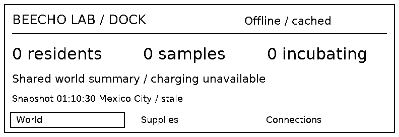
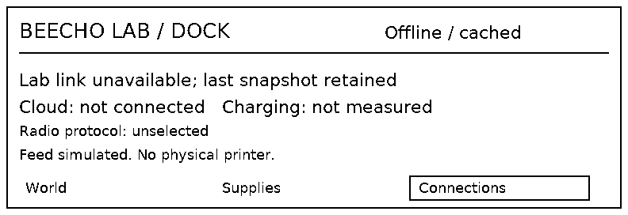

# Three devices, one game: promise and delivery gap

30 September 2026. Full-depth assessment of Lab, Companion and Dock against the
selected family, C18, Gemini03/04/07, the [four supplied references](../companion-promise/README.md)
and released native output. This extends the [playability audit](README.md), not
the implemented feature set. [Issue44](https://github.com/PacoCotera/critter-lab/issues/44)
holds repairs for later. No new artwork, mechanics, service or release is claimed.

The player journey is **explore with a field partner → bring discoveries home →
understand a sample → deliberately create → meet the same resident → recognize
the shared home world**. Lab, Companion and Dock need distinct purposes inside
that journey. Neither matching blue borders nor three individually readable
screens establish the promised experience.

## Where delivery falls short

| Device | Strength to preserve | Gap against the promise | Concrete production target |
| --- | --- | --- | --- |
| Lab,1024×600 | Useful Home destinations and accepted stock; retained sample/source; the same Pip identity and markings through Reveal/Habitat. | Research reads as five purchases and progress rows. Enlarged capsule, text and broad action panes displace the investigation. Incubation/Reveal/Habitat are visually similar; visits have a limited static result. Collection scope and selected sample are too easily confused. | C18-derived illustrated workpiece: disclosed feature/reference, actual known finding and unresolved question, exact cost and one focus. Deliberate creation review. Process imagery before opening; saved individual and bounded visit response after it. Habitat scenery cannot claim ecology or care rules absent from the game. |
| Companion,450×600 | Actual route, timing, chance, whole earned supplies, reviewed transfer and ended outing. | Probe is a monitor; Cargo a ledger. Repeated title/rail/footer and heavy frames compete with the subject. Accepted empty Cargo offers View expedition. Companions has no resident actions; marketing capture/training/company are not implemented. | A fictional illustrated gathering place/activity with compact live facts and durable empty/award feedback. Tangible item/count groups for Cargo. Slim persistent mode rail; selection, action focus and result distinct. Portable company must connect an actual saved resident and operation before showing an active care screen. |
| Dock,792×272 monochrome | Readable accepted totals, Supplies/Connections and retained offline cache. | Almost entirely text, without the family’s deliberate monochrome vocabulary. Feed and print-cancel notices replace snapshot age/stale information. Print is a simulated summary notice, not a specimen paper layout or physical output. | Authored monochrome category glyphs, grouped whole counts and quiet hierarchy. Permanent snapshot/freshness line separate from results. Actual Previous/OK/Next, Print/Feed controls. Count-only data cannot supply an identifiable resident portrait. |

The native release has not matched the craft of the established references.
Those references remain the production direction; this finding does not reopen
palette or screen discovery. Probe03 improves material craft but replaces the
living place with an emblem and boxes. Cargo04 and Lab07 are useful inventory/
transfer compositions, not templates for investigation or company. Marketing
adds an expressive living-world promise beyond those operational studies.

Two kinds of work are necessary. **Art projection** must improve hierarchy,
margins, native sprite scale, type, material rendering, focus halo/depth and still
feedback using the retained visual language. **Functional gaps** include Home/
escape, explicit creation commitment, capacity recovery, sample-specific research
and portable resident access. An attractive picture cannot stand in for them.

## Cross-domain objections resolved

Art, game design, UX and genomics assessed actual images and source/evidence,
then exchanged objections and solutions. Their agreement defines a proof target;
it does not approve the current native art or establish human enjoyment.

| Objection | Joined disposition |
| --- | --- |
| A lush scene can imply encounters, sensing, hidden phenotype or clickable targets. | Probe setting is fictional atmosphere and supported gathering activity only. No encounter silhouette, capture target, weather/GPS reading or hidden founder. Concise live facts, one console focus and named actual actions remain legible. No scene clicks. |
| A beautiful research portrait could leak unknowns; a topic picture could be mistaken for a sample observation. | Keep sample, reference, supported-form preview and revealed individual visibly separate. Known/unknown comes from validated facts/support. An unclear genetic bitmap gets no authority from its appearance. Carried pale variation does not draw pale markings on a plain Pp individual. |
| Art’s requested pending-study frame would imply a new background research system. | Current study resolves immediately. Show its actual commitment/saved finding and stock change; do not add a timer, queue or check-in. Incubation has the existing active-play process. |
| Gathering/return alone is too narrow to close a full-family promise. | The connected proof continues through retained sample findings, explicit creation, incubation/reveal and the same saved resident. Portable visit remains a function dependency; a mocked resident view cannot pass it. |
| A Dock resident silhouette invents identity from count-only cached data. | Use generic category glyphs now. Identified art requires permitted resident identity/descriptor in the snapshot. Cached read-only imagery cannot certify a fresh visit or world change. |
| Same-release portrait continuity does not prove lifelong retained art. | Preserve accepted identity, descriptor, original asset bytes/hash/version and derived display/paper profiles. The current fixed global Pip sprite/version path does not prove catalogue-update recovery or pending-art support. Missing art must not reroll genes or silently replace the resident. |

A bounded pose/response may depict the existing saved visit, with a still
equivalent. It cannot introduce training, needs, happiness meters, party
assignment or XP. Capture/training remain broader ambitions with unresolved
detail. Completed surveys can return a supported sample; the audited early
0/1/1 haul is supplies-only. Do not erase the former or depict a sample in the latter.

## Focused Dock evidence

Nine additional unmodified native frames exercise accepted World → offline
World/Supplies/Connections → Feed → Print preview/cancel → reconnect, in an
isolated saved world. The live sandbox was untouched. Stock remains0/1/1;
the raw protocol retains its100-per-item compatibility encoding.

Offline/cached remains visible. World and Print preview preserve the timestamp
and stale qualifier; **Feed feedback and the print-cancel result replace that
line**. This proves loss of freshness detail during those notices, not inventory
loss, missing offline status or a defect in every Print view. Hashes, dimensions
and actual states are in [the capture manifest](manifest.json). There are no
samples/residents in this fixture, so it cannot prove individual paper continuity.

## One coherent next proof

Repair navigation/commit/lifecycle boundaries first, then compose the same state
with reusable art. Follow the existing production order: information architecture,
layout, content, visual references, navigation. Reuse completed stages; do not
redraw icons separately for each screen or bake UI into generated screenshots.

1. **Orient and gather:** empty/populated Lab Home and section overviews;
   Companion mode overview/action entry; zero contents, before try, empty try,
   actual award and near-capacity pause. Live timing and earned units stay separate.
2. **Bring work home:** Cargo, reversible Review send/Keep, sealed waiting,
   incoming versus stock, fresh Accept, stored/ended with delayed receipt and
   completion. Back/Home restores the caller without duplication or resumed outing.
3. **Discover and choose:** return to the same sample with updated stock;
   disclosed finding/unknown, actual cost/shortage, immediate saved result and
   complete supported-form draft followed by a separate spending review.
   The [A/B discovery proposal](../research-and-creation.md#discovery-proposal--30-september-2026)
   is a content dependency; unchanged five-study code cannot claim its variety.
4. **Meet and recognize:** busy/active/ready incubation, deliberate reveal,
   the same saved individual/source and actual Habitat visit/result. Companions
   distinguishes unavailable from no resident; a later working portable view/visit
   shares that identity and authority, without simulated training/capture.
5. **Keep the shared world trustworthy:** Dock accepted/cached summaries before/
   after acceptance, offline age through notices, real controls and honest Print
   preview/cancel. A future specimen card is a different proof from today’s world-summary preview.

Use one shared resource/type/frame/focus family, purposeful Lab topic/finding
illustrations, layered Companion setting/activity, saved resident art and authored
monochrome Dock/paper derivatives. Inspect actual1× compositions beside the
references, including long labels, zero/max counts and still outcomes. Walk changed
transitions with depicted controls. A person must be able to identify subject,
state, consequence, what changed and how to return; human comprehension/fun and
physical display/ergonomic behavior need their own evidence.

The original reported Cargo trap remains open despite successful isolated native
and browser exits. Home is required on an existing color key; yellow Critters→Home
is a conditional recommendation preserving named resident access, not an approved
or implemented remap. This packet closes the audit/reconciliation task, not the
defects, native art production or complete V1 acceptance.
