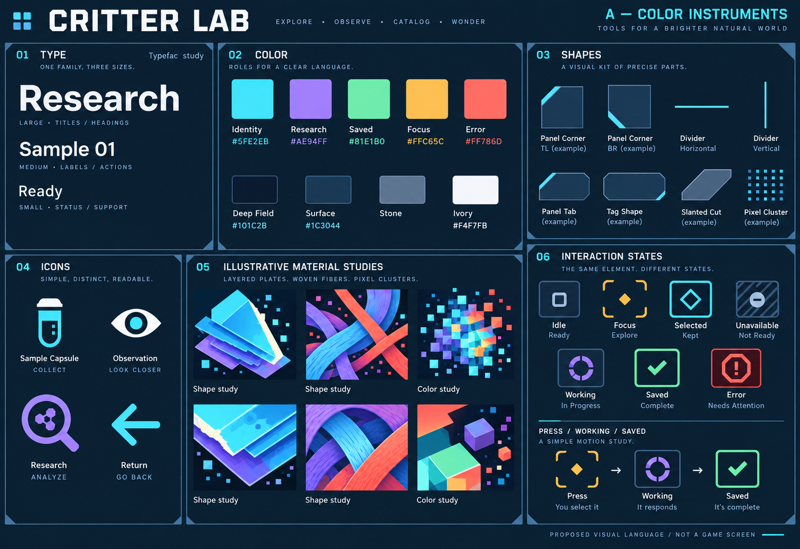
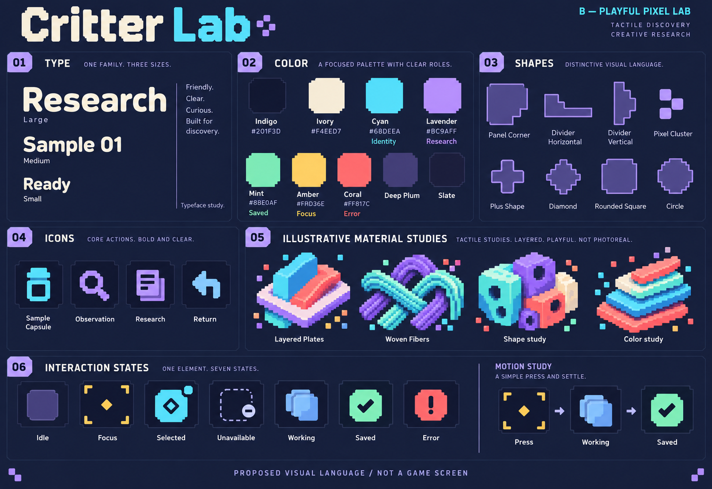

# Visual-language explorations

Proposals for discussion, 26 September 2026. These styleboards explore original graphic vocabularies before screen composition. Paco selected B as the foundation for refinement; the final visual language is not approved. See [refinement 02](refinement-02/README.md) for the current proposal. They are generated concept artwork, not exact font specimens, production components, canonical materials, rendered genomes or implemented interfaces.

## A — Color instruments

Precise geometry, clipped corners, angular icons and finer colored material studies. Quiet framing supports a more technical instrument character.

## B — Playful pixel lab

Stepped forms, stronger silhouettes and chunkier material studies. The proposed character is more tactile and playful while retaining readable type.

Both propose cyan identity, violet research context, mint saved results, amber focus and coral/red errors, reinforced by shapes and words. This compares shape and drawing vocabulary rather than merely recoloring one screen. A decorative art color does not establish an attribute, resource or gameplay state.

## Discussion and limits

The question is which vocabulary conveys curious, purposeful discovery and can remain clear across the device family. Internal inspection corrected mouse cursor imagery, differentiated retained selection from saved results, and reduced effects and ambiguous color captions. This is visual critique, not human usability evidence.

Generated lettering, example branding and token values are illustrative. They do not select a font or logo. Motion is represented by still diagrams, not validated animation. Probe monochrome translation and native-size screen application remain to be explored after direction. No staging or device implementation uses these boards.

Next apply the chosen vocabulary to representative states, test physical-control focus and refine the vocabulary where it fails. See the [screen standard](../screen-design-standard.md).

