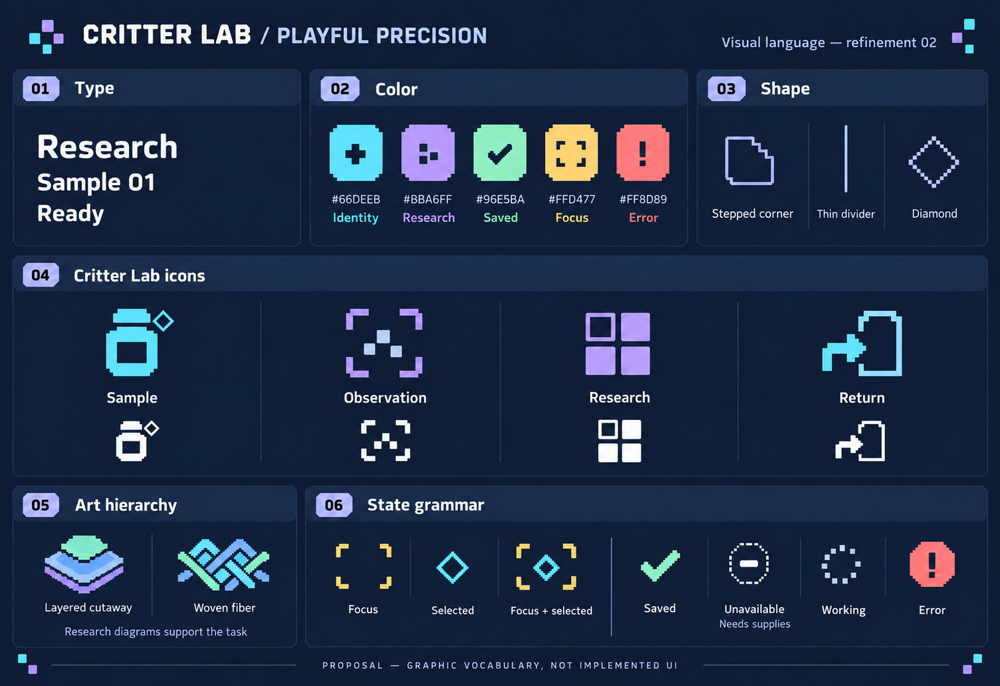
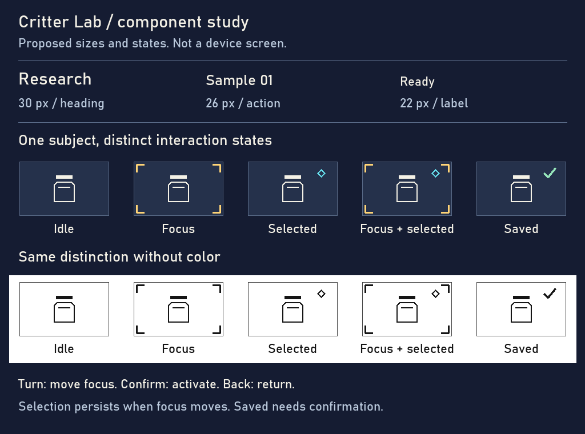

# Playful precision — refinement 02

Design review selected Playful Pixel Lab as the foundation, asking for finer detail, a tighter type range, clearer color and interaction states, distinctive icons and less dominant illustration. This is the next proposal, not approved production UI.

The concept keeps stepped corners and playful silhouettes while reducing coarse pixels. Cyan identifies, lavender groups research, amber marks focus, mint confirms saved results and coral flags failure. Shape and text reinforce meaning. Artwork is small and subordinate; these studies do not establish biology or mechanics.

The component sheet renders one family at 22, 26 and 30 pixels. It distinguishes focus, retained selection, their coexistence and a saved result in color and monochrome. Saved means persistence acknowledged, not another confirmation dialog. Bahnschrift is a study font, not a bundled or selected device font. This is a 1024×760 component sheet, not a device screen or proof of Probe readability.

Next: apply this vocabulary to representative Lab and Probe states at their actual display sizes, with fixed physical navigation and no disclosure of sample contents on the Probe. Assess clarity before implementation. Generated lettering in the styleboard is illustrative; the component sheet is the measured reference. Neither is a native performance or usability test.
