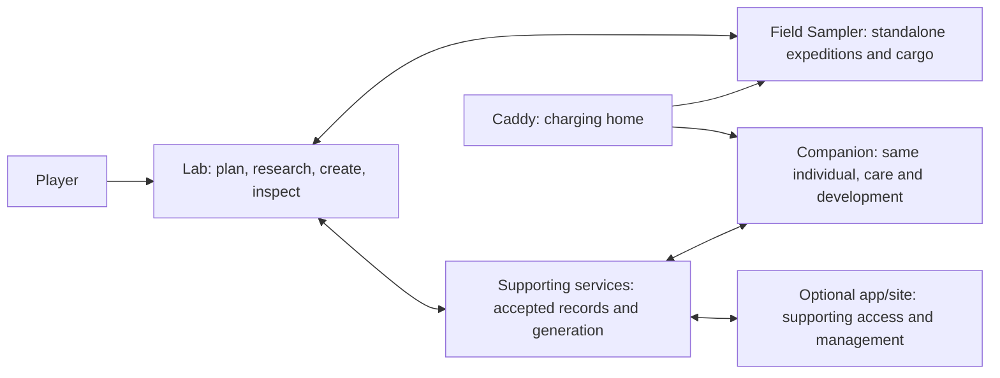

# Critter Lab: the product and the plan

**Planning proposal for owner review, 27 September 2026.** This connects the existing accepted direction; it does not approve open rules, visual designs, engineering choices or dates. Domain specifications remain authoritative for their details.

## The experience we are building

Critter Lab is a physical discovery and creature-raising game. Players bring mysteries home, investigate what they could become, make deliberate choices, and meet individuals whose identity and heredity remain recognizable as they grow, travel and produce descendants. Curiosity, experimentation and attachment are the intended experience; whether the game delivers them needs human playtesting.

The whole loop is **explore → investigate → choose → create → live together → discover more**. Players may also begin at the Lab without owning a Field Sampler. Shared equipment must not merge players' collections or permissions.

| Player moment | What makes it meaningful | What connects it to the next moment |
| --- | --- | --- |
| Choose an expedition at the Lab; carry the Probe | A purposeful gathering target with simple standalone operation | Player-attributed samples and resources return intact; fictional encounters remain distinct from measurements |
| Bring a mystery home | A sample is a question, not a hidden finished creature | Clues and retained findings support investigations |
| Investigate and prepare | Choose questions, see costs, retain discoveries, pursue supported possibilities | Resolve every required genomic region; missing supplies pause work rather than erase it |
| Select and create | Understand the complete supported configuration and displayed terms before committing | One qualifying sample and creation supplies produce one saved parentless individual; retries do not create/spend again |
| Deliberately open and meet | The reveal introduces an individual, not a reroll | Its identity, genome, history and finished art persist |
| Carry, care, develop and breed | Build attachment and recognizable lineages | Companion activity returns to the same individual; breeding needs compatible actual parents and permissions |

The [first-discovery story](../design/sample-to-critter-walkthrough.md) illustrates this loop. [Gameplay](../specs/gameplay.md) and [genetics](../specs/genetics.md) distinguish accepted rules from proposals.

## How the ecosystem fits together

The Lab is the extensible workbench, the Probe connects play to everyday surroundings, the Companion centers the relationship with critters, and the caddy charges the portables. The caddy does not implicitly transfer cargo or advance play. Routine play must not require opening a phone app.

Connected services preserve accepted records and perform remote generation. Content tools must produce and validate varied content without a permanent manual asset bottleneck. This is not permission to build a generic platform before a concrete content example exists. Offline devices retain only the supported temporary activity; exact reconciliation and allowances remain open. Cloud acceptance, local receipt and visual completion are different facts.

[Device responsibilities](../specs/devices.md), [system architecture](../specs/architecture.md), [cloud synchronization](../specs/cloud-sync.md) and the [proposed sample-to-critter contract](../specs/sample-to-critter-contract.md) explain these connections. Physical concepts and preliminary profiles do not establish final hardware or measured feasibility.

## Where we actually are

| Part of the whole | Current reality | Missing connection |
| --- | --- | --- |
| Game/experience | Accepted core directions, research structure and creation terms; worked proposals | Concrete content, coherent reviewed interactions, balance and human playtest |
| Software experience | Runnable host/native experiments and saved-state fixtures | One integrated journey with supporting services and real device adapters |
| Individual/genetics/art | Accepted information layers, identity requirements and concept assets | Approved worked critter example connecting heredity, expression, appearance, behavior and generation |
| Durable records/content | Architecture/contracts and experiments | Working accepted-record recovery, constrained generation and automated content tools |
| Physical kit | Concept references, preliminary profiles and firmware build scaffolds | Bench evidence, functional integration, schematics, editable cases and charging validation |

See [product status](../STATUS.md) for evidence and [build coverage](../BUILD.md) for available components. These are not complete-product claims.

## Design plan: make the same journey coherent

The following order is proposed. Accepted research/creation foundations are inputs, not choices to reopen without a reason.

| Review step | Artifact and question | Decision unlocked |
| --- | --- | --- |
| 1. Whole journey and visual foundation | Walk one expedition-to-discovery storyboard using existing sampling/research proposals and the selected Playful Pixel Lab direction. Is it understandable, inviting and consistent with device roles? | First prototype scope and keep/change direction for the visual vocabulary |
| 2. Research-to-individual example | Work one sample through findings, complete selection, creation terms and one recognizable critter. Separate example content from canonical choices. | Concrete V1 content/rule gaps and specimen design direction |
| 3. Interaction and continuity | Apply the direction to representative Lab/Probe/Companion moments with intended controls, pending/error states and shared-player context | Flows ready for functional implementation; remaining offline/rights decisions |
| 4. Physical application | Try approved interactions on preliminary device profiles and targeted bench setups | Engineering choices supported by owner direction and measurements |

Current review material: [Probe sampling](../design/probe-sampling.md), [research](../design/research-and-creation.md), [accepted creation terms](../design/creation-terms.md), [design references](../design/README.md). Visual refinement is a proposal, not final artwork. Device modules, controls and enclosures are not frozen by these plans.

**Next design deliverable:** one connected review packet for step1, using existing assets and worked scenarios. Show the relevant alternatives and consequences, not a questionnaire or another set of disconnected screen plates. Stop when the owner can decide journey scope and direction. No new functional UI, game phases, canonical creature art or purchases in this step.

## Implementation plan: build the reviewed journey in usable increments

| Increment | Usable result | Dependency and relevant acceptance |
| --- | --- | --- |
| 1. Reviewed research slice | A sample can be investigated, findings retained and a complete supported configuration selected through the agreed interactions | Reviewed step1/2 content and flow; exercise normal path, missing supplies and restart without extra spend |
| 2. Saved creation and continuity | Explicit creation yields one durable individual that can be reopened/restored without reroll or duplicate spending | Chosen creation/record boundaries; test uncertain request and restore the same identity. An interim local simulation must be labeled |
| 3. Identity-driven content | The saved individual has validated appearance/motion tied to its traits; the example is reproducible through content tools | Approved worked critter and mappings; verify variation, recognizability, preserved assets and failed-visual retry without a new individual |
| 4. Connected virtual ecosystem | The same journey spans Probe, Lab, supporting records and Companion with explicit simulated-device limits | Ready transfer/profile/offline contracts; check attributed cargo, handoff and supported interruption/reconciliation |
| 5. Physical integrated kit | Run the journey on engineering prototypes, then one complete alpha | Selected components, authorized spending and bench evidence; include printing/scanning, controls, charging and physical identity continuity |
| 6. Ten-kit pilot | Repeatable complete kits with compatible revisions, assembly/test instructions and support | Accepted alpha and costed sourcing; owner spending approval and per-kit acceptance |

This is dependency order, not a promise of sequential projects or fixed dates. A concrete vertical slice may combine small pieces of adjacent increments; it must serve one player outcome. Existing CI/release delivery is reused. No new infrastructure programme is implied. Detail and estimate only the next ready increment after design decisions, based on its actual scope. Later entries stay coarse.

## The next owner checkpoint

1. Does this whole experience and proposed first review scope represent the product we want next?
2. Which parts of the visual/journey proposal should be kept or changed in the concrete step1 packet?
3. What material product tradeoff, if any, blocks the next slice?

These are checkpoint topics; detailed choices come with actual comparable artifacts. Routine technical implementation remains the coordinator's responsibility. Acceptance for this plan is a navigable whole: explain the journey, system connections, current gaps and next deliverable without reading every specification. The plan does not replace owner design review or detailed contracts when those become necessary.

## Follow only the detail you need

| Reader/question | Entry point |
| --- | --- |
| New player | [Meet Critter Lab](players/README.md) |
| Design reviewer | [Design and references](../design/README.md) |
| Builder/developer | [Run the experiments](builders/getting-started.md) |
| Rules and technical boundaries | [Specification index](../specs/README.md) |
| Compatibility/contribution | [Versions](../releases/README.md), [contributing](../CONTRIBUTING.md) |