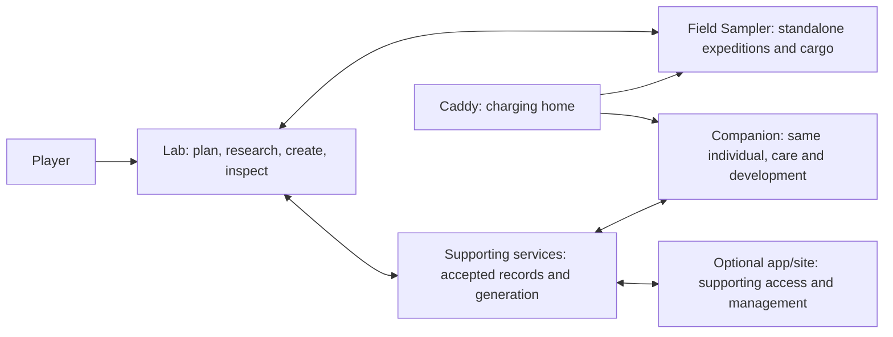

# Critter Lab: the product and the plan

**Connected product plan, 27 September 2026.** This connects the existing accepted direction; it does not approve open rules, visual designs, engineering choices or dates. Domain specifications remain authoritative for their details.

## The experience we are building

Critter Lab is a physical discovery and creature-raising game. Players bring mysteries home, investigate what they could become, make deliberate choices, and meet individuals whose identity and heredity remain recognizable as they grow, travel and produce descendants. Curiosity, experimentation and attachment are the intended experience; whether the game delivers them needs human playtesting.

The whole loop is **explore → investigate → choose → create → live together → discover more**. Players may also begin at the Lab without owning a Field Sampler. Shared equipment must not merge players' collections or permissions.

| Player moment | What makes it meaningful | What connects it to the next moment |
| --- | --- | --- |
| Choose an expedition at the Lab; carry the Probe | A purposeful gathering target with simple standalone operation | Player-attributed samples and resources return intact; fictional encounters remain distinct from measurements |
| Bring a mystery home | A sample is a cache of surprises discovered through research | Clues and retained findings support investigations |
| Investigate and prepare | Discover sample contents through studies; gather across several expeditions and retain progress | Resolve every required genomic region; missing supplies pause work rather than erase it |
| Select and create | Understand the complete supported configuration and displayed terms before committing | One qualifying sample and creation supplies produce one saved parentless individual; retries do not create/spend again |
| Deliberately open and meet | The reveal introduces an individual, not a reroll | Its identity, genome, history and finished art persist |
| Carry, care, develop and breed | Build attachment and recognizable lineages | Companion activity returns to the same individual; breeding needs compatible actual parents and permissions |

The [first-discovery story](../design/sample-to-critter-walkthrough.md) illustrates this loop. [Gameplay](../specs/gameplay.md) and [genetics](../specs/genetics.md) distinguish accepted rules from proposals.

## How the ecosystem fits together

The Lab is the extensible workbench, the Probe connects play to everyday surroundings, the Companion centers the relationship with critters, and the caddy charges the portables. The caddy does not implicitly transfer cargo or advance play. Routine play must not require opening a phone app.

Connected services preserve accepted records and perform remote generation. Content tools must produce and validate varied content without a permanent manual asset bottleneck. This is not permission to build a generic platform before a concrete content example exists. Offline devices retain only the supported temporary activity; exact reconciliation and allowances remain open. Cloud acceptance, local receipt and visual completion are different facts.

[Device responsibilities](../specs/devices.md), [system architecture](../specs/architecture.md), [cloud synchronization](../specs/cloud-sync.md) and the [proposed sample-to-critter contract](../specs/sample-to-critter-contract.md) explain these connections. Physical concepts and preliminary profiles do not establish final hardware or measured feasibility.

## Where we actually are

| Part of the whole | Current reality | Missing connection |
| --- | --- | --- |
| Game/experience | Accepted core directions, research structure and creation terms; worked proposals | Concrete content, coherent reviewed interactions, balance and human playtest |
| Software experience | Runnable host/native experiments and saved-state fixtures | One integrated journey with supporting services and real device adapters |
| Individual/genetics/art | Accepted information layers, identity requirements and concept assets | Approved worked critter example connecting heredity, expression, appearance, behavior and generation |
| Durable records/content | Architecture/contracts and experiments | Working accepted-record recovery, constrained generation and automated content tools |
| Physical kit | Concept references, preliminary profiles and firmware build scaffolds | Bench evidence, functional integration, schematics, editable cases and charging validation |

See [product status](../STATUS.md) for evidence and [build coverage](../BUILD.md) for available components. These are not complete-product claims.

## Design and delivery roadmap

Game-model foundation: [connected research game model](../design/research-and-creation.md): entity/relationship map, sample-to-record lifecycle, typed resource gathering, collection choices, worked inventory example, progression and workbench/hardware implications. Owner requested this design foundation before more screens. The prior bare process sketch is superseded as screen direction.

The [worked genetics bridge](../specs/genetics.md#worked-bridge-traits-alleles-research-and-phenotype) makes the accepted five-layer/eleven-family framework explicit in this model: traits trace to allele copies and expression rules, findings change known information, and phenotype remains distinct from current condition. The collection example uses those specific findings; arbitrary sample nicknames and disconnected glow descriptions are no longer its basis.

Research progressively decodes genome parts across gathering and Lab work. A fully decoded genome is required for incubation. Genomes vary in complexity as the game progresses; the next connected walkthrough must visibly link gathering → discovery → decoded regions → remaining research → incubation eligibility. Show a simple introductory genome without implying all later genomes take the same studies or expeditions. Exact progression gates remain open in [genetics](../specs/genetics.md#genome-imagery-and-progression).

The expedition-to-finding flow choices are accepted. Playful Pixel Lab is the selected visual foundation. Neither decision approves every screen composition or final art. The closed, unmerged PR18 screen packet reused rejected styling and is excluded from current review. The approved [Lab workbench study](../design/genome-workbench/README.md) covers one collection-to-discovery slice; separate experiments remain evidence of their stated scope only.

| Design outcome | Minimum artifact | Gate before dependent work |
| --- | --- | --- |
| D1. Continue the existing expedition-to-finding screen design | One connected walkthrough using verified selected references: Lab preparation → Probe gathering → return → study/discovery → further expedition → continued research; actual device gesture, focus and response at each step | Owner accepts the connected screen experience. Do not reopen the accepted flow or substitute rejected screen plates |
| D2. Connect research to an individual | One worked sample, resolved genomic regions, complete configuration, creation commitment, reveal and saved individual; trace visible traits to the genome | Owner steers the critter and research payoff; example content is distinguished from canonical rules |
| D3. Establish everyday continuity | Same individual moves to Companion and back; shared-player attribution and one interrupted/offline operation are worked through | Necessary care, permission and reconciliation choices resolved for this slice |
| D4. Apply the experience physically | Intended-size control/readability trials and targeted display/power/charging experiments | Owner selects hardware using measured evidence before PCB/case commitments or spending |

Current review material: [Probe sampling](../design/probe-sampling.md), [research](../design/research-and-creation.md), [accepted creation terms](../design/creation-terms.md), [design references](../design/README.md). Visual refinement is a proposal, not final artwork. Device modules, controls and enclosures are not frozen by these plans.

The [connected expedition review](../design/expedition-review/README.md) records accepted flow decisions, not an outstanding three-choice questionnaire. Material studies are V1 placeholders; broader meaningful study types are required for release and remain open. The [refinement reference](../design/visual-language/refinement-02/README.md) is visual vocabulary, not a complete approved screen set. The Lab workbench slice is now approved; Probe, recovery and the complete creation journey still need designed coverage.

**Completed foundation — Pip genetics and the Lab workbench.** Pip is the accepted qualitative worked reference. The bounded [genetic engine and locus-library contract](../specs/genetic-engine.md) defines one composed class baseline, a small locus set, explicit expression/applicability rules, validation and traceable phenotype output, followed by one compatible cross. LLMs assist authoring; algorithmic rules generate and validate candidates. The [small host proof and readable phenotype report](../prototype/genetics/README.md) now implement the bounded operations with focused validation. These demonstrated facts support the approved static Lab study below. No broad editor, full catalogue, production service or paid API use is selected.

The [current static workbench study](../design/genome-workbench/README.md) uses this same genetic content for a meaningful zone discovery and collection/workbench interaction: choose among partial genomes using typed inventory, reveal a hereditary fact and understand its phenotype consequence. This connects engine design to the game loop rather than making it a separate platform project. Selected visual vocabulary and existing Lab knob/Confirm/Back and Probe Next/Confirm remain inputs. The presented Lab composition is approved; unpictured flows still require design review before dependent UI work.

Acceptance: each moment shows what the player knows, the supported input, visible response and resulting state; Probe reveals no sample contents; the selected typography, palette, icons and art are visibly continuous; unsupported states are explicit. Stop at owner review of the connected experience. If lineage remains uncertain or two correction rounds fail, resolve the framing with the owner before more production. Scope and effort for any new artwork must be stated before generation; no unsupported calendar promise.

## Implementation plan: build the reviewed journey in usable increments

| Increment | Usable result | Dependency and relevant acceptance |
| --- | --- | --- |
| 1. Reviewed research slice | A sample can be investigated, findings retained and a complete supported configuration selected through the agreed interactions | Accepted D1 screen experience and D2 worked content; exercise normal path, missing supplies and restart without extra spend |
| 2. Saved creation and continuity | Explicit creation yields one durable individual that can be reopened/restored without reroll or duplicate spending | Chosen creation/record boundaries; test uncertain request and restore the same identity. An interim local simulation must be labeled |
| 3. Identity-driven content | The saved individual has validated appearance/motion tied to its traits; the example is reproducible through content tools | Approved worked critter and mappings; verify variation, recognizability, preserved assets and failed-visual retry without a new individual |
| 4. Connected virtual ecosystem | The same journey spans Probe, Lab, supporting records and Companion with explicit simulated-device limits | Ready transfer/profile/offline contracts; check attributed cargo, handoff and supported interruption/reconciliation |
| 5. Physical integrated kit | Run the journey on engineering prototypes, then one complete alpha | Selected components, authorized spending and bench evidence; include printing/scanning, controls, charging and physical identity continuity |
| 6. Ten-kit pilot | Repeatable complete kits with compatible revisions, assembly/test instructions and support | Accepted alpha and costed sourcing; owner spending approval and per-kit acceptance |

This is dependency order, not a promise of sequential projects or fixed dates. A concrete vertical slice may combine small pieces of adjacent increments; it must serve one player outcome. Existing CI/release delivery is reused. No new infrastructure programme is implied. Detail and estimate only the next ready increment after design decisions, based on its actual scope. Later entries stay coarse.

**Next iteration — gathering and progression.** Develop the [Probe-prepared resources and progression model](../design/probe-sampling.md) into one connected example: Probe capabilities → expedition opportunities/finds → Lab research methods → researchable genomic complexity. Three starting resources, rare findings enabling retained methods and progress-proportional discoveries are accepted directions. Resource identities, balance and exact Probe upgrades remain proposals. Stop at a reviewable progression example before new screens or implementation.

## How the plan is managed

Use an adapted agile workflow: one outcome-sized iteration, ordered work, a reviewable increment and a short review/replan. Design thinking resolves a named uncertainty; it does not restart discovery after selection. System diagrams descend from the ecosystem only when the next slice requires it. The game design document explains player choices and payoff; tests cannot establish fun.

| Planning artifact | Authoritative home | Purpose |
| --- | --- | --- |
| Product brief, roadmap and iteration goal | This page | Whole experience, dependencies, next outcome and exclusions |
| Living game design and worked examples | [Gameplay](../specs/gameplay.md), [genetics](../specs/genetics.md), linked design examples | Rules, player choices, identity and proposed content |
| Journey, input flow and visual vocabulary | [Design guide](../design/README.md), [experience](../specs/experience.md) | Screen/device behavior and review evidence |
| System context and contracts | [Architecture](../specs/architecture.md), [cloud sync](../specs/cloud-sync.md) | Authority, interfaces, interruption and recovery |
| Ordered implementation backlog | GitHub issues | One task per bounded outcome with dependencies and acceptance; product tasks belong in this repository |
| Evidence and acceptance | [Status](../STATUS.md), [build coverage](../BUILD.md), relevant experiment/bench reports | Distinguish implemented, simulated, measured and human-reviewed behavior |

Ready means the parent outcome, agreed inputs, consequential open choices, deliverable, exclusions, dependencies, effort bound and acceptance are explicit. Done means the appropriate artifact or integrated behavior is inspectable, relevant checks pass, specifications match, and limitations are stated. Design approval and technical validation are separate gates. Functional changes receive distinct architecture, implementation and independent technical review; documentation needs consistency/link checks, not a review panel.

The coordinator owns sequencing, integration and resource control. The owner steers UI/visual direction, game and critter choices, physical experience and material scope/spending decisions. Reviews are presented as whole player walkthroughs; repository diffs support them. Later roadmap entries stay coarse, and the next iteration is detailed only after its inputs are ready. No permanent busy roles or speculative infrastructure are needed.

## Follow only the detail you need

| Reader/question | Entry point |
| --- | --- |
| New player | [Meet Critter Lab](players/README.md) |
| Design reviewer | [Design and references](../design/README.md) |
| Builder/developer | [Run the experiments](builders/getting-started.md) |
| Rules and technical boundaries | [Specification index](../specs/README.md) |
| Compatibility/contribution | [Versions](../releases/README.md), [contributing](../CONTRIBUTING.md) |
