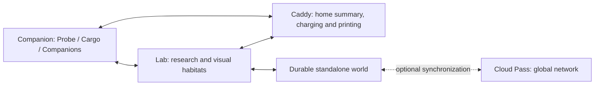

# Critter Lab: product and plan

Critter Lab connects exploration, genomic discovery and life with the critters you create. The whole journey is **explore → gather → investigate → decode → create → care and discover more**. Research preserves discoveries across expeditions; a complete genome is required for parentless incubation. Breeding uses actual compatible parents and permissions.

## One kit, three roles

The Companion combines the former separate Probe and companion roles. Lab is the home handheld workbench. The shared caddy is the tangible home for the collection. These roles do not prescribe which processor owns local simulation/storage; that allocation remains open. Docking does not transfer ownership or silently spend resources.

The core kit is designed to work standalone from the box, including nearby-kit interaction. An optional Cloud Pass adds global trading and breeding, lineage, certificates and minigames. Local core progress must be durable without cloud acceptance; global operations need their own validation and recovery. Exact local/global authority, reconciliation and entitlement protocols remain open. This is product direction, not delivered functionality or approved pricing.

## Current development gate

Electronics reference → integrated firmware/game software proof → human playtest → hardware or mobile decision. The current caddy reference is Waveshare 5.79-inch monochrome module, 792×272; the 3.7-inch proposal is superseded. Module/raw-panel integration, exact dimensions and evidence belong in [devices](../specs/devices.md#electronics-first-v1-reference-specification).

The native Lab preview and host experiments establish bounded software behavior. The complete kit, production services, device drivers, charging and printer are not implemented or physically validated. The next bounded implementation is expedition cargo → resource-funded research → saved finding with restart/retry recovery. Later creation, habitats and caddy branches must be labelled when simulated or unresolved. No PCB/enclosure commitment or purchase follows from concept art.

## Authoritative map

| Need | Source |
| --- | --- |
| Player introduction | [Meet Critter Lab](players/README.md) |
| Actual evidence and missing work | [Product status](../STATUS.md), [build coverage](../BUILD.md) |
| Mechanics and genomic framework | [Gameplay](../specs/gameplay.md), [genetics](../specs/genetics.md), [genetic engine](../specs/genetic-engine.md) |
| Research and creation | [Connected research design](../design/research-and-creation.md), [creation contract](../specs/sample-to-critter-contract.md) |
| Software/device boundaries | [Architecture](../specs/architecture.md), [cloud and local records](../specs/cloud-sync.md), [devices](../specs/devices.md) |
| Appearance and preserved references | [Design guide](../design/README.md) |
| Build and contribute | [Getting started](builders/getting-started.md), [foundation evidence](builders/foundation-demo.md) |

Older experiments and original art are preserved with their evidence limits. They do not override current specifications or reopen selected direction. Hardware proceeds only after software proof; the fallback mobile app reuses domain rules, content and durable identity.
