# Foundation demo: one expedition, one saved founder

Status: **queued design contract; not authorized for implementation dispatch**. The required sequence is preliminary hardware agreement → constrained simulation design → mockups within that environment → functional integration. The research and one-sample/one-founder rules are accepted; fixture quantities, timings, evidence mappings and creature content are provisional. This document does not select firmware, sensors, a cloud provider or production authentication.

## Entry gate

Agree a preliminary hardware specification first: controllers, displays, energy, sensors, storage, controls and viable firmware languages/toolchains. Design the simulation environment against those constraints and review its device/domain/adapter contract before creating new mockups. Mockups must use those agreed limits; integration code follows afterward. Existing experiments remain evidence, not an approved target. No new functional demo implementation is authorized by this plan.

Hardware and architecture are designed together. The preliminary specification must include an execution-placement matrix for sensing, event progression, interaction/rendering, research, generation and synchronization. For each function record its execution host (Lab, Probe/Companion controller or remote service), durable/temporary state owner, offline behavior, CPU/RAM/storage and energy assumptions, network dependency and simulation boundary. Remote generation and cloud-authoritative durable state are accepted; the Lab compute platform and exact local rules remain to be selected. The simulator reproduces this allocation rather than concealing all work in a browser process.

## The later vertical slice

The complete target is: choose an expedition at the Lab, run it on a simulated Probe while disconnected, return its haul, research all required regions, select a complete supported genome, create once and reopen the same individual after restart. Increment A ends earlier, at an accepted complete haul and one saved research finding; increment B adds full unlock and creation. The demo must make the device roles and authority transitions visible rather than join unrelated success screens.

```mermaid
flowchart LR
  Lab[Lab: select profile] --> Probe[Probe simulator: retained outing]
  Probe -->|reconnect and submit same haul| Authority[Demo authority: accepted haul]
  Authority --> Research[Lab: studies and retained findings]
  Research --> Complete[All required regions resolved]
  Complete --> Select[Complete genome selection]
  Select --> Commit[Atomic creation and spend]
  Commit --> Saved[Saved individual and retained art]
  Saved --> Reopen[Restart and inspect same record]
```

The [first-expedition fixture](../../design/first-expedition.md) supplies increment A. Proposed implementation scope: early return pauses and retains the same outing locally; no partial cargo settlement is implemented. A complete immutable haul is the only settlement input. Missed-event and completion rules remain labeled fixture defaults.

The [expedition design](../../design/probe-sampling.md), [research design](../../design/research-and-creation.md), [creation terms](../../design/creation-terms.md) and [technical contract](../../specs/sample-to-critter-contract.md) govern this slice. Supported alternatives share the sample's required region set; choosing a simpler alternative cannot bypass research. Earlier knowledge can guide investigation but cannot supply another sample's missing evidence.

## Existing code and missing connections

| Available experiment | Useful boundary | Still missing |
| --- | --- | --- |
| [Founder Lab](../../prototype/lab/README.md) | Pixel views, input/readiness guards, transactional browser save and one authored founder | Real accepted haul, server-owned inventory, complete-selection research and authority-backed creation |
| [Transfer](../../prototype/transfer/README.md) | Whole-haul replay/reopen behavior and truthful status presentation | Expedition selection/execution and cloud acceptance; its local receipt is not authoritative inventory |
| [Compatibility](../../prototype/compatibility/README.md) | Retained record bytes, identity and portrait hashes | Transactional gameplay, production schemas and migrations |
| [Pixel renderer](../../prototype/pixel/README.md) | Bounded host composition and reusable assets | Selected hardware profile, firmware and measured display behavior |

The current Node review server has no production authentication and includes writable sharing routes. Do not expose it as a secure game backend. Existing browser databases remain isolated experiments; do not silently migrate or overwrite their records.

The public checkout currently lacks its own CI workflow and deployable staging tooling. An older static deployment is not evidence that the current public source or a writable backend is deployed. Establish public-repository CI first, then package the new slice and validate its deployment independently. See [build coverage](../../BUILD.md).

## Minimal module and authority boundaries

Proposed location: `prototype/foundation/`, separate from existing stores. Use one Node process with clear modules, not a microservice per responsibility.

- **Content:** versioned expedition, study and complete-genome fixture definitions. Use explicit simulated evidence and retained placeholder assets. Exact resource values and event seeds are demo inputs, not approved balance.
- **Probe model:** portable pure transitions over a prepared expedition; records observations, event outcomes and player attribution. A browser storage adapter retains the outing while disconnected. No live server or phone is needed during the prepared outing; first download/start is online for this slice.
- **Domain:** pure validation and transitions for haul acceptance, research completeness, resource spending and creation. It neither draws screens nor calls storage/network APIs.
- **Authority repository:** single-process serialized transactions over one versioned server save envelope for this bounded slice. Reread committed data, atomically replace validated state, and preserve corrupt/unsupported bytes. This is a proposed host persistence choice, not a production database or power-loss guarantee.
- **HTTP adapter:** bounded requests to domain/repository; server-established demo player context, not a player ID trusted from the request. Initial access is restricted to local or access-controlled staging. Fixed demo identity is not account authentication; unknown actor/device contexts fail closed.
- **Lab client:** view/controller/render adapters consume authoritative results. Separate selected draft, submitted operation and accepted record; retain revision and whole-gesture guards. Reuse existing helpers only where their contracts match; do not make old fixed-founder logic decide new outcomes.

“Authoritative” here means the one demo service owns accepted effects. It does not establish production cloud identity, sensor authenticity, anti-cheat or cross-region durability. Caddy, Companion, app and website remain contextual roles, not new implementations in this slice.

### Hardware and firmware portability gate

The browser is a visual/behavioral host, not the target firmware architecture. Keep domain transitions, serializable facts and content requirements separate from browser storage, DOM input, Node files and HTTP. Do not promise source-level portability of JavaScript: shared behavior can require target-language implementation with matching contract examples.

Before freezing simulator device profiles, hardware design must narrow controller/display candidates, energy budget, sensing cadence, storage limits, controls/HID and supported languages/toolchains. Framebuffer size, input layout, refresh model and firmware language remain provisional until that evidence is available. Then define target adapters and measure resources on representative hardware; browser timing and host memory do not establish those budgets. CI baseline work is independent. The headless authority kernel is technically separable, but its dispatch is also queued under the agreed sequence.

## Commit and recovery behavior

Each request binds a stable operation ID to its player, subject, pinned versions and immutable payload. Exact retries return the saved result; changed payloads and cross-player access fail. A local Probe receipt cannot spend resources. Accept the complete haul and its deduplication result together before offering its inventory to research. Never discard the last local copy solely because bytes were sent.

Research spends displayed fixture supplies once and retains findings. Reject unsupported studies and creation while any required region is unresolved. Creation atomically consumes the one sample and displayed supplies, saves the selected genome/initial expression and individual, and retains research history. Concurrent submissions cannot spend the same sample twice. Back or lost replies do not cancel accepted work.

Use pinned retained portraits for the initial slice; no new generation service is claimed. Missing art leaves the individual intact and unavailable visually until the same asset returns. Retry/reopen does not reroll genes, charge again or silently substitute art. Resetting a browser restores accepted records from the service; losing an unsynced outing remains a possible loss. Console-generated fixture inputs must enter the same domain path with honest provenance.

## Required delivery order

1. **Preliminary hardware agreement:** review the hardware proposal and record supported display, input, memory, power, sensor and development-environment constraints. No selected components or languages are inferred here.
2. **Simulation contract:** define device profiles, simulated clocks/evidence, persistence and fault controls against those limits. Separate behavioral simulation from physical claims and domain logic from host adapters.
3. **Constrained mockups:** demonstrate the Lab/Probe flow within that environment. Review actual input/readiness and resource limitations before functional integration.
4. **Functional increments:** only after those gates, integrate accepted complete haul → one saved finding/reopen (A), then full unlock → saved founder/reopen (B). Add the bounded HTTP/access boundary before remote writes.
5. **Staging delivery:** package the exact tested revision, keep mutable saves outside releases, validate access controls and smoke-test restart/reopen. Rollback must respect save-format compatibility; static rollback does not prove backend recovery. Unattended transport and remote access remain separate gates.

Independent infrastructure scope is limited to a public CI baseline: lockfile install and existing Node tests with pinned official actions and read-only permissions. No secrets or deploy jobs are implied, and CI success does not approve the queued functional scope.

### Queued functional coder scope — not for dispatch yet

Own only new `prototype/foundation/{content,domain,repository,demo}.mjs`, its README and `prototype/tests/foundation.test.mjs`. For increment A, supply one qualifying complete haul and one supported study with unresolved regions remaining; preserve existing experiments unchanged. Return accepted haul → saved finding → reopen and explicit limits. Increment B later adds the declared complete configuration set and creation transaction. Do not implement account management, dynamic generation, crafting economy, physical transfer or speculative general registries.

Increment A acceptance: accepted haul replay adds nothing; altered/cross-player requests fail; partial haul settlement is unsupported; study retries do not spend again; lost-response/reopen retains the same accepted inventory, finding and unresolved regions; corrupt/unsupported saves remain intact. Increment B additionally rejects incomplete-genome creation, resolves concurrent creation to one founder and preserves exact genome/expression/origin/assets across reopen and missing art. Use actual temporary-file reopen and injected failures around commit. These checks prove the bounded host contract, not hardware flash durability or production authorization.
