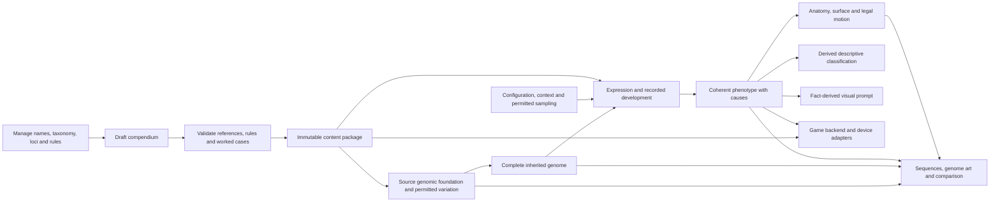

# Genome authoring and simulation workbench

Status: **provisional host authoring proof**, separate from the game and device simulator. The shared catalogue/model constructs anatomy, resolves surface expression and derives guarded fictional movement. It does not choose a creature class first. The original [five-locus Pip proof](../genetics/README.md) is preserved as a legacy reference.

Start with the [production pipeline and current gaps](../../specs/architecture.md#current-authoring-evidence-and-unsolved-construction-range)
and [image-led art handoff](art-template.md). The current diagrams and finite
construction grammar do not satisfy the owner's reference-quality or
bear/cat/cow/firefly anatomical-range brief. Valid records, replay and source
geometry are delivered parts; a useful general creature and pet generator is
still unfinished. The fixed anatomical V1 baseline was also rejected: inherited
accessories and proportions do not satisfy genome-derived organization.

Three independently replayable packages remain available: the diagnostic catalogue has **48 records: 42 executable and six drafts**; the continuous-static catalogue has **58 records: 50 executable and eight drafts**; the pet-material catalogue has **62 records: 54 executable and eight drafts**. The pet profile adds leading-region and ocular proportions plus actual rooted fur/feather construction. Its growth/deformation records remain drafts. All eleven dimension families remain inspectable, with unmodeled families shown as gaps. `validated` denotes schema-executable content; every record remains `provisional-host-proof`, not approved creature biology.

The initial **Generate creature** workspace uses the separate **Compositional
source experiment · v4** package, then uses one action to sample a valid genome
and constructed source scene. Its retained source illustration and short
copyable image-led Gemini instruction appear together before the initially
collapsed genome editor. Attach the shown image separately; the workbench does
not upload it. Current source6 and retained source3/4/5 derive their pet instruction plus a
short shape, extremity, owner-material and named-colour description through
`art-prompt-summary/1`. Clause witnesses and unsupported semantic labels stay
in Advanced inspection. Older unrelated profiles retain their original short
handoff and full semantic audit. Compact scene export retains inputs and expected
hashes; verified import rebuilds the source and derives the current summary,
never trusting imported prompt text. Returned feature changes are creative pet
proposals, not inherited facts.
This is an
authoring experiment, not a new game resident or canonical palette selection.
The original **Anatomy-diversity diagnostic** remains available. Its resolved graph
can contain radial or bilateral volumes, articulated contacts, membranes and fins;
it lacks coherent joined tissue and the narrow package's face/covering modules. The PET package is
an explicit **Narrow face/material calibration**, not the general creature
generator. Existing draft catalogues and retained PET records are preserved;
switching packages is deliberate and never migrates their genomes. See the
[source-and-output diversity diagnosis](evidence/diversity-diagnosis/README.md).

## Run and inspect

### Retain a manually returned pet proposal

After resolving a current source and its short prompt, choose the returned
PNG/JPEG/WebP in **Returned pet art**, enter a provider label and explicitly
select **Retain pet proposal**. Reopening that exact source/prompt in the same
browser shows its linked proposals. Editing, generating or changing the source
clears the selected file and hides previous art; pending work is cancelled.
Errors stay inside the panel and preserve the resolved source preview.

The browser-only `retained-pet-proposal/1` record binds the exact source record,
input/result/scene digests, consumer versions/foundation, prompt text and SHA256,
unchanged bitmap bytes and SHA256, dimensions/MIME, provider label and compact
source replay recipe. Download the native bitmap and linked JSON metadata as
two files. **Copy linked metadata** copies the identical indented JSON when a
browser cannot confirm downloads; local feedback reports clipboard success or
failure. This is export portability, without a new image-import service.
The separate IndexedDB `proposalBlobs` store holds eight distinct proposals;
a ninth rejects without eviction. Files are at most4MiB,4096px on the long side
and16million decoded pixels. Existing localStorage genome slots are unchanged.
Browser storage can be unavailable, full or cleared; keep exported files for
durable retention. All returned art remains **proposal**, with no acceptance,
inherited-fidelity claim, gene change, automatic provider call or animation.

### Compositional Generate and all eleven genomic branches

`genomic-compositional-source-experiment@4` uses separately pinned
`developmental-compositional-source/4`, `compositional-source/6`,
`compositional-surface-fields/4` and `compositional-reference/6` rules. All
retained version1/2/3 packages remain selectable with their original rules. The [content contract](../../design/anatomical-source-prototype/compositional-contract.md)
and [source-art rules](../../design/anatomical-source-prototype/compositional-art-direction.md)
replace the universal head/neck/torso/support rig. Ordered inherited contributors
resolve serial or branched region graphs, depth, bilateral/radial frames,
unequal growth, bend, broad/narrow joins, optional head/face modules, distinct
free/contact chains and independently rooted thin surfaces. Zero chains and
headless bodies are legitimate. A class name never selects an assembly.

The current foundation carries **111 ordered locus pairs**: the retained
98-pair union plus six region-shape/terminal/fur and seven ear/tail contributors. The
original union combines the broader 50 and structural 50 records, sharing
the two exact pigment definitions once. Six draft definitions remain visible
without invented allele copies. All eleven genomic branches appear in the
current authoring record, including branches whose locus/capability contracts
are still missing. Each record retains its exact source/version, contributions
and expressed, inactive or unimplemented consumer status. Sixty-three potential construction
contributors are not the whole project genome, and111 carried vectors do not
mean111 implemented phenotype features. Unimplemented movement, physiology or
other branches are not assigned zero capability or inferred from appearance.

The separate five-stage record inspector preserves foundation, inherited,
expression, phenotype and lifetime information. It does not replace the eleven
genomic branches or make lifetime state inheritable. Part, root, pigment and
material causes refer to retained contributors. New compact request/replay
recipes pin the exact registry definition before its derived top-level
`foundationPin` is attached. A full retained-catalogue/tree codec digest includes
that metadata and is deliberately a different hash boundary. Recovery rejects a mismatched foundation or
source digest rather than substituting another version. Anatomical V1 and all
older packages remain available under their original rules.

Original `compositional-source/1` records also retain their exact builder and
`compositional-reference/1` output. The corrected `/2` constructor intersects
the visible retained mesh for narrow contacts; `/1` used analytic ellipsoid
roots that could leave a visible gap. Version1 Generate and Resolve retain `/2` and
`compositional-reference/2`. Retained version2 uses its104-pair foundation and
`/4` construction/reference. Retained version3 requires111 explicit pairs and
`/5` construction/reference; no old input acquires missing copies or changes its
consumer. Reopening an old record never silently upgrades it.

Original vocabulary `/3` construction/reference records remain exactly replayable.
The `/4` reference changes only fur outlines to .80 times their already-lit fill
and .70px width at512; geometry, material2, copied pigments, light, camera and
clipping stay unchanged. Actual `/3` inspection withheld fur-readability acceptance
because its ribbons blended into smooth skin. Actual `/4` inspection found
visible scattered dashes rather than a coherent coat; fur material craft remains
HOLD. Neither reference is approved finished pet art. The factual primary-body
fur cue remains available to that retained profile's pet brief.

Source5 adds optional typed head-rooted concave ear sheets and one true continuous
axial tail, independently gated by seven exact new pairs. SERIAL uses its terminal
primary owner; FAN uses its root. Actual facet roots, directed surface normals,
owner frames and shared parent/child tissue witnesses remain inspectable. Ears
and tail are smooth body-pigment owners; they imply no hearing or motion. Fur's
new material3 consumer replaces each of48 primary roots with one overlapping
three-piece tapered/fringed cluster, at most1008 material fragments over seven
owners. It preserves inherited potential length/flow, exact local pigment clips
and complete opaque skin. [Actual source5 evidence](evidence/anatomical-roles/README.md)
gives the continuous tail a narrow readability pass; ears remain provisional and
coat craft remains HOLD because the clusters still read as isolated marks.

Current catalogue4 keeps those exact111 locus definitions and ordered values,
with a new foundation/baseline and source6/material4/reference6 identity. It
uses a continuous actual-facet mantle over complete opaque primary tissue,
shared pinned pigment seams/caps and inherited fibre length/flow. Finite limits
are672 refined triangles and1344 clipped polygons per owner,4704/9408 total.
Broad ears use the same copied length/root with explicit .90L width, .20L
recess and mirrored15° head-local yaw. The [current representation contract](../../design/anatomical-source-prototype/compositional-contract.md#continuous-coat-mantle-and-broad-ear-profile)
owns the equations and limits. Actual source6 craft is pending; oldsource5
records and authored-parent3 forks remain literal. Parent4 drafts have their own
storage slot and compile/replay source6 without migrating parent2/3 inputs.
Founder generation samples categorical/presence states explicitly, avoiding the
earlier 75% ON bias; numeric/pigment copies remain independent. All declared
mixed-copy maps remain valid for editing and inheritance. Generate keeps the
first eligible complete input within the declared ceiling, without ranking
appearance, imposing animal quotas or repairing genes. The actual reference
uses owned local pigments and smooth/scales or whole-primary fur fields on
the composed 3D source. Primary envelopes resolve inherited ovoid/barrel/tapered
profiles and bilateral p2/p3/p4 cross-sections; radial cross-sections remain
circular. Contact terminals resolve rounded/pad/wedge forms in their own frame,
with no ground or locomotion claim. Fur remains a bounded facet-rooted material
field over opaque skin, separate from128 scale cells. Retained material2 keeps
its336 ribbons; current material3 has the declared1008-fragment cluster bound.
It is a low-poly static construction reference, not finished HiBit pet art,
animation, a physical movement model or full organism-range acceptance.

### Anatomical Generate

The new `genomic-anatomical-source-experiment@1` package uses
`developmental-anatomical-source/1` expression and `anatomical-source/1`
construction. Its [content and authoring contract](../../design/anatomical-source-prototype/genomic-contract.md)
defines 34 carried locus pairs: 32 new anatomical/material contributors and two
exact pigment imports. Each copy is retained, including contributors whose
owning module is off. Numeric means, presence operators and complete pair maps
resolve before any geometry or descriptive classification is chosen.

One common composition connects a head and support-bearing core through a neck.
Independent presence contributions add a muzzle/jaw, paired head surfaces,
posterior region, exterior eyes and rooted wings. Two or three paired core
stations produce four or six genuine two-link support chains with shaped
terminal volumes. Head/core proportions, support span and splay, terminal size
and wing envelopes alter geometry; compact/lean/wing-bearing examples are authored
copy sets, never random-generation targets or species presets.

The existing ten body and six secondary pigment alleles remain independently
sampleable. Unlike pigment copies create surface-local fields, not an averaged
colour or an artist-selected recolour. Smooth/scales kind, scale coverage and
scale size have explicit surface owners; their patches belong to the skin.
Scales are not new attached body objects. The reference uses opaque coarse
three-dimensional volume and a consistent light, with no construction labels
painted into the model-facing image.

Generate displays the actual resulting source beside the unchanged short Gemini
instruction. Save/export retain the new version and complete copies; reopening
reconstructs from those inputs. Earlier packages and records continue through
their original rules. Catalogue source definitions live in the versioned content
file; individual copy editing does not rewrite the content library. The
framework's broader eleven branches are visible alongside the construction
subset in the newer compositional package.

This retained V1 hardcodes a head, neck, core and four/six supports. The owner
rejects that fixed organization; it is kept for exact older-record recovery.
It does not yet provide tails,
hoof/toe details, fur, antennae, emission, motion, swimming, biomechanical
performance or every requested animal form. The shown source is not finished
HiBit pet art. Creative model output remains a separate portrayal; automatic
production assets and animation remain later pipeline consumers.

### Complete radial source scene

The [radial scene experiment](evidence/radial-scene-workbench/README.md) connects
eligible resolved radial anatomy to the same Generate and verified-replay path.
`module-scene/3` retains the existing catalogue and inherited source, adds a
declared diagnostic eye slice at its actual longitudinal X depth, and maps
skin/scales over the ellipsoid's X/circumferential surface. The clean end-on
reference shows front fragments; a separate Advanced inspector exposes depth.
Axial regional anatomy continues to use scene2. Historical scene1/2 records
reconstruct their exact original recipes.

The controlled eyes-on skin/scales pair demonstrates source integration, not
random variety or finished pet art. Eye circles are diagnostic modules rather
than exterior tissue; conservative patch exclusions and the existing geometry
budgets can reject valid genetic sources. Fins, membranes and broader radial
topologies remain unsupported. No sampler quota or repaired genome supplies a
winner. The practical image-led sentence remains unchanged and separate from
the full audit. Run `node --test radial-scene.test.mjs` for the changed risks.

### Central radial source proof

The standalone [radial proof](evidence/radial-source-proof/README.md) adds
`graph-radial/1` as a consumer of existing resolved anatomy. One central volume
and three actual XYZ-rooted contact chains project along X into YZ. A height-only
relative changes the central envelope; a secondary-pigment control remains
visually identical because those copies are inactive. Complete source packets,
new construction identities and common-scale references remain inspectable.

Run `node --test graph-radial.test.mjs` and
`node construct-radial-proof.mjs --out evidence/radial-source-proof` with the
existing host runtime. This contacts-only proof retains eyes and covering facts
as **not projected**. It does not change the catalogue, sampler, current Generate
scene or saved records by itself. The complete diagnostic scene above is a
separate consumer; physical exterior features and finished pet portrayal remain
unfinished.

### Body organization experiment

The separately versioned [source experiment](evidence/body-organization/README.md)
adds inherited regional-growth and join-width contributors. It addresses the
equal regional lengths and fixed narrow joins that produce repeated bulb chains.
New `developmental-regional-growth/1` expression and `graph-source/2`
construction retain unequal station dimensions, roots and pigment ownership.
Older rules, saved records and `graph-source/1` retain their original behavior.

Run `node --test body-organization.test.mjs` and
`node construct-body-organization-proof.mjs --out evidence/body-organization`
with the existing host runtime. The body-only proof compares compact contact
and continuous tapered fin organizations, a growth-only inherited contrast,
an inactive single-body control and eight fixed random searches. Eyes are
explicitly off in that body-only proof; this is source geometry, not finished
pet art.

The separately identified `developmental-regional-scene/1` foundation carries
the same 50 executable contributors into the existing Generate workspace.
Its complete `module-scene/2` reference combines that body with actual inherited
optional eyes and skin/scales through `ocular-module/3` and `body-covering/2`.
Consumers independently reconstruct the source and reject incompatible or
overlapping geometry. They do not move eyes, repair plates or turn genes off
to obtain a winner. The short Gemini sentence is unchanged.

Run `node --test regional-scene.test.mjs` for the changed tuple, actual HTTP
transport and exact old-record replay checks. The [retained full-scene proof](evidence/regional-scene-workbench/README.md)
contains an eyes-on skin/scales contrast and one bounded random search. Earlier
packages remain selectable and keep their exact saved inputs, scenes and
prompts. Broad body diversity is still incomplete: this scene2 source path
supports axial organization; eligible radial anatomy now uses the separate
scene3 consumer described above.

### Candidate inherited pigments

The [colour comparison](evidence/pigment-vocabulary/README.md) proposes eight
additional body hues and four secondary-module hues beside the exact legacy
controls. The separate [candidate host experiment](evidence/inherited-pigment-experiment/README.md)
uses the existing two pigment loci, partition operator and construction rules.
It retains controlled colour-only variants and bounded random-generation results;
canonical colours and game residents are unchanged. Candidate v2 remains
selectable; its inherited pigment vocabulary also feeds the new regional
scene experiment. Old packages retain their exact catalogues and records.
Initial Generate waits for optional package loading. Deliberately selecting an older
package or importing a record prevents a late candidate response from switching
its source. If optional candidate loading fails, the labelled older fallback is
available; there is no silent migration or replacement creature.

Run `node --test pigment-proof.test.mjs` and
`node pigment-proof.mjs --out evidence/inherited-pigment-experiment` with the
existing host runtime. Candidate records pin their own catalogue foundation;
old records and compact strings continue to pin the exact old foundation.
The diagnostics demonstrate expressed colour ownership, not production pet art.
Validated partition-map records with one known palette output support at most
ten alleles, with an exact typed map for every unordered pair. Other loci retain
the four-allele ceiling and their existing stricter operator checks. This bounded
vocabulary extension does not change old foundations or maps.

### Reversible tree/string experiment

The [codec contract](codec-contract.md) defines a standalone host proof for
packing inherited records or complete retained snapshots into a reversible
string. Five layer branches and single-instance loci remain inspectable in the
decoded tree. An exact pinned foundation supplies repeatable dictionary and
mapping data; embedded mode carries it. The codec preserves supplied copies,
provenance, context, literal phenotype and evidence rather than rerunning a
creature generator during decoding.

Run `node --test genome-codec.test.mjs` and `node codec-proof.mjs` with the
existing host runtime. [Retained strings and measured roundtrips](evidence/genome-tree-codec/README.md)
separate inherited G from complete T, and shared S from embedded E. These
file/string artifacts do not reuse the authoring POST or local import limits.
UI, fingerprint art and QR sharing are subsequent consumers; the current
`#G`/`#E` prompt references remain lookup hashes.

### Shared exterior construction experiment

The standalone `graph-source/1` experiment tests structural breadth after existing
genetic resolution. One constructor turns supported resolved graph relations into
a continuous exterior, local surface domains and rooted appendages. It compares
one dominant body volume with articulated contacts against an axial multi-volume
body with fins, plus a proportion-only variant. These are selected genomic test
inputs, not organism classes or generation presets. Prior evaluator, retained
records, prompts and the default workbench UI remain unchanged.

Run `node construct-source-proof.mjs --out evidence/graph-source-proof` from this directory with the existing Node
host runtime. The outputs in `evidence/graph-source-proof/` retain original
input/result identities separately from the new construction identity, with
neutral common-scale silhouettes and construction manifests. See the evidence
README for actual checks and remaining gaps. This projection is static structural
evidence, not pet illustration, animation, physiology or game/device integration.
Unsupported radial, membrane, branched or marked inputs reject explicitly in this
first profile. Facial and covering construction remains subsequent work.

### Ocular module experiment

A separate 51-record package extends the broad graph with three inherited
contributors: eye-pair presence, placement and size. `developmental-ocular/1`
retains `developmental-analytic/1` as the body convention and `ocular-module/1`
as the feature constructor. One full genome controls both; this does not use the
narrow PET gate or choose a species. The three existing browser packages and their
records stay exact.

Run `node construct-module-proof.mjs --out evidence/graph-ocular-proof` from
this directory. The scene combines the verified body construction with optional
eye geometry in the leading local domain. Unsupported placement or clearance
rejects without changing anatomy. Common-scale comparisons show contact and fin
bodies, size-only and placement-only changes, and two eye-absent genomes whose
latent parameter differences do not change visible geometry.

This package is a standalone static construction proof. It is not added to the
default UI package list; generic diagnostic and Gemini prompt outputs explicitly
defer for it rather than implying that they depict its new loci. See
[the evidence](evidence/graph-ocular-proof/README.md) for actual validation and
thumbnail legibility. Coverings, oral features, vision physiology, finished pet
illustration, animation and game/device integration remain outside this slice.

### Broad body-local covering experiment

The separate `developmental-covering/1` package extends the ocular catalogue with
inherited covering kind (skin/scales), extent and element scale. Its 54 records
retain 48 executable contributors and the same six drafts. Body construction uses
the preserved analytic convention; opt-in `ocular-module/2` retains the same eye
geometry constants with the actual new source-rule identity. Old packages and
the prior ocular profile remain independently replayable.

Run `node construct-covering-proof.mjs --out evidence/graph-covering-proof`.
The standalone consumer retains overlapping scale plates in a declared body-local
field, preserving source pigment ownership and clearing eye/root regions. Skin
retains extent/scale as inactive. The comparison shows skin/scales on both body
organizations, extent-only and size-only effects, and an unchanged skin scene
despite different latent parameters. See [the evidence](evidence/graph-covering-proof/README.md)
for validation and actual 256px field/exclusion inspection.

This remains source construction, not finished pet art. Fur and feathers need
their own rooted material and contour operators. Full scene generation, browser
integration and faithful renderer prompts remain separate subsequent work; this
package is not added to the default UI list. Generic diagnostic, geometry-reference
and Gemini prompt consumers explicitly defer for it rather than omitting features.

### Connected scene authoring experiment

The connected experiment adds the 54-record covering catalogue as an optional package
in the existing React/Mantine interface. The original diagnostic, calibration and
covering packages remain independently replayable beside the separately versioned
pigment candidate. One post-resolution scene aggregates
the solved body, optional eyes and body-local skin/scales without rewriting the
genetic graph. Its source identities, full construction artifact and renderer
projection have separate versions and digests.

Generate searches at most 1,024 total unmodified whole-genome draws, accepting
only a genetically resolved input whose body, eyes and covering construct.
The declared candidate-seed sequence is the requested unsigned seed plus the
zero-based draw index, wrapping at 32 bits. Rejection counts identify genetic,
body, ocular and covering stages. Exhaustion returns no replacement creature;
art-prompt overflow is a separate presentation failure rather than a gene repair.

The positive Gemini brief describes the verified continuous exterior, rooted
appendage counts, optional eyes and actual pigment/plate fields. Detailed
coordinates remain in the exportable scene artifact, addressed by profile and
digest references in the bounded prompt audit. Diagnostic inspection ink is not
an inherited pigment. The existing subject, binding and prompt bounds remain.
The new template uses explicit pixel-art craft and compact plain proportions,
without brand-context assumptions or a replacement palette. Short `#G…` and
`#E…` references connect the brief to inherited and expressed identity; their
full hashes remain in the export. They do not encode a whole genome or implement
QR sharing.

Scene replay sends a compact retained-input and expected-identity envelope through
the existing 64KiB loopback endpoint. It reconstructs all geometry and checks
declared identities; embedded imported geometry is neither sent nor trusted.
New scene briefs use module-scene-art/3 to name each surface's ordered local
pigment fields. Known /2 compact imports retain their exact original prompt
after strict independent reconstruction; resolving those same inputs afresh
uses /3. Source geometry and inherited/expression identities stay unchanged.
The complete artifact remains available for local inspection/export. Copy edits
invalidate the current preview and prompt. This connection does not broaden the
construction profile or deliver finished pet art, fur/feathers, motion or game UI.

Use the existing host Node runtime22.12 or later and pnpm11.19.0:

```sh
cd prototype/generator-workbench
pnpm install --frozen-lockfile --ignore-scripts
pnpm run build
pnpm start
```

Open **http://127.0.0.1:4381**. React/Mantine/Vite provide the developer interface; this is not a device renderer. The same loopback server serves a built static UI and bounded same-origin JSON endpoints. No database service, account, telemetry, game-save access or per-frame model call is introduced. Device screens continue to use LVGL and their existing target toolchains.

Connected authoring journey:

1. Generate a random creature in one action. A fresh retained seed samples inherited copies and accepts only a model-valid constructed graph, without species presets or mutation-based repair. The current visual result is a structural diagnostic, not broad or finished pet art.
2. Inspect the resulting whole genome, choose one of eleven dimensions, and select a locus to see its copies and expressed trait. All records and modeled/draft gaps remain accessible.
3. Optionally edit a selected copy, then resolve its changed input. Inspect separate baseline/inherited/resolved summaries, sequences and fingerprint fields. Display order is not a chromosome or linkage claim.
4. Inspect anatomy/surfaces, derived movement and causal sources, and retain a candidate for comparison. Catalogue authoring is a separate advanced task, not required to create a valid random input.
5. Sample expression with a separate seed. Only permitted marking placement changes; inherited copies and anatomy remain unchanged. Suppressed markings cannot be activated through sampling.
6. Export and replay a complete experiment. Embedded outputs are recomputed from retained inputs/content and checked against digests.
7. Validate and export catalogue drafts. Released content and retained individuals are not rewritten by a naming edit.
8. Export the [preset art template](art-template.md) filled from resolved facts. Large projections reject explicitly rather than discard body parts or constraints.

The legacy Pip interface remains at `/legacy` with its original evaluation route. It is a diagnostic reference, not the expanded engine or production artwork.

## Authoring inspection contract

The [candidate flow browser evidence](evidence/candidate-workbench-flow/README.md)
records actual Generate, prompt paste, old-version import, edit invalidation and
unavailable-backend recovery. The final narrow-header correction received actual
UX inspection at800px and1280px; source diagnostics remain separate from pet art.

Actual revised captures passed the bounded layout/hierarchy review, including
the selected editor at1280px and two different random results. This is mediated
visual review plus source inspection; coordinator-operated browser actions and
technical validation are separate evidence. The primary
task is **Generate creature**: one fresh random valid genome and its structural
result, then whole-genome orientation → dimension → locus → copies and resolved
trait. Selected-copy editing is optional after generation, not a design-from-
scratch prerequisite. Keep all eleven dimensions visible,
including modeled/draft gaps. Dimension filtering, All and search must retain
access to every locus. Navigation grouping is not chromosome or linkage topology.

Show the selected locus's purpose, labeled copy values, editing controls,
resolved value/unit/state and prerequisites together. A scoped locus list should
not become a wall of simultaneous copy forms. Use visible variant buttons or
segmented choices for Copy 1 and Copy 2; do not require repeated dropdown opening.
Baseline is the declared content
baseline; inherited copies are the current genome; expression is the last
resolved output. Keep their summaries and whole-map inspector readily accessible.
Raw JSON, exact sequences and source records remain available in collapsed
advanced inspection. The **Gemini prompt** appears beside the structural preview
with one **Copy prompt** action. Current source6 and retained source3/4/5 use the base
“Turn the attached critter into a cute pet, shown alone in rich high-bit pixel
art.” followed by an actual-source description, targeting25–45 words without
truncating major enabled counts or owner materials. The
[brief contract](../../design/anatomical-source-prototype/compositional-contract.md#source-derived-pet-brief)
owns exact role aliases and limits. Other packages keep their original sentence.
Its image is the current scene reference or the old package's canonical diagnostic,
without selected-locus amber highlights. Editing inputs
clears the prompt with the preview. A failed Generate against unchanged inputs
retains the last successful result and its prompt, reports that no new creature
was generated, and keeps its accepted seed distinct from the failed request's
seed. A missing or unresolved source image disables copying. Semantic projection
errors from older full audit projections remain in Advanced inspection; a missing
current vocabulary summary disables prompt copying with an explicit reason,
while its valid source and verified image remain available for display/download.
Wording failure never rejects a constructed source or changes candidate selection.
This panel makes no provider call. Summary version, sourceRecordId, sceneDigest
and clause witnesses are outside the copied text. The wording consumer changes
no input, result, scene or replay identity. Compatible compositional definition
drafts are now supported as separate authored foundations; new loci, operators,
arbitrary palettes and physiology remain outside this editor.

### Author a compatible compositional draft

Choose the current compositional package and open Locus compendium. Edit a
record's metadata, bounded numeric allele contribution or complete existing
pair map in the record JSON, then **Validate & save record to draft**. The editor
bumps the record version and stores a separately pinned authored revision;
the current experiment remains unchanged. **Use draft in experiment** explicitly
selects those compiled definitions while keeping the current inherited copies.
Resolve consumes the edited contributions; Generate samples the draft's allele
definitions under the same founder policy. No stock catalogue is rewritten.

For example, `growth.region-taper` gentle .85→.70 stays within its original
[.45,.85] domain. At depthtwo its changed mean scales actual child geometry;
strong/gentle resolves .575. At depthone the carried value remains inactive.
The [actual authoring evidence](evidence/compositional-authoring/README.md)
retains this definition edit, its changed source, one ordinary Generate draw,
exact prompt and page-reload/import recovery.

Baseline label/description metadata and the exact parent's104 or111 starting pairs can be
saved separately. **Load active draft starting copies** deliberately replaces
the experiment's copies for Resolve; Generate never inherits that template.
Runtime operator references, IDs/allele order, targets, families, guards,
statuses, budgets and the existing10/6 pigment values/maps remain fixed.
Each mixed pair must remain inside the original domain; cross exponent values
must be pair-closed in2/3/4. Unsupported records remain unsupported.

Export/import/restore retains `compositional-authoring-delta/1` plus its compiled
definition pin. The full parent-specific104 or111 pair union plus six drafts and edited-source provenance are rebuilt
against the exact published parent, so a restart needs no temporary registry.
Requests/replay use the compact recipe; recipe plus genome must fit64KiB or fail
explicitly. Parent2/3 drafts use separate local-storage slots, preserving both
earlier compositional and saved legacy catalogue drafts. The eight creature-record
slots are unchanged. Published catalogue1/2 and exact source1–4 recipes remain
selectable/replayable; parent3 never supplies missing copies to those recipes.
See the [authoring contract](../../design/anatomical-source-prototype/compositional-contract.md#compatible-authored-foundations).
Failed import or save also preserves the unchanged verified current result;
unverified imported outputs never replace it. A changed input has no current
result to restore.

Template version4 keeps the full semantic audit text as a self-contained pixel-art illustration brief,
followed by compact semantic body, appendage and material descriptions. Diagnostic
polygons and surface samples are construction aids; they do not prescribe every
finished contour or describe scales as detached objects. Available appendage
form comes from actual dimensions/profile facts, and material prose retains
field, scale, flow and pigment ownership. Subject pigments come from resolved
fields; the craft paragraph cannot replace them with a generic palette.
Complete
geometry, causal trace, identity and limitation bindings remain in the exported
packet and advanced source inspection. The workbench handles replay/conflict
validation before creating the renderer text. [Contract and retained comparisons](art-template.md)
separate prompt review from anatomical fidelity and actual pet-art acceptance.

Editing copies invalidates the current result, highlight and export. Resolve
edits differs from generating a new creature. Generation uses a fresh seed and
the existing bounded valid sampler; retain the seed for replay. A known example
loads and resolves in one action using its explicit inputs, without a stale
state closure. The retained pin survives edits. Comparison
puts changed values/states first, with unchanged outputs available explicitly.

The result is a **structural diagnostic**, not finished creature art. Improve
framing with a shared inspector zoom while preserving aspect ratio, retained
geometry and relative world scale. Comparisons use one common camera/scale;
independent normalization must not hide proportion changes. Explain direct
contributors and prerequisite influence when a selection highlights several
regions. A larger diagram does not establish better morphology or art.
The opt-in continuous constructor requires bilateral organization, at least
three axial stations and fins, without articulated limbs or membranes. That
restricted construction explains much of the repeating silhouette. This UI
repair makes its facts easier to inspect; it does not implement the liked
novel pet's body/limb grammar or the owner's intended broad organism variety.

The [liked pet concept](evidence/art-reset/README.md) is separate proposed art
direction, unbound to the selected genome. Do not present it as a resolved engine
result or change it in response to copy edits. This repair adds no morphology
engine, provider call, catalogue, game/device UI or deployment behavior.

### Versioned diagnostic surface display

Advanced selected-locus inspection and comparisons use **`surface-detail/1`**.
The primary source image uses the retained canonical drawing bytes. This
inspection presentation version draws retained anisotropic patch
orientation in both generic and continuous views. In continuous views,
`fine-ridged` surfaces gain four evenly spaced neutral, quarter-opacity diagnostic
strokes in each atlas domain, clipped to the solved outline. Existing palettes,
mask boundaries, band behavior, facial modules and material construction remain
unchanged. These strokes depict texture; they do not add pigment genes or tissue.
Unknown display versions reject. Generic texture depiction was already present.

Omitting `viewOptions.projectionVersion` preserves the prior default bytes.
Stored diagnostic SVGs, canonical references, model results, digests and replay
are unchanged. The inspection display is independent of the packet's canonical
drawing. Continuous-profile turn-control values and reserve-capacity values
have no implemented consumer in their respective profiles; the inspector states
that limitation instead of implying an applied visual or behavior effect.

Focused verification is `node --test display-projection.test.mjs`. It checks
default broad-package selection, exact existing diagnostic/reference bytes,
isolated texture/orientation projection, unknown-version rejection and the actual
contrasting broad seed1/seed21 role counts. This is a diagnostic correction,
not finished character art, broad coherent surface construction or physical motion.
The actual [selected editor](evidence/workbench-usability/final-editor-1280.jpg)
shows both copy rows and their direct output together. Retained random captures
show different inputs/results, not general morphology coverage or finished art.

The experiment inspector includes both a [coherent static family experiment](evidence/critter-family/README.md) and the retained [geometry and pigment reference](evidence/geometry-calibration/README.md), with a trace manifest and CLI `.geometry.svg`/`.geometry.json` exports. The bounded projection supports volume/fin graphs and rejects unsupported projections without invalidating a valid genetic result. One matched Gemini/Sol-directed image-tool comparison preserves broad part counts and pigment roles, but does not establish exact geometry or finished creature art.

## Module boundary and evidence

| Module                                             | Responsibility                                                                                                                           |
| -------------------------------------------------- | ---------------------------------------------------------------------------------------------------------------------------------------- |
| `catalogue.mjs`                                    | Versioned locus metadata, typed contribution vocabulary, eleven-family coverage/gaps                                                     |
| `model.mjs`                                        | Pure validation, shared inherited-copy resolution, explicit construction-profile dispatch, bounded generation/crossing and causal result |
| `family-catalogue.mjs` / `family-construction.mjs` | Provisional continuous-body content; solved exterior, rooted fins, explicit ocular/oral geometry and body-local covering                 |
| `family-presentation.mjs` / `family-fixtures.mjs`  | Inspect solved family geometry and retain controlled copy-edit comparisons; never choose species or repair genomes                       |
| `pet-catalogue.mjs` / `pet-construction.mjs`       | New versioned face ratios and bounded rooted material elements, using the shared continuous solver with exact prior defaults             |
| `pet-fixtures.mjs` / `pet-projection.mjs`          | Four same-face materials, one face-only copy edit, and lossless bounded source/coordinate dictionaries                                   |
| `authoring-adapter.mjs`                            | Host records/digests, replay, presentation and fact-derived art-template projection                                                      |
| `module-scene.mjs` / `module-scene-authoring.mjs`   | Optional verified body/ocular/covering aggregate, bounded unmodified generation, compact replay and positive renderer projection |
| `authoring-identity.mjs`                           | Separate inherited/expression full digests and short lookup references; not reversible genome payloads |
| `art-prompt-summary.mjs`                           | Pure source3/4/5 pet wording from constructed roles, active facts and pinned pigment labels; separate clause/source audit |
| `anatomical-roles-{package,construction,presentation,adapter}.mjs` | Separately pinned111-pair source5: finite concave ears, graph-owned tail and bounded primary coat; strict old-version preservation |
| `genome-tree.mjs` / `genome-codec.mjs`              | Lossless layered packet mapping, exact ordered allele packing and bounded versioned string encode/decode |
| `presentation.mjs`                                 | Diagnostic graph and fingerprint renderers; never reinterprets allele rules                                                              |
| `geometry-reference.mjs`                           | Exact XY bounds/roots/masks for supported graphs; explicit static diagnostic profile                                                     |
| `src/`                                             | Framework forms, navigation and inspection of shared results                                                                             |
| `server.mjs`                                       | Existing loopback HTTP boundary; legacy and authoring APIs                                                                               |
| `simulate.mjs`                                     | Retained batch results/descriptions and calibration inputs                                                                               |

Run `pnpm test` for changed authoring behavior and preserved legacy/Pip boundaries, and `pnpm run build` for the framework bundle. `pnpm run simulate -- --out evidence/authoring` retains comparison inputs/results; the evidence manifest identifies exact examples and limits. [Evidence](evidence/README.md) distinguishes host validation, browser inspection and actual generated art from missing game/hardware proof.

The body graph is a finite connected-volume grammar with rooted articulated links, membranes and fins. It permits meaningful organization/attachment variation but does not yet span the owner's full microbial/animal breadth. Motion is a provisional analytic support rule, not aerodynamic/hydrodynamic validation or a working animation rig. The original diagnostic profile has no face contributors. The new continuous profile constructs explicit eye-pair presence/placement and an oral aperture; those shapes confer no sensing or feeding capability. It does not yet construct snouts, noses, jaws, teeth or gills. Static morphology and generated illustration do not establish pet interaction or human attachment.

Configured incubation, general polygenic/epigenetic mechanics, large variable-copy reproduction, production sprite/animation generation, automatic encyclopedia writing and device integration remain future work. No generated output becomes an owned game individual through this tool.

## Coherent family experiment

The content-package selector switches between the retained diagnostic profile and the provisional continuous-body profile. It is a construction-version choice, not a creature-class selector. Start with the explicit base input, resolve it, select a contributor and inspect the affected geometry beside the complete baseline, inherited copies and expression field. Load a controlled proportion variant or fin/material variant for comparison; these are recorded copy edits, not biological offspring. Saved records replay their retained content and inputs.

The engine solves continuous shoulders/caps, tissue joins, fin-root anchors, eye components, oral geometry and body-local scale plates. SVG, inspection highlights and fact-derived prompts consume the same retained solution. Invalid topology/placement rejects without changing inherited copies. Skin is executable; scales have bounded generated plate geometry with facial/root exclusions. Fur and feathers remain non-executable candidates with missing operators recorded in the compendium.

Export this selected family separately from the original thirteen cases:

```sh
node simulate.mjs --family --out evidence/critter-family
```

The [family test report](evidence/critter-family/README.md) owns exact examples, matched image inputs/outputs, acceptance results, gaps and issues. Neither this profile nor its generated images approve canonical creature appearance, whole-organism breadth, production animation or device integration.

## Pet face and material experiment

`genomic-pet-study@1` uses `continuous-pet/1`; previous catalogue/rule dispatch and retained result digests remain unchanged. Its retained calibration example is a compact three-station genome. The profile also accepts valid five-station inputs and rejects incompatible topology or impossible placement without repairing copies. It is a content-version choice, not a body preset or class selector.

Four explicit contributors control leading-width ratio, ocular radius, ocular separation and pupil ratio. The simple oral ellipse is posterior to the ocular pair under a declared profile rule; absent oculars use a fixed baseline, so inactive placement does not affect it. Leaf-like fins, facial geometry and material roots are solved upstream. Presence gives no sensing, nutrition or behavior capability. No snout, jaw, teeth or gills are added.

The four material cases share identical facial copies. Skin emits no covering elements; scales retain overlapping plates. Fur retains three curved tapered filaments per rooted tuft, including actual contour extensions. Feathers retain a shaft, two tapered curved vanes and six oblique barb divisions per element. Budgets are 128 plates, 64 tufts or 48 feathers; empty/over-budget constructions reject rather than truncate. Fur/feather elements retain the body pigment at their root local-u, while skin/scales retain continuous body masks. Live growth, deformation and physiological benefits remain unsupported.

The new profile display rotates the whole resolved subject by +90 degrees (`pageX=-Y, pageY=X`) with one shared camera/scale. This presentation mapping includes highlights and all material primitives; underlying retained geometry remains XY. Load `pet-face-variant` and pin a same-skin comparison to inspect an eye-size/pupil-only copy change without attributing it to material.

```sh
node simulate.mjs --pet --out evidence/pet-materials
node --test pet.test.mjs
```

CLI emits retained records, source SVGs, trace manifests, descriptions, genome fields and bounded art prompts. Pet-only lossless dictionaries intern source/prerequisite IDs and exact coordinate numbers; point indices cross-reference `proportionFacts.coveringCoordinateValues`. Engine replay verifies authority before projection, dictionary roundtrips preserve every value, and the existing 64KiB subject / 8KiB binding / 32KiB prompt limits remain unchanged. Valid results survive unavailable projections. [Pet evidence](evidence/pet-materials/README.md) owns actual outputs, checks and remaining craft limitations; the [content contract](../../design/genome-starter-content.md#pet-face-and-material-implementation-proof) owns provisional ratios and operators.

## Authoring engine: next design

Owner direction: this workbench is the authoring and experiment surface for the
game's generative engine. It must manage the locus compendium, naming and taxonomy;
inspect the entire baseline, inherited genome and resolved expression; display
structured genome fingerprint art; sample permitted expressions; and derive a
visual-generation prompt. The dimension count remains **eleven**, as corrected by
the owner. The five-locus screen above does not fulfill that direction.

The following defines the broader authoring direction. The first bounded implementation above covers only its stated cluster; the remaining breadth and biological/game decisions are proposals. Game development remains a separate consumer.

### Whole journey and module boundary



The workbench edits content and exercises the real engine; it does not own a second
set of genetic rules. The browser owns forms/navigation/inspection. Shared domain
modules own catalogue validation, inheritance and expression. Game adapters consume
versioned packages and results; this does not imply that an ESP32 runs the host's
JavaScript engine. Target runtime placement still needs its existing architecture
and toolchain gates.

### Compendium depth and management

Begin with a complete eleven-family taxonomy and a deep **Structure, Appearance,
Mechanics/movement** compendium. A useful initial design horizon is roughly20–30
distinct candidate loci in each priority family, not a quota or a claim of60–90
executable genes. Other families retain their baseline definitions, applicability
and explicit gaps while their detailed catalogue grows.

| Priority family    | Proposed coverage to develop                                                                                                                                             |
| ------------------ | ------------------------------------------------------------------------------------------------------------------------------------------------------------------------ |
| Structure          | Organization, segmentation, proportions, support/flexibility, appendage arrangement and attachments, joint geometry, contact structures and optional silhouette features |
| Appearance         | Pigment contributions, palette relationships, marking placement/geometry/density, surface texture, transparency and visible emission where applicable                    |
| Mechanics/movement | Eligible modes, coordination and gait, stride/cadence, joint excursion, balance, turning and maneuver control, matched-action effort and medium-specific constraints     |

Each locus has a stable ID/version, human name and aliases, primary family and
affected-family links, applicability, allele/copy definitions, inheritance and
expression rules, contributors/prerequisites, outputs, construction or motion
effects, research facts, and valid/invalid worked examples. Several loci may drive
one trait, and one locus may affect several families. Do not clone a locus into
each affected dimension or give every class every library locus.

Manage dimensions, locus/allele definitions, source baselines, derived taxonomy, reusable
rules and experiment records as related records. Taxonomy describes expressed results and organizes names;
it cannot select anatomy or grant reproductive compatibility. Renaming a label does not
change its stable ID or rewrite existing creatures. Deprecated records remain
available to packages/individuals that reference them.

The first catalogue store can remain standard Git-versioned structured files with
draft editing and immutable released packages. An inspectable draft is distinct
from executable validated content. Database management is a tool responsibility;
a new database service, account system or deployment is not needed to establish
it. A different storage implementation should follow a demonstrated query or
editing need, without changing those contracts.

LLMs may propose reusable definitions and combinations within the declared schema.
Automatic checks reject unknown references/operators, incompatible anatomy,
unsupported causal claims and duplicate definitions. New operator semantics remain
deliberate domain design. Increasing the number of names alone does not add useful
variability.

A proposed worked cluster connects limb proportions, joint excursion, contact-edge
geometry and foot-placement control. Their combination may permit a rough-hold
maneuver only when attachment and reachable-contact checks pass. Individually valid
features can produce an impossible combined movement; reject that case with its
contributing reasons instead of adding joints or changing the genome. Appearance
contributors can then place markings on that same resolved body. This is a rule
design example, not approved Pip anatomy or an implemented movement operator.

**Future polygenic/cross-dimension traits are required.** Several loci may
contribute to a shared output, and resolved structural, movement, energy and
environment-response properties may interact to produce an emergent capability or
profile. Actual environmental conditions are evaluation context; inherited
affinities and response rules are genomic contributors. A proposed gait/endurance
profile can combine supported limb mechanics, coordination, energy supply/recovery
and response to terrain/conditions. A sensory or metabolic output needs its own
declared contributors and prerequisites; it is not automatically produced by those
same inputs. Show the full contribution chain and changed-context comparison. The
compendium schema must support this now; the general interaction engine is later
work, not a sum of independent dimension scores or a new gene for every combination.

### Workbench views and framework

| View                | What the owner can inspect or do                                                                                                                                          |
| ------------------- | ------------------------------------------------------------------------------------------------------------------------------------------------------------------------- |
| Compendium          | Browse/search all eleven families; manage names, taxonomy, loci, alleles and rules; see where-used references and draft/validated/deprecated state                        |
| Foundation/baseline | Inspect source-supported fixed/variable contributors, developmental vocabulary, exclusions and complete baseline sequence/art; derived classes describe results afterward |
| Genome experiment   | Explore every applicable fixed/variable locus and baseline reference; inspect inherited copies, dependencies and a genotype sequence; compare related genomes             |
| Expression/creature | Inspect resolved values and causes, expressed sequence and genome art, anatomy/surface/motion preview, permitted expression sampling, comparison and prompt export        |

Implemented developer framework: **React + Mantine**, using Vite for the UI build. Mantine
supplies established [layout](https://mantine.dev/core/app-shell/),
[tree navigation](https://mantine.dev/core/tree/), forms and tables; React separates
component state from domain evaluation. See [React's component/state guidance](https://react.dev/learn/thinking-in-react)
and [Vite's supported templates/runtime requirements](https://vite.dev/guide/).
The committed pnpm lockfile pins the implementation dependencies. Host Node24.19.0 was used locally; CI uses Node22. These are authoring-host results.
Device screens continue to use LVGL.

Use a searchable family/record explorer, a large central genome/creature workspace
and a contextual inspector. Selecting a locus highlights its sequence segment,
affected body/motion properties and contributing relationships together. Tables
provide exhaustive access; the visual map supplies relationships. Neither replaces
the other, and no long explanation is required to navigate between them.

### Three sequences and structured fingerprint art

Keep separate inspectable encodings for:

1. **Baseline:** source/package references, invariants, applicable contributor set
   and permitted variation; it is not an individual allele assignment.
2. **Inherited genome:** complete locus IDs and actual allele copies, including
   carried/unexpressed information and pinned content references.
3. **Resolved expression:** output values, contributors, rule/context versions and
   retained developmental outcomes. This is not a second inherited genome.

Prefer readable, versioned fictional tokens before inventing molecular DNA letters.
For example, `appearance.markings=P/p` belongs to the inherited view while
`body-markings=none; pale-variant=carried` belongs to its resolved view under the
existing Pip rule. These are illustrative fragments, not a complete sequence.
Display ordering must not imply biological linkage or chromosome position unless
the content explicitly models those relationships.

Fingerprint **art** should encode those inspectable structures using the retained
[genome-field references](../../design/references/genome-field/README.md): clustered
regions, paired-copy glyphs, local focus and branch relationships. A visible legend
and bidirectional selection connect glyphs to records and sequence segments.
Inherited art retains unexpressed variants; expression art shows resolved outputs
and their causes. Baseline modules use reference/module glyphs until their internal
loci are actually modeled; no invented allele pairs fill those gaps. Visual
mappings need versioning and calibration. A separate
digest verifies exact data; art is not a cryptographic hash, individual identity,
permission token or guaranteed proof of uniqueness.

### Permitted randomization and visual prompt

Expose two clearly distinct experiment operations:

- **Generate a genome:** choose inherited variants allowed by the source/package
  and source constraints. This changes genotype and is not expression sampling.
- **Sample expression:** keep genotype fixed and sample only explicitly permitted
  contextual/developmental variation under pinned rules. Show changed and unchanged
  outputs, causes, context and seed. If no such variation is modeled, report that
  the expression is deterministic rather than invent variation.

Record actual sampled outcomes as well as seed, algorithm/content/rule versions
and context. A saved individual does not reroll when reopened. Dominant/recessive
relationships still apply: expression sampling cannot turn Pip's carried p in Pp
into pale markings under its current rule. Cosmetic render randomness cannot grant
new structures or capabilities.

For a future explicit variation rule, a markings genotype could permit a bounded
range of patch placement or density. Sampling realizes a layout within that range;
it does not invent a new allele per spot. Regulatory contributors may control the
bounds where defined. Whether this is developmental expression or nonheritable
render variation must be declared by the rule, not guessed by the UI.

Future epigenetic experiments add an inspectable **regulatory-state overlay**:
declared locus/region marks, their origin/trigger, affected expression rule,
establishment/removal, persistence and reproduction reset/transmission policy.
Inherited copies remain unchanged. Compare the same genotype under different
supported marks/context and show their downstream phenotype consequences; add a
regulatory-state encoding alongside the three representations above. Genome art
can show marks as an overlay rather than replacing inherited glyphs. Ordinary
fatigue, learning and a transient environmental response are not automatically
epigenetic. Mark persistence or inheritance is a declared fictional rule, not a
default. These belong to the existing expression/development and state/history
layers; exact mechanics and a regulatory-state evaluator are not implemented.
The [genetics framework](../../specs/genetics.md#accepted-dimension-families-dimensions-to-specify)
owns the polygenic/epigenetic meaning and biological reference.

The visual prompt is a projection of resolved anatomy, proportions, palette,
surface features and eligible motion, with explicit exclusions and a separate
style/pose/camera specification. Selecting a phrase traces back to its phenotype
sources. A prompt is useful for visual calibration and generation experiments; it
does not by itself supply coherent rigs, repeatable animation or validated artwork.
All generated representations must preserve the same resolved creature. The
algorithmic construction pipeline remains required.

### Next increments and stopping condition

The [first locus/expression content proposal](../../design/genome-starter-content.md)
defines genome-first diversity and a cross-organization ground/air/water proof,
baseline/partial/full-expression visual obligations and the future engineering
idea. Its24connected six-legged records are one local calibration case, not
the V1 catalogue. Classes describe expressed results; they are not anatomy presets.
This is proposed content design, not implemented or canonical biology.

1. Extend the existing framework compendium and eleven-family inventory beyond
   the current narrow executable construction profile. Empty families and draft
   candidates are visible; their presence does not imply supported expression.
   Validate connected structural/appearance/movement clusters before promoting
   more records to executable packages.
2. Expand expression/construction across developmental/topology contributors:
   different coherent organizations and legal ground/air/water motion, plus
   within-organization body/surface/control variation, with clear exclusions,
   causal traces and whole-baseline/genome/expression views. Preserve the existing
   Pip package as a reference instead of silently rewriting it.
3. Extend the existing expression sampling, genome representations, sequence
   comparison and fact-derived prompt output to those broader constructions.
   Inspect contrasting generated organizations, related variants and rejection
   cases before integrating the game. Classification follows expression; it
   must never choose a body or repair the genome.

The next proof must show useful differences in the resulting creature, not merely
more selectors. The60–90 candidate range guides compendium breadth; a meaningful
compendium/connected-rule review need not wait for every planned record to exist.
Missing records and unsupported rules must remain explicit. General anatomy/rule/style
choices stay provisional until reviewed.
The first executable proof is described above. Further broad content, configured incubation and production generation are not supplied by the older local24-locus proposal. Game saves and sandbox remain unchanged.
