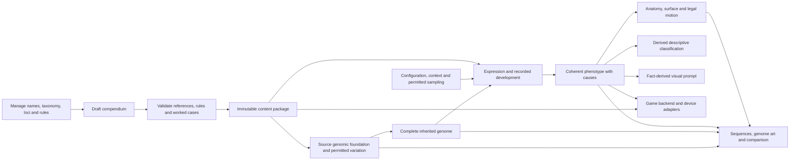

# Genome authoring and simulation workbench

Status: **provisional host authoring proof**, separate from the game and device simulator. The shared catalogue/model constructs anatomy, resolves surface expression and derives guarded fictional movement. It does not choose a creature class first. The original [five-locus Pip proof](../genetics/README.md) is preserved as a legacy reference.

Three independently replayable packages remain available: the diagnostic catalogue has **48 records: 42 executable and six drafts**; the continuous-static catalogue has **58 records: 50 executable and eight drafts**; the pet-material catalogue has **62 records: 54 executable and eight drafts**. The pet profile adds leading-region and ocular proportions plus actual rooted fur/feather construction. Its growth/deformation records remain drafts. All eleven dimension families remain inspectable, with unmodeled families shown as gaps. `validated` denotes schema-executable content; every record remains `provisional-host-proof`, not approved creature biology.

## Run and inspect

Use the existing host Node runtime22.12 or later and pnpm11.19.0:

```sh
cd prototype/generator-workbench
pnpm install --frozen-lockfile --ignore-scripts
pnpm run build
pnpm start
```

Open **http://127.0.0.1:4381**. React/Mantine/Vite provide the developer interface; this is not a device renderer. The same loopback server serves a built static UI and bounded same-origin JSON endpoints. No database service, account, telemetry, game-save access or per-frame model call is introduced. Device screens continue to use LVGL and their existing target toolchains.

Connected authoring journey:

1. Generate a random creature in one action. A fresh retained seed samples inherited copies and accepts only a model-valid constructed graph, without species presets or mutation-based repair. The current visual result is a structural diagnostic, not broad or finished pet art.
2. Inspect the resulting whole genome, choose one of eleven dimensions, and select a locus to see its copies and expressed trait. All records and modeled/draft gaps remain accessible.
3. Optionally edit a selected copy, then resolve its changed input. Inspect separate baseline/inherited/resolved summaries, sequences and fingerprint fields. Display order is not a chromosome or linkage claim.
4. Inspect anatomy/surfaces, derived movement and causal sources, and retain a candidate for comparison. Catalogue authoring is a separate advanced task, not required to create a valid random input.
5. Sample expression with a separate seed. Only permitted marking placement changes; inherited copies and anatomy remain unchanged. Suppressed markings cannot be activated through sampling.
6. Export and replay a complete experiment. Embedded outputs are recomputed from retained inputs/content and checked against digests.
7. Validate and export catalogue drafts. Released content and retained individuals are not rewritten by a naming edit.
8. Export the [preset art template](art-template.md) filled from resolved facts. Large projections reject explicitly rather than discard body parts or constraints.

The legacy Pip interface remains at `/legacy` with its original evaluation route. It is a diagnostic reference, not the expanded engine or production artwork.

## Authoring inspection contract

Agreed bounded UI repair; actual final browser review is pending. The primary
task is **Generate creature**: one fresh random valid genome and its structural
result, then whole-genome orientation → dimension → locus → copies and resolved
trait. Selected-copy editing is optional after generation, not a design-from-
scratch prerequisite. Keep all eleven dimensions visible,
including modeled/draft gaps. Dimension filtering, All and search must retain
access to every locus. Navigation grouping is not chromosome or linkage topology.

Show the selected locus's purpose, labeled copy values, editing controls,
resolved value/unit/state and prerequisites together. A scoped locus list should
not become a wall of simultaneous copy forms. Use visible variant buttons or
segmented choices for Copy 1 and Copy 2; do not require repeated dropdown opening.
Baseline is the declared content
baseline; inherited copies are the current genome; expression is the last
resolved output. Keep their summaries and whole-map inspector readily accessible.
Raw JSON, exact sequences, source records and art prompts remain available in
collapsed advanced inspection rather than occupying the main reading path.

Editing copies invalidates the current result, highlight and export. Resolve
edits differs from generating a new creature. Generation uses a fresh seed and
the existing bounded valid sampler; retain the seed for replay. A known example
loads and resolves in one action using its explicit inputs, without a stale
state closure. The retained pin survives edits. Comparison
puts changed values/states first, with unchanged outputs available explicitly.

The result is a **structural diagnostic**, not finished creature art. Improve
framing with a shared inspector zoom while preserving aspect ratio, retained
geometry and relative world scale. Comparisons use one common camera/scale;
independent normalization must not hide proportion changes. Explain direct
contributors and prerequisite influence when a selection highlights several
regions. A larger diagram does not establish better morphology or art.
The current continuous constructor requires bilateral organization, at least
three axial stations and fins, without articulated limbs or membranes. That
restricted construction explains much of the repeating silhouette. This UI
repair makes its facts easier to inspect; it does not implement the liked
novel pet's body/limb grammar or the owner's intended broad organism variety.

The [liked pet concept](evidence/art-reset/README.md) is separate proposed art
direction, unbound to the selected genome. Do not present it as a resolved engine
result or change it in response to copy edits. This repair adds no morphology
engine, provider call, catalogue, game/device UI or deployment behavior.

The experiment inspector includes both a [coherent static family experiment](evidence/critter-family/README.md) and the retained [geometry and pigment reference](evidence/geometry-calibration/README.md), with a trace manifest and CLI `.geometry.svg`/`.geometry.json` exports. The bounded projection supports volume/fin graphs and rejects unsupported projections without invalidating a valid genetic result. One matched Gemini/Sol-directed image-tool comparison preserves broad part counts and pigment roles, but does not establish exact geometry or finished creature art.

## Module boundary and evidence

| Module | Responsibility |
| --- | --- |
| `catalogue.mjs` | Versioned locus metadata, typed contribution vocabulary, eleven-family coverage/gaps |
| `model.mjs` | Pure validation, shared inherited-copy resolution, explicit construction-profile dispatch, bounded generation/crossing and causal result |
| `family-catalogue.mjs` / `family-construction.mjs` | Provisional continuous-body content; solved exterior, rooted fins, explicit ocular/oral geometry and body-local covering |
| `family-presentation.mjs` / `family-fixtures.mjs` | Inspect solved family geometry and retain controlled copy-edit comparisons; never choose species or repair genomes |
| `pet-catalogue.mjs` / `pet-construction.mjs` | New versioned face ratios and bounded rooted material elements, using the shared continuous solver with exact prior defaults |
| `pet-fixtures.mjs` / `pet-projection.mjs` | Four same-face materials, one face-only copy edit, and lossless bounded source/coordinate dictionaries |
| `authoring-adapter.mjs` | Host records/digests, replay, presentation and fact-derived art-template projection |
| `presentation.mjs` | Diagnostic graph and fingerprint renderers; never reinterprets allele rules |
| `geometry-reference.mjs` | Exact XY bounds/roots/masks for supported graphs; explicit static diagnostic profile |
| `src/` | Framework forms, navigation and inspection of shared results |
| `server.mjs` | Existing loopback HTTP boundary; legacy and authoring APIs |
| `simulate.mjs` | Retained batch results/descriptions and calibration inputs |

Run `pnpm test` for changed authoring behavior and preserved legacy/Pip boundaries, and `pnpm run build` for the framework bundle. `pnpm run simulate -- --out evidence/authoring` retains comparison inputs/results; the evidence manifest identifies exact examples and limits. [Evidence](evidence/README.md) distinguishes host validation, browser inspection and actual generated art from missing game/hardware proof.

The body graph is a finite connected-volume grammar with rooted articulated links, membranes and fins. It permits meaningful organization/attachment variation but does not yet span the owner's full microbial/animal breadth. Motion is a provisional analytic support rule, not aerodynamic/hydrodynamic validation or a working animation rig. The original diagnostic profile has no face contributors. The new continuous profile constructs explicit eye-pair presence/placement and an oral aperture; those shapes confer no sensing or feeding capability. It does not yet construct snouts, noses, jaws, teeth or gills. Static morphology and generated illustration do not establish pet interaction or human attachment.

Configured incubation, general polygenic/epigenetic mechanics, large variable-copy reproduction, production sprite/animation generation, automatic encyclopedia writing and device integration remain future work. No generated output becomes an owned game individual through this tool.

## Coherent family experiment

The content-package selector switches between the retained diagnostic profile and the provisional continuous-body profile. It is a construction-version choice, not a creature-class selector. Start with the explicit base input, resolve it, select a contributor and inspect the affected geometry beside the complete baseline, inherited copies and expression field. Load a controlled proportion variant or fin/material variant for comparison; these are recorded copy edits, not biological offspring. Saved records replay their retained content and inputs.

The engine solves continuous shoulders/caps, tissue joins, fin-root anchors, eye components, oral geometry and body-local scale plates. SVG, inspection highlights and fact-derived prompts consume the same retained solution. Invalid topology/placement rejects without changing inherited copies. Skin is executable; scales have bounded generated plate geometry with facial/root exclusions. Fur and feathers remain non-executable candidates with missing operators recorded in the compendium.

Export this selected family separately from the original thirteen cases:

```sh
node simulate.mjs --family --out evidence/critter-family
```

The [family test report](evidence/critter-family/README.md) owns exact examples, matched image inputs/outputs, acceptance results, gaps and issues. Neither this profile nor its generated images approve canonical creature appearance, whole-organism breadth, production animation or device integration.

## Pet face and material experiment

`genomic-pet-study@1` uses `continuous-pet/1`; previous catalogue/rule dispatch and retained result digests remain unchanged. The default authoring input is a compact three-station genome. The profile also accepts valid five-station inputs and rejects incompatible topology or impossible placement without repairing copies. It is a content-version choice, not a body preset or class selector.

Four explicit contributors control leading-width ratio, ocular radius, ocular separation and pupil ratio. The simple oral ellipse is posterior to the ocular pair under a declared profile rule; absent oculars use a fixed baseline, so inactive placement does not affect it. Leaf-like fins, facial geometry and material roots are solved upstream. Presence gives no sensing, nutrition or behavior capability. No snout, jaw, teeth or gills are added.

The four material cases share identical facial copies. Skin emits no covering elements; scales retain overlapping plates. Fur retains three curved tapered filaments per rooted tuft, including actual contour extensions. Feathers retain a shaft, two tapered curved vanes and six oblique barb divisions per element. Budgets are 128 plates, 64 tufts or 48 feathers; empty/over-budget constructions reject rather than truncate. Fur/feather elements retain the body pigment at their root local-u, while skin/scales retain continuous body masks. Live growth, deformation and physiological benefits remain unsupported.

The new profile display rotates the whole resolved subject by +90 degrees (`pageX=-Y, pageY=X`) with one shared camera/scale. This presentation mapping includes highlights and all material primitives; underlying retained geometry remains XY. Load `pet-face-variant` and pin a same-skin comparison to inspect an eye-size/pupil-only copy change without attributing it to material.

```sh
node simulate.mjs --pet --out evidence/pet-materials
node --test pet.test.mjs
```

CLI emits retained records, source SVGs, trace manifests, descriptions, genome fields and bounded art prompts. Pet-only lossless dictionaries intern source/prerequisite IDs and exact coordinate numbers; point indices cross-reference `proportionFacts.coveringCoordinateValues`. Engine replay verifies authority before projection, dictionary roundtrips preserve every value, and the existing 64KiB subject / 8KiB binding / 32KiB prompt limits remain unchanged. Valid results survive unavailable projections. [Pet evidence](evidence/pet-materials/README.md) owns actual outputs, checks and remaining craft limitations; the [content contract](../../design/genome-starter-content.md#pet-face-and-material-implementation-proof) owns provisional ratios and operators.

## Authoring engine: next design

Owner direction: this workbench is the authoring and experiment surface for the
game's generative engine. It must manage the locus compendium, naming and taxonomy;
inspect the entire baseline, inherited genome and resolved expression; display
structured genome fingerprint art; sample permitted expressions; and derive a
visual-generation prompt. The dimension count remains **eleven**, as corrected by
the owner. The five-locus screen above does not fulfill that direction.

The following defines the broader authoring direction. The first bounded implementation above covers only its stated cluster; the remaining breadth and biological/game decisions are proposals. Game development remains a separate consumer.

### Whole journey and module boundary



The workbench edits content and exercises the real engine; it does not own a second
set of genetic rules. The browser owns forms/navigation/inspection. Shared domain
modules own catalogue validation, inheritance and expression. Game adapters consume
versioned packages and results; this does not imply that an ESP32 runs the host's
JavaScript engine. Target runtime placement still needs its existing architecture
and toolchain gates.

### Compendium depth and management

Begin with a complete eleven-family taxonomy and a deep **Structure, Appearance,
Mechanics/movement** compendium. A useful initial design horizon is roughly20–30
distinct candidate loci in each priority family, not a quota or a claim of60–90
executable genes. Other families retain their baseline definitions, applicability
and explicit gaps while their detailed catalogue grows.

| Priority family | Proposed coverage to develop |
| --- | --- |
| Structure | Organization, segmentation, proportions, support/flexibility, appendage arrangement and attachments, joint geometry, contact structures and optional silhouette features |
| Appearance | Pigment contributions, palette relationships, marking placement/geometry/density, surface texture, transparency and visible emission where applicable |
| Mechanics/movement | Eligible modes, coordination and gait, stride/cadence, joint excursion, balance, turning and maneuver control, matched-action effort and medium-specific constraints |

Each locus has a stable ID/version, human name and aliases, primary family and
affected-family links, applicability, allele/copy definitions, inheritance and
expression rules, contributors/prerequisites, outputs, construction or motion
effects, research facts, and valid/invalid worked examples. Several loci may drive
one trait, and one locus may affect several families. Do not clone a locus into
each affected dimension or give every class every library locus.

Manage dimensions, locus/allele definitions, source baselines, derived taxonomy, reusable
rules and experiment records as related records. Taxonomy describes expressed results and organizes names;
it cannot select anatomy or grant reproductive compatibility. Renaming a label does not
change its stable ID or rewrite existing creatures. Deprecated records remain
available to packages/individuals that reference them.

The first catalogue store can remain standard Git-versioned structured files with
draft editing and immutable released packages. An inspectable draft is distinct
from executable validated content. Database management is a tool responsibility;
a new database service, account system or deployment is not needed to establish
it. A different storage implementation should follow a demonstrated query or
editing need, without changing those contracts.

LLMs may propose reusable definitions and combinations within the declared schema.
Automatic checks reject unknown references/operators, incompatible anatomy,
unsupported causal claims and duplicate definitions. New operator semantics remain
deliberate domain design. Increasing the number of names alone does not add useful
variability.

A proposed worked cluster connects limb proportions, joint excursion, contact-edge
geometry and foot-placement control. Their combination may permit a rough-hold
maneuver only when attachment and reachable-contact checks pass. Individually valid
features can produce an impossible combined movement; reject that case with its
contributing reasons instead of adding joints or changing the genome. Appearance
contributors can then place markings on that same resolved body. This is a rule
design example, not approved Pip anatomy or an implemented movement operator.

**Future polygenic/cross-dimension traits are required.** Several loci may
contribute to a shared output, and resolved structural, movement, energy and
environment-response properties may interact to produce an emergent capability or
profile. Actual environmental conditions are evaluation context; inherited
affinities and response rules are genomic contributors. A proposed gait/endurance
profile can combine supported limb mechanics, coordination, energy supply/recovery
and response to terrain/conditions. A sensory or metabolic output needs its own
declared contributors and prerequisites; it is not automatically produced by those
same inputs. Show the full contribution chain and changed-context comparison. The
compendium schema must support this now; the general interaction engine is later
work, not a sum of independent dimension scores or a new gene for every combination.

### Workbench views and framework

| View | What the owner can inspect or do |
| --- | --- |
| Compendium | Browse/search all eleven families; manage names, taxonomy, loci, alleles and rules; see where-used references and draft/validated/deprecated state |
| Foundation/baseline | Inspect source-supported fixed/variable contributors, developmental vocabulary, exclusions and complete baseline sequence/art; derived classes describe results afterward |
| Genome experiment | Explore every applicable fixed/variable locus and baseline reference; inspect inherited copies, dependencies and a genotype sequence; compare related genomes |
| Expression/creature | Inspect resolved values and causes, expressed sequence and genome art, anatomy/surface/motion preview, permitted expression sampling, comparison and prompt export |

Implemented developer framework: **React + Mantine**, using Vite for the UI build. Mantine
supplies established [layout](https://mantine.dev/core/app-shell/),
[tree navigation](https://mantine.dev/core/tree/), forms and tables; React separates
component state from domain evaluation. See [React's component/state guidance](https://react.dev/learn/thinking-in-react)
and [Vite's supported templates/runtime requirements](https://vite.dev/guide/).
The committed pnpm lockfile pins the implementation dependencies. Host Node24.19.0 was used locally; CI uses Node22. These are authoring-host results.
Device screens continue to use LVGL.

Use a searchable family/record explorer, a large central genome/creature workspace
and a contextual inspector. Selecting a locus highlights its sequence segment,
affected body/motion properties and contributing relationships together. Tables
provide exhaustive access; the visual map supplies relationships. Neither replaces
the other, and no long explanation is required to navigate between them.

### Three sequences and structured fingerprint art

Keep separate inspectable encodings for:

1. **Baseline:** source/package references, invariants, applicable contributor set
   and permitted variation; it is not an individual allele assignment.
2. **Inherited genome:** complete locus IDs and actual allele copies, including
   carried/unexpressed information and pinned content references.
3. **Resolved expression:** output values, contributors, rule/context versions and
   retained developmental outcomes. This is not a second inherited genome.

Prefer readable, versioned fictional tokens before inventing molecular DNA letters.
For example, `appearance.markings=P/p` belongs to the inherited view while
`body-markings=none; pale-variant=carried` belongs to its resolved view under the
existing Pip rule. These are illustrative fragments, not a complete sequence.
Display ordering must not imply biological linkage or chromosome position unless
the content explicitly models those relationships.

Fingerprint **art** should encode those inspectable structures using the retained
[genome-field references](../../design/references/genome-field/README.md): clustered
regions, paired-copy glyphs, local focus and branch relationships. A visible legend
and bidirectional selection connect glyphs to records and sequence segments.
Inherited art retains unexpressed variants; expression art shows resolved outputs
and their causes. Baseline modules use reference/module glyphs until their internal
loci are actually modeled; no invented allele pairs fill those gaps. Visual
mappings need versioning and calibration. A separate
digest verifies exact data; art is not a cryptographic hash, individual identity,
permission token or guaranteed proof of uniqueness.

### Permitted randomization and visual prompt

Expose two clearly distinct experiment operations:

- **Generate a genome:** choose inherited variants allowed by the source/package
  and source constraints. This changes genotype and is not expression sampling.
- **Sample expression:** keep genotype fixed and sample only explicitly permitted
  contextual/developmental variation under pinned rules. Show changed and unchanged
  outputs, causes, context and seed. If no such variation is modeled, report that
  the expression is deterministic rather than invent variation.

Record actual sampled outcomes as well as seed, algorithm/content/rule versions
and context. A saved individual does not reroll when reopened. Dominant/recessive
relationships still apply: expression sampling cannot turn Pip's carried p in Pp
into pale markings under its current rule. Cosmetic render randomness cannot grant
new structures or capabilities.

For a future explicit variation rule, a markings genotype could permit a bounded
range of patch placement or density. Sampling realizes a layout within that range;
it does not invent a new allele per spot. Regulatory contributors may control the
bounds where defined. Whether this is developmental expression or nonheritable
render variation must be declared by the rule, not guessed by the UI.

Future epigenetic experiments add an inspectable **regulatory-state overlay**:
declared locus/region marks, their origin/trigger, affected expression rule,
establishment/removal, persistence and reproduction reset/transmission policy.
Inherited copies remain unchanged. Compare the same genotype under different
supported marks/context and show their downstream phenotype consequences; add a
regulatory-state encoding alongside the three representations above. Genome art
can show marks as an overlay rather than replacing inherited glyphs. Ordinary
fatigue, learning and a transient environmental response are not automatically
epigenetic. Mark persistence or inheritance is a declared fictional rule, not a
default. These belong to the existing expression/development and state/history
layers; exact mechanics and a regulatory-state evaluator are not implemented.
The [genetics framework](../../specs/genetics.md#accepted-dimension-families-dimensions-to-specify)
owns the polygenic/epigenetic meaning and biological reference.

The visual prompt is a projection of resolved anatomy, proportions, palette,
surface features and eligible motion, with explicit exclusions and a separate
style/pose/camera specification. Selecting a phrase traces back to its phenotype
sources. A prompt is useful for visual calibration and generation experiments; it
does not by itself supply coherent rigs, repeatable animation or validated artwork.
All generated representations must preserve the same resolved creature. The
algorithmic construction pipeline remains required.

### Next increments and stopping condition

The [first locus/expression content proposal](../../design/genome-starter-content.md)
defines genome-first diversity and a cross-organization ground/air/water proof,
baseline/partial/full-expression visual obligations and the future engineering
idea. Its24connected six-legged records are one local calibration case, not
the V1 catalogue. Classes describe expressed results; they are not anatomy presets.
This is proposed content design, not implemented or canonical biology.

1. Extend the existing framework compendium and eleven-family inventory beyond
   the current narrow executable construction profile. Empty families and draft
   candidates are visible; their presence does not imply supported expression.
   Validate connected structural/appearance/movement clusters before promoting
   more records to executable packages.
2. Expand expression/construction across developmental/topology contributors:
   different coherent organizations and legal ground/air/water motion, plus
   within-organization body/surface/control variation, with clear exclusions,
   causal traces and whole-baseline/genome/expression views. Preserve the existing
   Pip package as a reference instead of silently rewriting it.
3. Extend the existing expression sampling, genome representations, sequence
   comparison and fact-derived prompt output to those broader constructions.
   Inspect contrasting generated organizations, related variants and rejection
   cases before integrating the game. Classification follows expression; it
   must never choose a body or repair the genome.

The next proof must show useful differences in the resulting creature, not merely
more selectors. The60–90 candidate range guides compendium breadth; a meaningful
compendium/connected-rule review need not wait for every planned record to exist.
Missing records and unsupported rules must remain explicit. General anatomy/rule/style
choices stay provisional until reviewed.
The first executable proof is described above. Further broad content, configured incubation and production generation are not supplied by the older local24-locus proposal. Game saves and sandbox remain unchanged.
