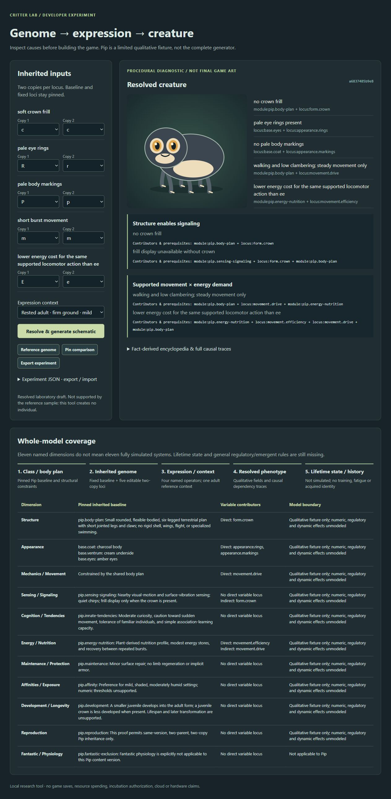
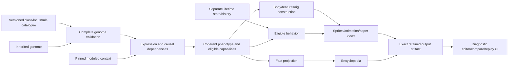
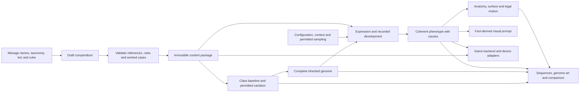

# Generative backend workbench

Status: runnable **developer scaffold**, separate from the game and device simulator.
It reuses the existing versioned [Pip genetics proof](../genetics/README.md).
It tests the causal chain, not a full critter generator or approved art direction.



[Review and browser evidence](evidence/README.md) distinguishes host validation
from the missing production and hardware proof.

## Run and inspect

Use the existing installed Node runtime (22 or later), without installing packages:

```sh
node prototype/generator-workbench/server.mjs
```

Open **http://127.0.0.1:4381**. The server binds to loopback, with a small
same-origin JSON API and fixed static-file allowlist. No database, remote provider,
accounts, telemetry or game-save access is introduced.

Try the connected journey:

1. Pin the reference candidate for comparison.
2. Change markings from **Pp to pp**, then resolve. Carried variation becomes
   expressed markings; schematic, factual entry and comparison change together.
3. Change crown to **cc**. Crown and frill-display eligibility disappear together.
4. Change movement to **mm**, keeping **Ee**. Efficient walking does not grant
   burst movement. Energy is qualitative, compared for the same supported action.
5. Select the unsupported juvenile context. The evaluator rejects it rather than
   applying adult defaults. Restore the reference to continue.
6. Export an experiment as visible, copyable JSON and validate/import it again.
   No browser download is required. Imported outputs are ignored and
   recomputed from the pinned inputs. Identical inputs produce identical output
   hashes. Editing or rejecting input clears the current result.

All five information layers and eleven dimension families remain visible. The
matrix distinguishes inherited baseline, direct/indirect contributors, exclusions
and missing modeling. Only five two-copy loci vary. The reference sample supports
two explicit candidates; other engine-valid laboratory drafts gain no sample,
creation, ownership or breeding authorization.

## Big components and present implementation

The intended system must translate the full genome through expression into a
coherent creature, including interactions between expressed contributions.
Structure, physiology, available actions and behavior cannot be independently
randomized cosmetic attributes. This tool exposes the small existing example and
missing boundaries rather than substituting it for the whole framework.



These are logical modules, **not selected microservices**. The complete product
boundary is owned by [architecture](../../specs/architecture.md#creature-production-pipeline).

| Component | Scaffold today | Extension boundary |
| --- | --- | --- |
| Catalogue / genetic engine | Existing pinned Pip baseline, fixed/variable loci and four operators | Add declared content/operators with valid and invalid cases; never duplicate expression in presentation |
| Evaluation adapter | Genome/context validation, expression, dependency closure, coverage and sample-support distinction | General regulatory and multi-expression rules need versioned definitions; no numeric trait invention |
| Construction | Deterministic SVG from resolved crown/rings/markings and fixed six-legged plan | Replace diagnostic grammar with validated body/rig/style construction, without per-creature artists or prefinished portrait selection |
| Encyclopedia | Structured resolved facts and sources | Derive wording/visuals from permitted facts; no fabricated ancestry or biology |
| Experiment artifact | Exact input, content/context/generator version, output bytes and SHA-256 digests | Production also retains accepted subject/operation identity, origin/parents, configured incubation and construction/profile versions |
| Lifetime / behavior | Explicitly unimplemented | Acquired state stays separate from inherited ability; behavior selects eligible actions before animation depicts them |
| LLM expansion / search | Not connected | Candidate reusable content is validated before use; search cannot replace accepted genomes or parental inheritance |
| Device / game consumer | Not connected | LVGL remains device presentation; this browser is not a hardware simulator |

The relationship views expose existing constraints: structure enabling signaling,
and movement alongside matched-action energy cost. **They do not implement a new
emergent-trait solver.** Future emergence must come from explicit combinations of
expression rules, with contributor traces and incompatibility checks. A combined
description alone does not establish an emergent mechanic.

Configured incubation remains the product generation trigger. Here one declared
adult context is evaluated, not incubation sliders or a birth. Configuration
effects, regulation, development, mutation policy, broad class generation,
body/rig variability, sprite/animation generation and learned behavior are not
implemented. These are experimental adapter interfaces, not a production API.

## Interfaces and reproducibility

- `GET /api/catalogue`: pinned definitions and default complete input.
- `POST /api/evaluate`: `{ schemaVersion, genome, context }` yields a resolved
  diagnostic artifact or rejection without generated output.
- `evaluate.mjs`: boundary/projection; the existing engine owns genetic truth.
- `schematic.mjs`: phenotype-only diagnostic construction; unknown traits fail.
- `server.mjs`: local transport; no genetic rules in the server.
- `app.mjs`: editor, stale-result safety, comparison, export/import; no genetic rules in the UI.

Requests/imports are bounded to64KiB. Unknown envelope/genome fields, unsupported
context and invalid genomes are rejected. Context key order may differ; values
must match the reference exactly. Hashing sorts object keys and retains array
order. Import recomputes from input and never trusts embedded SVG/facts. There
are no timestamps or random portrait selections in replay.

Checks:

The path-scoped [Actions check](../../.github/workflows/generator-workbench.yml)
runs these two suites on Node22 without dependencies, native builds or deployment.

```sh
node --test prototype/tests/generator-workbench.test.mjs prototype/tests/pip-genetics.test.mjs
```

The focused suite checks carried/expression differences, prerequisites, transitive
causes, sample boundaries, repeatability, unknown construction values, malformed
inputs and HTTP recovery. Browser inspection covers actual edit/resolve/compare,
import/export and rejection/recovery. Host diagnostic evidence does not establish
hardware, production art quality, gameplay enjoyment or complete biology.

## Authoring engine: next design

Owner direction: this workbench is the authoring and experiment surface for the
game's generative engine. It must manage the locus compendium, naming and taxonomy;
inspect the entire baseline, inherited genome and resolved expression; display
structured genome fingerprint art; sample permitted expressions; and derive a
visual-generation prompt. The dimension count remains **eleven**, as corrected by
the owner. The five-locus screen above does not fulfill that direction.

The following is a proposed implementation sequence, not implemented functionality
or approved new creature biology. Game development remains a separate consumer.

### Whole journey and module boundary



The workbench edits content and exercises the real engine; it does not own a second
set of genetic rules. The browser owns forms/navigation/inspection. Shared domain
modules own catalogue validation, inheritance and expression. Game adapters consume
versioned packages and results; this does not imply that an ESP32 runs the host's
JavaScript engine. Target runtime placement still needs its existing architecture
and toolchain gates.

### Compendium depth and management

Begin with a complete eleven-family taxonomy and a deep **Structure, Appearance,
Mechanics/movement** compendium. A useful initial design horizon is roughly20–30
distinct candidate loci in each priority family, not a quota or a claim of60–90
executable genes. Other families retain their baseline definitions, applicability
and explicit gaps while their detailed catalogue grows.

| Priority family | Proposed coverage to develop |
| --- | --- |
| Structure | Organization, segmentation, proportions, support/flexibility, appendage arrangement and attachments, joint geometry, contact structures and optional silhouette features |
| Appearance | Pigment contributions, palette relationships, marking placement/geometry/density, surface texture, transparency and visible emission where applicable |
| Mechanics/movement | Eligible modes, coordination and gait, stride/cadence, joint excursion, balance, turning and maneuver control, matched-action effort and medium-specific constraints |

Each locus has a stable ID/version, human name and aliases, primary family and
affected-family links, applicability, allele/copy definitions, inheritance and
expression rules, contributors/prerequisites, outputs, construction or motion
effects, research facts, and valid/invalid worked examples. Several loci may drive
one trait, and one locus may affect several families. Do not clone a locus into
each affected dimension or give every class every library locus.

Manage dimensions, locus/allele definitions, class baselines, taxonomy, reusable
rules and experiment records as related records. Class taxonomy organizes names;
reproductive compatibility is a separate relationship. Renaming a label does not
change its stable ID or rewrite existing creatures. Deprecated records remain
available to packages/individuals that reference them.

The first catalogue store can remain standard Git-versioned structured files with
draft editing and immutable released packages. An inspectable draft is distinct
from executable validated content. Database management is a tool responsibility;
a new database service, account system or deployment is not needed to establish
it. A different storage implementation should follow a demonstrated query or
editing need, without changing those contracts.

LLMs may propose reusable definitions and combinations within the declared schema.
Automatic checks reject unknown references/operators, incompatible anatomy,
unsupported causal claims and duplicate definitions. New operator semantics remain
deliberate domain design. Increasing the number of names alone does not add useful
variability.

A proposed worked cluster connects limb proportions, joint excursion, contact-edge
geometry and foot-placement control. Their combination may permit a rough-hold
maneuver only when attachment and reachable-contact checks pass. Individually valid
features can produce an impossible combined movement; reject that case with its
contributing reasons instead of adding joints or changing the genome. Appearance
contributors can then place markings on that same resolved body. This is a rule
design example, not approved Pip anatomy or an implemented movement operator.

**Future polygenic/cross-dimension traits are required.** Several loci may
contribute to a shared output, and resolved structural, movement, energy and
environment-response properties may interact to produce an emergent capability or
profile. Actual environmental conditions are evaluation context; inherited
affinities and response rules are genomic contributors. A proposed gait/endurance
profile can combine supported limb mechanics, coordination, energy supply/recovery
and response to terrain/conditions. A sensory or metabolic output needs its own
declared contributors and prerequisites; it is not automatically produced by those
same inputs. Show the full contribution chain and changed-context comparison. The
compendium schema must support this now; the general interaction engine is later
work, not a sum of independent dimension scores or a new gene for every combination.

### Workbench views and framework

| View | What the owner can inspect or do |
| --- | --- |
| Compendium | Browse/search all eleven families; manage names, taxonomy, loci, alleles and rules; see where-used references and draft/validated/deprecated state |
| Class/baseline | Inspect structural grammar, all applicable contributors, invariant versus variable properties, exclusions and a complete baseline sequence/art view |
| Genome experiment | Explore every applicable fixed/variable locus and baseline reference; inspect inherited copies, dependencies and a genotype sequence; compare related genomes |
| Expression/creature | Inspect resolved values and causes, expressed sequence and genome art, anatomy/surface/motion preview, permitted expression sampling, comparison and prompt export |

Recommendation: **React + Mantine**, using Vite for the developer UI build. Mantine
supplies established [layout](https://mantine.dev/core/app-shell/),
[tree navigation](https://mantine.dev/core/tree/), forms and tables; React separates
component state from domain evaluation. See [React's component/state guidance](https://react.dev/learn/thinking-in-react)
and [Vite's supported templates/runtime requirements](https://vite.dev/guide/).
No framework is installed in this revision. The installed host Node runtime was
checked as24.19.0; concrete package versions and lockfile belong to implementation.
Device screens continue to use LVGL.

Use a searchable family/record explorer, a large central genome/creature workspace
and a contextual inspector. Selecting a locus highlights its sequence segment,
affected body/motion properties and contributing relationships together. Tables
provide exhaustive access; the visual map supplies relationships. Neither replaces
the other, and no long explanation is required to navigate between them.

### Three sequences and structured fingerprint art

Keep separate inspectable encodings for:

1. **Baseline:** class/package references, invariants, applicable contributor set
   and permitted variation; it is not an individual allele assignment.
2. **Inherited genome:** complete locus IDs and actual allele copies, including
   carried/unexpressed information and pinned content references.
3. **Resolved expression:** output values, contributors, rule/context versions and
   retained developmental outcomes. This is not a second inherited genome.

Prefer readable, versioned fictional tokens before inventing molecular DNA letters.
For example, `appearance.markings=P/p` belongs to the inherited view while
`body-markings=none; pale-variant=carried` belongs to its resolved view under the
existing Pip rule. These are illustrative fragments, not a complete sequence.
Display ordering must not imply biological linkage or chromosome position unless
the content explicitly models those relationships.

Fingerprint **art** should encode those inspectable structures using the retained
[genome-field references](../../design/references/genome-field/README.md): clustered
regions, paired-copy glyphs, local focus and branch relationships. A visible legend
and bidirectional selection connect glyphs to records and sequence segments.
Inherited art retains unexpressed variants; expression art shows resolved outputs
and their causes. Baseline modules use reference/module glyphs until their internal
loci are actually modeled; no invented allele pairs fill those gaps. Visual
mappings need versioning and calibration. A separate
digest verifies exact data; art is not a cryptographic hash, individual identity,
permission token or guaranteed proof of uniqueness.

### Permitted randomization and visual prompt

Expose two clearly distinct experiment operations:

- **Generate a genome:** choose inherited variants allowed by the class/package
  and source constraints. This changes genotype and is not expression sampling.
- **Sample expression:** keep genotype fixed and sample only explicitly permitted
  contextual/developmental variation under pinned rules. Show changed and unchanged
  outputs, causes, context and seed. If no such variation is modeled, report that
  the expression is deterministic rather than invent variation.

Record actual sampled outcomes as well as seed, algorithm/content/rule versions
and context. A saved individual does not reroll when reopened. Dominant/recessive
relationships still apply: expression sampling cannot turn Pip's carried p in Pp
into pale markings under its current rule. Cosmetic render randomness cannot grant
new structures or capabilities.

For a future explicit variation rule, a markings genotype could permit a bounded
range of patch placement or density. Sampling realizes a layout within that range;
it does not invent a new allele per spot. Regulatory contributors may control the
bounds where defined. Whether this is developmental expression or nonheritable
render variation must be declared by the rule, not guessed by the UI.

Future epigenetic experiments add an inspectable **regulatory-state overlay**:
declared locus/region marks, their origin/trigger, affected expression rule,
establishment/removal, persistence and reproduction reset/transmission policy.
Inherited copies remain unchanged. Compare the same genotype under different
supported marks/context and show their downstream phenotype consequences; add a
regulatory-state encoding alongside the three representations above. Genome art
can show marks as an overlay rather than replacing inherited glyphs. Ordinary
fatigue, learning and a transient environmental response are not automatically
epigenetic. Mark persistence or inheritance is a declared fictional rule, not a
default. These belong to the existing expression/development and state/history
layers; exact mechanics and a regulatory-state evaluator are not implemented.
The [genetics framework](../../specs/genetics.md#accepted-dimension-families-dimensions-to-specify)
owns the polygenic/epigenetic meaning and biological reference.

The visual prompt is a projection of resolved anatomy, proportions, palette,
surface features and eligible motion, with explicit exclusions and a separate
style/pose/camera specification. Selecting a phrase traces back to its phenotype
sources. A prompt is useful for visual calibration and generation experiments; it
does not by itself supply coherent rigs, repeatable animation or validated artwork.
All generated representations must preserve the same resolved creature. The
algorithmic construction pipeline remains required.

### Next increments and stopping condition

1. Establish the framework-based compendium manager and full eleven-family
   inventory, with the deep priority-family draft catalogue and complete records.
   Validate one connected structural/appearance/movement cluster within that
   catalogue before promoting large batches to executable packages.
2. Expand expression/construction across that content: meaningful body proportions,
   surface differences and legal gait/maneuver variation, with clear exclusions,
   causal traces and whole-baseline/genome/expression views. Preserve the existing
   Pip package as a reference instead of silently rewriting it.
3. Add declared expression sampling, structured genome art/sequence comparison
   and fact-derived prompt output. Inspect contrasting creatures and rejection
   cases before extending the grammar or integrating the game.

The next proof must show useful differences in the resulting creature, not merely
more selectors. The60–90 candidate range guides compendium breadth; a meaningful
compendium/connected-rule review need not wait for every planned record to exist.
Missing records and unsupported rules must remain explicit. General anatomy/rule/style
choices stay provisional until reviewed.
This design revision does not implement the compendium, install a framework, make
model calls, change game saves or deploy the sandbox.
