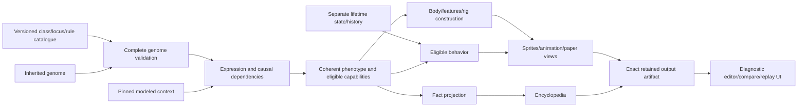

# Generative backend workbench

Status: runnable **developer scaffold**, separate from the game and device simulator.
It reuses the existing versioned [Pip genetics proof](../genetics/README.md).
It tests the causal chain, not a full critter generator or approved art direction.


[Review and browser evidence](evidence/README.md) distinguishes host validation
from the missing production and hardware proof.

## Run and inspect

Use the existing installed Node runtime (22 or later), without installing packages:

```sh
node prototype/generator-workbench/server.mjs
```

Open **http://127.0.0.1:4381**. The server binds to loopback, with a small
same-origin JSON API and fixed static-file allowlist. No database, remote provider,
accounts, telemetry or game-save access is introduced.

Try the connected journey:

1. Pin the reference candidate for comparison.
2. Change markings from **Pp to pp**, then resolve. Carried variation becomes
   expressed markings; schematic, factual entry and comparison change together.
3. Change crown to **cc**. Crown and frill-display eligibility disappear together.
4. Change movement to **mm**, keeping **Ee**. Efficient walking does not grant
   burst movement. Energy is qualitative, compared for the same supported action.
5. Select the unsupported juvenile context. The evaluator rejects it rather than
   applying adult defaults. Restore the reference to continue.
6. Export an experiment as visible, copyable JSON and validate/import it again.
   No browser download is required. Imported outputs are ignored and
   recomputed from the pinned inputs. Identical inputs produce identical output
   hashes. Editing or rejecting input clears the current result.

All five information layers and eleven dimension families remain visible. The
matrix distinguishes inherited baseline, direct/indirect contributors, exclusions
and missing modeling. Only five two-copy loci vary. The reference sample supports
two explicit candidates; other engine-valid laboratory drafts gain no sample,
creation, ownership or breeding authorization.

## Big components and present implementation

The intended system must translate the full genome through expression into a
coherent creature, including interactions between expressed contributions.
Structure, physiology, available actions and behavior cannot be independently
randomized cosmetic attributes. This tool exposes the small existing example and
missing boundaries rather than substituting it for the whole framework.



These are logical modules, **not selected microservices**. The complete product
boundary is owned by [architecture](../../specs/architecture.md#creature-production-pipeline).

| Component | Scaffold today | Extension boundary |
| --- | --- | --- |
| Catalogue / genetic engine | Existing pinned Pip baseline, fixed/variable loci and four operators | Add declared content/operators with valid and invalid cases; never duplicate expression in presentation |
| Evaluation adapter | Genome/context validation, expression, dependency closure, coverage and sample-support distinction | General regulatory and multi-expression rules need versioned definitions; no numeric trait invention |
| Construction | Deterministic SVG from resolved crown/rings/markings and fixed six-legged plan | Replace diagnostic grammar with validated body/rig/style construction, without per-creature artists or prefinished portrait selection |
| Encyclopedia | Structured resolved facts and sources | Derive wording/visuals from permitted facts; no fabricated ancestry or biology |
| Experiment artifact | Exact input, content/context/generator version, output bytes and SHA-256 digests | Production also retains accepted subject/operation identity, origin/parents, configured incubation and construction/profile versions |
| Lifetime / behavior | Explicitly unimplemented | Acquired state stays separate from inherited ability; behavior selects eligible actions before animation depicts them |
| LLM expansion / search | Not connected | Candidate reusable content is validated before use; search cannot replace accepted genomes or parental inheritance |
| Device / game consumer | Not connected | LVGL remains device presentation; this browser is not a hardware simulator |

The relationship views expose existing constraints: structure enabling signaling,
and movement alongside matched-action energy cost. **They do not implement a new
emergent-trait solver.** Future emergence must come from explicit combinations of
expression rules, with contributor traces and incompatibility checks. A combined
description alone does not establish an emergent mechanic.

Configured incubation remains the product generation trigger. Here one declared
adult context is evaluated, not incubation sliders or a birth. Configuration
effects, regulation, development, mutation policy, broad class generation,
body/rig variability, sprite/animation generation and learned behavior are not
implemented. These are experimental adapter interfaces, not a production API.

## Interfaces and reproducibility

- `GET /api/catalogue`: pinned definitions and default complete input.
- `POST /api/evaluate`: `{ schemaVersion, genome, context }` yields a resolved
  diagnostic artifact or rejection without generated output.
- `evaluate.mjs`: boundary/projection; the existing engine owns genetic truth.
- `schematic.mjs`: phenotype-only diagnostic construction; unknown traits fail.
- `server.mjs`: local transport; no genetic rules in the server.
- `app.mjs`: editor, stale-result safety, comparison, export/import; no genetic rules in the UI.

Requests/imports are bounded to64KiB. Unknown envelope/genome fields, unsupported
context and invalid genomes are rejected. Context key order may differ; values
must match the reference exactly. Hashing sorts object keys and retains array
order. Import recomputes from input and never trusts embedded SVG/facts. There
are no timestamps or random portrait selections in replay.

Checks:

The path-scoped [Actions check](../../.github/workflows/generator-workbench.yml)
runs these two suites on Node22 without dependencies, native builds or deployment.

```sh
node --test prototype/tests/generator-workbench.test.mjs prototype/tests/pip-genetics.test.mjs
```

The focused suite checks carried/expression differences, prerequisites, transitive
causes, sample boundaries, repeatability, unknown construction values, malformed
inputs and HTTP recovery. Browser inspection covers actual edit/resolve/compare,
import/export and rejection/recovery. Host diagnostic evidence does not establish
hardware, production art quality, gameplay enjoyment or complete biology.
