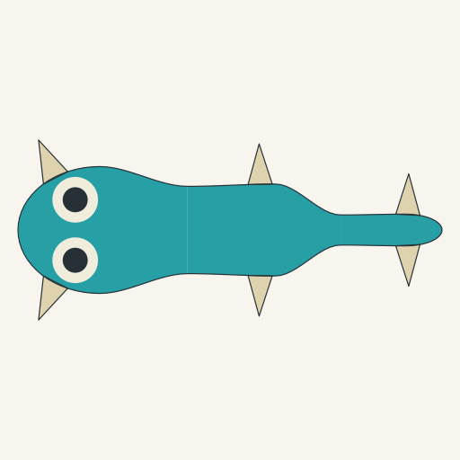
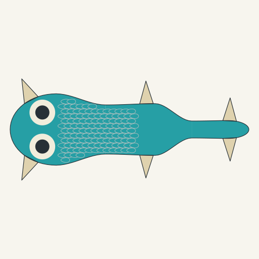
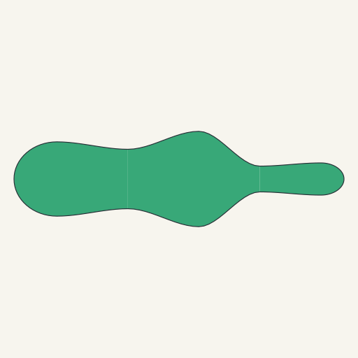

# Regional body scene in Generate

This provisional host integration connects the inherited body-organization
experiment to the existing Generate workspace. It retains the complete genome
and resolves a body, optional paired eyes and skin/scales into one source image.
The source remains a structural illustration, not finished pet art or an
approved biological design. Broad creature diversity is still incomplete.

The separate `genomic-regional-scene-experiment@1` foundation has 56 records:
50 executable and six unchanged drafts. Its `developmental-regional-scene/1`
expression uses the same regional-growth law as the [body-only source
proof](../body-organization/README.md). A closed `graph-source/2` →
`ocular-module/3` → `body-covering/2` → `module-scene/2` chain reconstructs and
verifies the actual retained source. Earlier packages and their saved records
retain their original rules, scenes and prompt versions.

## Actual source images

These controlled inputs have three unequal axial domains, six rooted fins and
two eyes. Their inherited lagoon body and cream fin colours are unchanged.
Only covering copies change between skin and scales: skin emits no plates;
scales emits 125 plates within the existing 128-plate budget. The small plate
outlines are a material inspection field, not 125 separate appendages or
finished surface illustration. Fin triangles remain construction envelopes.

The unmodified fixed search starts at seed 1 and accepts seed 79 after 79 raw
draws: 32 genetic and 46 body rejections, followed by one complete winner.
That source inherits green skin, eyes off and no appendages; it was not
substituted for a more attractive example. The existing 1,024-draw ceiling and
raw sequential sampling remain unchanged. [The manifest](manifest.json)
retains the seed sequence, stage counts and exact source/scene/prompt identities.

An authored compact contact body with eyes on is also retained in
[the rejection record](contact-eye-on-rejection.json): an eye overlaps a root.
The constructor rejects it rather than moving eyes, changing their size or
turning inherited presence off.

## Image-led handoff

Attach the actual displayed source image and copy this exact sentence:

> Turn the attached critter into a cute digital pet, shown alone in rich high-bit pixel art.

The detailed semantic audit stays separate in each `.prompt.txt` file and packet.
It is not appended to this short creative instruction. New features or changed
colours in an illustrated pet remain proposed depiction changes until compared
with the inherited source. No generated pet, animation or provider result is
claimed by these source images.

## Checks and retention

`node --test regional-scene.test.mjs` checks the new supported version tuple,
actual eyes-on skin/scales, off/inactive causes, tampered geometry rejection,
literal old scene and body-only replay, startup/import guards, and real HTTP
evaluate/generate/replay. Oversized requests reject with 413 and subsequent
valid requests still work. New request and compact replay bodies measure
58,064–60,975 bytes, below the unchanged 65,536-byte limit. Local formatted
compact exports also fit the existing 1 MB import limit. The existing Vite
workbench builds without a new framework or dependency.

Each of the three retained cases includes a complete `.packet.json`, compact
`.replay.json`, canonical `.svg`, and audit `.prompt.txt`. Packet identity is
distinct from its complete scene identity. The short #G/#E references are hash
fingerprints; they are not reversible genome strings or ownership permission.

`draw-references.mjs` rasterizes the exact canonical SVGs at their native
512×512 size using the existing Sharp runtime, without contour changes or
recolouring. [The image manifest](image-manifest.json) records both source and
PNG hashes. These sources remain axial: equivalent complete radial, membrane,
deformation and marked-surface scenes are not supported here. Game/device
implementation and hardware validation are unchanged.
