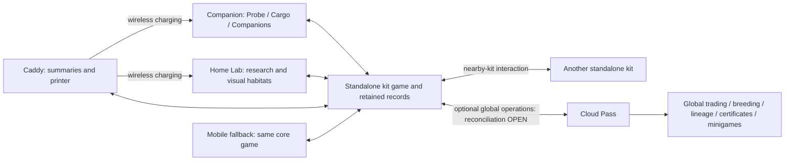
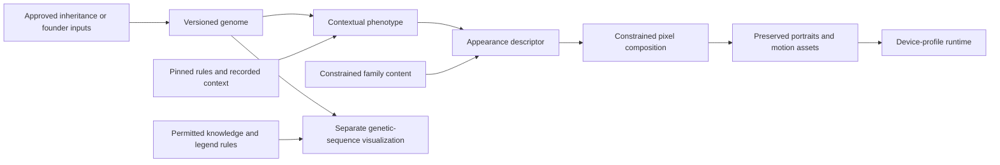

# Ecosystem architecture

Status: accepted responsibilities with proposed implementation boundaries. Service topology, providers, transports, firmware framework and production schemas remain unselected.

The core kit works standalone from the box, including nearby-kit interaction. Core in this diagram is a logical responsibility, not a selected server, process or device. Exact local authority placement, nearby-kit protocol and local/global reconciliation remain OPEN. Preserve one coherent inventory and individual identity rather than invent independent per-device worlds.

The optional Cloud Pass supplies global trading and breeding, lineage, certificates and minigames. It is not required to accept core research, creation or other local play. No price, provider or subscription enforcement design is selected. The Linux-class Lab may execute work locally; cloud generation is an optional capability, not a dependency that prevents core play when disconnected. Exact generation workloads and content delivery remain unselected. Routine play needs no phone or personal home server.

The [physical-experience principle](experience.md#physical-experience-is-the-product) governs the device boundaries. A whole-game software/app prototype may model all roles before hardware exists; a future full app edition is possible. The owner now explicitly directs a mobile fallback if the hardware-oriented software experience does not justify building the kit, and shared domain services should not force identical interactions across devices.

## Current development gate

Define the [electronics-first reference](devices.md#electronics-first-v1-reference-specification), then prove firmware/game behavior in software before PCB/enclosure development. Mobile is an explicit fallback product, not merely a remote control for hardware. Share domain operations, state/identity and preserved content; retain device-specific presentation and input adapters. Simulated peripherals must remain labeled. Existing C/MCU builds do not establish functional device firmware.

The caddy is the tangible home of the collection, not an assumed mandatory gateway or selected authority server. Habitats are bounded simulation/state units with proposed freeze/restore; this does not require a process or Docker container per habitat. Preserve coherent inventory and population across core devices and permitted global operations; the authority and reconciliation mechanisms remain open. Docked Companion Probe activity continues subject to observation validity. Detailed transfer, freeze/time and offline permissions remain explicit domain choices.

## Creature production pipeline

The next bounded genetic-content foundation uses [Pip content and engine contract](genetic-engine.md). Separate reusable class/locus content from individual genomes, expression results and lifetime state. LLM-assisted authoring produces candidate content; explicit algorithms and validation enforce the selected rules. The first contract covers one baseline, locus definitions, traceable phenotype generation and a compatible cross. Execution location, provider and broader tooling are not selected by this proof; preserve the current local/cloud responsibilities below.

Genetics resolves inherited properties; appearance mapping connects resolved visible properties to structural constraints, proportions, palette and markings. Rendering cannot choose genes to fit its preferred image. Authored constraints must address attachment, layering and incompatible anatomy; not all phenotype properties must be visible.

Motion preserves the same anatomy and markings across frames, with a stable still alternative. Behavior chooses permitted creature actions; animation depicts them. Neither is device navigation or a gameplay commit. Genetic-sequence visualization needs its own mapping and disclosure contract. An unresearched sample bitmap is sample identity/potential, not a resolved individual's genome under research B.

Content creation and management tooling is required from the beginning: author/import constraints, generate candidates in batches, validate, version and publish. Procedural, genetic and LLM-driven frameworks are preferred exploration directions, not selected technologies. Generated output is candidate data; it cannot approve its own rules or bypass structural/domain validation. Routine content production must not depend on manually drawing every individual.

Logical job, validation, storage and publication responsibilities do not require a separate deployed microservice for each step. Retain stable operation identity, pinned inputs and exact resolved output. Store finished art and hashes, not only seeds, prompts or component names. Retrying a resolved request returns its saved result rather than regenerating an approximation.

### Content management boundary

Proposed tool contract: import or author family constraints and assets; record source/provenance; generate a batch; inspect genetic and visual consistency; validate applicability, references and device budgets; publish an immutable content version. Draft content is not eligible for gameplay until validation and publication succeed. Rejected candidates remain distinct from accepted individuals. Distribution must declare supported rules, interpreter and asset profiles; retiring content must not erase saved specimens or their retained art. Exact tool UX, licence checks, publication permissions and content delivery remain to be designed.

## App, website and backend

The mobile fallback shares core rules, identity and preserved content; supporting app/website surfaces access the local or optional global records their role permits. Proposed surfaces include collection/history, permitted specimen lookup, research knowledge, device setup and account recovery. Their exact feature split is open; neither owns a parallel inventory or requires routine play to move onto a phone. Public lookup must use a permitted projection rather than expose private genomes, location history or credentials.

For optional global operations, the backend owns accepted service records, operation results, authorization and its generation/content jobs. Local core records remain valid without that backend; exact local acceptance and global reconciliation are unselected. A cache or client claim alone does not confer global rights. Service/provider topology and production APIs remain open. Account recovery, device revocation, data export/deletion and backup/restore need explicit policies; none is equivalent to fictional death or specimen transfer. [Local/global synchronization](cloud-sync.md) defines the scope distinction and proposed global acceptance/retry boundary.

## Domain and adapter separation

| Boundary | Responsibility |
| --- | --- |
| Genetics/research/crafting | Validated rules, eligibility and effects; independent of screen or network |
| Authoritative state | Player-scoped permissions, accepted events, inventory, identity and recovery |
| View mapping | Known/unknown facts, permitted actions and readable interpretation; no second genetics implementation |
| Interaction | Selection, draft, caller and readiness guards; no implicit durable mutation |
| Pixel rendering | Bounded composition from supplied views/assets/profile; no random regeneration or storage |
| Device adapters | Display completion, controls, sensors, storage, radio, printer and charging |
| Supporting services | Remote generation, synchronization and permitted lookup; no implicit ownership through cache |

## Whole-haul transfer

The bounded host experiment uses five durable steps: Probe seals immutable cargo; Lab stores receipt plus all cargo; Probe clears that matching cargo and retains a tombstone; Lab confirms clearance; Probe records final completion before new gathering. Replayed old messages cannot clear a later haul. No post-seal cancellation is supported by that experiment. Identity/digest consistency is not authenticated provenance.

A historical Lab receipt does not prove current Probe emptiness, remaining Lab inventory or delivery of the final acknowledgment. Local offload is distinct from optional global acceptance. Production design must define local cargo acceptance, safe discard and recovery without making cloud synchronization mandatory. Sample opening, resource spending and founder creation are separate operations.

## Compatibility and evidence

Native runtime delivery separates verified release bytes from persistent player state. CI publishes tested bundles tied to successful main builds and exact digests. Staging switches the existing presenter service to a verified release, checks health and restores the previous release if startup fails. The [delivery contract](../native/UPDATER.md) describes this small boundary; host operations remain private.

Preserve individual ID, origin versus ancestry, genome revision, expression context/rules, family/mapping versions and exact portrait/motion/sequence assets. A new device-profile derivative has its own version and must not overwrite the original. Unsupported content retains records and verified historical display where possible.

The minimum meaningful foundation proof is one provisional family with related individuals, inherited visible traits, carried/unexpressed and contextual cases; traceable appearance/sequence mapping; stable portraits and one bounded motion set; reopen/update preservation; and measured device-profile budgets. Static placeholders and read/copy fixtures are useful limited evidence, not this complete pipeline.

See [cloud synchronization](cloud-sync.md), [genetics](genetics.md), [devices](devices.md) and [experience](experience.md).

## Three-device host simulator

The current simulator presents Lab, combined Companion and Dock together, with
separate native frame/control contexts at1024×600,450×600 and792×272 monochrome.
One C17 host aggregate remains the simulation authority: existing expedition
fields are Companion-owned carried cargo; stock, samples and residents are the
Lab-accepted world. Only Companion controls start expeditions. This does not
claim separate MCU processes, endpoint storage or radio firmware.

The native kit adapter seals an immutable haul snapshot in an atomic sidecar.
New seals contain only whole awarded supplies; gathering preparation and chance
state are separate Companion activity. Simulated arrival opens Lab reception once,
never acceptance. The input module captures/restores navigation only, without
restoring world state, clocks or armed gestures. A fresh Confirm accepts the haul.

Acceptance first persists its exact game sequence and haul ID. Fresh acceptance
uses journal version4 and command16 (EXPEDITION_UNLOAD): credit the immutable haul
once and end its source expedition in the same durable game commit. An early
return does not earn a completion sample. Independent preparation and committed
chance state remain on Companion for a later new outing; neither is cargo.
Matching receipt closes transport metadata, not a second award or a continuation.

Journal versions1/2/3 remain readable. Reserved COMMITTING intents replay their
original commands3/11/14 and exact fingerprints before any newer mutation. Version3
early acceptance retains its historical source identity until receipt; its empty
route can then explicitly Finish. Fresh unreserved legacy acceptance may reserve
command16, converting its raw supply encoding atomically before ending the route.
Version4 receipt validation expects the source route already ended. An empty
outing can Finish without a phantom haul, sample or extra chance draw. The next
outing gets a new identity; no Continue action follows an accepted unload.

Version2 game saves append separately persisted gathering preparation, chance
state, attempted/awarded classes and a legacy-encoding flag. The decoder checks
the original version1 payload/checksum and retains its raw semantics until an
existing receipt intent is resolved or new acceptance converts atomically.
Conversion preserves whole Lab/carried portions and translates historical
residues into preparation time, without awarding an item. Progress never occupies
cargo capacity or pays a cost. New inventory is multiples of the internal100
encoding for each indivisible item; [V1](../native/selected-lab/V1.md) owns fixture
timing, chances and costs. Saved chance outcomes prevent restart/retry rerolls.

Restart reconciles the exact intent before allowing another mutation. A matching
operation ID alone is insufficient: the command fingerprint must also match.
Missing required sidecar, corruption, mismatched cargo or durability uncertainty
fails closed, preserving files. Keep backups of save and sidecars together before
conversion; old binaries cannot read the new layout. This host fixture is not a
production radio format, endpoint migration framework or rollback-save promise.

Wireless controls outside the shells independently interrupt Companion and Dock
links. Dock retains a timestamped accepted-world projection while offline and
catches up after reconnect; it never owns a second inventory or awards rewards.
Cloud/charging are unavailable, and Print/Feed are explicitly simulated feedback.
Production distributed receipts still need independent endpoint persistence,
authentication, pairing, delivery ordering and radio failure validation.

Radio choice remains open. The current Pi4 and ESP32-S3 references support Wi-Fi
and BLE; neither supplies native802.15.4/Zigbee in the selected profile. Zigbee
would need additional suitable radio hardware. No radio stack, BOM or connector
is selected by this simulator. [Device references](devices.md) remain hardware
authority. Native APIs expose logical device input and link availability only.

Simulator presentation keeps one ordered native authority. HTTP/1.1 reuses
connections; negotiated gzip reduces BMP transfer losslessly after the native
pipe lock has been released. Each browser device has one frame request plus its
latest desired revision, and at most one disposable background status poll.
Polling never joins the ordered input queue. Older status responses cannot regress
the current revision; stale-frame rejection permits a later retry. Fresh physical
down/up edges remain separate acknowledged requests. Lost down acknowledgement,
overlap or suspension discards unsent releases; native interaction epochs decide eligibility during refresh; stale actions
are consumed instead of replayed. Readiness follows actual decode/paint, never status alone.
Rejected POSTs with unread bodies close their connection. No kernel pool,
WebSocket dependency or production radio transport is implied by this host bridge.

Companion/Dock frame readiness accepts an actually painted revision within the
current interaction's minimum/current range, matching Lab. A time-only repaint
between frame download and ready acknowledgement does not invalidate the action;
a semantic change advances the minimum and rejects the earlier frame. Physical
down requests reassert painted readiness atomically before down under the same
native pipe lock. Release remains a separate request after acknowledged down.
This prevents another ready acknowledgement from interleaving that prefix/down;
it does not establish independent clients' concurrent hold ownership.
