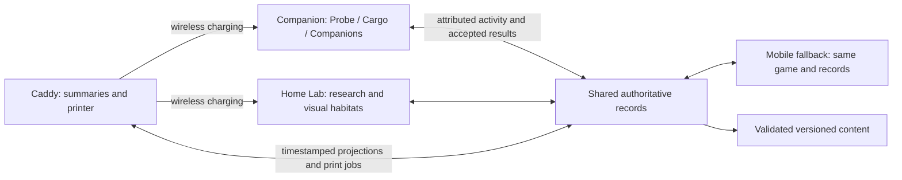
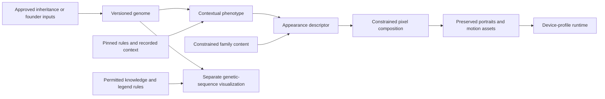

# Ecosystem architecture

Status: accepted responsibilities with proposed implementation boundaries. Service topology, providers, transports, firmware framework and production schemas remain unselected.

The Lab is connected. The owner directs a more capable Linux-class Lab to execute more work locally and reduce cloud dependence; the board and local generation workload remain to be selected. Cloud generation remains available, but generation is no longer required to execute exclusively remotely. Devices may hold temporary probing, evolving and training state partly offline. Cloud owns accepted durable state and recovery. Phone support is optional for routine device play; device-hosted setup needs no personal home server.

The [physical-experience principle](experience.md#physical-experience-is-the-product) governs the device boundaries. A whole-game software/app prototype may model all roles before hardware exists; a future full app edition is possible. The owner now explicitly directs a mobile fallback if the hardware-oriented software experience does not justify building the kit, and shared domain services should not force identical interactions across devices.

## Current development gate

Define the [electronics-first reference](devices.md#electronics-first-v1-reference-specification), then prove firmware/game behavior in software before PCB/enclosure development. Mobile is an explicit fallback product, not merely a remote control for hardware. Share domain operations, state/identity and preserved content; retain device-specific presentation and input adapters. Simulated peripherals must remain labeled. Existing C/MCU builds do not establish functional device firmware.

The caddy is the tangible home of the collection but not the authoritative memory server or mandatory gateway. Habitats are bounded simulation/state units with proposed freeze/restore; this does not require a process or Docker container per habitat. Preserve a single authoritative inventory and population across clients. Docked Companion Probe activity continues subject to observation validity. Detailed transfer, freeze/time and offline permissions remain explicit domain choices.

## Creature production pipeline

The next bounded genetic-content foundation uses [Pip content and engine contract](genetic-engine.md). Separate reusable class/locus content from individual genomes, expression results and lifetime state. LLM-assisted authoring produces candidate content; explicit algorithms and validation enforce the selected rules. The first contract covers one baseline, locus definitions, traceable phenotype generation and a compatible cross. Execution location, provider and broader tooling are not selected by this proof; preserve the current local/cloud responsibilities below.

Genetics resolves inherited properties; appearance mapping connects resolved visible properties to structural constraints, proportions, palette and markings. Rendering cannot choose genes to fit its preferred image. Authored constraints must address attachment, layering and incompatible anatomy; not all phenotype properties must be visible.

Motion preserves the same anatomy and markings across frames, with a stable still alternative. Behavior chooses permitted creature actions; animation depicts them. Neither is device navigation or a gameplay commit. Genetic-sequence visualization needs its own mapping and disclosure contract. An unresearched sample bitmap is sample identity/potential, not a resolved individual's genome under research B.

Content creation and management tooling is required from the beginning: author/import constraints, generate candidates in batches, validate, version and publish. Procedural, genetic and LLM-driven frameworks are preferred exploration directions, not selected technologies. Generated output is candidate data; it cannot approve its own rules or bypass structural/domain validation. Routine content production must not depend on manually drawing every individual.

Logical job, validation, storage and publication responsibilities do not require a separate deployed microservice for each step. Retain stable operation identity, pinned inputs and exact resolved output. Store finished art and hashes, not only seeds, prompts or component names. Retrying a resolved request returns its saved result rather than regenerating an approximation.

### Content management boundary

Proposed tool contract: import or author family constraints and assets; record source/provenance; generate a batch; inspect genetic and visual consistency; validate applicability, references and device budgets; publish an immutable content version. Draft content is not eligible for gameplay until validation and publication succeed. Rejected candidates remain distinct from accepted individuals. Distribution must declare supported rules, interpreter and asset profiles; retiring content must not erase saved specimens or their retained art. Exact tool UX, licence checks, publication permissions and content delivery remain to be designed.

## App, website and backend

The supporting app and website consume the same authorized cloud records as devices. Proposed surfaces include collection/history, permitted specimen lookup, research knowledge, device setup and account recovery. Their exact feature split is open; neither owns a parallel inventory or requires routine play to move onto a phone. Public lookup must use a permitted projection rather than expose private genomes, location history or credentials.

The backend owns accepted player records, operation results, authorization, generation jobs and versioned content access. Client drafts/caches cannot authorize mutations. Service/provider topology and production APIs remain open. Account recovery, device revocation, data export/deletion and backup/restore need explicit policies; none is equivalent to fictional death or specimen transfer. [Cloud synchronization](cloud-sync.md) defines the proposed acceptance/retry boundary.

## Domain and adapter separation

| Boundary | Responsibility |
| --- | --- |
| Genetics/research/crafting | Validated rules, eligibility and effects; independent of screen or network |
| Authoritative state | Player-scoped permissions, accepted events, inventory, identity and recovery |
| View mapping | Known/unknown facts, permitted actions and readable interpretation; no second genetics implementation |
| Interaction | Selection, draft, caller and readiness guards; no implicit durable mutation |
| Pixel rendering | Bounded composition from supplied views/assets/profile; no random regeneration or storage |
| Device adapters | Display completion, controls, sensors, storage, radio, printer and charging |
| Supporting services | Remote generation, synchronization and permitted lookup; no implicit ownership through cache |

## Whole-haul transfer

The bounded host experiment uses five durable steps: Probe seals immutable cargo; Lab stores receipt plus all cargo; Probe clears that matching cargo and retains a tombstone; Lab confirms clearance; Probe records final completion before new gathering. Replayed old messages cannot clear a later haul. No post-seal cancellation is supported by that experiment. Identity/digest consistency is not authenticated provenance.

A historical Lab receipt does not prove current Probe emptiness, remaining Lab inventory or delivery of the final acknowledgment. Local offload is distinct from cloud acceptance. Production design must define when local cargo may be discarded and recovery exposure before cloud sync. Sample opening, resource spending and founder creation are separate operations.

## Compatibility and evidence

Native runtime delivery separates verified release bytes from persistent player state. CI publishes tested bundles tied to successful main builds and exact digests. Staging switches the existing presenter service to a verified release, checks health and restores the previous release if startup fails. The [delivery contract](../native/UPDATER.md) describes this small boundary; host operations remain private.

Preserve individual ID, origin versus ancestry, genome revision, expression context/rules, family/mapping versions and exact portrait/motion/sequence assets. A new device-profile derivative has its own version and must not overwrite the original. Unsupported content retains records and verified historical display where possible.

The minimum meaningful foundation proof is one provisional family with related individuals, inherited visible traits, carried/unexpressed and contextual cases; traceable appearance/sequence mapping; stable portraits and one bounded motion set; reopen/update preservation; and measured device-profile budgets. Static placeholders and read/copy fixtures are useful limited evidence, not this complete pipeline.

See [cloud synchronization](cloud-sync.md), [genetics](genetics.md), [devices](devices.md) and [experience](experience.md).
