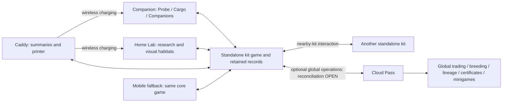
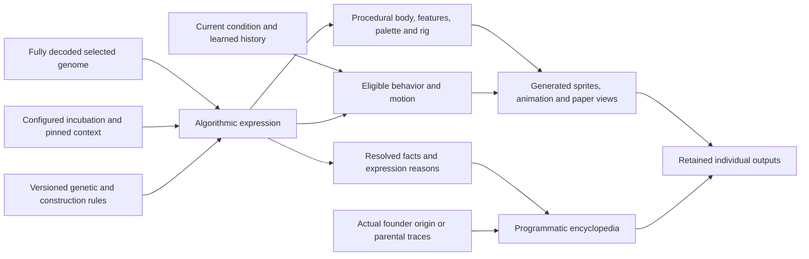
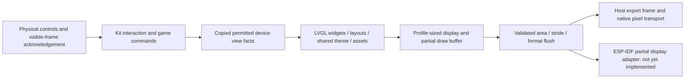

# Ecosystem architecture

Status: accepted responsibilities with proposed implementation boundaries. The Lab targets Raspberry Pi4/Linux; Companion and Caddy target ESP32. LVGL9.6.0 is the required graphics framework for all three devices. The current connected host screen families use LVGL; physical display integration is unvalidated. Service topology, providers, transports and production schemas remain unselected.

The core kit works standalone from the box, including nearby-kit interaction. Core in this diagram is a logical responsibility, not a selected server, process or device. Exact local authority placement, nearby-kit protocol and local/global reconciliation remain OPEN. Preserve one coherent inventory and individual identity rather than invent independent per-device worlds.

The optional Cloud Pass supplies global trading and breeding, lineage, certificates and minigames. It is not required to accept core research, creation or other local play. No price, provider or subscription enforcement design is selected. The Linux-class Lab may execute work locally; cloud generation is an optional capability, not a dependency that prevents core play when disconnected. Exact generation workloads and content delivery remain unselected. Routine play needs no phone or personal home server.

The [physical-experience principle](experience.md#physical-experience-is-the-product) governs the device boundaries. A whole-game software/app prototype may model all roles before hardware exists; a future full app edition is possible. The owner now explicitly directs a mobile fallback if the hardware-oriented software experience does not justify building the kit, and shared domain services should not force identical interactions across devices.

## Current development gate

Define the [electronics-first reference](devices.md#electronics-first-v1-reference-specification), then prove firmware/game behavior in software before PCB/enclosure development. Mobile is an explicit fallback product, not merely a remote control for hardware. Share domain operations, state/identity and preserved content; retain device-specific presentation and input adapters. Simulated peripherals must remain labeled. Existing C/MCU builds do not establish functional device firmware.

The caddy is the tangible home of the collection, not an assumed mandatory gateway or selected authority server. Habitats are bounded simulation/state units with proposed freeze/restore; this does not require a process or Docker container per habitat. Preserve coherent inventory and population across core devices and permitted global operations; the authority and reconciliation mechanisms remain open. Docked Companion Probe activity continues subject to observation validity. Detailed transfer, freeze/time and offline permissions remain explicit domain choices.

## Creature production pipeline

Owner direction,1October: **a fully decoded genome becomes the generative input
for a critter generator triggered by configured incubation**. Algorithms create
all creature art, sprites, animations and encyclopedia content from that genome
and its expressed loci. There is no per-creature illustrator, editor, copywriter
or manual finishing gate. The crew designs and tests the general genetics,
procedural construction, behavior, visual grammar and automatic acceptance rules.
This is the selected production direction, not an implemented generator.

The existing [Pip engine proof](genetic-engine.md) establishes a bounded qualitative
genetics fixture, not this complete production pipeline. General style and new
genetic rules still need owner steering; ordinary outputs must not need individual
human authorship. Original Gemini/C18 art supplies direction and calibration,
not a catalogue of prefinished creature portraits for the generator to select.

The complete inherited genome and incubation configuration are inputs, not a PRNG
seed alone. Configuration must have declared model-supported effects. Contextual
expression, development and possible heritable mutation are distinct; their
settings/effects are not yet selected. Preserve the decoded genome unless an
explicit approved rule permits change. No temperature/trait sliders or gene
shopping is implied. Research completeness, accepted creation and deliberate
reveal remain governed by [sample-to-critter](sample-to-critter-contract.md).
Generated assets being ready cannot reveal a newborn early.

Procedural construction derives anatomy, proportions, attachments, markings and
palette from the resolved phenotype. A rig and compatible motion rules generate
the same body's animation. Behavior selects permitted actions using hereditary
eligibility, current conditions and retained learned state; animation depicts
them. Training history does not silently become an inherited capability.
Rendering cannot choose genes to make a preferred picture. A reskinned fixed
portrait does not establish this generator.

Encyclopedia facts come from resolved genetic/expression reasons, actual origin
or parents and permitted individual history. Generated language may phrase that
fact projection, but cannot invent physiology, ancestry, ownership or knowledge.
Child-facing entries emphasize visual structure/capabilities and short factual
descriptions; optional inspection exposes depth. Partial research views receive
only their permitted facts, not a hidden full genome with an instruction to ignore it.

### Content management boundary

LLMs expand candidate locus/baseline definitions, relationships, rule combinations,
visual construction parameters and concise factual presentation. Algorithms
validate them under the declared genetics/construction vocabulary before they
can become gameplay inputs. Output checks must cover references, applicability,
expression, structural compatibility, rig/motion legality, factual claims and
target asset budgets. General-generator calibration uses actual native-size
outputs against the selected visual references. Automatic checks do not alone
establish beauty or fun; calibration/human playtesting assesses the generator,
without requiring per-creature drawing or editing.

Genetic algorithms may search candidate content or parameter combinations for
validity and useful diversity. Actual breeding inherits from the recorded parents
under explicit genetic rules; search must not replace accepted parental alleles
or redraw a child until it is desirable. New general operators cannot publish
their own biological meaning merely because an LLM produced valid syntax.

## Generation backend proposal — 30 September 2026

The current logical boundary follows the1October automatic-production direction
above. Workload placement, providers, paid API access and production topology
remain unselected. Modules/jobs in the existing runtime can prove the boundary;
a service per step, new queue, editor or full generation platform is not required.

| Responsibility | Input and accepted result | Failure boundary |
| --- | --- | --- |
| Content expansion | General constraints → automatically checked reusable definitions/parameters | Reject unsupported rules; never fabricate an individual's facts |
| Genetic resolution | Decoded founder inputs or actual parent genomes, pinned rules/context → genome, expression and reasons | No ancestry repair, desirable-child redraw or silent mutation |
| Procedural graphics | Resolved anatomy/appearance, rig, legal action/state, style/profile → sprites, animation, stills and derivatives | Preserve the subject; reject mismatched geometry/motion rather than change genes |
| Encyclopedia | Permitted resolved facts, origin/parents and history → structured entry and generated concise wording | Unsupported claims fail; no hidden disclosure or per-creature copywriting |
| Device presentation | Retained outputs and scoped view → LVGL screens/frame stream | No model call per frame, manual pixel UI or replacement game renderer |

Requests retain stable operation/subject identity, exact genome/configuration,
rule/content/construction/model/profile versions, expression reasons and provenance.
Save exact accepted outcomes and finished asset bytes/hashes. Seed or prompt is
traceability, not a substitute for the result. Retry returns the recorded result;
a changed model or content version must not replace an established individual.
Equal genomes may still be different individuals with different origins/history.

Bundled supported rules and a bounded procedural grammar must sustain local core
play; optional remote expansion cannot make routine play require a phone or live
model connection. Heavy generation placement and ESP32 memory/runtime feasibility
need measured design/target proof, not inference from host results. Retained assets
allow device presentation independent of generation latency. This selects no new
gateway, hardware, provider or cloud deployment.

A failed graphics/entry operation preserves genome, configuration, accepted birth
and spending. Retry the same operation. Use a verified generated still of the same
subject if available; otherwise show an honest fault/pending state. Never substitute
another creature portrait or reroll birth. Unsupported legacy content and content
retirement preserve existing individuals and their retained art.

Smallest proposed proof: one general class/style grammar and contrasting complete
genomes drive configured generation of appearance, a legal action/still and an
encyclopedia. Check carried-versus-expressed and capability/motion differences,
reject an incompatible output without changing the genome, and verify stable
replay. This proof requires no new API integration. Reuse unchanged parent-cross
evidence; assess actual craft before broadening the grammar. See the
[connected design review](../design/probe-bench-review.md) for player experience.

## App, website and backend

The mobile fallback shares core rules, identity and preserved content; supporting app/website surfaces access the local or optional global records their role permits. Proposed surfaces include collection/history, permitted specimen lookup, research knowledge, device setup and account recovery. Their exact feature split is open; neither owns a parallel inventory or requires routine play to move onto a phone. Public lookup must use a permitted projection rather than expose private genomes, location history or credentials.

For optional global operations, the backend owns accepted service records, operation results, authorization and its generation/content jobs. Local core records remain valid without that backend; exact local acceptance and global reconciliation are unselected. A cache or client claim alone does not confer global rights. Service/provider topology and production APIs remain open. Account recovery, device revocation, data export/deletion and backup/restore need explicit policies; none is equivalent to fictional death or specimen transfer. [Local/global synchronization](cloud-sync.md) defines the scope distinction and proposed global acceptance/retry boundary.

## Domain and adapter separation

| Boundary | Responsibility |
| --- | --- |
| Genetics/research/crafting | Validated rules, eligibility and effects; independent of screen or network |
| Authoritative state | Player-scoped permissions, accepted events, inventory, identity and recovery |
| View mapping | Known/unknown facts, permitted actions and readable interpretation; no second genetics implementation |
| Interaction | Selection, draft, caller and readiness guards; no implicit durable mutation |
| Pixel rendering | Bounded composition from supplied views/assets/profile; no random regeneration or storage |
| Device adapters | Display completion, controls, sensors, storage, radio, printer and charging |
| Supporting services | Remote generation, synchronization and permitted lookup; no implicit ownership through cache |

## Native UI foundation

Owner requires all device screens to use the established graphics/UI framework.
Application code must not compose screens by writing pixels directly, or wrap a
legacy manually rendered screen in an LVGL image and call that a migration.
Display flush adapters may copy or convert library output into the target pixel
format; that transport operation must remain separate from UI composition.
Linux is the Lab target and the current host-test platform, not the Companion or
Caddy firmware target. Their adapters must compile under ESP-IDF for ESP32.

Companion Cargo and Probe currently use retained450×600 workpieces with
**LVGL9.6.0**, pinned upstream commit
`80ca777e37a2b176770726a02e07a6fb79ef0b39`. Their shared display/context owns
separate roots, copied view facts and bounded assets. The
[native Probe proof](../docs/evidence/native-companion-probe/README.md) covers
mode switching and the field/return journey. The Dock uses retained
LVGL for its complete page family and extracts the portable display/partial-flush
boundary; [native verification and independent review pass](../docs/evidence/native-dock-lvgl/README.md). All known Companion host routes now use retained LVGL, including residents
and visits. Lab Home, workspace previews and connected reception/received records
also use retained LVGL. Sample collection, research/review/findings and Library use copied presentation facts and one retained LVGL tree; [native evidence](../docs/evidence/native-lab-research/README.md) covers disclosure, controls, original art and lifetime. Creation/review, incubation/reveal, Habitat and residents now use copied action facts and one retained LVGL family; [native evidence](../docs/evidence/native-lab-actions/README.md) covers explicit authority, original art and saved identity. Standalone legacy acquisition graphics are retired. Their domain/input/save commands remain maintained regression fixtures, with graphics assertions moved to supported LVGL screens and canonical connected reception. Unsupported standalone pages fail before BMP output; interactive protocols return a recoverable error before announcing frame bytes. This does not restore connected Lab acquisition. [Retirement contract and evidence](../docs/evidence/lvgl-route-retirement/README.md). The [ESP-IDF Companion target](../native/companion/README.md) now
registers the current shared UI in a headless harness; [compile/link validation passed](../docs/evidence/native-companion-esp/README.md). Runtime integration remains unvalidated.
Host pixel-stream evidence,
actual ESP-IDF UI compilation and hardware measurements are separate gates.

The architect must review the complete screen-route and target-build inventory
before migration integration. Acceptance requires LVGL composition for every
device page, explicit portable view/UI versus host/ESP-IDF adapter boundaries,
and removal of active manual-renderer fallbacks. Missing LVGL output must fail
explicitly rather than silently use the old renderer. Existing game ownership,
save compatibility and physical-control guards remain constraints.

| Established library | Fit for this product | Decision |
| --- | --- | --- |
| [LVGL](https://github.com/lvgl/lvgl/tree/v9.6.0) | C retained widgets, grid/flex, reusable styles, physical-input groups, software drawing and animation; vendor support for ESP32 and Linux display backends | Use for the shared UI proof |
| [Raylib](https://github.com/raysan5/raylib/blob/master/FAQ.md) | C game graphics and audio with Raspberry Pi/Linux support; its supported platform list does not provide the shared ESP32 UI path | Keep as an option for richer Lab scenes/audio when a measured requirement justifies it; no dependency now |
| [LovyanGFX](https://github.com/lovyan03/LovyanGFX) | ESP-IDF/Arduino display driving, DMA and sprite drawing; useful beneath a UI rather than a full retained layout/interaction system | Consider only for a specific unsupported display driver, not a second UI implementation |
| [Nuklear](https://github.com/Immediate-Mode-UI/Nuklear) | Portable immediate-mode C UI; deliberately leaves renderer and input handling to the application | Would retain more bespoke drawing/focus integration than this slice needs |

Espressif's maintained [esp_lvgl_port](https://github.com/espressif/esp-bsp/tree/master/components/esp_lvgl_port)
integrates LVGL9 with display and navigation inputs. LVGL supplies embedded Linux
framebuffer/DRM backends. These are future hardware adapters, not demonstrated
support for the selected AMOLED, RPi4 panel or Caddy e-paper. The current proof
uses headless software output on the existing Linux host, requiring no SDL,
window system, external GPU or new development environment.

The Kit remains the sole focus/eligibility/commit authority. Framework focus
mirrors accepted navigation; widget click callbacks cannot issue game commands.
Rendering, cosmetic motion and sound cannot create inventory, alter research,
advance hidden knowledge or bypass fresh-input guards. The UI context owns its
display, widget tree, asset adapters and buffers; it holds copied facts rather
than borrowed game-state pointers. Other screens migrate incrementally only after
this real path passes independent native/control and art/UX review. Owner permits
a complete re-layout, particularly of Companion; old page geometry is not a
constraint. Game/UX/art must discuss player questions, visual hierarchy and actual
control sequences before dependent compositions are treated as selected.

### Current migration coverage and target evidence

| Product screen family | Composition now | Remaining requirement |
| --- | --- | --- |
| Companion Probe and field source choice, including Probe mode preview | LVGL | [Shared current ESP compile checked](../docs/evidence/native-companion-esp/README.md); runtime/panel adapter unvalidated |
| Companion Cargo | LVGL | Same checked shared compile; runtime/panel adapter unvalidated |
| Companion Send/Keep confirmation | Retained LVGL using shared portable Cargo/Send tree | [Actual host source/control/output and independent review checked](../docs/evidence/native-companion-send/README.md); [same shared ESP compile checked](../docs/evidence/native-companion-esp/README.md); runtime/panel adapter unvalidated |
| Companion Discard class/quantity/Keep review and empty Finish review | Retained LVGL using the shared portable Cargo tree | [Native controls/output and independent technical/interaction/craft review checked](../docs/evidence/native-companion-discard/README.md); [same shared ESP compile checked](../docs/evidence/native-companion-esp/README.md); runtime/panel adapter unvalidated |
| Companion Cargo mode preview | Retained LVGL, same portable Cargo tree | [Native output, controls and independent review checked](../docs/evidence/native-companion-cargo-preview/README.md); [same shared ESP compile checked](../docs/evidence/native-companion-esp/README.md); runtime/panel adapter unvalidated |
| Companion Companions mode preview | Retained LVGL, lazy portable resident preview tree | [Native source/controls/output and independent review checked](../docs/evidence/native-companion-resident-preview/README.md); [same shared ESP compile checked](../docs/evidence/native-companion-esp/README.md); runtime/panel adapter unvalidated |
| Companion residents and visits | Retained LVGL, same portable resident tree as mode preview | [Native controls/output and independent technical/interaction/craft review checked](../docs/evidence/native-companion-resident-actions/README.md); [same shared ESP compile checked](../docs/evidence/native-companion-esp/README.md); runtime/panel adapter unvalidated |
| Lab Home/workspace previews | Retained LVGL, copied view and lazy host display context | [Native route/control/lifetime and independent review passed](../docs/evidence/native-lab-home/README.md) |
| Lab connected incoming haul and received list/detail | Retained LVGL, copied reception/history facts; native image primitives for original field map | [Native controls/output, failure-first routes and independent technical/craft checks passed](../docs/evidence/native-lab-reception/README.md) |
| Lab sample collection, research/review/findings and Library | Copied knowledge and costs; retained LVGL with original reference art | [Native route, disclosure, physical-control, lifetime and focused craft/game review passed](../docs/evidence/native-lab-research/README.md) |
| Lab creation/review, incubation/reveal, Habitat and residents | Copied action facts; one reused retained LVGL family | [Native authority, route/pixel/lifetime and focused art/UX/game preservation checks passed](../docs/evidence/native-lab-actions/README.md); rejected canister remains provisional art |
| Standalone legacy acquisition pages | Graphics retired; domain/input/save commands retained as regression fixtures | [Unsupported frames reject before bytes; maintained capture callers use supported LVGL pages](../docs/evidence/lvgl-route-retirement/README.md). Connected Lab EXPEDITION/CARGO remain reception/log through LVGL; unsupported discard/unknown pages reject explicitly |
| Caddy World/Supplies/Connections/print review | Retained LVGL, four-gray host output | [Complete host family checked5431f44](../docs/evidence/native-dock-lvgl/README.md); [same shared ESP-IDF UI compile checkedc3c8a6d](../docs/evidence/native-dock-lvgl/ESP32.md) |

The current three-device presenter is one Linux x86-64 process. It verifies
logical views, controls and native output, not separate physical endpoints.
The Lab has no verified ARM/HDMI/GPIO adapter. `native/companion` now registers
the same current Cargo/Probe/resident UI for a headless ESP-IDF compile proof;
[compile/link/static evidence](../docs/evidence/native-companion-esp/README.md)
passes at `fadee5d`; runtime allocation/profile and physical adapters are unresolved. The headless
Caddy target compiles/links the shared current Dock UI under ESP-IDF; it has no
physical panel, live game authority or radio adapter. The historical nRF Probe
fixture is not the combined Companion.
None of these scaffold builds qualifies as current firmware evidence.

Portable UI headers must contain owned plain-C view facts, styles/assets and
profile/display interfaces. They must not require `DeviceKit`, `SelectedLab`,
`FILE`, POSIX storage, radio or GPIO. Projection adapters extract permitted
facts; semantic physical input still reaches the interaction/domain owner.
Host full-frame export storage is optional adapter storage, not an embedded UI
requirement. The ESP32 path can consume partial regions without a host RGB frame.
One shared LVGL lifetime owns all displays; profile-specific roots/assets avoid
instantiating every screen family on each device.

`native/ui/companion_cargo_view.h` owns only copied Cargo/Send/Discard/Finish presentation facts.
The retained `companion_cargo_ui` receives fonts/images and physical focus but
cannot access Kit, files or game commands. `selected-lab/cargo_view.c` projects
ownership and review consequences; `native_ui.c` owns host display/export and
asset lifetime. Send seals cargo and stops exploration; Lab acceptance ends the
expedition. Successful sealing returns to Cargo, and offline sealing waits.
Known migrated Cargo/Send/Discard/Finish routes fail explicitly rather than using manual fallback.
Discard selectors project the existing two-row window over all logical choices,
including forty quantities plus Keep. Logical focus, first visible row and local
widget focus are separate copied facts; the UI does not navigate or decide loss.
Review shows exact whole-item loss and remainder; Keep and Back retain the caller
and cargo. Finish is only available for an empty outing and sends nothing.
Storage failures close actions. This migration adds no rules or physical controls.

Cargo mode preview uses the same owned view with an explicit selector flag.
It shows current cargo or the accepted delivery record and always exposes zero
Cargo actions. Mode focus belongs to the rail, separately from remembered Cargo
action focus. Left/Right switches modes; Down or Confirm enters Cargo without
sending or discarding. Storage errors hide navigation affordances. Projection
rejects inconsistent mode/focus and the known route cannot fall back to raster
composition. Companions preview uses a separate lazy retained root with an owned
plain view of the selected revealed resident. Existing saved-art and form guards
own provenance and property disclosure; no live research is recomputed here.
Invalid selection fails the frame rather than falling back to manual drawing.
Resident list and visit workpieces reuse that tree with explicit screen tags.
List focus is the selected resident index; visit focus is the local command row.
Projection validates both against existing Kit authority. Both visit rows remain
visible; an unavailable visit is muted with visible focus and a reason. Global
storage error closes action/focus affordances. Entry never invokes a visit; a
separate fresh physical Confirm reaches the existing game command. Empty-list
Return to Probe is preserved; an impossible empty visit fails explicitly.
Immediate saved-at-Lab/stale-cache feedback is retained without inventing a new
visit or reading live research. No manual Companion composition/fallback remains.

Flush-ready means the adapter has released the draw buffer. It is distinct from
the painted-frame acknowledgement used to authorize input, especially for an
asynchronous e-paper refresh. Area, stride, format and buffer lifetime must be
validated. Panel format conversion is permitted here; UI composition is not.

The complete host Dock family and display/host boundary are checked at5431f44.
The [bounded headless ESP-IDF compile](../docs/evidence/native-dock-lvgl/ESP32.md)
contains the same shared Dock UI, pinned LVGL and partial-flush adapter atc3c8a6d;
ELF/map/static memory evidence is separate from hardware boot. [Current Companion shared UI compilation](../docs/evidence/native-companion-esp/README.md)
passes separately at `fadee5d`; every Lab family still needs migration.
Each slice requires
exact pushed source, actual native output, physical-control regression checks
and independent review. Final architecture acceptance audits all entry points:
no active manual compositor, silent fallback or full-screen legacy bitmap wrapper.
UI pool, assets/fonts, draw buffers and adapter storage are measured separately;
host memory success does not establish MCU fit or physical performance.

Shared margins, palette, font hierarchy, framing and focus styles belong in theme
tokens. Images use retained Gemini source pixels at native size with verified
alpha/channel conversion; no framework default skin or magnified coarse sprite
establishes HiBit quality. Current retained images are fixture/reference evidence.
Future creature detail must come from the algorithmic construction pipeline above,
with general style grammar and native-size generator calibration. Layout and
craft are separate gates; no per-creature manual master is required.

The proof's animation is finite and cosmetic, with a fully visible still focus
and explicit reduced-motion behavior. Sound has no selected backend or assets;
no playback is claimed. The first host uses one live UI context; two simultaneous
contexts are lifecycle-test scope. Controlled motion requires a single context
because LVGL has a global presentation clock. Owned buffers and object returns
are checked, but arbitrary upstream pool exhaustion is not a validated graceful
recovery path; fixed-pool margin must be measured, not assumed. Host memory measurements and tests do not establish
Companion DMA, frame rate, PSRAM fit, thermal or power performance. Dependencies
are pinned, vendored unchanged with upstream licenses and retrieved through Git;
no configure-time downloads or new deployment service.

## Whole-haul transfer

The bounded host experiment uses five durable steps: Probe seals immutable cargo; Lab stores receipt plus all cargo; Probe clears that matching cargo and retains a tombstone; Lab confirms clearance; Probe records final completion before new gathering. Replayed old messages cannot clear a later haul. No post-seal cancellation is supported by that experiment. Identity/digest consistency is not authenticated provenance.

A historical Lab receipt does not prove current Probe emptiness, remaining Lab inventory or delivery of the final acknowledgment. Local offload is distinct from optional global acceptance. Production design must define local cargo acceptance, safe discard and recovery without making cloud synchronization mandatory. Sample opening, resource spending and founder creation are separate operations.

## Compatibility and evidence

Native runtime delivery separates verified release bytes from persistent player state. CI publishes tested bundles tied to successful main builds and exact digests. Staging switches the existing presenter service to a verified release, checks health and restores the previous release if startup fails. The [delivery contract](../native/UPDATER.md) describes this small boundary; host operations remain private.

Preserve individual ID, origin versus ancestry, genome revision, expression context/rules, family/mapping versions and exact portrait/motion/sequence assets. A new device-profile derivative has its own version and must not overwrite the original. Unsupported content retains records and verified historical display where possible.

The minimum meaningful foundation proof is one provisional family with related individuals, inherited visible traits, carried/unexpressed and contextual cases; traceable appearance/sequence mapping; stable portraits and one bounded motion set; reopen/update preservation; and measured device-profile budgets. Static placeholders and read/copy fixtures are useful limited evidence, not this complete pipeline.

See [cloud synchronization](cloud-sync.md), [genetics](genetics.md), [devices](devices.md) and [experience](experience.md).

## Three-device host simulator

The current simulator presents Lab, combined Companion and Dock together, with
separate native frame/control contexts at1024×600,450×600 and792×272 four-gray.
One C17 host aggregate remains the simulation authority: existing expedition
fields are Companion-owned carried cargo; stock, samples and residents are the
Lab-accepted world. Only Companion controls start expeditions. This does not
claim separate MCU processes, endpoint storage or radio firmware.

The native kit adapter seals an immutable haul snapshot in an atomic sidecar.
New seals contain only whole awarded supplies; retained source remainders and
frozen legacy preparation stay on Companion. Simulated arrival opens Lab reception once,
never acceptance. The input module captures/restores navigation only, without
restoring world state, clocks or armed gestures. A fresh Confirm accepts the haul.

Acceptance first persists its exact game sequence and haul ID. Map acceptance
uses journal version5 and command25 (FIELD_UNLOAD), storing whole supplies, an
explicitly collected capsule and the sanitized received record atomically, then
ending the source expedition. Legacy timed outings retain command16 and their
original recovery branches. An early return never earns a completion sample.
Preparation and committed chance state remain on Companion for a later outing;
neither is cargo. Matching receipt closes transport metadata, not a second award
or continuation.

Journal versions1/2/3 remain readable. Reserved COMMITTING intents replay their
original commands3/11/14 and exact fingerprints before any newer mutation. Version3
early acceptance retains its historical source identity until receipt; its empty
route can then explicitly Finish. Fresh unreserved legacy acceptance may reserve
command16, converting its raw supply encoding atomically before ending the route.
Version4 receipt validation expects the source route already ended. An empty
outing can Finish without a phantom haul, sample or extra chance draw. The next
outing gets a new identity; no Continue action follows an accepted unload.

Historical version2 game saves append separately persisted gathering preparation, chance
state, attempted/awarded classes and a legacy-encoding flag. The decoder checks
the original version1 payload/checksum and retains its raw semantics until an
existing receipt intent is resolved or new acceptance converts atomically.
Conversion preserves whole Lab/carried portions and translates historical
residues into retained preparation data, without awarding an item. Legacy field
clocks are frozen in the current proof; their remaining cargo can be returned.
Progress never occupies
cargo capacity or pays a cost. New inventory is multiples of the internal100
encoding for each indivisible item; [V1](../native/selected-lab/V1.md) owns fixture
current provisional source contents and costs. Saved outcomes prevent restart/retry rerolls.

Core V1 version3 appends parallel research and individual-art metadata after
the complete frozen version2 payload, including its original tail padding.
Version1/2 lengths and checksums are validated before read-only conversion;
committed old samples retain their five-study content. First-ever acceptance
through command16 after upgrade pins current A/B content, including a still
uncommitted older arrival. Its haul fingerprint and receipt retry remain unchanged.
New commands17/18 bind sample identity, content version and method/candidate;
required evidence and disclosed support authorize creation. The domain owns
stock, unused material, exact genome/expression and retained original-art hashes.
The connected research/creation view is implemented in Core V1. Old binaries
cannot read version3 or the appended current version4 layout.

Version4 appends local field state and a sixteen-record received-log ring after
the frozen 8040-byte V3 payload. Exact V1/V2/V3 lengths and checksums are checked
before zero-extension. Field state pins geometry/content, legal and hidden paths,
position, visited/inspected places, trace/capsule identity, finite source budgets
and results. Commands19–24 bind deliberate field actions; actions after Start
also bind the expected expedition ID. Current field-content version3 reuses that
saved layout with finite whole-unit source quantities. Appended command26
(FIELD_TAKE) binds outing, source and previewed quantity; validated acceptance
atomically credits cargo and decrements that retained source. Inspection, ticks,
rendering and selection do not award items. Legacy field-content1/2 remain frozen
and returnable; loading does not convert their attempts into new pickup units.

Received records contain walked paths, visited places, accomplishments, whole
accepted contents and acceptance time/identity. The Lab projection excludes the
away avatar, preparation, active source and unrevealed sites. The ring is bounded
host retention, not a permanent cloud archive; receipt idempotency remains
independent of whether a history row has rotated out.

Restart reconciles the exact intent before allowing another mutation. A matching
operation ID alone is insufficient: the command fingerprint must also match.
Missing required sidecar, corruption, mismatched cargo or durability uncertainty
fails closed, preserving files. Keep backups of save and sidecars together before
conversion; old binaries cannot read the new layout. This host fixture is not a
production radio format, endpoint migration framework or rollback-save promise.

Wireless controls outside the shells independently interrupt Companion and Dock
links. Dock retains a timestamped accepted-world projection while offline and
catches up after reconnect; it never owns a second inventory or awards rewards.
The Kit sidecar stores a version2 envelope around the unchanged 160-byte
transfer journal, bounded revealed-resident cache, sealed field record and
Companion's own acknowledged capsule count. Bare journal versions1–4 and the
original version1 envelope
must pass their original exact-size/checksum/policy checks before migration;
the wrapper independently checks its version, length, checksum and cache records.
Transfer command IDs, fingerprints, intent reconciliation and required-file marker
retain their existing semantics. Keep this envelope with its matching world save.
The prototype supports eight accepted own capsules; that local receipt history
pins sample eligibility at outing start, rather than querying live Lab capacity.
Later trips can gather supplies only. Acceptance independently rejects a full
sample shelf atomically, preserving sealed results. This host limit is not final
capacity, a field sensor, or an inventory disposal mechanic.

The resident cache records saved individual/source IDs, genome/expression,
original art metadata and visit count, with snapshot time/world revision. It
contains no unborn resident. Companion reads only this accepted projection and
resolves a connected visit by exact ID through existing `CARE_VISIT`; pending
transfer states block visits. Offline inspection is stale and read-only, with
no queued mutation. Lab and Companion share the accepted count; Dock's accepted
visit total and freshness are also persisted in the envelope. Projection writes
publish only after successful save. Failure retains the older in-memory snapshot
as stale; a successfully accepted world visit is not repeated to repair it.
Restart reads the snapshot actually retained on disk; reconnect refreshes without
issuing another visit. This is a host cache boundary, not separate endpoint/radio
persistence or a new care/needs mechanic.
Cloud/charging are unavailable, and Print/Feed are explicitly simulated feedback.
Production distributed receipts still need independent endpoint persistence,
authentication, pairing, delivery ordering and radio failure validation.

Radio choice remains open. The current Pi4 and ESP32-S3 references support Wi-Fi
and BLE; neither supplies native802.15.4/Zigbee in the selected profile. Zigbee
would need additional suitable radio hardware. No radio stack, BOM or connector
is selected by this simulator. [Device references](devices.md) remain hardware
authority. Native APIs expose logical device input and link availability only.

Simulator presentation keeps one ordered native authority. HTTP/1.1 reuses
connections; negotiated gzip reduces BMP transfer losslessly after the native
pipe lock has been released. Each browser device has one frame request plus its
latest desired revision, and at most one disposable background status poll.
Polling never joins the ordered input queue. Older status responses cannot regress
the current revision; stale-frame rejection permits a later retry. Fresh physical
down/up edges remain separate acknowledged requests. Lost down acknowledgement,
overlap or suspension discards unsent releases; native interaction epochs decide eligibility during refresh; stale actions
are consumed instead of replayed. Readiness follows actual decode/paint, never status alone.
The single-host presenter explicitly refreshes/paints cleared Companion cargo
before exposing a new accepted Lab stock frame. Current inventory is zero at the
atomic accepted unload, including pending receipt; sent contents remain a separate
read-only delivery record. A consumed gesture during the update receives visible
feedback and never queues. This join does not establish a real disconnected-radio
protocol or synchronized future hardware displays.
Rejected POSTs with unread bodies close their connection. No kernel pool,
WebSocket dependency or production radio transport is implied by this host bridge.

Companion/Dock frame readiness accepts an actually painted revision within the
current interaction's minimum/current range, matching Lab. A time-only repaint
between frame download and ready acknowledgement does not invalidate the action;
a semantic change advances the minimum and rejects the earlier frame. Physical
down requests reassert painted readiness atomically before down under the same
native pipe lock. Release remains a separate request after acknowledged down.
This prevents another ready acknowledgement from interleaving that prefix/down;
it does not establish independent clients' concurrent hold ownership.
