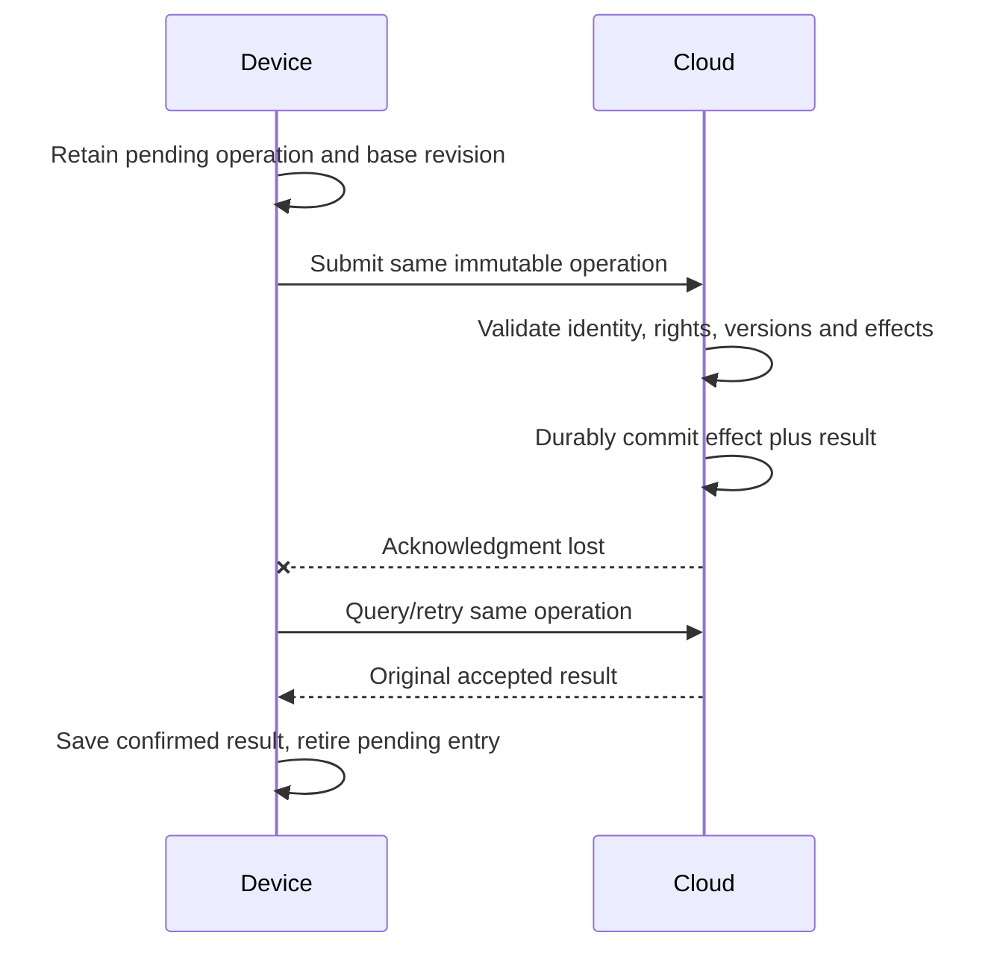

# Cloud authority, temporary activity and recovery

Accepted: cloud holds authoritative durable state; the connected Lab uses remote generation. Devices may retain temporary probing, evolving and training activity until sync. Protocol fields, authentication provider, database, offline allowances, clocks and conflict rules remain proposed.

## Identity and rights

Service-derived authenticated context determines the permitted player and current device enrollment. Client-supplied player/owner IDs are not credentials. Player-scoped reads, operation lookup and recovery require authorization; public views expose only permitted projections. [Ownership, custody and breeding grants](players-social.md#proposed-rights-model) are separate; ordinary profile switching is not registration reassignment.

A shared Probe's pending expedition remains assigned to its original player; docking it while another profile is active cannot credit that profile. Companion training/progress likewise stays player-attributed. Revocation, registration reassignment, offline handover and late-event eligibility need explicit policies; no cached portrait or physical possession supplies rights.

## Proposed operation boundary

A submission identifies stable operation, originating device/enrollment, subject, known cloud revision, relevant content/rules versions and immutable action payload. Bind its identity to the authenticated player and exact request. Ordering/causal information may help reconciliation; device time is not automatically trusted elapsed time.

| Result | Meaning |
| --- | --- |
| Accepted | Effect and result are durably committed together; response identifies the authoritative revision and saved result |
| Rejected | A verified reason prevents acceptance, such as invalid authorization or changed payload under an existing operation |
| Unresolved | Eligibility, versions, dependency or conflict policy is unknown; no effect accepted |
| No verified response | Local communication uncertainty; not proof of cloud failure or rejection |

Check access before exposing even duplicate receipts. An exact accepted retry returns the original result without another effect or generation. Resolve accepted identity before applying new stale-revision checks. Changed payload under the same identity never overwrites the result. Unknown permissions or unsupported actions cannot be accepted. Until explicit domain policy exists, competing valid submissions remain unresolved rather than last-write-wins.

Request arrival, job enqueue and generation completion are not gameplay acceptance. Generated candidates pass domain/content validation before authoritative publication. Display readiness and animation completion are also separate from commit.

## Reset and content preservation

After valid recovery, restore accepted cloud records and retained exact assets. If a device fails before uploading activity, that unsynced work may be lost; cloud recovery cannot recreate what it never received. A cloud-pending request remains pending until resolved. Lost local operation identity does not authorize a new compensating creation or reward.

Preserve individual/genome/expression identity, provenance, pinned versions and finished art. Do not generate a replacement portrait or recompute old outcomes under new defaults. Unsupported records remain intact; only independently validated historical facts may be displayed. Missing art is unavailable, not a missing individual. Backup retention, service availability and account recovery still need operational design.

Local Lab offload receipt and Probe clearance are not cloud acceptance. Production inventory must define discard/retention and failure exposure before synchronization. Breeding, lending, lifecycle and offline reward/time effects need approved game semantics before an executable reconciliation policy. See [players and social play](players-social.md) and [architecture](architecture.md).
