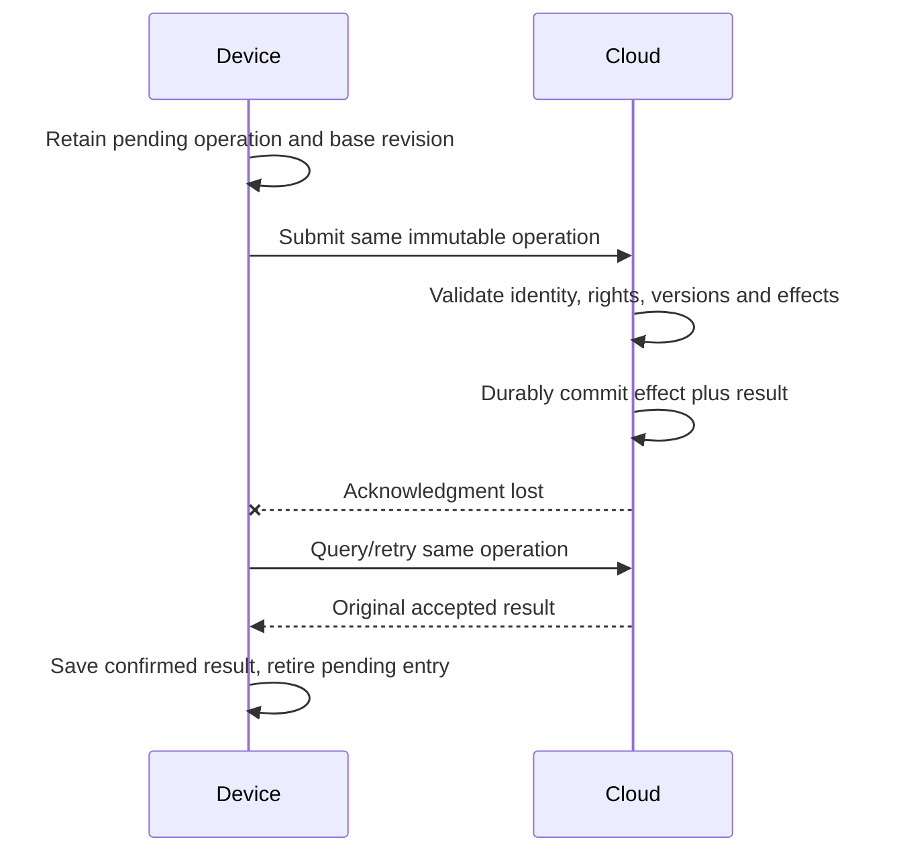

# Local core, optional Cloud Pass and recovery

Accepted: the core kit works standalone from the box, including interaction with nearby kits. The optional Cloud Pass adds global trading and breeding, lineage, certificates and minigames. Core play must not require internet access, a Cloud Pass or a cloud acceptance round trip. No prices or service topology are selected here.

Local core records are durable game records, not merely temporary cloud drafts. The exact authority placement within the combined Companion, Lab and caddy, nearby-kit authentication/acceptance and local/global reconciliation protocol remain OPEN. Do not infer that each device owns an independent inventory or that the caddy is the authority server. The mobile fallback follows the same core/optional-service distinction.

Habitat freeze/restore must preserve resident identity and prevent restoring transferred residents as duplicates; exact semantics remain proposed in [gameplay](gameplay.md#self-contained-habitats). Changing a view, docking or closing the app is not an implicit freeze operation. Local and cloud generation placement follows [architecture](architecture.md); core play cannot depend on remote generation being available.

## Identity and rights

For Cloud Pass operations, service-derived authenticated context determines the permitted player and current device enrollment. Local-core and nearby-kit identity, authorization and enrollment mechanisms remain open; standalone play does not require service enrollment. Client-supplied player/owner IDs are not credentials. In both scopes, player-scoped reads, operation lookup and recovery require authorization; public views expose only permitted projections. [Ownership, custody and breeding grants](players-social.md#proposed-rights-model) are separate; ordinary profile switching is not registration reassignment.

A shared Companion's pending Probe-mode expedition remains assigned to its original player; docking it while another profile is active cannot credit that profile. Companion training/progress likewise stays player-attributed. Revocation, registration reassignment, offline handover and late-event eligibility need explicit policies; no cached portrait or physical possession supplies rights.

## Proposed global operation boundary

A Cloud Pass submission identifies stable operation, originating device/enrollment, subject, known cloud revision, relevant content/rules versions and immutable action payload. Bind its identity to the authenticated player and exact request. Ordering/causal information may help reconciliation; device time is not automatically trusted elapsed time.

| Result | Meaning |
| --- | --- |
| Accepted | Effect and result are durably committed together; response identifies the authoritative revision and saved result |
| Rejected | A verified reason prevents acceptance, such as invalid authorization or changed payload under an existing operation |
| Unresolved | Eligibility, versions, dependency or conflict policy is unknown; no effect accepted |
| No verified response | Local communication uncertainty; not proof of cloud failure or rejection |

Check access before exposing even duplicate receipts. An exact accepted retry returns the original result without another effect or generation. Resolve accepted identity before applying new stale-revision checks. Changed payload under the same identity never overwrites the result. Unknown permissions or unsupported actions cannot be accepted. Until explicit domain policy exists, competing valid submissions remain unresolved rather than last-write-wins.

Request arrival, job enqueue and generation completion are not gameplay acceptance. Generated candidates pass domain/content validation before authoritative publication. Display readiness and animation completion are also separate from commit.

## Reset and content preservation

Local-core recovery must preserve accepted local records and exact assets without requiring a Cloud Pass. Backup, device-loss recovery and nearby-kit handover policies remain open; local storage cannot promise recovery after its loss. For Cloud Pass, valid service recovery restores the accepted global records and retained assets available there; it cannot recreate local records it never received. A cloud-pending request remains pending until resolved. Lost operation identity does not authorize a new compensating creation or reward.

Preserve individual/genome/expression identity, provenance, pinned versions and finished art. Do not generate a replacement portrait or recompute old outcomes under new defaults. Unsupported records remain intact; only independently validated historical facts may be displayed. Missing art is unavailable, not a missing individual. Backup retention, service availability and account recovery still need operational design.

A local Lab offload receipt and Companion Cargo clearance do not establish global acceptance. Core inventory acceptance must be defined independently of optional cloud synchronization; discard/retention, nearby-kit transfer, enrollment into global services and competing local/global changes remain open. Breeding, lending, lifecycle and elapsed-time effects need approved game semantics before an executable reconciliation policy. Do not assume uploading a local record certifies it globally, or that ending Cloud Pass access deletes local core records. See [players and social play](players-social.md) and [architecture](architecture.md).
