# Interaction and visual experience

Accepted direction: retro pixel-based device screens, recognizable critters and tactile operation. Responsive specimen presence is required as an experience goal; screen art, palette and motion remain under owner review; selected simulator display profiles are listed below. Desktop composition studies are not firmware or hardware evidence.

## Physical experience is the product

Accepted: the Lab, Probe, Companion and Caddy exist to make the game tangible. Each has a distinct purpose, rhythm and relationship with the player. Their interfaces should express those differences rather than reproduce one generic application on different screens.

| Surface | Experience to preserve |
| --- | --- |
| Probe | A simple e-ink instrument that accompanies ordinary activity and catches varied observations and fictional events. Brief checks and straightforward collection; deeper interpretation belongs at the Lab. |
| Companion | A cute, highly interactive presence for bonding, training and development. Responsive creature reactions matter; it is more than a collection viewer. Exact actions and animations remain open. |
| Lab | A customizable research workbench with room for many screens and game loops: investigation, crafting, creation, collections and knowledge. Expand its capabilities through a coherent interaction framework, not trait-specific navigation exceptions. |
| Caddy | A tangible home and charging place for the portables, supporting the kit's physical routine. Docking does not by itself imply data transfer, ownership change or gameplay rewards. |

The complete game may first be designed and prototyped in software or an app. A future complete app edition is also allowed in principle; its scope is not committed. A software-first prototype must preserve the different device roles and transitions so it tests the intended experience. It does not validate tactile controls, e-ink refresh, handling, charging or real-world ergonomics.

Lab extensibility is not a fixed page count or a commitment to unlimited hardware capacity. Physical display count, display modules, controls and performance budgets remain separate decisions. Current kit play still supports operation without a required phone. Final layouts, creature behavior and physical designs retain their own review gates.

Expedition selection reinforces these roles: compare duration, difficulty, expected rewards and event character at the Lab, then carry the chosen expedition on the simple Probe. Exact comparison layout and on-device event interactions remain to be designed.

## Operate the object

The Lab workbench supports a collection of partially decoded genomes. Selecting a record brings its sample identity, discovered/unknown zones and studies into focus; available resource types in Lab inventory make different work possible. Unknown is a knowledge state, not a lock or permission gate. Show discovery through the changing research subject and relevant findings, using concise labels rather than tutorial/report paragraphs. The Probe gathers typed resources and samples under an expedition profile; it does not act as a task counter for only one genome. The connected object and interaction proposal lives in [research and creation](../design/research-and-creation.md).

Research is a process of discovering surprises in a sample cache. The connected experience spans several gathering expeditions: the Probe shows actual gathering progress toward known research needs; the Lab shows retained discoveries, research progress, remaining work and what further gathering enables. Neither an expedition-complete message nor a supply count substitutes for research completion. Design the return to the same sample and continuation together, preserving findings. Exact meters, numbers and timing remain open under [gameplay](gameplay.md#research-is-discovery-across-expeditions--accepted).

A sample, creature, vessel or inventory is the center of each activity. Composition follows purpose: browsing selects; research examines; creation review explains consequences; Meet gives a saved individual room. Use connected explanations where needed rather than scattered short labels. Details adds depth but must not hide instructions essential to play.

Separate **focus**, **retained selection/draft**, **navigation** and **domain commitment**. Focus previews; explicit Select retains a value; entering a named destination navigates. A separate supported command commits. Use generic action labels rather than attribute-specific toggles. Back restores caller, object, page and valid focus without committing a draft or cancelling submitted work. Unsupported choices need explanation and fresh selection, never silent substitution.

```mermaid
flowchart LR
  Focus[Focus / preview] --> Select[Explicit Select]
  Select --> Draft[Retained reversible draft]
  Draft --> Review[Named review destination]
  Review --> Commit[Supported explicit commit]
  Commit --> Pending[Pending operation]
  Pending --> Saved[Verified saved result]
  Saved --> Ready[Ready]
  Ready --> Open[Deliberate Open]
  Open --> Meet[Same saved individual]
```

This diagram specifies separation, not a claim that all production joins are implemented. Sample opening, research B commitment and creation remain governed by their own domain rules.

## Input and visibility

### Simulated console controls — accepted

The simulator's depicted device controls are the player input surface. Existing knob and buttons drive visible focus, supported actions and screen feedback. Lab uses rotation and existing Confirm/Back; Probe uses existing Next/Confirm, including a reachable on-screen return target where required. Activate screen targets through those controls. Do not invent device keys, knob-press actions, clickable screen controls or touch/web shortcuts. Unassigned keys remain inactive. Design input, focus, activation, pending/error response and return together. Developer controls stay outside device shells.

Continue the selected visual foundation and existing screen work. Selection of a styleboard does not approve a complete screen composition, and compatible control mappings do not approve styling. Rejected layouts are not a basis for incremental polish.

Every interaction frame has an identity covering page, object, focus and displayed facts. Activation requires that requested frame to be visibly ready. Pixel submission or SPI completion alone is not physical visibility. Ignore stale draw/readiness callbacks and stale domain responses; scope asynchronous work to the selected identity and request generation.

Discard blocked activation rather than queueing it. A gesture started during refresh, suspension or idle wake remains consumed through repeat/release. Require a fresh gesture; blur and pointer cancellation cancel pending activation. Coalesce navigation to one pending target. Safe Back can request a return frame while waiting, but does not cancel a committed operation; the return frame must itself become ready.

Use one focused target, while several actions may be enabled. Preserve stable contextual positions; skip disabled targets without making labels illegible. Status updates preserve valid focus or return to a safe target, never automatically select a new consequential command. Keep press received, work pending, result saved and screen visible distinct.

## Profiles and identity

- Color, monochrome/print and slow-refresh views need deliberate composition, not assumed equivalent color conversion. Meaning has shape/text equivalents. Preserve silhouettes and major markings.
- Pixel-aligned glyphs need lowercase/punctuation/full-ID coverage and measured physical readability. Use intentional short display labels with lossless full values in bounded Details; do not silently clip identity or shrink text to fit.
- Animation must preserve saved identity and provide stable still/reduced-motion equivalents. Slow-refresh screens cannot rely on smooth animation, blinking focus or timed responses.
- Individual, family, expressed, carried-but-unexpressed and unknown information have distinct labels. A missing portrait preserves known identity and offers same-record recovery, never another specimen.
- Idle may cycle collection, research activity and encyclopedia. Timing remains open. Entry/rotation wait for readiness; wake consumes the first gesture and restores prior context. Idle adds no research, reward or care progress by itself.

## Copy and document presentation

Use ordinary sentence case and plain explanations; reserve pixel or monospaced labels for short instrument text. Name the object and actual action, explain unavailable actions, and distinguish pending, accepted and historical facts. Keep player copy free of protocol jargon; technical specifications retain precise terms. Essential meaning stays in selectable text rather than artwork alone.

Documentation uses restrained diagrams, explicit labels and plain backgrounds. Cream/charcoal with small orange accents belong to the approved editorial direction; they do not select a screen palette or recolor critters. Preserve reference device geometry and individual markings in illustrations. No decorative distress, ornamental filler or convincing success image should conceal an unresolved interface.

## Device adaptations

Lab pages can support comparisons and richer explanation; portable pages emphasize one activity and shallow navigation. Companion presence centers the individual without invented hunger/happiness/neglect meters. App/setup forms may use normal accessible controls rather than forcing pixel constraints onto configuration. The phone is supporting access, not required to finish routine encounters.

Empty, loading, unavailable, unsupported, disabled and historical/cached are distinct. Preserve records on error; uncertainty is not failure. Include storage-full, interrupted operations, low power, unavailable sensing, printer/paper faults and offline lookup as explicit states. Exact control hardware and each screen's detailed layout remain design work.

## Native prototype presentation

The expedition-to-finding slice uses distinct native compositions: a 1024 × 600 color Lab, a 122 × 250 portrait monochrome Probe candidate, and a 368 × 448 color Companion. The browser presents the complete frame by default; the playable view never requires panning inside the screen. The enclosure palette does not restrict the color displays. Use the Lab's resolution for a clear focal object, fine readable type and visual findings rather than enlarged low-resolution labels.

The previous Lab layouts are rejected, including the large explanation band and placeholder form artwork. Do not carry them forward as layout requirements. The next design round follows the [screen design standard](../design/screen-design-standard.md): consistent typography, reference-led instrument compositions, meaningful artwork and complete physical interaction sequences. Study review must still expose actual cost and stock, and results must distinguish known possibilities from unknown regions. Probe events never disclose sample contents or imply a research finding.

Player language explains actions without requiring chemistry knowledge. The prototype calls its existing research resource **Lab supplies**; reviewing a study is separate from **Start study**, whose cost must be visible before activation. A finding shows what became known and what remains unknown. Revisiting preserves the result without spending or rerolling. Internal field names do not prescribe player vocabulary.

Hardware-shaped presenter housings follow the original references but remain provisional appearance studies. Actual screen profiles are enforced; housing dimensions, controls, sensor behavior and physical refresh are not validated by a browser. Engineering time controls and release information stay outside the device face. Release identity uses the first seven commit SHA characters as plain text and fixed deployment timestamp displayed in Mexico City time.

The shared prototype exposes Reset sandbox outside the device controls. Confirmation clears demo progress for everyone and returns to the initial Lab expedition; Cancel leaves state unchanged. Reset is a simulator operation, not a device gameplay action.

### Physical navigation design

The earlier per-command browser button deck is rejected as the target interaction. Fixed simulated hardware actuators send logical input; native C owns focus, activation and screen feedback. The provisional map is Lab rotation/Confirm/Back, Probe Next/Confirm, and Companion previous/Confirm/next. Additional keys and touch functions remain unassigned until designed. Read-only art and status panels must not look like touch targets.

Preserve fresh-gesture, frame-readiness and cancellation rules above. Engineering controls, Reset and device selection remain outside the device face. Current implementation coverage is recorded in build documentation; a proposed map is not proof of hardware behavior.

## Current prototype acceptance gate

Before expanding into additional game phases, the existing slice must establish a coherent experience accepted by the owner: layout, color, interaction, pixel art and concise player-facing copy. Review these together through a representative playable sequence. Successful command execution, readable text or static screen approval alone does not establish experience acceptance. Design refinements and implementation needed to meet this gate remain in scope.

The current phase is design iteration. Compare and review visual directions, then connected physical-control sequences, before resuming screen implementation. Rejected proposals are not a basis for incremental styling patches.
