# Interaction and visual experience

Accepted direction: retro pixel-based device screens, recognizable critters and tactile operation. Responsive specimen presence is required as an experience goal; screen art, palette and motion remain under owner review; selected simulator display profiles are listed below. Desktop composition studies are not firmware or hardware evidence.

## Physical experience is the product

Accepted current architecture: the combined Companion, home Lab and Caddy make the game tangible. Probe is now a Companion mode, not a separate physical device. The [consolidated device direction](devices.md#current-consolidated-product-architecture) supersedes older separate-device studies while preserving their gameplay work.

| Surface | Experience to preserve |
| --- | --- |
| Companion | Main everyday interaction device: Probe for expeditions/observations/encounters, Cargo for carried findings and temporary captures, Companions for bonding/training/development. Brief field checks coexist with responsive creature presence; mode changes do not silently cancel activity. Combined display and controls remain proposed. |
| Lab | A customizable research workbench with room for many screens and game loops: investigation, crafting, creation, collections and knowledge. Expand its capabilities through a coherent interaction framework, not trait-specific navigation exceptions. |
| Caddy | Charges Lab and Companion, prints, and presents the shared world's habitats, eggs, residents and environments. It shows accepted local records or an explicitly dated cache; optional global services do not gate core play. Exact storage/authority placement remains open in [architecture](architecture.md). Docking alone confers no transfer, ownership or reward. |

The complete game may first be designed and prototyped in software or an app. A future complete app edition is also allowed in principle; its scope is not committed. A software-first prototype must preserve the different device roles and transitions so it tests the intended experience. It does not validate tactile controls, e-ink refresh, handling, charging or real-world ergonomics.

Lab extensibility is not a fixed page count or a commitment to unlimited hardware capacity. Physical display count, display modules, controls and performance budgets remain separate decisions. Current kit play still supports operation without a required phone. Final layouts, creature behavior and physical designs retain their own review gates.

Expedition selection and field play belong on the Companion. The Lab receives
records and accepted results; it has no live away-expedition view. Return is
player-directed. The [reviewed map study](../design/expedition-map-study/README.md)
guides the accepted local map loop; rates, budgets and physical performance
remain unvalidated.

## Navigation and passive previews — owner direction

The owner requires navigation-only sidebars. Directions select a destination or
inspectable target and update its read-only preview immediately, without spending,
accepting, starting work or visiting. Confirm enters the selected task or performs
its explicit action; Back restores its caller. Collection browsing should expose
sample-specific findings as focus moves. Habitat Overview should show the resident
population rather than treating one selected resident as the whole Habitat.

The bounded Habitat slice uses a passive Home population preview and an entered
four-column, two-row Residents gallery for the eight supported saved residents.
Only revealed individuals appear. Half-size images reuse each saved-authorized
original; unsupported appearance remains Art pending. The selected member's full
identity, retained form, source sample and visits update in a shared detail band.
This reversible layout requires native scale, fit and memory evidence; it does
not establish final art, ecology or enjoyment.

Home Up/Down still selects workspaces; Right on Habitat remains passive.
Confirm on Habitat, or the Habitat key,
enters Population without care. Inside the gallery, Left/Right selects an adjacent
column and Up/Down the same-column row; absent neighbors and edges clamp without
wrapping. Physical Back returns to Home Habitat. These gallery directions replace
the older Left-as-Back/Right-as-inspect aliases only in that collection. Confirm
enters the selected Resident activity safely on Population navigation. Its sidebar
contains Population and Received expeditions (Explore in the standalone fixture);
the separate workpiece action Spend time together requires fresh Confirm. Right
passively focuses that action, Left restores Population, and Back restores the
same gallery member. Browsing and task entry never record care.
The named Received expeditions visit preserves its Resident caller: detail Back
returns to the record list, then Back restores that same resident and navigation
choice. This transient caller is separate from an arriving haul's return context
and adds no saved world state.

The separate Research workpiece keeps Samples Overview followed by sample
destinations on the left. Focus immediately previews that exact sample's full
identity, origin, retained clue and unknowns in main. Library retains its existing
finding ordinals and previews the exact focused record freely; it adds no Overview
or ordinal shift. Inquiry choices, costs, Start, findings and shortages belong in
main, with only one active focus. Existing Confirm/review/fresh-Start and Back
caller boundaries remain. This presentation adds no evidence minigame or new
trait; comprehension, enjoyment and final visual acceptance require actual use.

A's internal coat references have a separate permission: validated heritage and
coat findings must both be known. Coat before heritage remains text-only. Both
permitted references appear together, without another reveal click. Complete
original portraits still require complete knowledge and both supported-candidate
permissions, on entered free comparison only. B preserves its linked walking
relationships and common reference conditions; effort also grants free movement
inspection. The [comparison contract](../design/research-and-creation.md#next-comparison-trial)
defines these disclosure boundaries. Native source-size/2× clipping and long-copy
fit are acceptance gates, not approved art inferred from this specification.

## Framework-led Companion layout

Owner permits a complete game re-layout, particularly Companion, to use the
selected displays and LVGL. Existing page geometry is not a design requirement.
Approved Gemini/C18 identity and the physical controls remain requirements.

The Companion home presents three full-width destinations: Probe, Cargo and
Companions. Up/Down selects their vertically arranged workpieces; Left/Right
retains compatible clamped selection. A fresh Confirm enters the remembered
mode without starting an outing, spending, sending or visiting. Each destination
shows current known state: outing location/status, current supply/sample capacity,
and the retained revealed-critter count. Compact current cargo remains visible.
No unrevealed portrait or new scene asset is needed for this home.

Within each mode a slim rail is secondary to its workpiece. Probe centers the
legal map, player and known local finding; its unstarted outing choices are
full-width vertical rows matching Up/Down. The existing three profile names do
not imply different finite yields: current field offers and rules are shared.
Cargo centers actual whole materials, a capsule only when carried, capacity and
its deliberate Send action. Companions centers the same saved individual and
supported visit. Final art, discovery depth and enjoyment remain separate gates.

Every supported connected screen uses a retained LVGL tree and copied facts;
transport serializers have no manual drawing fallback. Target adapters and
hardware validation remain separate from host proof. A framework does not supply
missing art or make acquisition engaging. Cargo exposes the actual manifest and
sealing terms before one fresh Send; Lab acceptance remains separate.

The current bounded timer-free Probe composition uses a native32px illustrated
world in a384×320 viewport at33/98. A quiet mode rail and26px place title lead
into the field; a north-up player-follow camera clamps at world edges without
another control or saved state. Only disclosed legal routes and visible places
appear. The abstract corner player marker, reached-place cue and legal clipping
cues preserve orientation without obscuring findings.

Local offer, result and exact free space occupy a384×72 context at33/432.
Current whole cargo occupies an unframed402×64 band at24/518. There is no
preparation strip or repeated instruction footer. A single offer takes directly
on fresh Confirm. Actual alternatives temporarily use a384×192 map and material
clusters at302–418: directions preview one choice, Back preserves the source and
cargo, and fresh Confirm commits the displayed whole batch. Saved results do not
gate the next direction. The entire oversized offer remains after rejection.

Entry, sent, ended and unavailable states cannot present a sealed record as a
live map. Legacy field collection is ended with an explicit return/finish route.
Neutral samples reveal no contents or genotype. Native intended-size exports
remain the composition gate; environmental depth, entry craft and human enjoyment
are not established by geometry or source checks.
## Operate the object

### Current owner playtest requirements

Owner playtest, 30 September 2026: one existing Lab color shortcut must become
**Home**, returning to the global **Overview · Lab** without spending, sending,
revealing or ending an ongoing activity. The owner selected the yellow Critters key as Home, preserving the full resident
list under Habitat. No extra hardware button is added. Every
Companion mode, including Cargo after accepted unloading, must retain a visible,
usable route back to its mode selector and another task. The reported post-haul
Cargo trap is pending isolated reproduction; it is not claimed repaired.

Keep the lab-wide Home overview and focus-driven feature previews. Correct the
prototype's single-device shortcut: Lab plans and receives; the separate Companion
conducts Probe-mode expeditions and carries cargo until successful Lab acceptance.
Acceptance clears current carried supplies and capsules when it credits Lab.
The immutable delivery record and pending acknowledgment stay distinct from
current inventory; receipt completion cannot award another copy. The simulator
must make both device roles and this ownership transition visible.

Display resources as integer counts with explicit units; gathering progress is
separate from usable stock. Do not round away saved quantities or imply that a
rounded count is spendable. The stock header must reflect a saved haul receipt
immediately. The current native release already stores whole awarded supplies separately
from gathering preparation; legacy encoding is preserved through its documented conversion.

Research uses one persistent workbench: pending samples on the left, each retaining
its own discoveries; the selected sample shows established findings, unresolved
questions and the next directed research choice together. Avoid compulsory checklists,
hidden progress and textbook explanations. Expedition purpose, relevant opportunities
and observed results must be understandable; renamed identical routes are insufficient.

Each main section also needs its own collection/activity overview, distinct from
an individual item's overview. Research starts with an **Overview** entry above
the left sample list: it summarizes all samples, retained discoveries, work in
progress and supply needs. Focusing a sample previews only that sample; Confirm
enters its workbench. Returning to Research Overview restores the collection-wide
picture, not a summary of whichever sample was last selected. Apply this hierarchy
to Explore, Incubator and Habitat using their meaningful section-wide activity and
individual expedition, incubation or habitat/resident context. Global Home,
section overview and selected-item overview have different scopes and must not
silently substitute for one another. Focus previews without committing or spending.

Use contextual titles **Overview — Lab**, **Overview — Explore**,
**Overview — Research**, **Overview — Incubator** and **Overview — Habitat**.
The short menu entry may say Overview where its function context is visible.
Back remains the separate return-to-previous-context action; an overview label
must not imply that it is a Back button. The owner selected Overview as the name
after requesting explicit home/function context.

Current art remains provisional and below the approved C18 reference. Match the
screen-design standard's margins, palette, frames, typography, focus effects and
sprite craft in actual native renders. Reported intermittent navigation freezes
require reproduction and recovery checks, not an assumption of user error.

The Lab workbench supports a collection of partially decoded genomes. Selecting a record brings its sample identity, discovered/unknown zones and studies into focus; available resource types in Lab inventory make different work possible. Unknown is a knowledge state, not a lock or permission gate. Show discovery through the changing research subject and relevant findings, using concise labels rather than tutorial/report paragraphs. The Probe gathers typed resources and samples under an expedition profile; it does not act as a task counter for only one genome. The connected object and interaction proposal lives in [research and creation](../design/research-and-creation.md).

Research is a process of discovering surprises in a sample cache. The connected experience spans several gathering expeditions: the Probe shows actual gathering progress toward known research needs; the Lab shows retained discoveries, research progress, remaining work and what further gathering enables. Neither an expedition-complete message nor a supply count substitutes for research completion. Design the return to the same sample and continuation together, preserving findings. Exact meters, numbers and timing remain open under [gameplay](gameplay.md#research-is-discovery-across-expeditions--accepted).

A sample, creature, vessel or inventory is the center of each activity. Composition follows purpose: browsing selects; research examines; creation review explains consequences; Meet gives a saved individual room. Use connected explanations where needed rather than scattered short labels. Details adds depth but must not hide instructions essential to play.

Do not repeat basic control tutorials on ordinary screens, including Home's
workspace previews. Focus, the physical panel and action labels identify ordinary
navigation. Costs, sample-use/retained-record terms, actual state, results and
unusual errors remain visible. This applies across Lab, Companion and Dock.

Separate **focus**, **retained selection/draft**, **navigation** and **domain commitment**. Focus previews; explicit Select retains a value; entering a named destination navigates. A separate supported command commits. Use generic action labels rather than attribute-specific toggles. Back restores caller, object, page and valid focus without committing a draft or cancelling submitted work. Unsupported choices need explanation and fresh selection, never silent substitution.

```mermaid
flowchart LR
  Focus[Focus / preview] --> Select[Explicit Select]
  Select --> Draft[Retained reversible draft]
  Draft --> Review[Named review destination]
  Review --> Commit[Supported explicit commit]
  Commit --> Pending[Pending operation]
  Pending --> Saved[Verified saved result]
  Saved --> Ready[Ready]
  Ready --> Open[Deliberate Open]
  Open --> Meet[Same saved individual]
```

This diagram specifies separation, not a claim that all production joins are implemented. Sample opening, research B commitment and creation remain governed by their own domain rules.

The proposed Probe [Observations and expedition log](../design/probe-sampling.md#observations-and-expedition-log--requested-destination) makes sensed context and its connection to encounters inspectable. It is read-only, uses existing directions/Confirm/Back, distinguishes measured observations from game events and does not create collection rewards. Layout remains part of the full UI revisit.

## Input and visibility

### Feature-led research journey — proposed screen projection

The [player-facing genetics projection](../design/research-and-creation.md#player-facing-genetics-abstraction--proposed-projection) supplies the game contract. The proposed screen journey lets a player choose research, retain discoveries and understand what those discoveries enable. Features, findings and supported outcomes organize the player view; internal loci do not prescribe its navigation. A feature can depend on several inherited facts, and a finding can inform several features. This is an information and interaction proposal, not an implemented screen sequence or approved layout.

The overview keeps the selected sample, useful research topics, retained knowledge and remaining opportunities together. A known inherited possibility, an established reference outcome and unresolved information have distinct roles. Do not reduce them to a completion color or infer absence from an unknown fact. The engine supplies what can be established under the named reference conditions; partial research does not universally mean an unknown outcome. Generic feature art identifies a topic, not the appearance of a living critter or an undiscovered sample result.

#### Worked interaction: Sample A

Current implementation evidence is the [connected native journey](../docs/evidence/playable-expeditions/README.md). The two-Data browser study described below is a retained earlier illustrative fixture, not current cost, controls or connected-game authority.

The existing illustrative fixture starts with Data 2, Energy 1 and Essence 0. A pale-marking variant is known; the other required markings fact and adult-reference appearance are unresolved. All other required information in this small authored example is assumed established. Labels below illustrate purpose and hierarchy, not final player copy.

| State | What the player sees and can do | Console input and retained context |
| --- | --- | --- |
| Sample overview | Sample A is the workpiece. Markings shows the known pale variant and remaining research; the supported Markings study is available. Other records and inventory remain reachable in their existing context. | Rotate changes one visible focus. Confirm opens the focused destination; Back restores collection and sample focus. Browsing spends nothing. |
| Research choice and review | Markings study names a discovery topic, not a question to answer or a desired allele. Show its purpose, Data cost 2, available Data 2 and explicit Start study. Inspecting known findings is free and distinct from starting research. | Rotate moves focus among available actions; a fresh Confirm on Start commits. Back leaves the review without spending or losing Sample A. No genotype or result selection. |
| Work pending | Keep Sample A and the committed study identifiable. Show pending work without displaying a finding as saved. | A return gesture may leave the view, but does not cancel submitted work. Repeated input does not submit another study; uncertain delivery checks the same operation. |
| Finding saved | Reveal the accepted result: the pale variant is retained, but pale markings would not appear under the adult, mild-condition reference. Show what became known and what remains unresolved. Accepted stock is Data 0, Energy 1, Essence 0. | Focus a supported return action; do not automatically focus another consequential command. The record retains the finding, reference context and operation result. |
| Free inspection and return | Explain the saved markings finding and its reference rule. Known inherited potential remains distinguishable from an expressed feature. Technical genotype notation, if later selected for a secondary view, is not required to understand the result. | Confirm inspects without spending or rerolling. In detail, Return and Back restore Sample A, its feature context and valid overview focus. Detail need not repeat inventory or the entire overview index. |
| Research and incubation readiness | The overview reflects engine-derived remaining work. For this authored fixture, completing the last required finding can make research complete; that alone does not commit incubation. Supported complete configuration, source sample and required materials are reviewed separately. | Existing explicit selection, review and commit boundaries apply. No automatic incubation, feature-count completion test or new device control is introduced. |

Each view answers its own purpose: overview offers useful places to explore; review explains the spend; pending identifies submitted work; result reveals the discovery; inspection explains retained evidence; readiness explains the next supported step. Moving detail off the default view must not erase evidence or meaningful inheritance relationships. Return restores that broader context rather than trapping the player in a result page.

#### Connected sample overview, study review and inspection

The retained earlier screen27 proposal (historical composition fixture, not current controls or canonical traits) uses a clearly illustrative combination of existing crown, eye-ring and markings findings. It is not a new canonical baseline. Crown and Eye rings are established free-inspection destinations; Markings begins with known pale inheritance and unknown expected appearance. The scope label is Research because the view crosses genomic dimension families.

- **Overview:** three stable feature targets. Rotate moves one focus; Confirm inspects a known finding for free or opens the supported Markings study review. Action hints follow the focused target. Back restores collection. Only Markings has an authored study in this fixture; do not invent studies for the other two.
- **Review:** name the study purpose and show cost2 Data packs against stock2. Start study is the explicit spending boundary. Return or Back leaves without spending and restores Markings focus. The reference art does not reveal the unknown result.
- **Saved inspection:** retain pale inheritance beside the expected absence of pale markings under adult/mild reference conditions. Stock is now0/1/0. Return/Back restores the sample overview with Markings known and freely inspectable, preserving focus. No second spend, reroll or automatic incubation.

The same shared feature references and selected resource assets appear across frames. The three exports cover representative composition and information; pending/uncertain-operation behavior follows the journey above, while dynamic focus and return still need a connected console prototype. They do not establish human comprehension, complete genomic coverage, physical readability or final visual approval.

One focus marker identifies an action or navigable target. Feature illustrations, reference examples, knowledge states and resource items have visibly different roles; they do not imitate focus or touch controls. A static storyboard can assess that distinction and information visibility. A later connected console sequence must establish comprehension, operation feedback and return behavior; it cannot be inferred from readable labels alone.

### Visual-system direction

The UI is a screen inside a physical game device, not a scene depicting another device or laboratory bench. The owner now favors exploring recognizable features and discoveries, with genomic loci abstracted beneath the player view. Preserve structure, known inheritance, reference expression and undiscovered information through the feature-led journey above; a locus map is not required navigation. Vintage paper/illustration may suit library content or a possible color Probe; neither placement nor display technology is selected. See [screen design standard](../design/screen-design-standard.md#proposed-feature-facing-visual-contract) for current research boundaries. Rejected concept plates do not define the UI.

### Home and feature landings

The Lab opens with Home selected: a lab-wide overview of retained resources,
expedition/cargo, samples/discoveries, incubation and revealed residents. Moving
focus through Home, Explore, Research, Incubator and Habitat changes the large
preview to that feature's actual state; it never commits an action. Confirm enters
the focused feature; Back restores its Home focus. See the [landing contract](../design/home-landings/README.md)
for state coverage and visual derivation from the approved baseline. Current V1
research resolves on commitment and has no background research queue.

### Simulated console controls — accepted

The simulator's depicted device controls are the player input surface. Owner-authorized Lab migration (29 September 2026) follows the Raspberry Pi4 family concept: directional cross at left, Home/Research/Library/Habitat workspace keys in the middle (yellow Home first, orange Research second), Back then Confirm at right, no knob. Up/Down move one list focus per fresh press/release. Left follows Back; Right opens explicitly safe read-only details where available and never commits research, discard, offload, incubation, reveal or care. Confirm activates the selected action, preserving commitment reviews. Workspace keys navigate without spending, revealing an incubating resident or stopping active gathering/incubation; preserve selected sample/topic/resident context. Home opens Overview · Lab; Habitat includes the full revealed-resident list; V1 Library shows sample-specific recorded findings only, not a complete encyclopedia. Empty destinations remain honest and navigable. Every button obeys the same fresh-gesture, cancellation and visible-ready-frame boundary. Screen pixels remain non-clickable. Portable legacy inputs remain unchanged by this Lab migration; no physical GPIO behavior is claimed. Developer controls stay outside device shells.

Continue the selected visual foundation and existing screen work. Selection of a styleboard does not approve a complete screen composition, and compatible control mappings do not approve styling. Rejected layouts are not a basis for incremental polish.

Every interaction frame has an identity covering page, object, focus and action
meaning. Activation requires a frame acknowledged as visibly ready. A later
time-only repaint may retain that acknowledged interaction when its object,
focus, destination, availability and commitment meaning are unchanged. First
cargo availability, expedition completion, incubation readiness, navigation,
spending/receipt and error/recovery changes require a newly visible frame.
An animation or timer must not consume an otherwise valid press. Pixel submission
or SPI completion alone is not physical visibility. Ignore stale draw/readiness
callbacks and stale domain responses; scope asynchronous work to the selected
identity and request generation.

Discard blocked activation rather than queueing it. A gesture started during refresh, suspension or idle wake remains consumed through repeat/release. Require a fresh gesture; blur and pointer cancellation cancel pending activation. Coalesce navigation to one pending target. Safe Back can request a return frame while waiting, but does not cancel a committed operation; the return frame must itself become ready.

Use one focused target, while several actions may be enabled. Preserve stable contextual positions; skip disabled targets without making labels illegible. Status updates preserve valid focus or return to a safe target, never automatically select a new consequential command. Keep press received, work pending, result saved and screen visible distinct.

## Profiles and identity

- Color, monochrome/print and slow-refresh views need deliberate composition, not assumed equivalent color conversion. Meaning has shape/text equivalents. Preserve silhouettes and major markings.
- Pixel-aligned glyphs need lowercase/punctuation/full-ID coverage and measured physical readability. Use intentional short display labels with lossless full values in bounded Details; do not silently clip identity or shrink text to fit.
- Animation must preserve saved identity and provide stable still/reduced-motion equivalents. Slow-refresh screens cannot rely on smooth animation, blinking focus or timed responses.
- Individual, family, expressed, carried-but-unexpressed and unknown information have distinct labels. A missing portrait preserves known identity and offers same-record recovery, never another specimen.
- Idle may cycle collection, research activity and encyclopedia. Timing remains open. Entry/rotation wait for readiness; wake consumes the first gesture and restores prior context. Idle adds no research, reward or care progress by itself.

## Copy and document presentation

Use ordinary sentence case and plain explanations; reserve pixel or monospaced labels for short instrument text. Name the object and actual action, explain unavailable actions, and distinguish pending, accepted and historical facts. Keep player copy free of protocol jargon; technical specifications retain precise terms. Essential meaning stays in selectable text rather than artwork alone.

Documentation uses restrained diagrams, explicit labels and plain backgrounds. Cream/charcoal with small orange accents belong to the approved editorial direction; they do not select a screen palette or recolor critters. Preserve reference device geometry and individual markings in illustrations. No decorative distress, ornamental filler or convincing success image should conceal an unresolved interface.

## Device adaptations

Lab pages can support comparisons and richer explanation; portable pages emphasize one activity and shallow navigation. Companion presence centers the individual without invented hunger/happiness/neglect meters. App/setup forms may use normal accessible controls rather than forcing pixel constraints onto configuration. The phone is supporting access, not required to finish routine encounters.

Empty, loading, unavailable, unsupported, disabled and historical/cached are distinct. Preserve records on error; uncertainty is not failure. Include storage-full, interrupted operations, low power, unavailable sensing, printer/paper faults and offline lookup as explicit states. Exact control hardware and each screen's detailed layout remain design work.

## Native prototype presentation

The expedition-to-finding slice uses distinct native compositions: a 1024 × 600 color Lab, a 122 × 250 portrait monochrome Probe candidate, and a 368 × 448 color Companion. The browser presents the complete frame by default; the playable view never requires panning inside the screen. The enclosure palette does not restrict the color displays. Use the Lab's resolution for a clear focal object, fine readable type and visual findings rather than enlarged low-resolution labels.

The previous Lab layouts are rejected, including the large explanation band and placeholder form artwork. Do not carry them forward as layout requirements. The next design round follows the [screen design standard](../design/screen-design-standard.md): consistent typography, reference-led instrument compositions, meaningful artwork and complete physical interaction sequences. Study review must still expose actual cost and stock, and results must distinguish known possibilities from unknown regions. Probe events never disclose sample contents or imply a research finding.

Player language explains actions without requiring chemistry knowledge. The prototype calls its existing research resource **Lab supplies**; reviewing a study is separate from **Start study**, whose cost must be visible before activation. A finding shows what became known and what remains unknown. Revisiting preserves the result without spending or rerolling. Internal field names do not prescribe player vocabulary.

Hardware-shaped presenter housings follow the original references but remain provisional appearance studies. Actual screen profiles are enforced; housing dimensions, controls, sensor behavior and physical refresh are not validated by a browser. Engineering time controls and release information stay outside the device face. Release identity uses the first seven commit SHA characters as plain text and fixed deployment timestamp displayed in Mexico City time.

The shared prototype exposes Reset sandbox outside the device controls. Confirmation clears demo progress for everyone and returns to the initial Lab expedition; Cancel leaves state unchanged. Reset is a simulator operation, not a device gameplay action. Every newly deployed sandbox version starts a fresh shared game across Lab, Companion and Dock; saved progress, transfer state and device caches are cleared together. Checks of the unchanged running version preserve play. This is the owner-approved sandbox policy, not a production save policy.

### Physical navigation design

The earlier per-command browser button deck is rejected as the target interaction. Fixed simulated hardware actuators send logical input; native C owns focus, activation and screen feedback. The Lab map is the accepted directional/workspace/Back/Confirm panel above; legacy Probe Next/Confirm and Companion previous/Confirm/next mappings are separate. Additional keys and touch functions remain unassigned until designed. Read-only art and status panels must not look like touch targets.

Preserve fresh-gesture, frame-readiness and cancellation rules above. Engineering controls, Reset and device selection remain outside the device face. Current implementation coverage is recorded in build documentation; a proposed map is not proof of hardware behavior.

## Current prototype acceptance gate

Before expanding into additional game phases, the existing slice must establish a coherent experience accepted by the owner: layout, color, interaction, pixel art and concise player-facing copy. Review these together through a representative playable sequence. Successful command execution, readable text or static screen approval alone does not establish experience acceptance. Design refinements and implementation needed to meet this gate remain in scope.

The current phase is design iteration. Compare and review visual directions, then connected physical-control sequences, before resuming screen implementation. Rejected proposals are not a basis for incremental styling patches.

## Playable three-device simulator boundary

Lab, Companion and Dock are visible together. Lab retains its approved Overview
art and controls. Companion uses directions, Back and Confirm across Probe,
Cargo and Companions. At the three-destination home, Up/Down and compatible
Left/Right select a mode, clamped at either end. Confirm enters its remembered
valid task without invoking it; a fresh Confirm acts. Up/Down moves action focus,
clamped; Up from the first action or Back returns to the same selected home
mode. Task Back restores its caller and row. Left/Right inside tasks never aliases
commit or Back. Probe keeps earned whole supplies visible. Cargo exposes its
whole-item manifest and the term that sending stops collection. One fresh Send
seals/sends directly; there is no normal second Send review. Mode browsing never
transfers, discards or starts an outing. Discard and empty-Finish reviews retain
their separate deliberate decisions.
Companions currently marks party assignment as unimplemented rather than assigning
a resident or fabricating training effects.

Lab automatically opens reception once when a haul arrives, invalidating held
inputs. A fresh Confirm explicitly accepts the whole-item manifest. Back leaves
it pending and restores the caller's navigation with the current world retained.
Only accepted whole supplies fund research. Link loss before
send retains the sealed haul; loss after acceptance retains the receipt until
Companion receives it. Duplicate acceptance cannot award another haul. Successful fresh acceptance ends the source expedition. Before acceptance use
Returning; afterward use Returned or Expedition ended, separately from receipt
status. The matching receipt enables a new outing, never Continue for the ended
route. Browsing Cargo or leaving it before Send keeps the current expedition. On world
acceptance, current outgoing supplies/sample become zero on Companion and Lab
reception, including committed-receipt recovery. Accepted historical amounts
remain only in Received records and the immutable journal; receipt status does
not redraw them as current cargo.
Gathering progress remains an activity state on Companion and is never presented
as an unfinished inventory item in either manifest. Timing/chance fixtures are
provisional under [gameplay](gameplay.md#research-collection-and-gathering--accepted).

Dock Previous/OK/Next browses world, supplies and connections; detail views use
OK to return. Print opens a simulated preview with Confirm/Cancel; Feed reports
simulation only. No physical printing, charging or cloud status is inferred.
The display is a timestamped cache of accepted state, marked stale when offline.
Developer link switches sit outside device shells; screen pixels are not inputs.
The host aggregate and recovery limits are defined in [architecture](architecture.md#three-device-host-simulator).

The connected Companion implementation is functional scaffolding, not accepted
visual design. Its mechanics and native rendering evidence do not approve the
text-panel composition. Screen art is being derived from Gemini with the approved
C18/hardware references while preserving the real gathering/whole-item/reception
journey above.

The [Companion experience proposal](../design/companion-experience.md) records
the owner-requested tactile full-device overhaul: immediate mode overviews,
clear Home/Back orientation, game language and visible results. Its detailed
interaction map and resident extension are proposals, not released behavior.

### Expedition ownership and exploration revision — owner direction

Companion owns expedition selection and field play. Lab's field view shows received
expedition records and accepted outcomes; it does not mirror the away Companion's
live map, timer, position or gathering state. A pending incoming transfer remains
an actual reception event, distinct from knowledge of the field journey. The current
host simulation's live field overview is superseded direction, pending implementation.

The active [field design](../design/probe-sampling.md) provides retained reachable
locations, deliberate whole-unit acquisition and a separate trace/sample journey.
The timer-free candidate supersedes the prior single active gathering clock.
Supplies, remaining offers, sealed samples and disclosed routes stay distinct.
Actual alternatives use one transient chooser; single visible offers collect
directly. Cargo remains accessible without replacing the field task. Existing
physical controls only; no touch shortcuts, reflex test or repeated-roll loop.
Numeric content, event catalogue, environmental depth and human enjoyment remain
provisional; source readiness is separate from native acceptance/deployment.
