# Interaction and visual experience

Accepted direction: retro pixel-based device screens, recognizable critters and tactile operation. Responsive specimen presence is required as an experience goal; exact display, art, palette, resolution and motion remain unselected. Desktop composition studies are not firmware or hardware evidence.

## Operate the object

A sample, creature, vessel or inventory is the center of each activity. Composition follows purpose: browsing selects; research examines; creation review explains consequences; Meet gives a saved individual room. Use connected explanations where needed rather than scattered short labels. Details adds depth but must not hide instructions essential to play.

Separate **focus**, **retained selection/draft**, **navigation** and **domain commitment**. Focus previews; explicit Select retains a value; entering a named destination navigates. A separate supported command commits. Use generic action labels rather than attribute-specific toggles. Back restores caller, object, page and valid focus without committing a draft or cancelling submitted work. Unsupported choices need explanation and fresh selection, never silent substitution.

```mermaid
flowchart LR
  Focus[Focus / preview] --> Select[Explicit Select]
  Select --> Draft[Retained reversible draft]
  Draft --> Review[Named review destination]
  Review --> Commit[Supported explicit commit]
  Commit --> Pending[Pending operation]
  Pending --> Saved[Verified saved result]
  Saved --> Ready[Ready]
  Ready --> Open[Deliberate Open]
  Open --> Meet[Same saved individual]
```

This diagram specifies separation, not a claim that all production joins are implemented. Sample opening, research B commitment and creation remain governed by their own domain rules.

## Input and visibility

Every interaction frame has an identity covering page, object, focus and displayed facts. Activation requires that requested frame to be visibly ready. Pixel submission or SPI completion alone is not physical visibility. Ignore stale draw/readiness callbacks and stale domain responses; scope asynchronous work to the selected identity and request generation.

Discard blocked activation rather than queueing it. A gesture started during refresh, suspension or idle wake remains consumed through repeat/release. Require a fresh gesture; blur and pointer cancellation cancel pending activation. Coalesce navigation to one pending target. Safe Back can request a return frame while waiting, but does not cancel a committed operation; the return frame must itself become ready.

Use one focused target, while several actions may be enabled. Preserve stable contextual positions; skip disabled targets without making labels illegible. Status updates preserve valid focus or return to a safe target, never automatically select a new consequential command. Keep press received, work pending, result saved and screen visible distinct.

## Profiles and identity

- Color, monochrome/print and slow-refresh views need deliberate composition, not assumed equivalent color conversion. Meaning has shape/text equivalents. Preserve silhouettes and major markings.
- Pixel-aligned glyphs need lowercase/punctuation/full-ID coverage and measured physical readability. Use intentional short display labels with lossless full values in bounded Details; do not silently clip identity or shrink text to fit.
- Animation must preserve saved identity and provide stable still/reduced-motion equivalents. Slow-refresh screens cannot rely on smooth animation, blinking focus or timed responses.
- Individual, family, expressed, carried-but-unexpressed and unknown information have distinct labels. A missing portrait preserves known identity and offers same-record recovery, never another specimen.
- Idle may cycle collection, research activity and encyclopedia. Timing remains open. Entry/rotation wait for readiness; wake consumes the first gesture and restores prior context. Idle adds no research, reward or care progress by itself.

## Copy and document presentation

Use ordinary sentence case and plain explanations; reserve pixel or monospaced labels for short instrument text. Name the object and actual action, explain unavailable actions, and distinguish pending, accepted and historical facts. Keep player copy free of protocol jargon; technical specifications retain precise terms. Essential meaning stays in selectable text rather than artwork alone.

Documentation uses restrained diagrams, explicit labels and plain backgrounds. Cream/charcoal with small orange accents belong to the approved editorial direction; they do not select a screen palette or recolor critters. Preserve reference device geometry and individual markings in illustrations. No decorative distress, ornamental filler or convincing success image should conceal an unresolved interface.

## Device adaptations

Lab pages can support comparisons and richer explanation; portable pages emphasize one activity and shallow navigation. Companion presence centers the individual without invented hunger/happiness/neglect meters. App/setup forms may use normal accessible controls rather than forcing pixel constraints onto configuration. The phone is supporting access, not required to finish routine encounters.

Empty, loading, unavailable, unsupported, disabled and historical/cached are distinct. Preserve records on error; uncertainty is not failure. Include storage-full, interrupted operations, low power, unavailable sensing, printer/paper faults and offline lookup as explicit states. Exact control hardware and each screen's detailed layout remain design work.
