# Interaction and visual experience

Accepted direction: retro pixel-based device screens, recognizable critters and tactile operation. Responsive specimen presence is required as an experience goal; exact display, art, palette, resolution and motion remain unselected. Desktop composition studies are not firmware or hardware evidence.

## Physical experience is the product

Accepted: the Lab, Probe, Companion and Caddy exist to make the game tangible. Each has a distinct purpose, rhythm and relationship with the player. Their interfaces should express those differences rather than reproduce one generic application on different screens.

| Surface | Experience to preserve |
| --- | --- |
| Probe | A simple e-ink instrument that accompanies ordinary activity and catches varied observations and fictional events. Brief checks and straightforward collection; deeper interpretation belongs at the Lab. |
| Companion | A cute, highly interactive presence for bonding, training and development. Responsive creature reactions matter; it is more than a collection viewer. Exact actions and animations remain open. |
| Lab | A customizable research workbench with room for many screens and game loops: investigation, crafting, creation, collections and knowledge. Expand its capabilities through a coherent interaction framework, not trait-specific navigation exceptions. |
| Caddy | A tangible home and charging place for the portables, supporting the kit's physical routine. Docking does not by itself imply data transfer, ownership change or gameplay rewards. |

The complete game may first be designed and prototyped in software or an app. A future complete app edition is also allowed in principle; its scope is not committed. A software-first prototype must preserve the different device roles and transitions so it tests the intended experience. It does not validate tactile controls, e-ink refresh, handling, charging or real-world ergonomics.

Lab extensibility is not a fixed page count or a commitment to unlimited hardware capacity. Physical display count, display modules, controls and performance budgets remain separate decisions. Current kit play still supports operation without a required phone. Final layouts, creature behavior and physical designs retain their own review gates.

Expedition selection reinforces these roles: compare duration, difficulty, expected rewards and event character at the Lab, then carry the chosen outing on the simple Probe. Exact comparison layout and on-device event interactions remain to be designed.

## Operate the object

A sample, creature, vessel or inventory is the center of each activity. Composition follows purpose: browsing selects; research examines; creation review explains consequences; Meet gives a saved individual room. Use connected explanations where needed rather than scattered short labels. Details adds depth but must not hide instructions essential to play.

Separate **focus**, **retained selection/draft**, **navigation** and **domain commitment**. Focus previews; explicit Select retains a value; entering a named destination navigates. A separate supported command commits. Use generic action labels rather than attribute-specific toggles. Back restores caller, object, page and valid focus without committing a draft or cancelling submitted work. Unsupported choices need explanation and fresh selection, never silent substitution.

```mermaid
flowchart LR
  Focus[Focus / preview] --> Select[Explicit Select]
  Select --> Draft[Retained reversible draft]
  Draft --> Review[Named review destination]
  Review --> Commit[Supported explicit commit]
  Commit --> Pending[Pending operation]
  Pending --> Saved[Verified saved result]
  Saved --> Ready[Ready]
  Ready --> Open[Deliberate Open]
  Open --> Meet[Same saved individual]
```

This diagram specifies separation, not a claim that all production joins are implemented. Sample opening, research B commitment and creation remain governed by their own domain rules.

## Input and visibility

Every interaction frame has an identity covering page, object, focus and displayed facts. Activation requires that requested frame to be visibly ready. Pixel submission or SPI completion alone is not physical visibility. Ignore stale draw/readiness callbacks and stale domain responses; scope asynchronous work to the selected identity and request generation.

Discard blocked activation rather than queueing it. A gesture started during refresh, suspension or idle wake remains consumed through repeat/release. Require a fresh gesture; blur and pointer cancellation cancel pending activation. Coalesce navigation to one pending target. Safe Back can request a return frame while waiting, but does not cancel a committed operation; the return frame must itself become ready.

Use one focused target, while several actions may be enabled. Preserve stable contextual positions; skip disabled targets without making labels illegible. Status updates preserve valid focus or return to a safe target, never automatically select a new consequential command. Keep press received, work pending, result saved and screen visible distinct.

## Profiles and identity

- Color, monochrome/print and slow-refresh views need deliberate composition, not assumed equivalent color conversion. Meaning has shape/text equivalents. Preserve silhouettes and major markings.
- Pixel-aligned glyphs need lowercase/punctuation/full-ID coverage and measured physical readability. Use intentional short display labels with lossless full values in bounded Details; do not silently clip identity or shrink text to fit.
- Animation must preserve saved identity and provide stable still/reduced-motion equivalents. Slow-refresh screens cannot rely on smooth animation, blinking focus or timed responses.
- Individual, family, expressed, carried-but-unexpressed and unknown information have distinct labels. A missing portrait preserves known identity and offers same-record recovery, never another specimen.
- Idle may cycle collection, research activity and encyclopedia. Timing remains open. Entry/rotation wait for readiness; wake consumes the first gesture and restores prior context. Idle adds no research, reward or care progress by itself.

## Copy and document presentation

Use ordinary sentence case and plain explanations; reserve pixel or monospaced labels for short instrument text. Name the object and actual action, explain unavailable actions, and distinguish pending, accepted and historical facts. Keep player copy free of protocol jargon; technical specifications retain precise terms. Essential meaning stays in selectable text rather than artwork alone.

Documentation uses restrained diagrams, explicit labels and plain backgrounds. Cream/charcoal with small orange accents belong to the approved editorial direction; they do not select a screen palette or recolor critters. Preserve reference device geometry and individual markings in illustrations. No decorative distress, ornamental filler or convincing success image should conceal an unresolved interface.

## Device adaptations

Lab pages can support comparisons and richer explanation; portable pages emphasize one activity and shallow navigation. Companion presence centers the individual without invented hunger/happiness/neglect meters. App/setup forms may use normal accessible controls rather than forcing pixel constraints onto configuration. The phone is supporting access, not required to finish routine encounters.

Empty, loading, unavailable, unsupported, disabled and historical/cached are distinct. Preserve records on error; uncertainty is not failure. Include storage-full, interrupted operations, low power, unavailable sensing, printer/paper faults and offline lookup as explicit states. Exact control hardware and each screen's detailed layout remain design work.

## Native prototype presentation

The expedition-to-finding slice uses distinct native compositions: a 1024 × 600 color Lab, a 122 × 250 portrait monochrome Probe candidate, and a 368 × 448 color Companion. The browser presents the complete frame by default; the playable view never requires panning inside the screen. The enclosure palette does not restrict the color displays. Use the Lab's resolution for a clear focal object, fine readable type and visual findings rather than enlarged low-resolution labels.

The initial outing and finding prototypes prioritize large native text in a wide lower explanation band, with the trail or sample and form sketches above it. The finding names both possibilities, states that neither is chosen, and preserves the unknown remainder, origin and current supplies. This is a provisional readability correction for those two pages, not acceptance of all screens. Complete-frame phone reduction still limits secondary text; fitting the raster is not proof of comfortable reading.

Player language explains actions without requiring chemistry knowledge. The prototype calls its existing research resource **Lab supplies**; reviewing a study is separate from **Start study**, whose cost must be visible before activation. A finding shows what became known and what remains unknown. Revisiting preserves the result without spending or rerolling. Internal field names do not prescribe player vocabulary.

Hardware-shaped presenter housings follow the original references but remain provisional appearance studies. Actual screen profiles are enforced; housing dimensions, controls, sensor behavior and physical refresh are not validated by a browser. Engineering time controls and release information stay outside the device face. Release identity uses the first seven commit SHA characters as plain text and fixed deployment timestamp displayed in Mexico City time.

The shared prototype exposes Reset sandbox outside the device controls. Confirmation clears demo progress for everyone and returns to the initial Lab outing; Cancel leaves state unchanged. Reset is a simulator operation, not a device gameplay action.

### Prototype control deck

Each simulated device has one working, labelled button deck inside its provisional housing. Buttons come directly from the displayed native action descriptors. There is no duplicate detached action row, invented Back/Details command or decorative key pretending to operate the game. An empty Companion has no play controls. Screen pixels remain native C output; housing buttons are a prototype input mapping, not finalized physical hardware.

Tab follows normal page order. Arrow keys move focus only within the device deck; Enter and Space activate the focused button. Focus alone never spends resources. Keep input unavailable until the matching frame is decoded. A pointer/key gesture must belong to the same device, revision and frame from start through activation; cancelled or held gestures cannot carry into new content. Reset, retry, device selection and engineering controls remain separate from the device action deck.
