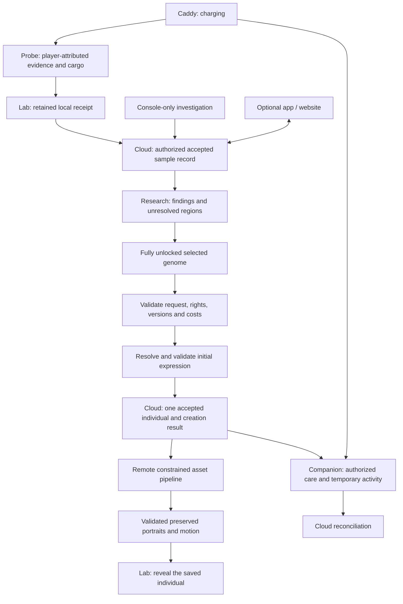

# Sample to critter: system contract

Status: **proposed system-design contract**, carrying accepted product requirements. This is not a production schema or implementation plan. [Genetics](genetics.md), [gameplay](gameplay.md), [architecture](architecture.md) and [cloud synchronization](cloud-sync.md) remain the surrounding specifications.

## Accepted foundation

Creation requires a **fully unlocked, selected genome**. Research and resource expenditure resolve required genomic information; creation cannot secretly finish missing regions or substitute a random genome. Supported possibilities followed by guided synthesis remains the research direction. Exactly how research establishes those possibilities is still open.

The connected Lab requests remote generation; its device controller does not run the generation stack. Cloud holds accepted durable records. Routine play needs no phone, and a console-only path remains required. Neither an attractive preview nor a completed animation proves a saved creation.

The diagram proposes the creation/asset boundary below; it does not establish resource prices, permission policies or a selected service topology.

## Five distinct records

| Record | Meaning and preservation rule |
| --- | --- |
| Sample | Evidence, origin and stable sample identity/pattern. It is neither a critter nor necessarily an already fixed individual genome. Retrying offload cannot create another copy of its resources. |
| Knowledge | Player-attributed findings and completeness for a particular sample/candidate and rules version. An annotation changes understanding, not collected evidence or inherited material. |
| Complete selected genome | Explicit, valid hereditary configuration chosen from supported possibilities. Completeness covers the declared modeled content; unsupported dimensions are not silently invented. It has no living individual identity yet. |
| Phenotype | Expression of that genome under pinned rules and recorded context. Carried but unexpressed variants differ from unknown ones. A later context can produce a new expression record without replacing ancestry or silently rewriting genes. |
| Individual | Unique saved identity, complete genome, explicit parentless founder origin, creation event and retained expression/assets. Samples and templates are not parents. Two matching genomes still describe different individuals. |

**PROPOSED:** bind the selected genome to immutable sample, finding, content and rules references, including a recorded expression context. If context or supported content changes before acceptance, show the difference and require an explicit new selection where necessary. Rendering cannot pick different alleles to obtain a nicer portrait. Genetic-sequence visualization uses actual permitted genetic facts and its own legend, separately from creature art.

## Creation and retry boundary

**PROPOSED:** creation submits one stable operation identity plus the exact selected genome reference, required inputs and displayed terms. Authenticated service context supplies the player and valid device enrollment; client claims alone cannot supply ownership or permissions. Shared-device profile switching cannot reassign an earlier player's request.

The cloud validates completeness, compatibility, rights, versions and the approved resource rule before acceptance. It durably commits the individual, creation result and any applicable inventory effect together. A job queue entry is insufficient. Any internal reservation must remain distinct from accepted spending; its expiry/release policy is not selected here. A changed payload using an existing operation identity is rejected rather than overwriting it.

Apply the [cloud retry contract](cloud-sync.md#proposed-operation-boundary): exact retries return the original identity/genome; uncertain delivery requires the same operation lookup, not another creation. Back exits without undoing submitted work. Opening, revealing, printing and reloading cannot spend resources again.

## Expression and asset failures

**PROPOSED:** commit creation only after the selected genome and initial expression record pass domain validation, but permit visual production to finish afterward. Subsequent asset production has no authority to modify that committed phenotype.

If art fails, retain the individual and report unavailable visuals or pending completion. Retry the asset job for the same pinned descriptor and versions, not a new birth. Once validated art is published, retain exact bytes and content hashes; a missing local copy is fetched again rather than generated anew. Later device-profile derivatives cannot overwrite the originals. Motion preserves anatomy and markings, with a stable still alternative. Missing assets cannot authorize substitute traits, refunds or duplicate specimens. Compensation policy is not established here.

## Offline and ecosystem boundaries

Local Probe offload and cargo clearance do not establish cloud inventory acceptance. Temporary evidence, research drafts and authorized Companion activity remain attributed to their original player until reconciliation. **PROPOSED:** this contract offers no offline authoritative creation; an offline draft must pass current cloud validation before becoming an individual. Lost unsynced activity cannot be promised recoverable. Accepted records can be restored through authorized cloud recovery.

The Companion uses saved individuals and records temporary activity without transferring ownership; exact care effects remain separately defined. The caddy supplies charging, not sample delivery, creation confirmation or care credit. Optional app/website views use the same authorized records and operations rather than a parallel inventory or required phone approval step.

## Three decisions still required

1. **Research completeness:** how guided candidates become fully unlocked, which resource expenditures resolve regions, and the equivalent console-only acquisition path.
2. **Creation terms:** sample/resource consumption or reuse, conflict handling and any compensation after accepted creation; none follows automatically from asset success.
3. **Temporary activity:** supported offline research/care actions, handover retention and reconciliation rules, including when local offload data may safely be discarded.

Recommended review order: settle research completeness first. For V1, prefer a small declared set of supported configurations, simple studies that explain the relevant bitmap regions, and explicit choice only after every required region is understood. This is a proposed starting rule, not a production cap on genetic diversity. Then settle creation terms before defining offline allowances that depend on them.
