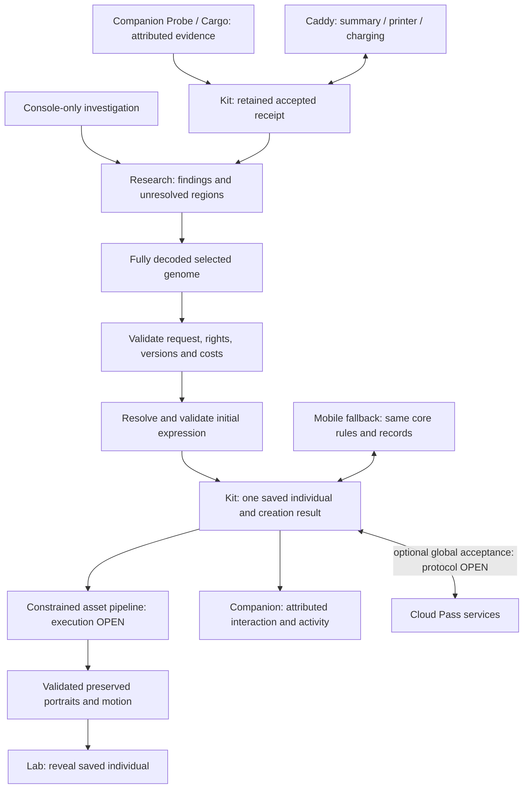

# Sample to critter: system contract

Status: **proposed system-design contract**, carrying accepted product requirements. This is not a production schema or implementation plan. [Genetics](genetics.md), [gameplay](gameplay.md), [architecture](architecture.md) and [cloud synchronization](cloud-sync.md) remain the surrounding specifications.

## Accepted foundation

The [accepted baseline/sample/phenotype distinction](genetics.md#genome-baseline-collected-sample-and-phenotype--accepted-distinction) governs these records: a sample carries particular genomic information consistent with a reusable foundation, not just a visible-trait fragment. It need not be tissue from a donor; provenance does not create parentage. Fragment assembly is not an implied acquisition step.

Research incrementally decodes genome regions; a fully decoded genome is a prerequisite for incubation. Validate completeness before accepting the creation/incubation commitment. A partial genome must remain research-in-progress rather than being completed implicitly by generation. Genome complexity varies with game progression; this contract must not hard-code the introductory example's study count as a universal completeness rule. Exact complexity and progression rules belong in [genetics](genetics.md#genome-imagery-and-progression).

Creation requires a **fully decoded, selected genome**. Research and resource expenditure resolve required genomic information; creation cannot secretly finish missing regions or substitute a random genome. Supported possibilities followed by guided synthesis remains the research direction. Exactly how research establishes those possibilities is still open.

The core kit must perform this journey standalone from the box, including supported nearby-kit interaction. Local research and creation cannot require Cloud Pass acceptance or remote generation. The optional Cloud Pass adds global trading/breeding, lineage, certificates and minigames. Local authority placement, generation execution and local/global reconciliation remain OPEN. Routine play needs no phone; a console-only path remains required. Neither an attractive preview nor a completed animation proves a saved creation.

The diagram proposes the creation/asset boundary below; it does not establish resource prices, permission policies or a selected service topology.

## Five distinct records

The [connected game model](../design/research-and-creation.md) distinguishes capsule/container, contained sample, prepared research record and shared typed inventory. Preparation creates or reopens sample-specific knowledge; it does not duplicate sample material or allocate an individual. A player can retain many partly decoded records and choose work against their inventory. Expeditions supply resource awards and optional new samples; collection points remain distinct from spendable inventory. Detailed preparation and point-conversion rules are still proposals.

| Record | Meaning and preservation rule |
| --- | --- |
| Sample | Evidence, origin and stable sample identity/pattern. It is neither a critter nor necessarily an already fixed individual genome. Retrying offload cannot create another copy of its resources. |
| Knowledge | Player-attributed findings and completeness for a particular sample/candidate and rules version. An annotation changes understanding, not collected evidence or inherited material. |
| Complete selected genome | Explicit, valid hereditary configuration chosen from supported possibilities. Completeness covers the declared modeled content; unsupported dimensions are not silently invented. It has no living individual identity yet. |
| Phenotype | Expression of that genome under pinned rules and recorded context. Carried but unexpressed variants differ from unknown ones. A later context can produce a new expression record without replacing ancestry or silently rewriting genes. |
| Individual | Unique saved identity, complete genome, explicit parentless founder origin, creation event and retained expression/assets. Samples and templates are not parents. Two matching genomes still describe different individuals. |

**PROPOSED:** bind the selected genome to immutable sample, finding, content and rules references, including a recorded expression context. If context or supported content changes before acceptance, show the difference and require an explicit new selection where necessary. Rendering cannot pick different alleles to obtain a nicer portrait. Genetic-sequence visualization uses actual permitted genetic facts and its own legend, separately from creature art.

## Creation and retry boundary

**PROPOSED:** creation submits one stable operation identity plus the exact selected genome reference, required inputs and displayed terms. Local-core identity and authorization must support standalone and nearby-kit play; exact mechanisms remain open. For global operations, authenticated service context supplies the player and valid device enrollment; client claims alone cannot supply global ownership or permissions. Shared-device profile switching cannot reassign an earlier player's request.

The accepting core authority, whose placement is OPEN, validates completeness, compatibility, rights, versions and the approved resource rule. It durably commits the individual, creation result and any applicable inventory effect together without requiring a cloud round trip. Optional global acceptance has its own validation and cannot be inferred from a local receipt. A job queue entry is insufficient. Any internal reservation must remain distinct from accepted spending; its expiry/release policy is not selected here. A changed payload using an existing operation identity is rejected rather than overwriting it.

Preserve the same idempotency requirement locally and globally; the [global retry contract](cloud-sync.md#proposed-global-operation-boundary) applies to Cloud Pass: exact retries return the original identity/genome; uncertain delivery requires the same operation lookup, not another creation. Back exits without undoing submitted work. Opening, revealing, printing and reloading cannot spend resources again.

## Expression and asset failures

**PROPOSED:** commit creation only after the selected genome and initial expression record pass domain validation, but permit visual production to finish afterward. Subsequent asset production has no authority to modify that committed phenotype.

If art fails, retain the individual and report unavailable visuals or pending completion. Retry the asset job for the same pinned descriptor and versions, not a new birth. Once validated art is published, retain exact bytes and content hashes; a missing copy is restored from retained original bytes where available rather than generated anew; recovery cannot assume a cloud connection or backup exists. Later device-profile derivatives cannot overwrite the originals. Motion preserves anatomy and markings, with a stable still alternative. Missing assets cannot authorize substitute traits, refunds or duplicate specimens. Compensation policy is not established here.

## Offline and ecosystem boundaries

Local Companion Cargo offload and clearance require a durable core acceptance boundary; they do not establish global inventory acceptance. Core research and creation are supported without Cloud Pass. Exact local authority, nearby-kit transfer, safe discard, handover retention and optional global enrollment/reconciliation remain OPEN. Do not treat saved local individuals as cloud-pending drafts or promise recovery of lost records without a retained copy.

Companion activity remains attributed to its player and does not itself transfer ownership. The caddy summarizes the same records, prints and charges; it is not an assumed mandatory gateway or a second inventory. Mobile/app views use permitted records and operations rather than a parallel world or required phone approval step. Global rights and certificates require the applicable optional service validation, not merely a scan or local creation.

## Three decisions still required

1. **Research content mapping:** the V1 investigation/completeness structure is accepted in [gameplay](gameplay.md#research-and-creation); exact evidence-to-candidate mappings, resource requirements and equivalent console-only acquisition still need definition.
2. **Creation implementation:** [gameplay](gameplay.md#creation-inputs-and-retained-discoveries) now defines accepted one-use material, retained knowledge and spending/retry semantics. Reservations, competing-request conflicts and remedies for permanent acceptance/content failure still need design.
3. **Temporary activity:** local and nearby-kit identity/acceptance, temporary activity, handover retention and optional global reconciliation rules, including when local offload data may safely be discarded.

Creation terms remain accepted for the standalone core; exact local acceptance and nearby/global reconciliation need design without reopening those genetic rules. The accepted V1 research structure does not approve technical transaction defaults, content mappings or a cap on genetic diversity.
